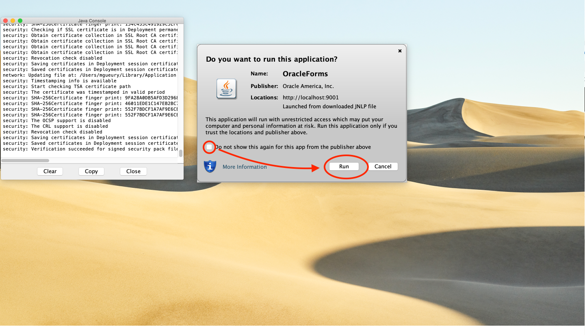
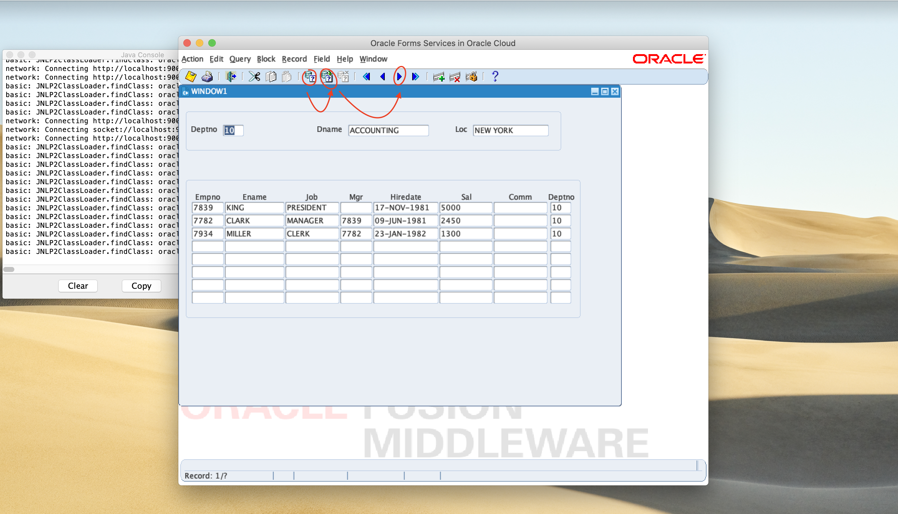

# Compile and Run Forms

In this lab, you will install a database schema and compile Oracle Forms samples.

Estimated Time: 20 minutes

### Objectives

In this lab, you will:
* Install a schema in a database
* Compile Oracle Forms samples
* Configure Oracle Forms Runtime
* Run the samples

### Prerequisites 

This lab assumes you have:
* All previous labs successfully completed

## Task 1: Copy the sample files

Log to your Forms machine. And download the sample files.

```
<copy>cd $HOME
sudo yum install git -y
git clone https://github.com/mgueury/forms-to-oci-samples.git
cd forms-to-oci-samples
# Copy the Forms files in the FORMS_PATH
cp forms/* ../oracle/formsmodules/.
</copy>
```

Check the script to set the environment variables:
```
<copy>cat env.sh</copy>
```

```
# ORACLE_HOME
export ORACLE_HOME=/u01/oracle/middleware/Oracle_Home
export PATH=$ORACLE_HOME/bin:$PATH

# Domain Home
export DOMAIN_HOME=/u01/oracle/middleware/user_projects/domains/base_domain

# TNS Admin with connection to the database
export TNS_ADMIN=$DOMAIN_HOME/config/fmwconfig

# Forms Config directory with default.env and formsweb.cfg
export FORMS_CONFIG=$DOMAIN_HOME/config/fmwconfig/servers/WLS_FORMS/applications/formsapp_12.2.1/config

# Directory with the FMB files
export FMB_PATH=/home/opc/oracle/formsmodules

# Compilation directory
export FORMS_PATH=$FMB_PATH:/u01/oracle/middleware/Oracle_Home/forms

# Instance of Forms (for compilation)
export FORMS_INSTANCE=$DOMAIN_HOME/config/fmwconfig/components/FORMS/instances/forms1

# Needed for compilation
export TERM=vt220

# Connection used during compilation
export DB_USER=scott
export DB_PASSWORD=LiveLab__123
export DB_TNS=orcl
```

You will need to adapt it if you DB setup is different. But in short:
- The Forms Source files (fmb,mmb,pll) will be in FMB_PATH=/home/opc/oracle/formsmodules
- The connection to the database will be scott/LiveLab__123@orcl

## Task 2: Create a Sample Schema and Tables in the Database

First check the file that we will install. 

```
<copy>vi dept.sql</copy>
```

```
create user scott identified by &1;
grant connect, resource to scott;
grant unlimited tablespace to scott;

connect scott/&1@&2;

CREATE TABLE dept(
  deptno NUMBER(2,0),
  dname  VARCHAR2(14),
  loc    VARCHAR2(13),
  CONSTRAINT pk_dept PRIMARY KEY (deptno));

CREATE TABLE emp(
  empno    NUMBER(4,0),
  ename    VARCHAR2(10),
  job      VARCHAR2(9),
  mgr      NUMBER(4,0),
  hiredate DATE,
  sal      NUMBER(7,2),
  comm     NUMBER(7,2),
  deptno   NUMBER(2,0),
  CONSTRAINT pk_emp PRIMARY KEY (empno),
  CONSTRAINT fk_deptno FOREIGN KEY (deptno) REFERENCES dept (deptno)
);
....
```

Run the dept.sql script in the database. It takes as arguments:
- the password that will be used for the scott schema (LiveLab__123)
- the tns entry name of the database (orcl)

Let's create the schema.
```
<copy>
cd $HOME/forms-to-oci-samples
. ./env.sh 
sqlplus $DB_ADMIN/$DB_PASSWORD@$DB_TNS @dept.sql $DB_PASSWORD $DB_TNS</copy>
```

Output:
```
SQL> @dept.sql LiveLab__123 orcl
old   1: create user scott identified by &1
new   1: create user scott identified by LiveLab__123

User created.
Grant succeeded.
Grant succeeded.
Connected.
Table created.
Table created.
1 row created.
...
```

## Task 3: Compile the Oracle Forms samples

The directory contains a script to compile your forms. Let's look at it.


```
<copy>cat compile.sh</copy>
```

```
#!/bin/bash
. ./env.sh

# Libraries
for FILE in `ls $FMB_PATH/*.pll`; do
  OUTPUT=${FILE/pll/plx}
  echo "PLL: $FILE -> $OUTPUT"
  $FORMS_INSTANCE/bin/frmcmp_batch.sh $FILE $DB_USER/$DB_PASSWORD@$DB_TNS \
    module_type=library batch=yes output_file=$OUTPUT compile_all=special
done

# Menus
for FILE in `ls $FMB_PATH/*.mmb`; do
  OUTPUT=${FILE/mmb/mmx}
  echo "MMB: $FILE -> $OUTPUT"
  $FORMS_INSTANCE/bin/frmcmp_batch.sh $FILE $DB_USER/$DB_PASSWORD@$DB_TNS \
    module_type=menu batch=yes output_file=$OUTPUT compile_all=special
done

# Forms
for FILE in `ls $FMB_PATH/*.fmb`; do
  OUTPUT=${FILE/fmb/fmx}
  echo "FMB: $FILE -> $OUTPUT"
  $FORMS_INSTANCE/bin/frmcmp_batch.sh $FILE $DB_USER/$DB_PASSWORD@$DB_TNS \
    module_type=form batch=yes output_file=$OUTPUT compile_all=special
  ERR=${FILE/fmb/err}
  echo --- FMB Compilation output -------------------------------------------
  cat $ERR
  echo ----------------------------------------------------------------------
  echo 
done
```

Run it.

```
<copy>./compile.sh</copy>
```

```
ls: cannot access /home/opc/oracle/formsmodules/*.pll: No such file or directory
MMB: /home/opc/oracle/formsmodules/menudef.mmb -> /home/opc/oracle/formsmodules/menudef.mmx
MMB: /home/opc/oracle/formsmodules/menudefs.mmb -> /home/opc/oracle/formsmodules/menudefs.mmx
FMB: /home/opc/oracle/formsmodules/dept_emp.fmb -> /home/opc/oracle/formsmodules/dept_emp.fmx
--- FMB Compilation output -------------------------------------------
Compiling procedure CHECK_PACKAGE_FAILURE... 
   No compilation errors.

Compiling procedure QUERY_MASTER_DETAILS... 
   No compilation errors.
...
```

## Task 4: Configure the Forms Runtime

There is a prebuilt configuration that we will just add to test our Forms.

```
<copy>cd $HOME/forms-to-oci-samples
cat formsweb.cfg.template</copy>
```

You will see entries like this:

```
[dept]
basejnlp=base.jnlp
webstart=enabled
userid=scott/LiveLab__123@orcl
form=dept.fmx
#  webstart_codebase=https://LOADBALANCER_HOSTNAME/forms/java
...
```

The interesting parameters:
- "webstart: enabled" allows to start Forms from Webstart
- "userid=scott/LiveLab__123@orcl"  allows to log automatically in the Form
- "form=dept.fmx" is the Forms that will be started.

Let's add this configuration

```
<copy>. ./env.sh
cat formsweb.cfg.template >> $FORMS_CONFIG/formsweb.cfg</copy>
```

## Task 5: Test

You should have a SSH connection from your computer to the server forwarding port 9001.
Check **Lab 4 - Task 1: Port Forwarding** for the command.

Try this URL. You will need to have Java Runtime installed on your computer to do this.

```
 <copy>http://localhost:9001/forms/frmservlet?config=dept_emp</copy>
```

Depending of the browser, it will download a .jnlp file or start it automatically.
If it is just a download, you have to click on the download .jnlp file to start the Java Runtinme.
You will probably have 1 or 2 warnings before the Forms windows appears.



Then the screen will appear. Click on the below icon to get the data. 



If you reached this point, CONGRATULATIONS !!

## Next Steps

You could improve this setup by:
- using several Forms servers and a Load Balancer in front of them for High Availability
- using Dataguard to replicate the database in another datacenter for Disaster and Recovery
- using a Devops Git repository to store source Forms files to share between the Forms Builder and Server
- using Terraform and "Infrastructure As Code" to create the setup automatically
- add Reports Server to the installation
- install Webutil
- ...

## Learn More

* [Forms Documentation](https://docs.oracle.com/en/middleware/developer-tools/forms/12.2.1.4/index.html)
* [Oracle-Base notes] (https://oracle-base.com/articles/12c/oracle-forms-and-reports-12c-configuration-notes)

## Acknowledgements
* Marc Gueury - Application Development EMEA
* Michael Ferrante - Senior Principal Product Manager
* Last Updated - March 2022
