# Option 2: Database Cloud Service

## Introduction

Estimated Time: 15 minutes

### Objectives

In this lab, you will: 
- Integrate with a database
- Run the Forms configuration

## Task 1: Integrate with Database Cloud Service

For a production database, it is better to use Database Cloud Service.

1. Go to the Oracle Cloud home page. In the Hamburger menu, look for **Oracle Database**. Then **Bare Metal, VM and Exadata**

   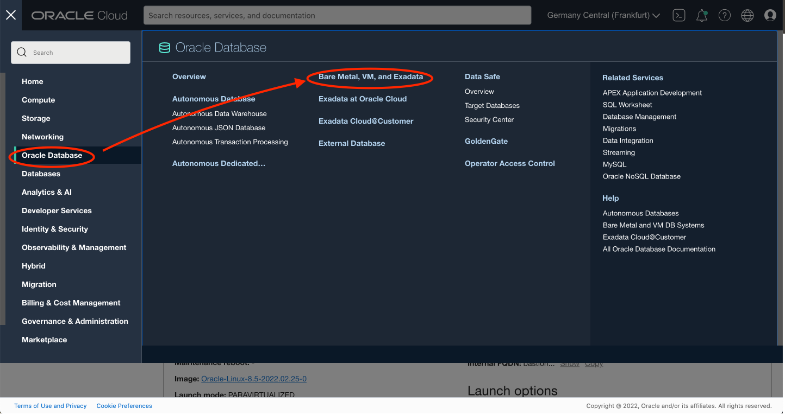

2. Click **Create DB System**

   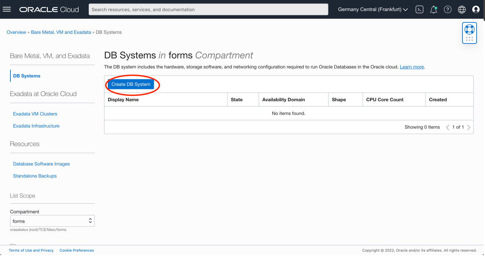

3. Then in
    
    - Name your DB system: **db** (for ex)
    - Change Shape and choose the one that you need (Ex: VM.Standard2.1 )

    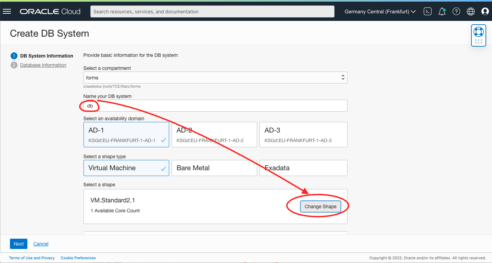

4. Further in the wizard

    - Oracle Database software edition: Choose the version that you need (Ex: Enterprise High Perfomance)
    - Choose storage management software: **Logical Volume Manager**
    - SSH key: add the public ssh key that you got from the bastion (##1##)

   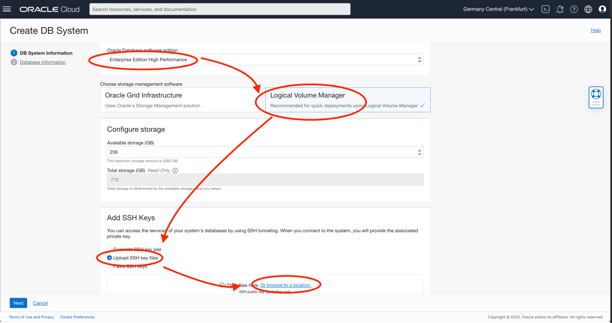

    - Choose your licence (Ex: Bring Your Own Licence)
    - Virtual cloud network **forms-vcn**
    - Client subnet: **Private Subnet-forms-vcn**
    - Click **Next**

    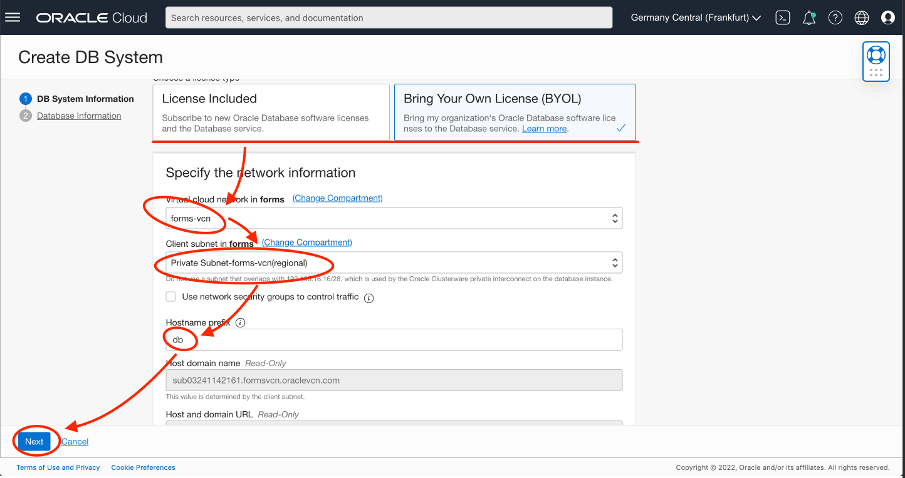

5. On the second tab,

    - Database name: **DB**
    - Password: **LiveLab__123** (for ex)
    - Confirm Password: **LiveLab__123** (for ex)
    - Click **Create DB System**

    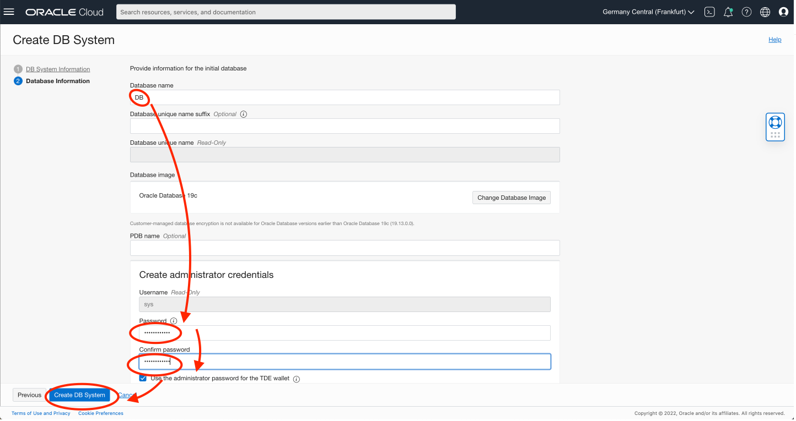

    You can execute the Task 2 before that the database is created. You will need it for step 3 only.

6. Get the connection details of the database.
   Go to the database node. Then DB

    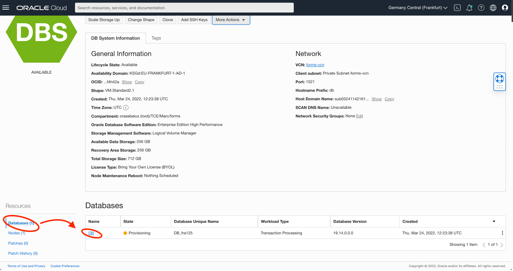

    - Click **DB Connection**
    - And the easy connection string (##DB\_EASY##)
    - Then copy the long connection string (##DB\_LONG##)

    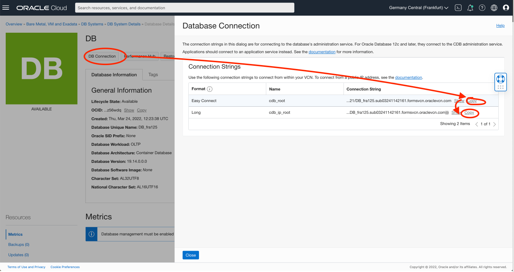

## Task 2: Start Forms Configuration 

The Forms and Database should be started. Let's provision the installation.

1. SSH to the Forms Server

    Ideally, you should SSH to you Forms Server from your computer.

    There are several ways to do this. For this tutorial, we will use a Bastion server.  However, for daily use it will likely be easier to use a VPN or Fastconnect. 

    ```
    # Add the key to ssh-agent
    ssh-add &lt;ssh-private-key&gt;
    # Connect via the bastion
    ssh -J opc@&lt;bastion-ip&gt; opc@&lt;Forms Private IP&gt;

    Ex:
    ssh-add ssh-key-2022-03-21.key
    ssh -J opc@130.131.132.133 opc@10.0.1.130
    ```

2. The provisioning will start. 

## Task 3: Configure Forms with Database Cloud Service

1. Choose Dabase Cloud Service **2**

    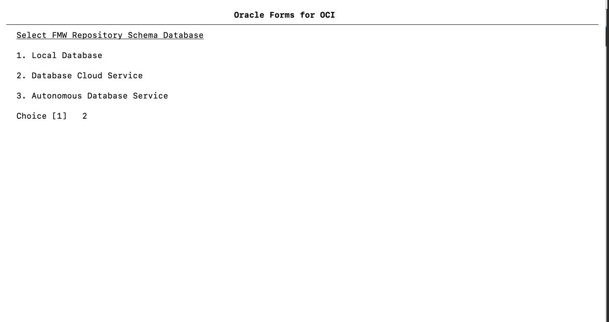

2. Enter the followin:

    - Enter the DBCS Sys Password: **LiveLab__123**
    - Enter the DBCS PDB Name: **db\_pdb1**
      = the name of the db + "_pdb1"
    - Enter the DBCS long connect string:  see ##DB\_LONG##. Take care to replace with the service name by db_pdb1

    ```
    (DESCRIPTION=(CONNECT_TIMEOUT=5)(TRANSPORT_CONNECT_TIMEOUT=3)(RETRY_COUNT=3)(ADDRESS_LIST=(LOAD_BALANCE=on)(ADDRESS=(PROTOCOL=TCP)(HOST=10.0.0.197)(PORT=1521)))(CONNECT_DATA=(SERVICE_NAME=DB_fra125.subnet1234567.formsvcn.oraclevcn.com)))

    to 

    (DESCRIPTION=(CONNECT_TIMEOUT=5)(TRANSPORT_CONNECT_TIMEOUT=3)(RETRY_COUNT=3)(ADDRESS_LIST=(LOAD_BALANCE=on)(ADDRESS=(PROTOCOL=TCP)(HOST=10.0.0.197)(PORT=1521)))(CONNECT_DATA=(SERVICE_NAME=db_pdb1.subnet1234567.formsvcn.oraclevcn.com)))
    ```

    - Enter the DBCS easy connect string: see ##DB\_EASY##

    ```
    Ex: db.subnet1234567.formsvcn.oraclevcn.com:1521/DB_fra125.subnet1234567.formsvcn.oraclevcn.com
    ```

    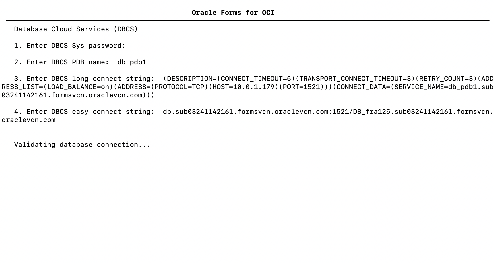

2. Enter the passwords. By example:

    - Vnc Password: **LiveLab1**
    - FMW Repository Schema password: **LiveLab__123**
    - WLS Admin password: **LiveLab1**

    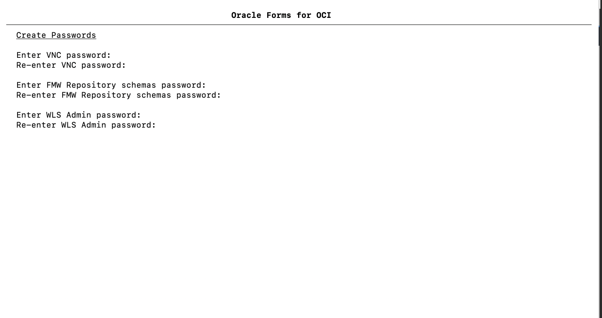

3. Run the provisioning

4. Answer 'y' to the next question

    ````
    Exit and continue in the background? (y/N).
    ```

    It is safer to run in the background. If the shell is remain open
    and the shell is terminated intentionally or unintentionally, the provisioning will fail.
   
    Wait that the provisioning finishes. Connect with ssh to see the status. It takes about 10 mins.

## Learn More

* [Forms on Oracle Cloud Infrastructure](https://docs.oracle.com/en/middleware/developer-tools/forms/12.2.1.4/forms-oci/index.html)

## Acknowledgements
* Marc Gueury - Application Development EMEA
* Michael Ferrante - Senior Principal Product Manager
* Last Updated - March 2022
