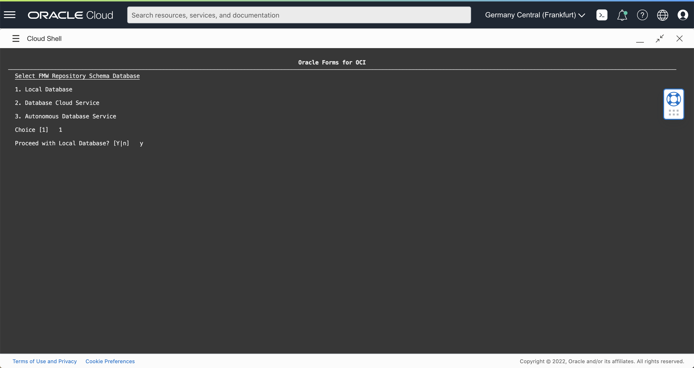
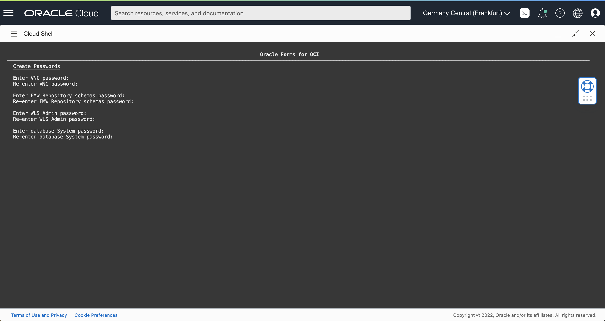
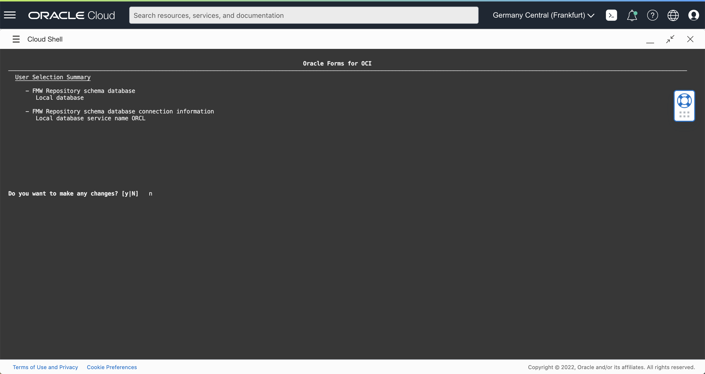

# Option 1: Local Database

## Introduction

Estimated Time: 15 minutes

### Objectives

In this lab, you will: 
- Integrate with a database
- Run the Forms configuration

### Prerequisites 

This lab assumes you have:
* Followed the previous lab

## Task 1:  Integrate with a Local DB

Nothing to do, the Database is already installed in the same machine as Forms

## Task 2: Start Forms Configuration 

The Forms and Database should be started. Let's provision the installation.

1. SSH to the Forms Server

   Ideally, you should SSH to you Forms Server from your computer.

   There are several ways to do this. For this tutorial, we will use a Bastion server.  However, for daily use it will likely be easier to use a VPN or Fastconnect. 

    ```
    # Add the key to ssh-agent
    ssh-add &lt;ssh-private-key&gt;
    # Connect via the bastion
    ssh -J opc@&lt;bastion-ip&gt; opc@&lt;Forms Private IP&gt;

    Ex:
    ssh-add ssh-key-2022-03-21.key
    ssh -J opc@130.131.132.133 opc@10.0.1.130
    ```

2. The provisioning will start. 

## Task 3: Forms Configuration with a Local DB

1. Choose Local Database: **1** 

   

2. Enter the passwords. By example:
    
    - Vnc Password: **LiveLab1**
    - FMW Repository Schema password: **LiveLab__123**
    - WLS Admin password: **LiveLab1**
    - Database System Password: **LiveLab__123**

    

3. Run the provisioning

    

4. Answer 'y' to the next question

    ````
    Exit and continue in the background? (y/N).
    ```

    It is safer to run in the background. If the shell is remain open
    and the shell is terminated intentionally or unintentionally, the provisioning will fail.
  
    Wait that the provisioning finishes. Connect with ssh to see the status. It takes about 10 mins.

## Learn More

* [Forms on Oracle Cloud Infrastructure](https://docs.oracle.com/en/middleware/developer-tools/forms/12.2.1.4/forms-oci/index.html)

## Acknowledgements
* Marc Gueury - Application Development EMEA
* Michael Ferrante - Senior Principal Product Manager
* Last Updated - March 2022
