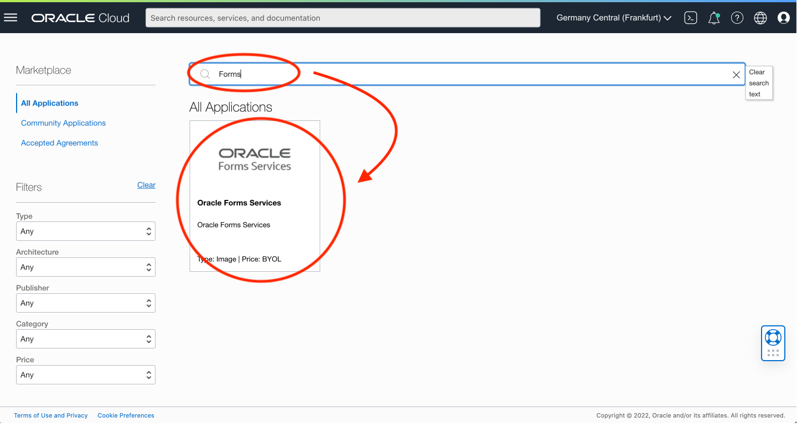
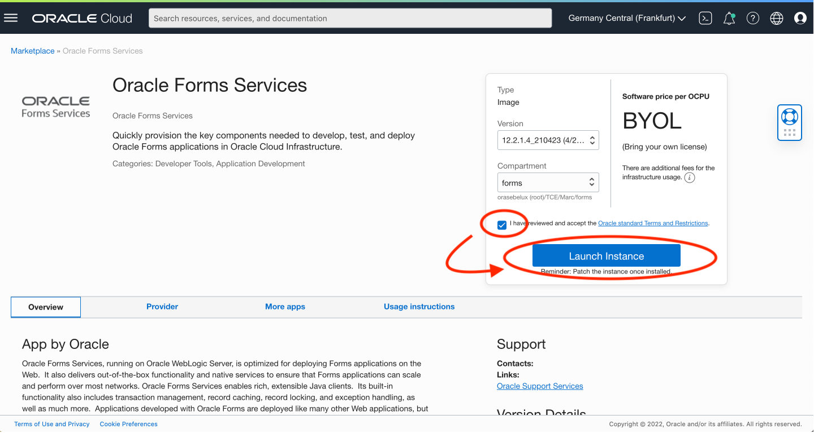
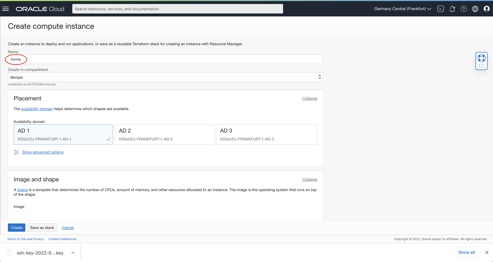
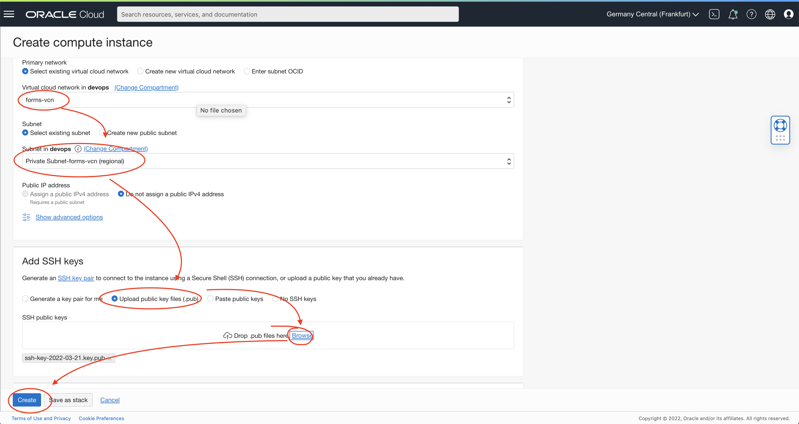
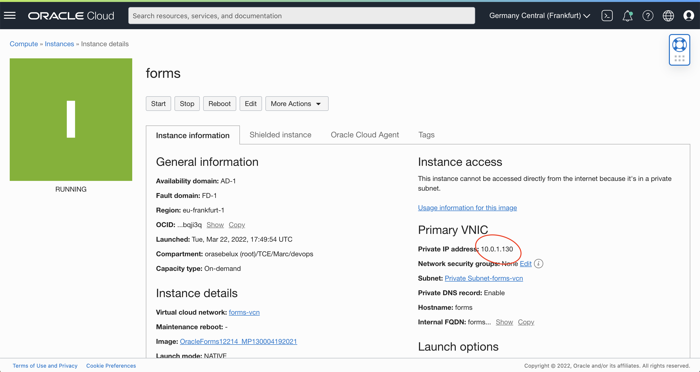
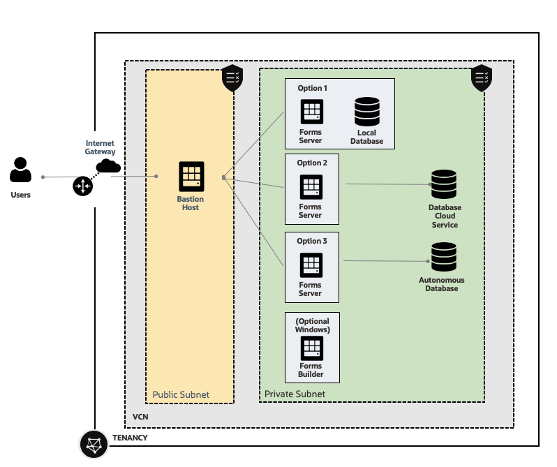

# Provision Oracle Forms 

## Introduction

Estimated Time: 5 minutes

### Objectives

In this lab, you will:
* Provision an Oracle Forms Server environment

### Prerequisites 

This lab assumes you have:
* Followed the previous lab

## Task 1: Provision Oracle Forms

Go to the Marketplace. 

1. Go to the Oracle Cloud home page. In the Hamburger menu, look for **Marketplace**
2. In the search, look for **Forms**

   

3. Review the Terms and Conditions then check **I have reviewed and accept the Oracle standard Terms and Restrictions**.  Then click **Launch Instance**.

   

4. Enter the machine name, ex: **forms**

   

5. Then check that:
    - VCN: **forms-vcn**
    - Subnet: **Private subnet for forms-vcn**
    - Check the button **Upload the public key** and upload the public key that you got from the Bastion in  Lab1 (##1##)
    - Click Create

   

6. Get the Private IP

   

   Write it down. (##3##)

## Task 2: Decide your next step

Here you have several choices. Install the Forms Server with
- a Local Database (database in the same VM as Forms)
- a Database Cloud Service (with automatic backup, easy dataguard setup ...)
- Autonomous database (not contained in this document)

  

Choose your next Lab accordingly.

## Learn More

* [Forms on Oracle Cloud Infrastructure](https://docs.oracle.com/en/middleware/developer-tools/forms/12.2.1.4/forms-oci/index.html)

## Acknowledgements
* Marc Gueury - Application Development EMEA
* Michael Ferrante - Senior Principal Product Manager
* Last Updated - March 2022
