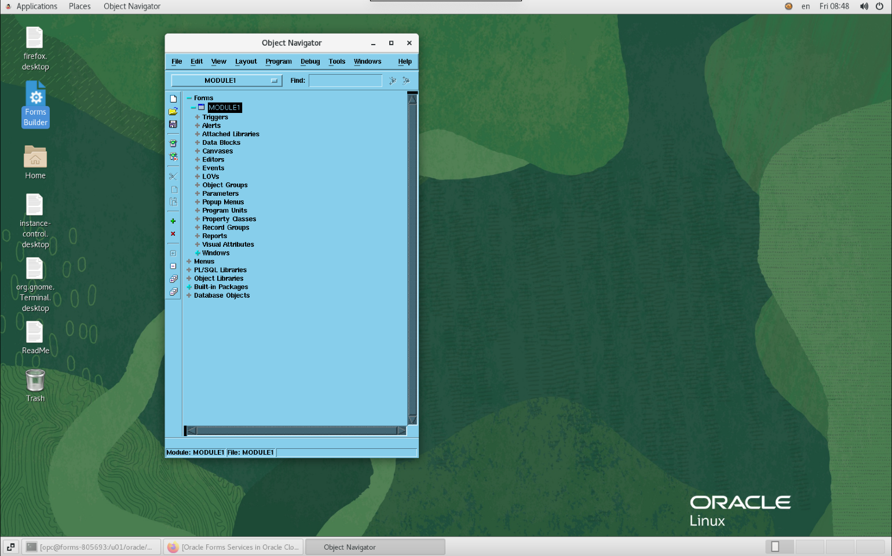

# Explore the Forms Environment

## Introduction

Let's check what has been installed.

Estimated Time: 10 minutes

### About Forms

Oracle Forms is an application development technology used for creating screens that interact with an Oracle database. The source form or module (.fmb) is compiled into a platform-specific "executable" (.fmx) that is run (interpreted) by the Forms runtime server. The running form is used to view and edit data in database-driven applications. 

### Objectives

In this lab, you will:
* Check the main files and directory created by Oracle Forms 
* Check the URLs that are preinstalled.

### Prerequisites 

This lab assumes you have:
* All previous labs successfully completed

## Task 1: Port Forwarding

Since we use a Bastion, we do not have direct access to the Forms machine. We will use port forwarding to access
the different ports of the installation.

Ports:
- 5901 is the VNC port for :1
- 7001 is the port of WebLogic
- 9001 is the port of Forms
- 9002 is the port of Reports 

```
With port forwarding:
ssh -J opc@&lt;bastion-ip&gt; opc@&lt;Forms Private IP&gt; -L5901:localhost:5901 -L9001:0.0.0.0:9001 -L7001:0.0.0.0:7001

Ex:
ssh -J opc@130.131.132.133 opc@10.0.1.130 -L5901:localhost:5901 -L7001:0.0.0.0:7001 -L9001:0.0.0.0:9001 -L9002:0.0.0.0:9002
```
Run the above command and let the ssh connection opened. 

Note: this command assumes that the SSH Private Key has been added to your ssh-agent. It was normally done after the Forms installation. 
```
Ex: ssh-add ssh-key-2022-03-21.key
```

## Task 2: Check the Main Files and Directories

Let's look at the important files and directories.

### 1. README

There is a README in the Desktop directory. It is a good idea to read it first.

```
<copy>cd $HOME/Desktop
vi ReadMe</copy>
```

```
...
------------------------------------------------
Using this Environment
------------------------------------------------

All software has been installed and is owned by the "opc" user.

o Software locations:
  o  Database software is installed only if you choose to have a local database during provisioning.
  o  Database ORACLE_HOME:  /u01/oracle/database/base/Oracle_Home
       o Database connect string: orcl

  o  Middleware ORACLE_HOME:  /u01/oracle/middleware/Oracle_Home
  o  Middleware DOMAIN_HOME:  /u01/oracle/middleware/user_projects/domains/base_domain

       o WebLogic Server repository (RCU) schema prefix: FRM
       o WebLogic Server Administrator username:  weblogic

  o  JDK 8 HOME: /u01/oracle/jdk

  o  FORMS_PATH in frmbld.sh and default.env includes:  /home/opc/oracle/formsmodules
... 
```

### 2. DOMAIN_HOME

Oracle Forms is installed on top of Fusion Middleware Infrastructure, which includes WebLogic Server.  Oracle Forms is made up of several mid-tier server side components, but the most relevant are the Forms Servlet and Forms Server.  The Forms Servlet is deployed into WebLogic similar to any other J2EE app and the Forms Server runs independently from the Oracle Home containing the installation.  The Forms Servlet acts as traffic cop between the Forms Server and the individual users running the applications.

The Forms configuration files are stored in a Domain and should be administered using Fusion Middleware Control.  

```
<copy>export DOMAIN_HOME=/u01/oracle/middleware/user_projects/domains/base_domain/
cd $DOMAIN_HOME
ls</copy>
```

```
auditlogs      console-ext           init-info      resources                        sysman
autodeploy     derby.log             lib            security                         system_components
backup_config  derbyShutdown.log     nodemanager    servers                          tmp
bin            edit.lok              orchestration  startManagedWebLogic_readme.txt
common         fileRealm.properties  original       startWebLogic.sh
config         generated_classes     pending        store
```

### 3. Oracle Forms Runtime configuration

The main files to configure Oracle Forms Runtime are: 
- formsweb.cfg : who contains the list of configurations to start your Forms programs
- default.env : who contains the FORMS environment variables used at runtime.

Let's look at them.

```
<copy>export FORMS_CONFIG=/u01/oracle/middleware/user_projects/domains/base_domain/config/fmwconfig/servers/WLS_FORMS/applications/formsapp_12.2.1/config
cd $FORMS_CONFIG</copy>
```

```
cat default.env
...
# default.env - default Forms environment file, Linux version
# 
# This file is used to set the Forms runtime environment parameters.
# If a parameter is not defined here, the value used will be that defined
# in the environment in which the WLS Managed Server was started.
# 
# NOTES
#    Configuration assistant will replace all the macro's with
#    the actual values.
# 
ORACLE_HOME=/u01/oracle/middleware/Oracle_Home
FORMS_INSTANCE=/u01/oracle/middleware/user_projects/domains/base_domain/config/fmwconfig/components/FORMS/instances/forms1
# 
# 
# TNS Entry to locate the database
# 
TNS_ADMIN=/u01/oracle/middleware/user_projects/domains/base_domain/config/fmwconfig
FORMS_PATH=/u01/oracle/middleware/Oracle_Home/forms:/u01/oracle/middleware/user_projects/domains/base_domain/config/fmwconfig/components/FORMS/instances/forms1:/home/opc/oracle/formsmodules
# 
# 
...
```

There are important things to notice about the runtime configuration:
- ORACLE\_HOME (Directory with Forms Binaries) is in /u01/oracle/middleware/Oracle_Home
- TNS\_ADMIN (Directory with connection to the Database) is per default is $DOMAIN_HOME/config/fmwconfig
- FORMS\_PATH (Directory of your Forms program) includes /home/opc/oracle/formsmodules

```
cat formsweb.cfg
...
[webstart]
basejnlp=base.jnlp
webstart=enabled

[webutil_webstart]
WebUtilLogging=off
WebUtilLoggingDetail=normal
WebUtilErrorMode=Alert
WebUtilDispatchMonitorInterval=5
WebUtilTrustInternal=true
WebUtilMaxTransferSize=16384
basejnlp=webutil.jnlp
webstart=enabled
...
```

In the **formsweb.cfg** file, we see several configurations that can be used to start Forms in URL like:

```
http://xxxxx/forms/frmservlet?config=&lt;config name&gt;
ex: http://xxxxx/forms/frmservlet?config=webstart
```

### 4. TNS_ADMIN

The TNS\_ADMIN used by the runtime is $DOMAIN\_HOME/config/fmwconfig. Let's check it:

```
<copy>cd $DOMAIN_HOME/config/fmwconfig
cat tnsnames.ora</copy>
```

For a Local DB
```
ORCL = 
  (DESCRIPTION = 
    (ADDRESS = (PROTOCOL = TCP)(HOST = forms.subnet1234567.formsvcn.oraclevcn.com)(PORT = 1521))
    (CONNECT_DATA =
      (SERVER = DEDICATED)
       (SERVICE_NAME = orcl)
   )
  )
```

For Database Cloud Service
```
ORCL = (DESCRIPTION=(CONNECT_TIMEOUT=5)(TRANSPORT_CONNECT_TIMEOUT=3)(RETRY_COUNT=3)(ADDRESS_LIST=(LOAD_BALANCE=on)(ADDRESS=(PROTOCOL=TCP)(HOST=10.0.1.179)(PORT=1521)))(CONNECT_DATA=(SERVICE_NAME=db_pdb1.subnet1234567.formsvcn.oraclevcn.com)))
```

Notice both have the same ORCL alias.

### 5. Stop/Start script

There is a script to start/stop the Database, OHS, Forms or WebLogic

```
<copy>/home/opc/oracle/utilities/srvcontroller.sh</copy>
```

```
----------------------------------------------------------------------------------
     Oracle Forms Instance Control     
----------------------------------------------------------------------------------
 1 : stop_all         : stops admin server, OHS, Forms managed server and RCU DB.
 2 : start_all        : starts admin server, OHS, Forms managed server and RCU DB.
 3 : stop_local_db    : stops RCU DB.
 4 : start_local_db   : starts RCU DB.
 5 : stop_domain      : stops admin server, OHS, Forms managed server.
 6 : start_domain     : starts admin server, OHS, Forms managed server.
 7 : stop_fserver     : stops Forms managed server.
 8 : start_fserver    : starts Forms managed server.
 9 : stop_ohs         : stops OHS.
10 : start_ohs        : starts OHS.
11 : delete_domain    : deletes the FMW Domain and the Weblogic RCU schemas.      
----------------------------------------------------------------------------------
```

### 6. Database (Local DB only)

If you are using the Local DB for the RCU and optionally your own schemas. You can find the database in /u01/oracle/database/base/Oracle_Home.
Let's connect to it.

```
<copy>cat /etc/oratab</copy>
```
```
...
#
orcl:/u01/oracle/database/base/Oracle_Home:N
```
The file /etc/oratab defines the list of ORACLE\_HOME environments
```
<copy>. oraenv
orcl
sqlplus system/LiveLab__123@orcl</copy>
```

```
SQL*Plus: Release 19.0.0.0.0 - Production on Tue Mar 22 08:33:27 2022
Version 19.3.0.0.0

Copyright (c) 1982, 2019, Oracle.  All rights reserved.


Connected to:
Oracle Database 19c Enterprise Edition Release 19.0.0.0.0 - Production
Version 19.3.0.0.0

SQL> 
```

## Task 3: Test the URLs

Notice that the installation has created the following URLs:

- Test forms URL: [http://localhost:9001/forms/frmservlet?config=webstart](http://localhost:9001/forms/frmservlet?config=webstart)
- Weblogic Console: [http://localhost:7001/console](http://localhost:7001/console) ( weblogic / LiveLab1 )
- FADS console: [http://localhost:7001/fadsui](http://localhost:7001/fadsui) ( weblogic / LiveLab1 )

VNC is also accessible on port 5901. Start your favorite VNC viewer and connect to **localhost:1**



## Learn More

* [Forms Documentation](https://docs.oracle.com/en/middleware/developer-tools/forms/12.2.1.4/index.html)

## Acknowledgements
* Marc Gueury - Application Development EMEA
* Last Updated - March 2022
