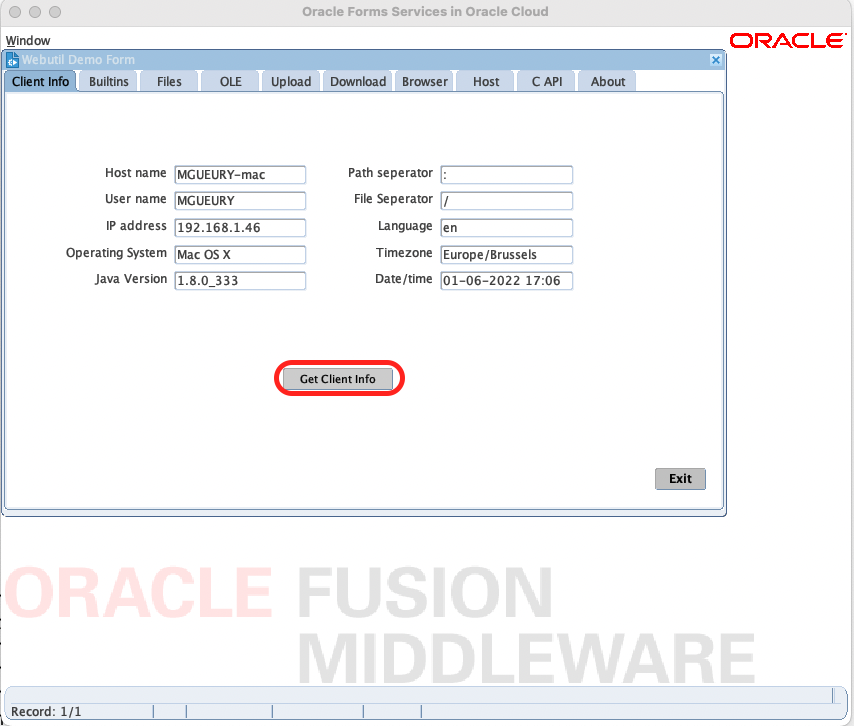
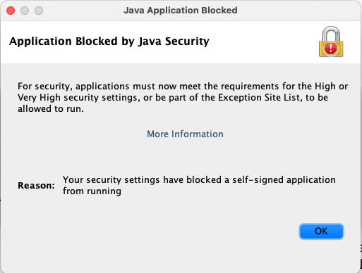
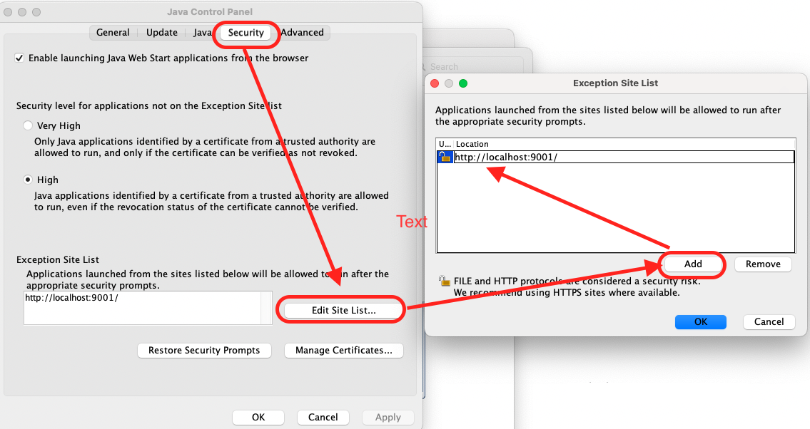

# WebUtil

## Introduction

WebUtil is an Oracle Forms Library. 

It provides a simple way to achieve client side integration while running Oracle Forms from a web application server like WebLogic Server. It simplifies the upgrading of older client/server applications to web deployment, and enhances the capabilities of web based Oracle Forms applications.

On client/server side, the library was called d2kwutil.pll

Estimated Time: 10 minutes

### Objectives

In this lab, you will:
* Install WebUtil
* Run a demo that is using it

### Prerequisites 

This lab assumes you have:
* All previous labs successfully completed

## Task 1: Install and compile the Webutil Demo

You should have a SSH connection from your computer to the server forwarding port 9001.
Check **Lab 4 - Task 1: Port Forwarding** for the command.

Run the following script to install WebUtil. This script is a sample script that install WebUtil.
For more explanation, please refer to [How to Configure Webutil in Forms 12c (Doc ID 2070183.1)](https://support.oracle.com/knowledge/Middleware/2070183_1.html) 

Run:
```
cd $HOME/forms-to-oci-samples/webutil
./webutil.sh
```

This will download the jacob.jar files, copy the file webutil.pll in $HOME/oracle/formsmodules, ...

Recompile the webutil_demo
```
rm $HOME/oracle/formsmodules/webutil_demo.fmx    
cd $HOME/forms-to-oci-samples
./compile.sh
````

Check the compiled files
```
ls $HOME/oracle/formsmodules/webutil* 
```

## Task 2: Restart Forms Server

We need to restart the server to clean his HTML cache. 
Please run:

```
/home/opc/oracle/utilities/srvcontroller.sh
Choose 7: stop Forms
tail -f /tmp/frm_stop.log
```

Follow it until it is stopped (Then CTRL+C)

```
/home/opc/oracle/utilities/srvcontroller.sh
Choose 8: start Forms
tail -f /tmp/frm_startup.log
```
Follow it until it is started (Then CTRL+C)

## Task 3: Test

Try this URL

```
 <copy>http://localhost:9001/forms/frmservlet?config=webutil_demo</copy>
```



Congratulation ! 

If it does not work, check the common issues below. 

## Common Issues

### FRM_40735 - ORA 6508

When running WebUtil, you have the error 
```
FRM-40735 : WHEN-BUTTON-PRESSED trigger raised unhandled exception ORA-6508
```
This is often because the WebUtil library used during the compilation is not the same than the one used during the runtime.
- Check your FORMS_PATH for duplicate libraries
- Be sure to compile and run with the same library 


### Application Blocked by Java Security 

Your security settings have blocked a self-signed application from running.



This is because the jacob.jar file is self-signed. 
You can work-around by adding http://localhost:9001/ in the security exception of the Java console.
- Go to Control Panel (or Settings in MacOS)
- Start the Java Console settings
- Go to the security tab
- Add http://localhost:9001



## Learn More

* [How to Configure Webutil in Forms 12c (Doc ID 2070183.1)](https://support.oracle.com/knowledge/Middleware/2070183_1.html)
* [WebUtil](https://www.oracle.com/tools/technologies/forms-webutil.html)

## Acknowledgements
* Marc Gueury - Application Development EMEA
* Michael Ferrante - Senior Principal Product Manager
* Last Updated - June 2022


