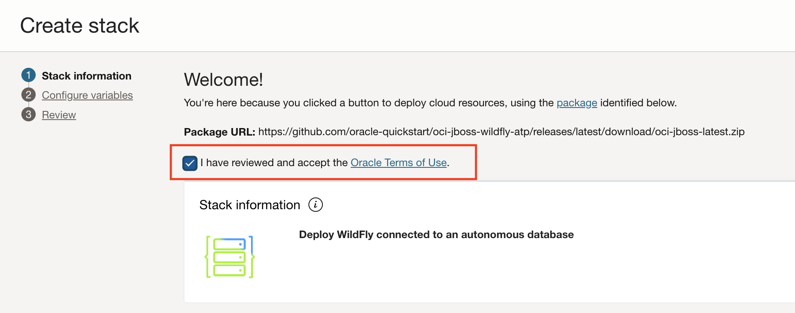
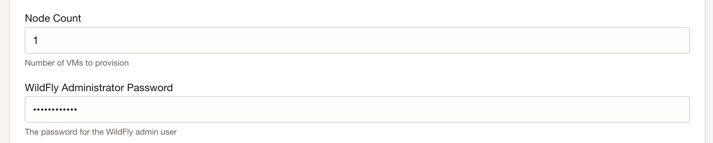
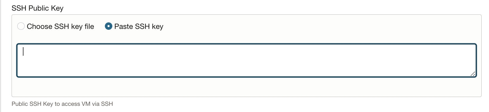
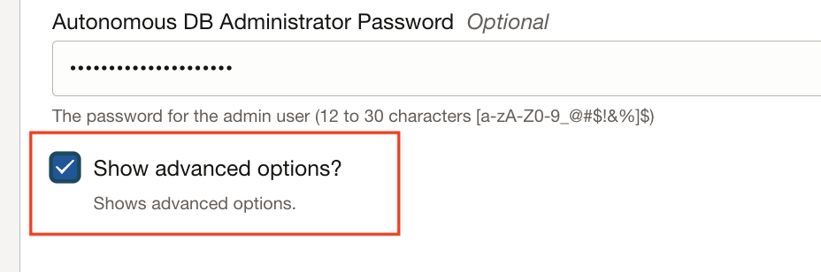
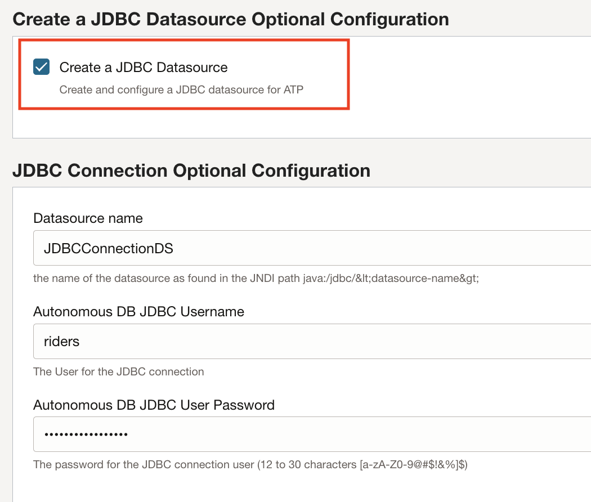
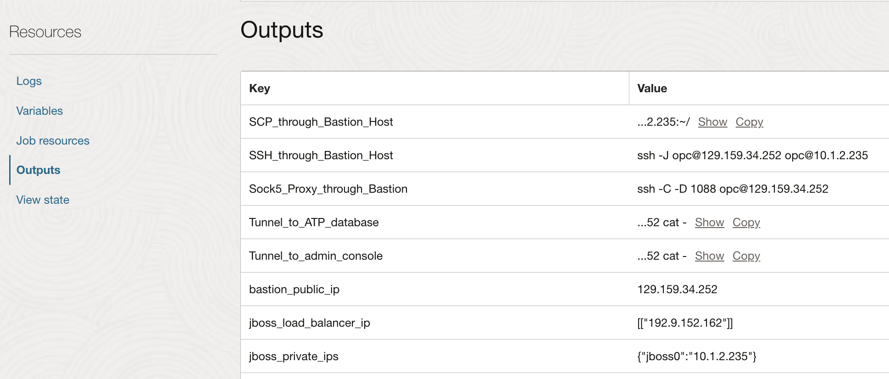

# Deploy JBoss/WildFly on OCI with Oracle Autonomous Database

## Introduction

In this lab, we will deploy a WildFly Cluster on Oracle Cloud Infrastructure (OCI) with Terraform, along with an Autonomous Transaction Processing Database.

Estimated Lab Time: 25 minutes

### Objectives

In this lab, you will provision:
* A WildFly cluster based on Compute Virtual Machine (VM).
* A public load balancer targeting the WildFly instances.
* An Oracle Autonomous Database.

### Prerequisites

For this lab, you need:

* An Oracle Free Tier, Always Free, Paid or LiveLabs Cloud Account.

## Task 1: Deploy with 1-click deploy

1. Go to the oracle-quickstart repositiory on Github [https://github.com/oracle-quickstart/oci-jboss-wildfly-atp](https://github.com/oracle-quickstart/oci-jboss-wildfly-atp)

2. Scroll to the deployment button and click **Deploy on Oracle Cloud**.

3. Agree to the terms.

    

4. Make sure you are in the compartment you want to use to deploy this stack.

5. Click **Next**.

6. Create a password for the WildFly admin user.

    

7. For the **SSH Key**, click **Paste** and paste the SSH key created ealier.

    

7. Click **Show Advanced Options**

    

8. Scroll to the bottom and click **Create JDBC Source**

    

9. Enter the JDBC source name as `JDBCDatasourceDS`.

10. Enter the username as `riders`.

11. Enter the datasource password found in the local environment `env` file locted at `wildfly-to-oci/env` under the variable named `DS_PASSWORD`.

12. Click **Next**.

13. Scroll to the bottom and Click **Run Apply**.

14. Click **Create**.

The job will take a few minutes.

When the job completes, make sure to notice the **Outputs** thart provides useful information about the resources deployed.

You may proceed to the next lab.

## Acknowledgements
 - **Author** - Subash Singh, Emmanuel Leroy
 - **Last Updated By/Date** - Emmanuel Leroy, February 2023