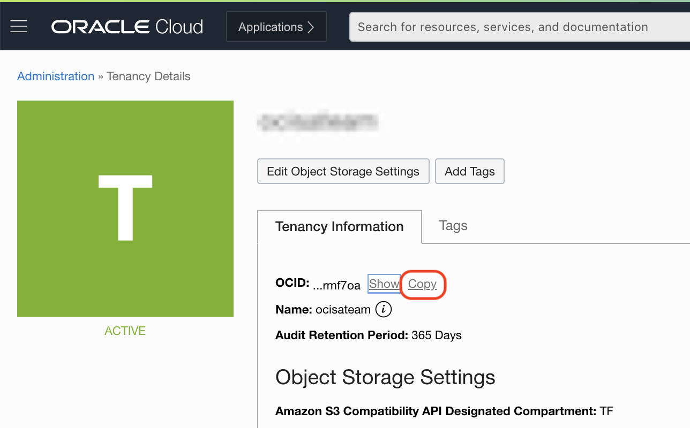
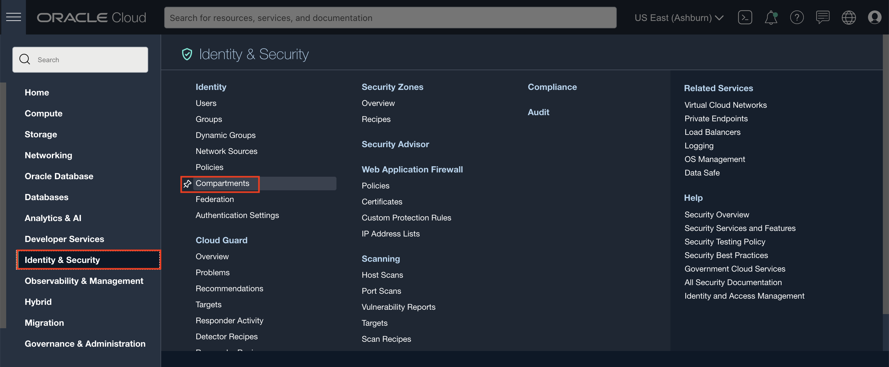
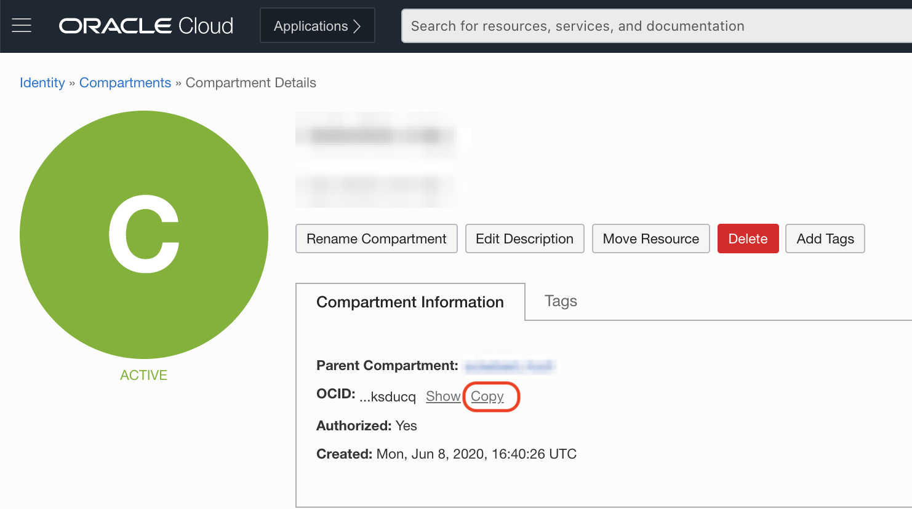
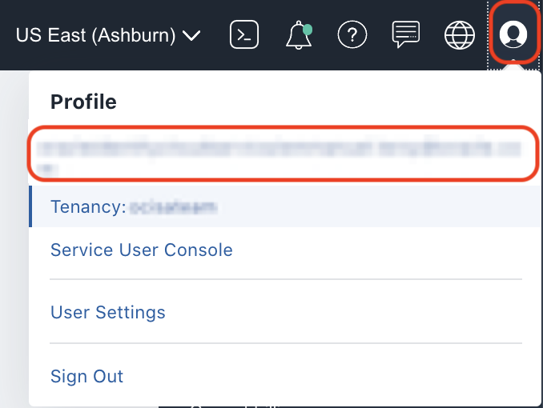
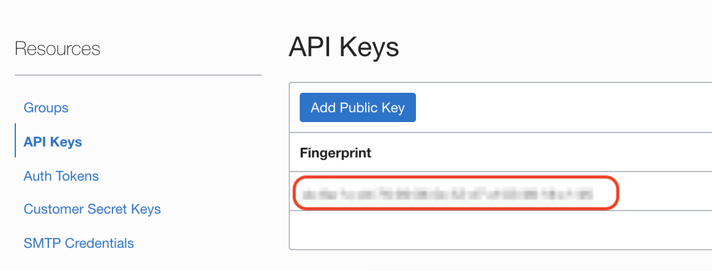

# Deploy JBoss/WildFly on OCI with Oracle Autonomous Database

## Introduction

In this lab, we will deploy a WildFly Cluster on Oracle Cloud Infrastructure (OCI) with Terraform, along with an Autonomous Transaction Processing Database.

Estimated Lab Time: 25 minutes

### Objectives

In this lab, you will provision:
* A WildFly cluster based on Compute Virtual Machine (VM).
* A public load balancer targeting the WildFly instances.
* An Oracle Autonomous Database.

### Prerequisites

For this lab, you need:

* An Oracle Free Tier, Always Free, Paid or LiveLabs Cloud Account.
* Git installed.
* Terraform installed. If you need guidance to setup Terraform, please visit the [prerequistes](https://github.com/oracle-quickstart/oci-prerequisites) document.

## Task 1: Gather Required Information

1. Get your `tenancy OCID`.

    - In the OCI web console, **click** your **User** icon (top right corner), then **Tenancy**.

        

    - **Copy** the OCID of the tenancy and paste it in your environment file.

        

2. Get your `compartment OCID`.

    - In the OCI web console, go to **Identity & Security -> Compartments**.

    

    - Navigate to the compartment where you want to deploy the infrastructure.

    - **Copy** the OCID of the compartment.

    

3. Get your `user OCID`.

    - In the OCI web console, **click** your **User** icon (top right corner), then **click** your user name.
        
    

    - **Copy** the OCID of your user and paste it in your environment file.

    

4. Get the oci public key `fingerprint`.

    - In your user settings, under API Keys, you will find the `fingerprint` value. 
    
    Make sure this is the one matching the oci public key you created for terraform.

    


## Task 2: Get the Terraform Code

For this step, you should open a separate shell terminal, so you are on your local machine (not the docker container).

1. You'll find the code on Github.com at [https://github.com/oracle-quickstart/oci-jboss-wildfly-atp](https://github.com/oracle-quickstart/oci-jboss-wildfly-atp).

2. You can click **Code** and download as a zip file.

3. Or using the git command line, in a local folder of your choice, clone the repository with:

    ```bash
    <copy>
    git clone https://github.com/oracle-quickstart/oci-jboss-wildfly-atp
    </copy>
    ```

4. Get into the code folder:

    ```bash
    <copy>
    cd oci-jboss-wildfly-atp
    </copy>
    ```

5. With the information gathered earlier, create the appropriate TF_VARS, in a `TF_VARS.sh` file:

    ```
    <copy>
    export TF_VAR_tenancy_ocid=ocid1.tenancy....
    export TF_VAR_user_ocid=ocid1.user.oc1..
    export TF_VAR_region=us-ashburn-1
    export TF_VAR_fingerprint=50:d0:7d:f7:0e:05:cd:87:3b:2a:cb:50:b1:17:90:e9
    export TF_VAR_private_key_path=~/.oci/oci_api_key.pem
    </copy>
    ```

6. Source the TF_VARS.sh file:

    ```
    <copy>
    source ./TF_VARS.sh
    </copy>
    ```

## Task 3: Create a `terraform.tfvars` Config File

To run the deployment, you need to define a few settings in a file named `terraform.tfvars`.

1. Create a file called `terraform.tfvars` and open it with your prefered editor.

2. Enter the followiong information in the `terraform.tfvars` file:

    ```
    <copy>
    tenancy_ocid = "ocid1.tenancy.oc1..."
    compartment_id = "ocid1.compartment.oc1..."
    region = "us-ashburn-1"

    vcn_cidr_block = "10.1.0.0/16"
    jboss_vm_shape = "VM.Standard.E2.1"
    jboss_node_count = 2
    ssh_authorized_keys = "ssh-rsa..."
    jboss_admin_username = "admin"
    jboss_admin_password = "<wildlfy_admin_password>"

    provision_atp      = true
    atp_private_subnet = true
    atp_admin_password = "<atp_admin_password>"
    atp_display_name   = "JBossATP"
    atp_db_name        = "atpdbjboss"

    create_jdbc_ds = true
    ds_name = "JDBCConnectionDS"
    atp_username   = "RIDERS"
    atp_password   = "Nge29v2rv#1YtSIS#"

    domain_mode = true
    </copy>
    ```

    *Note: The terraform lets us create the datasource for the application. Here we need to specify the datasource name `ds_name`, user `atp_username` and user password `atp_password` for the application. The values above reflect the demo 'on-premises' environment values, so do not change them.*

3. Save the `terraform.tfvars` file.

## Task 4: Run the Deployment

1. Initialize the project:

    ```
    <copy>
    terraform init
    </copy>
    ```

2. Check the plan (optional) to determine what will happen:

    ```
    <copy>
    terraform plan
    </copy>
    ```

3. Apply the plan:

   ```bash
    <copy>
    terraform apply
    </copy>
    ```

4. Type `yes` to apply the plan at the prompt.

    ```
    Do you want to perform these actions?
    Terraform will perform the actions described above.
    Only 'yes' will be accepted to approve.

    Enter a value: yes
    ```

    It will take a few minutes to provision the resources

    You may proceed to the next lab while it is provisioning, however you will not be able to migrate the data to the database until the infrastructure is completly provisioned.

5. Note the outputs of the terraform for future use.    

You may proceed to the next lab.

## Acknowledgements
 - **Author** - Subash Singh, Emmanuel Leroy
 - **Last Updated By/Date** - Emmanuel Leroy, May 2021