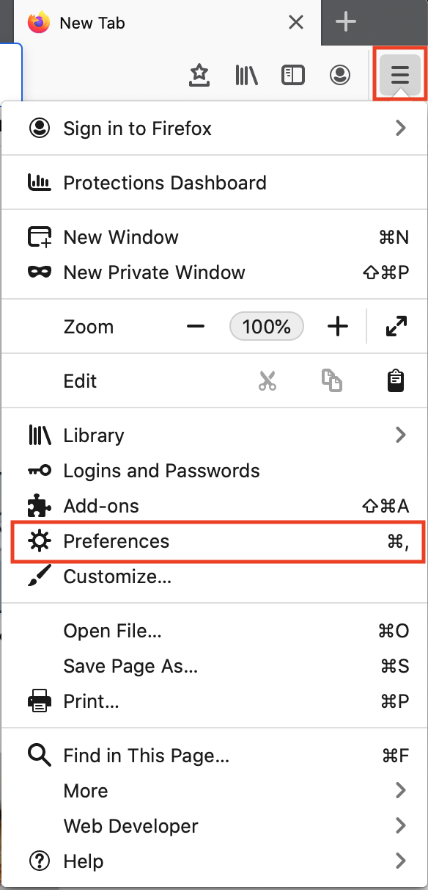
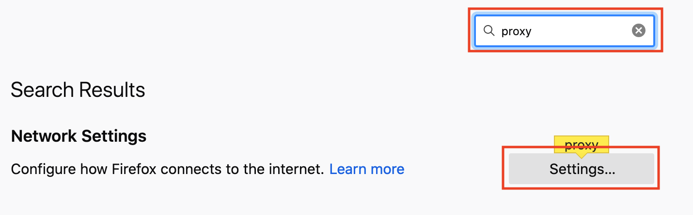
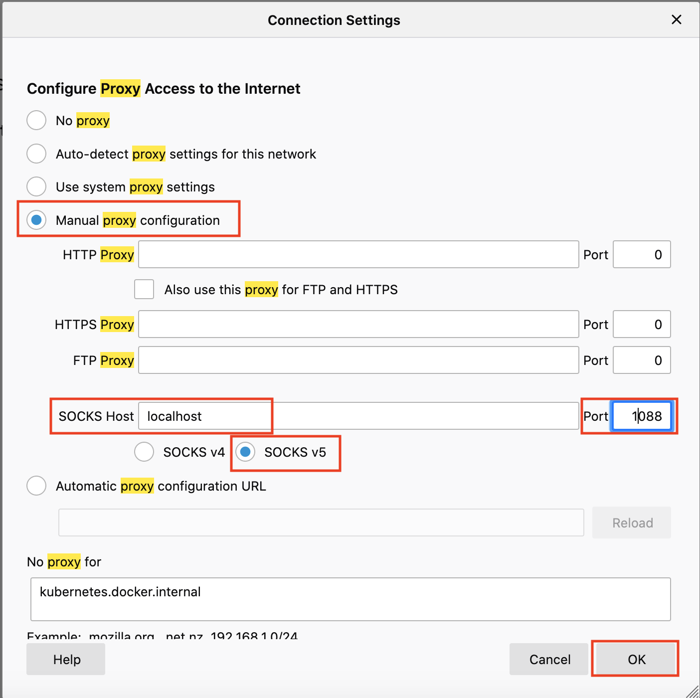
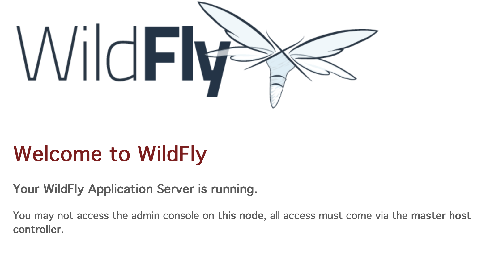
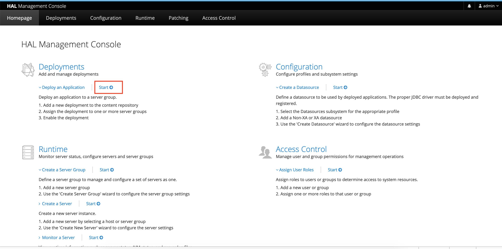
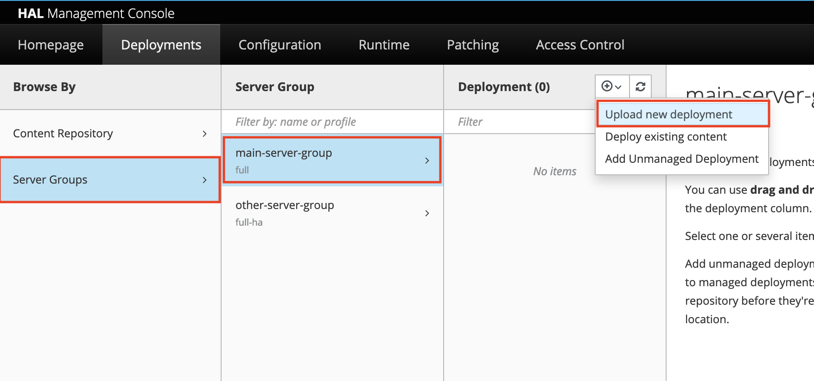
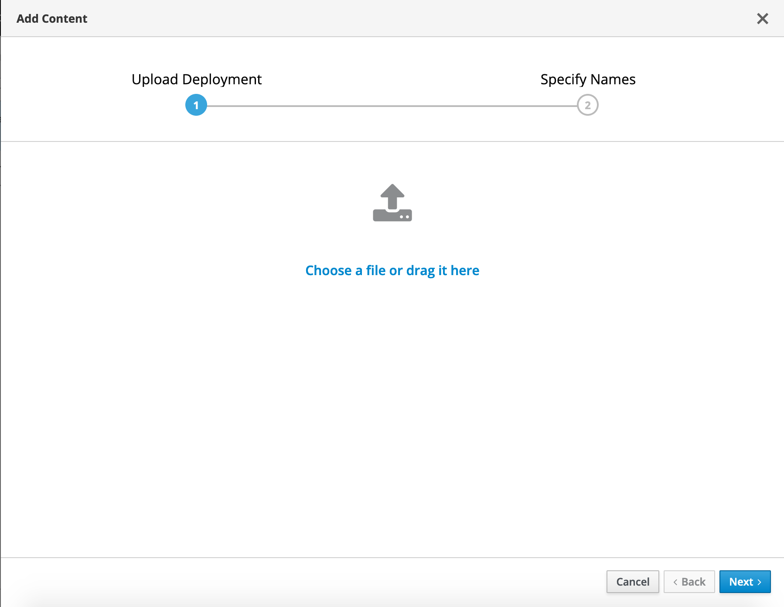
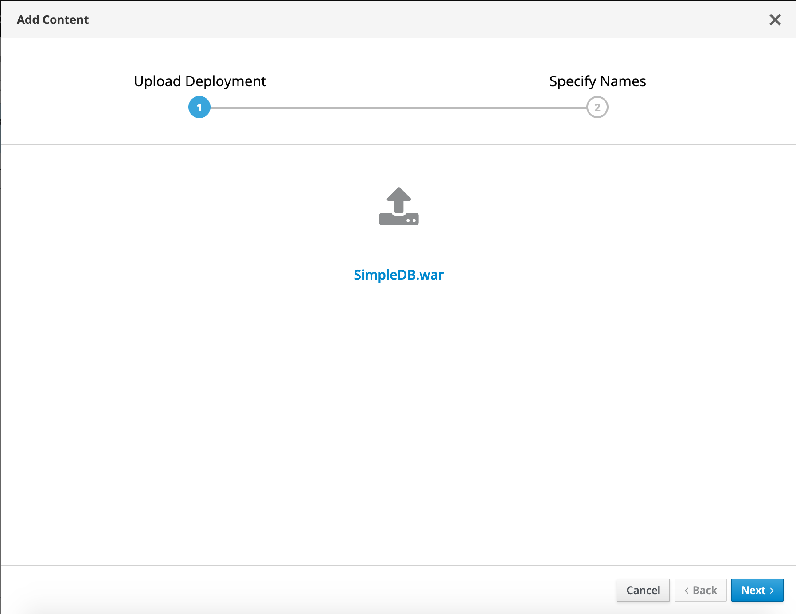
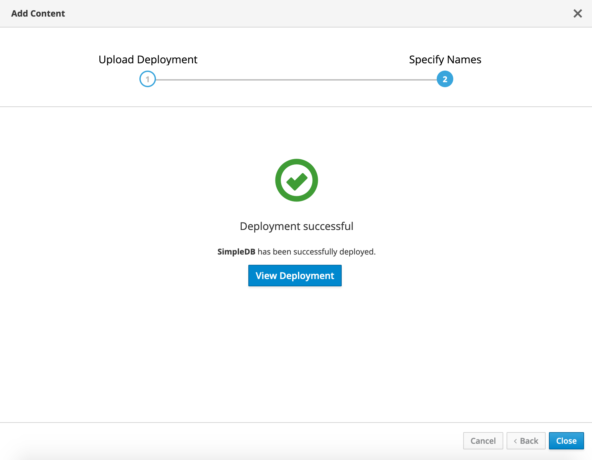

# Migrate the JBoss/WildFly Application

## Introduction

In this lab, we will migrate the application to the JBoss/WildFly cluster on Oracle Cloud Infrastructure (OCI).

Estimated Lab Time: 10 minutes

### Objectives

In this lab, you will:
* Move the application over to the JBoss/WildFly cluster on OCI.
* Configure the datasource used by the application to point to the Oracle Autonomous Database.

### Prerequisites

For this lab, you need to have provisioned the WildFly cluster on OCI.

## Task 1: Connect to the WildFly Admin Console

1. From the output of the WildFly deployment, gather the command to create a SOCKSv5 proxy.

    It should look something like:

    ```bash
    <copy>
    ssh -C -D 1088 opc@<BASTION_IP>
    </copy>
    ```

2. Run the command in your local computer terminal (not the docker container), adding the path to the SSH key file:

    ```bash
    <copy>
    ssh -i ./wildfly-to-oci/ssh/id_rsa -C -D 1088 opc@<BASTION_IP>
    </copy>
    ```

2. Open a new FireFox browser window.

3. Go to Preferences.

    

4. In the search bar, type **proxy**, then click **Settings**.

    

5. In the Settings page, Click **Manual proxy configuration**, then **SOCKS v5**, and enter **localhost** for the host and **1088** for the  port as below:

    

6. Then navigate to the WildFly admin console URL, using the **Private IP** of the wildfly server.

    It should be [http://10.1.2.2:9990/console/](http://10.1.2.2:9990/console/) or [http://10.1.2.3:9990/console/](http://10.1.2.3:9990/console/) if this is your first deployment.

    If you get the message below, you are looking at the wrong node, try the other node's IP.

    
    
7. Log in with the WildFly admin credentials (from terraform.tfvars)

## Task 2: Locate the WAR File

1. Since we built the `SimpleDB.war` WAR file inside the Docker container, we can find it on your local machine in the on-premises environment folder under:

    ```
    <copy>
    wildfly-to-oci/wildfly/app/SimpleDB.war
    </copy>
    ```

## Task 3: Install the Application in the WildFly Console

1. In the WildFly console, click **Start** under **Deployments**.

    

2. Then click **By Server Group** -> **main-server-group** and then the **(+)** icon to **Upload New Deployment**.

    

3. On the modal prompt, navigate to the location of the WAR file, and select it.

    

4. Click **Next**.

    

5. Do not change the values in the next screen and click **Finish**.

6. The domain controller will deploy the application on all servers in the server group.

    


## Task 4: Check the Application is Served via the Load Balancer

1. Get the load balancer public IP from the Terraform output. 

2. Go to http://*LOAD_BALANCER_IP*/SimpleDB/.

3. Check that you see the application being served.

    

You may proceed to the next lab.

## Acknowledgements
 - **Author** - Subash Singh, Emmanuel Leroy
 - **Last Updated By/Date** - Emmanuel Leroy, February 2023
