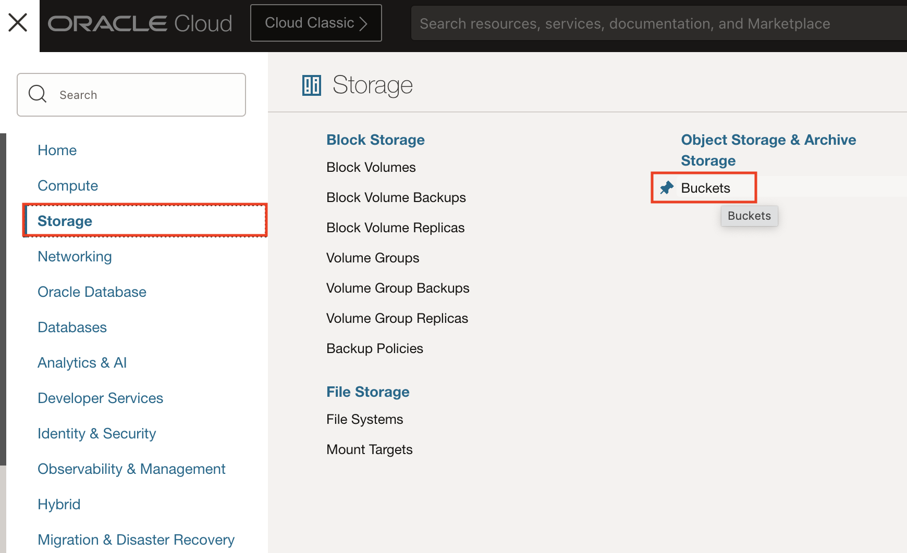
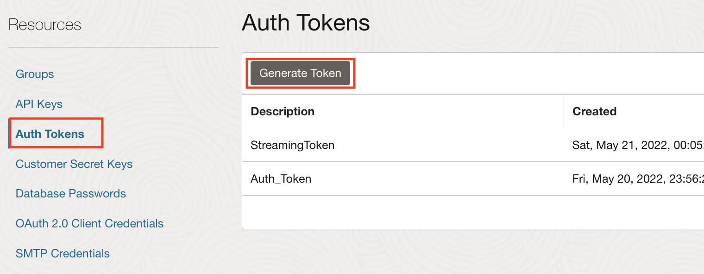

# Migrate the On-Premises Database to Oracle Autonomous Database

## Introduction

In this lab, we will migrate the on-premises database to the Oracle Autonomous Database on Oracle Cloud Infrastructure (OCI).

Estimated Lab Time: 10 minutes

### Objectives

In this lab, you will move the application database schema over to the Oracle Autonomous Database on OCI using datapump and OCI Object Storage as intermediate storage location.


## Task 1: Install the OCI CLI on the Source Database

The OCI Command Line Interface (CLI) tool will be needed to get the wallet from the database and put the database dump file into object storage.

*Note:* You could also do without the CLI by getting the wallet through the console and uploading the dump file through the console. This requires more manual steps.

1. You should still be inside the oracle database container, otherwise get inside with:

    ```
    <copy>
    docker exec -it wildfly-to-oci_oracledb_1 /bin/bash
    </copy>
    ```

1. Install the OCI CLI on the source database:

    ```bash
    <copy>
    bash -c "$(curl -L https://raw.githubusercontent.com/oracle/oci-cli/master/scripts/install/install.sh)"
    </copy>
    ```

    Press **enter** to use the defaults for all options.

2. Restart your shell:
    ```
    <copy>
    exec -l $SHELL
    </copy>
    ```

3. Configure the OCI CLI:

    ```
    <copy>
    oci setup config
    </copy>
    ```

    You will be prompted for:
    - Location of the config. Press **Enter**.
    - `user_ocid`: enter your user OCID.
    - `tenancy_ocid`: enter your tenancy OCID.
    - `region`: enter your region from the list provided.
    - Generate a RSA key pair: press **Enter** for Yes (default).
    - Directory for keys: press **Enter** for the default.
    - name for the key: press **Enter** for the default.
    - Passphrase: press **Enter** for no passphrase.


    You should see an output like:

    ```bash
    Private key written to: /home/oracle/.oci/oci_api_key.pem
    Fingerprint: 21:d4:f1:a0:55:a5:c2:ce:e2:...
    Config written to /home/oracle/.oci/config
    ```


4. Upload the public key to your OCI account.

    In order to use the CLI, you need to upload the public key generated to your user account.

    Get the key content with:

    ```
    <copy>
    cat /home/oracle/.oci/oci_api_key_public.pem
    </copy>
    ```

5. Copy the full printed output to clipboard.

6. In the Oracle Cloud Console:

    - Under **User -> User Settings**.
    - Click **API Keys**.
    - Click **Add Public Key**.
    - Click **Paste Public Key**.
    - Paste the key copied above.
    - Click **Add**.

    You can verify that the Fingerprint generated matches the fingerprint output of the config.

7. Test your CLI:

    ```
    <copy>
    oci os ns get
    </copy>
    ```

    This command should output the namespace of your tenancy (usually the name of the tenancy)

    ```
    {
        "data": "your-tenancy-namespace"
    }
    ```

## Task 2: Create an OCI Object Storage Bucket

1. Go to **Storage -> Object Storage**.

    

2. Make sure you are in the compartment where you deployed the resources.

3. Click **Create Bucket**.

4. Give the bucket the name **atp-upload**.

5. Click **Create Bucket**.

## Task 3: Export the Database Schema and Data

1. Run the datapump export script `datapump_export.sh`:

    ```bash
    <copy>
    cd ~/datapump
    ./datapump_export.sh
    </copy>
    ```

    This will take a minute or so. 
    
    The log should look like:

    ```
    SQL*Plus: Release 12.2.0.1.0 Production on Fri Oct 9 22:33:38 2020

    Copyright (c) 1982, 2016, Oracle.  All rights reserved.

    Last Successful login time: Fri Oct 09 2020 21:35:52 +00:00

    Connected to:
    Oracle Database 12c Enterprise Edition Release 12.2.0.1.0 - 64bit Production

    SQL> DROP DIRECTORY export
    *
    ERROR at line 1:
    ORA-04043: object EXPORT does not exist


    SQL> Disconnected from Oracle Database 12c Enterprise Edition Release 12.2.0.1.0 - 64bit Production

    SQL*Plus: Release 12.2.0.1.0 Production on Fri Oct 9 22:33:38 2020

    Copyright (c) 1982, 2016, Oracle.  All rights reserved.

    Last Successful login time: Fri Oct 09 2020 22:33:38 +00:00

    Connected to:
    Oracle Database 12c Enterprise Edition Release 12.2.0.1.0 - 64bit Production

    SQL> 
    Directory created.

    SQL> Disconnected from Oracle Database 12c Enterprise Edition Release 12.2.0.1.0 - 64bit Production

    Export: Release 12.2.0.1.0 - Production on Fri Oct 9 22:33:39 2020

    Copyright (c) 1982, 2017, Oracle and/or its affiliates.  All rights reserved.

    Connected to: Oracle Database 12c Enterprise Edition Release 12.2.0.1.0 - 64bit Production
    Starting "SYSTEM"."SYS_EXPORT_SCHEMA_01":  system/********@oracledb:/PDB.us.oracle.com schemas=RIDERS DIRECTORY=export 
    Processing object type SCHEMA_EXPORT/TABLE/TABLE_DATA
    Processing object type SCHEMA_EXPORT/TABLE/STATISTICS/TABLE_STATISTICS
    Processing object type SCHEMA_EXPORT/STATISTICS/MARKER
    Processing object type SCHEMA_EXPORT/USER
    Processing object type SCHEMA_EXPORT/SYSTEM_GRANT
    Processing object type SCHEMA_EXPORT/DEFAULT_ROLE
    Processing object type SCHEMA_EXPORT/PRE_SCHEMA/PROCACT_SCHEMA
    >>> DBMS_AW_EXP: SYS.AW$EXPRESS: OLAP not enabled
    >>> DBMS_AW_EXP: SYS.AW$AWMD: OLAP not enabled
    >>> DBMS_AW_EXP: SYS.AW$AWCREATE: OLAP not enabled
    >>> DBMS_AW_EXP: SYS.AW$AWCREATE10G: OLAP not enabled
    >>> DBMS_AW_EXP: SYS.AW$AWXML: OLAP not enabled
    >>> DBMS_AW_EXP: SYS.AW$AWREPORT: OLAP not enabled
    Processing object type SCHEMA_EXPORT/TABLE/TABLE
    >>> DBMS_AW_EXP: SYS.AW$EXPRESS: OLAP not enabled
    >>> DBMS_AW_EXP: SYS.AW$AWMD: OLAP not enabled
    >>> DBMS_AW_EXP: SYS.AW$AWCREATE: OLAP not enabled
    >>> DBMS_AW_EXP: SYS.AW$AWCREATE10G: OLAP not enabled
    >>> DBMS_AW_EXP: SYS.AW$AWXML: OLAP not enabled
    >>> DBMS_AW_EXP: SYS.AW$AWREPORT: OLAP not enabled
    . . exported "RIDERS"."RIDERS"                           863.7 KB    9040 rows
    Master table "SYSTEM"."SYS_EXPORT_SCHEMA_01" successfully loaded/unloaded
    ******************************************************************************
    Dump file set for SYSTEM.SYS_EXPORT_SCHEMA_01 is:
    /home/oracle/datapump/export/expdat.dmp
    Job "SYSTEM"."SYS_EXPORT_SCHEMA_01" successfully completed at Fri Oct 9 22:34:04 2020 elapsed 0 00:00:24

    ```
  
## Task 4: Move the Dump File to the Object Storage bucket on OCI

1. Put the dump file in the `atp-upload` bucket:

    ```
    <copy>
    oci os object put \
    -bn atp-upload \
    --file /home/oracle/datapump/export/expdat.dmp \
    --name expdat.dmp
    </copy>
    ```

    The log should look like:

    ```
    Uploading object  [####################################]  100%
    {
    "etag": "4170701c-22e9-42b1-9bea-44423eede8b7", 
    "last-modified": "Fri, 09 Oct 2020 22:36:05 GMT", 
    "opc-content-md5": "9YvlOURl0QgQBvxFvxKMnQ=="
    }
    ```

## Task 5: Get the OCID of the Database

1. Go to **Oracle Database -> Autonomous Transaction Processing**.

    

2. Make sure you are in the right compartment and **click** the database you provisioned earlier to get to the details.

3. Copy the **OCID**, and save in a notepad for later use.

4. Also gather the **Private Endpoint IP**.

5. And the **Private Endpoint URL** (i.e. hostname).

    

## Task 6: Get the Database Wallet

1. Using the OCI CLI, download the database wallet on the source database, replacing the OCID:

    ```bash
    <copy>
    oci db autonomous-database generate-wallet --autonomous-database-id <your ATP OCID> --file wallet.zip --password atpPasSword1
    </copy>
    ```

    Replace the OCID of the autonomous database in the command.

2. Unzip the wallet:

    ```bash
    <copy>
    unzip wallet.zip
    </copy>
    ```

3. Set the `DIRECTORY` to point to the wallet location in the `sqlnet.ora` file:

    - Edit the sqlnet.ora file:

    ```
    <copy>
    nano sqlnet.ora
    </copy>
    ```

    Replace the directory value as below
    ```
    <copy>
    WALLET_LOCATION = (SOURCE = (METHOD = file) (METHOD_DATA = (DIRECTORY="/home/oracle/datapump")))
    SSL_SERVER_DN_MATCH=yes
    </copy>
    ```

4. Set the `TNS_ADMIN` environment variable:

    ```
    <copy>
    export TNS_ADMIN=$(pwd)
    </copy>
    ```

## Task 6: Create a Local Tunnel to the Oracle Autonomous Database

1. Get the public IP of the bastion host from the terraform output.

    If the JBoss/WildFly server was deployed in a public subnet, you can use the public IP of the JBoss/WildFly server as bastion.

2. Create a tunnel with:

    ```bash
    <copy>
    # Configure the Bastion Public IP to go through
    export BASTION_IP=<Public IP of the bastion>
    </copy>
    ```

    ```bash
    <copy>
    # This DB_HOST is the Private Endpoint IP gathered earlier
    export DB_HOST=<Private endpoint>
    </copy>
    ```

    Run:

    ```bash
    <copy>
    ssh -4 -M -S socket -fnNT -L 1522:${DB_HOST}:1522 opc@${BASTION_IP} cat -
    </copy>
    ```

    You will be prompted to type `yes` to acknowledge the new host.

3. Edit the `/etc/hosts` to point the *Private Endpoint Host* of the ATP database to 127.0.0.1 (localhost).

    ```
    <copy>
    # This looks up the Private Endpoint Host in the tnsnames.ora file
    ATP_HOSTNAME=$(sed 's|.*(host=\([a-z0-9.-]*\)).*|\1|;' tnsnames.ora | head -n1)
    sudo su -c "printf \"127.0.0.1  ${ATP_HOSTNAME}\n\"  >> /etc/hosts"
    </copy>
    ``` 

4. You can verify it was inserted properly with:

    ```
    <copy>
    cat /etc/hosts
    </copy>
    ```

    Which should output something like:

    ```
    127.0.0.1	localhost
    ::1	localhost ip6-localhost ip6-loopback
    fe00::0	ip6-localnet
    ff00::0	ip6-mcastprefix
    ff02::1	ip6-allnodes
    ff02::2	ip6-allrouters
    172.19.0.3	58aa534ef636
    127.0.0.1  jrhdeexg.adb.us-ashburn-1.oraclecloud.com
    ```

## Task 7: Get an OCI Auth token

1. Go to **User -> User Settings**.

2. Take note of your full username.

    

3. Go to **Auth Tokens**.

    

4. Click **Generate Token**.

5. Give it a name.

6. Click **Generate Token**.

7. Copy the output of the token to notepad.

## Task 8: Configure Database Cloud Credential

1. Using SQL*PLus Instant Client, connect to the remote database through the tunnel created earlier:

    ```
    sqlplus admin@<you_atp_db_name>_high
    ```

    If you followed the naming conventions used in this workshop, this should be:

    ```
    <copy>
    sqlplus admin@atpdb_high
    </copy>
    ```

    You'll be prompted for the admin password for the ATP database `atp_admin_password`, which was configured in the `terraform.tfvars` file.

2. You should be logged into a SQL prompt like:

    ```
    SQL*Plus: Release 12.2.0.1.0 Production on Fri Oct 9 22:52:05 2020

    Copyright (c) 1982, 2016, Oracle.  All rights reserved.

    Enter password: 

    Connected to:
    Oracle Database 19c Enterprise Edition Release 19.0.0.0.0 - Production

    SQL> 
    ```

3. Create the OCI cloud credential:

    At the SQL prompt, paste the following command (replacing the `username` and `password` values):

    Note: your username is the full name dislayed when you look at your user on the Oracle Cloud Console. If you use a federated user, it is usually your email prefixed with `oracleidentitycloudservice/`
    ```
    <copy>
    SET DEFINE OFF
    BEGIN
    DBMS_CLOUD.CREATE_CREDENTIAL(
        credential_name => 'DEF_CRED_NAME',
        username => '<oci username>',
        password => '<oci auth token>'
    );
    END;
    /
    </copy>
    ```

    If you have any communication issue, make sure the tunnel is still running.

4. Set as the default credential:

    ```
    <copy>
    ALTER DATABASE PROPERTY SET DEFAULT_CREDENTIAL = 'ADMIN.DEF_CRED_NAME';
    </copy>
    ```

5. Type `exit` to exit SQL*Plus.


## Task 9: Import the Dump File into the Database

Use datapump to import the data dump.

1. Define the environment variables below:
    ```
    <copy>
    export REGION=<your-region ex: us-ashburn-1>
    export NAMESPACE=<your namespace>
    export BUCKET=atp-upload
    export FILENAME=expdat.dmp
    export ATP_DB_NAME=atpdb <or your ATP DB name>
    export ATP_PASSWORD="<atp_admin_password>"
    </copy>
    ```

2. Run:

    ```bash
    <copy>
    impdp admin/${ATP_PASSWORD}@${ATP_DB_NAME}_low directory=data_pump_dir dumpfile=default_credential:https://objectstorage.${REGION}.oraclecloud.com/n/${NAMESPACE}/b/${BUCKET}/o/${FILENAME} parallel=16 exclude=cluster,db_link
    </copy> 
    ```

2. The first attempt will fail with an error: `ORA-01950: no privileges on tablespace 'DATA'` and we need to give quota to the created user RIDERS:

    ```
    <copy>
    echo "GRANT UNLIMITED TABLESPACE TO RIDERS;" | sqlplus admin/${ATP_PASSWORD}@${ATP_DB_NAME}_low
    </copy>
    ```

    You should see:

    ```
    Grant Succeeded
    ```

3. We also need to drop the table `RIDERS.RIDERS` that was created or its data won't be created on the next run:

    ```bash
    <copy>
    echo "DROP TABLE RIDERS.RIDERS;" | sqlplus admin/${ATP_PASSWORD}@${ATP_DB_NAME}_low
    </copy>
    ```

3. Re-run the import now that the user `RIDERS` has valid quota:

    ```
    <copy>
    impdp admin/${ATP_PASSWORD}@${ATP_DB_NAME}_low directory=data_pump_dir dumpfile=default_credential:https://objectstorage.${REGION}.oraclecloud.com/n/${NAMESPACE}/b/${BUCKET}/o/${FILENAME} parallel=16 exclude=cluster,db_link
    </copy>
    ```
    
    You will still see errors related to the user `RIDERS` and the associated table `RIDERS.RIDERS` already existing. This is normal as these objects were created on the first run of the command.

The database has been migrated.

You may proceed to the next lab.

## Acknowledgements
 - **Author** - Subash Singh, Emmanuel Leroy
 - **Last Updated By/Date** - Emmanuel Leroy, May 2021
