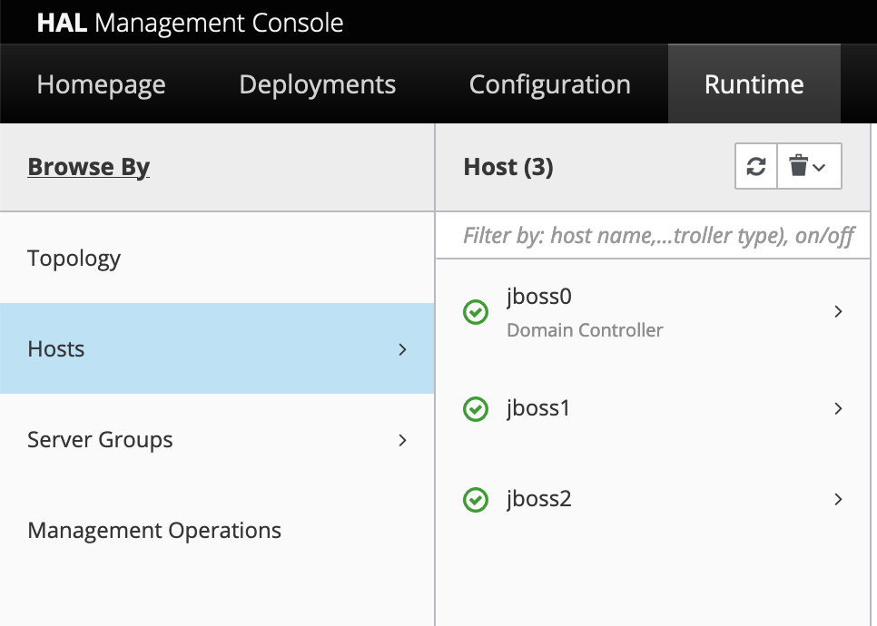

# Scale the JBoss/WildFly Cluster

## Introduction

In this lab, we will explain how to scale the number of JBoss/WildFly nodes on Oracle Cloud Infrastructure.

Estimated Lab Time: 5 minutes

### Objectives

In this lab, you will scale the number of nodes.

### Prerequisites

For this lab, you need to have provisioned the JBoss/WildFly cluster on OCI.

## Task 1: Scale the Number of Nodes

On your local machine where you ran the terraform.

1. Edit the `terraform.tfvars` file to have:

    ```yaml
    jboss_node_count=3
    ```

2. Run terraform plan:

    ```bash
    <copy>
    terraform plan
    </copy>
    ```

    Check the output to make sure this is what you expected. It should add a compute instance and re-register a backend to the load balancer.


3. Run terraform apply.

    ```bash
    <copy>
    terraform apply
    </copy>
    ```

    Once this is complete, you will get the private IPs of the 3 JBoss/WildFly servers, as well as the load balancer IP.

4. The WildFly Domain controller will automatically deploy the application on the additional server.

    If you didn't use Domain Mode, then you'll need to re-deploy the application on each additional WildFly node.

5. You can check the new node was added to the domain in the WildFly console, under **Runtime** -> **Hosts**.

    

6. You can also check the new node in the proxied browser on port 8080/SimpleDB to see the app deployed successfully.


You're done!


## Acknowledgements
 - **Author** - Subash Singh, Emmanuel Leroy
 - **Last Updated By/Date** - Emmanuel Leroy, October 2020
