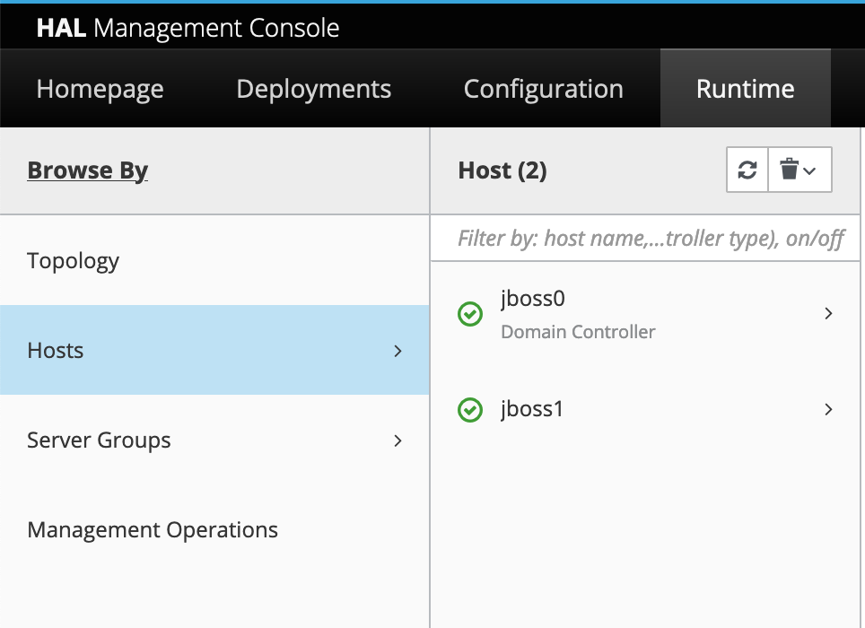

# Scale the JBoss/WildFly Cluster

## Introduction

In this lab, we will explain how to scale the number of JBoss/WildFly nodes on Oracle Cloud Infrastructure.

Estimated Lab Time: 5 minutes

### Objectives

In this lab, you will scale the number of nodes.

### Prerequisites

For this lab, you need to have provisioned the JBoss/WildFly cluster on OCI.

## Task 1: Scale the Number of Nodes

1. Edit the variables in stack deployed earlier by going to the **Stack Details**, open **Variables** and then click **Edit Variables**

2. Adjust the number of nodes in the UI to 2 nodes 

3. Click **Next**

4. Click **Run Apply** at the bottom and then **Save**.

    Once this is complete, you will get the private IPs of the 3 JBoss/WildFly servers, as well as the load balancer IP.

5. The WildFly Domain controller will automatically deploy the application on the additional server.

    If you didn't use Domain Mode, then you'll need to re-deploy the application on each additional WildFly node.

6. You can check the new node was added to the domain in the WildFly console, under **Runtime** -> **Hosts**.

    

You're done!

## Acknowledgements
 - **Author** - Subash Singh, Emmanuel Leroy
 - **Last Updated By/Date** - Emmanuel Leroy, February 2023
