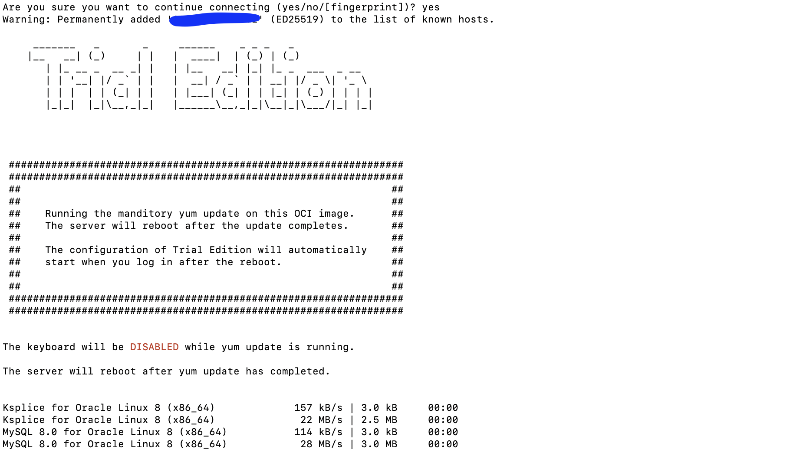
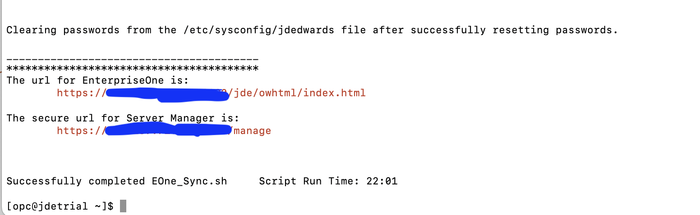

# Create a Trial Edition Instance in Oracle Cloud Infrastructure

## Introduction

In this tutorial, a JD Edwards (JDE) Trial Edition will be created in Oracle Cloud Infrastructure (OCI). The JDE Trial Edition will be provisioned and connected to.

Estimated Time: 40 minutes

### About Product/Technology

The process includes creating the JDE Trial Edition environment, setting up a bridge to connect to the JDE Trial Edition, ensuring the configurations are correct for the JDE Trial Edition, and finally, getting the IP addresses of the JDE consoles to access them in your web browser.


### Objectives

To deploy JDE Trial Edition, in this tutorial, you will:

*   Provision Trial Edition from OCI marketplace.
*   Set up PuTTY to access OCI instance.
*   Perform first-time configuration of Trial Edition.
*   Connect to JDE resources.

### Prerequisites

*   Virtual Cloud Network (VCN) created.
*   Established security list rules for JDE.
*   SSH Key pair generated.
*   Familiarity with Oracle Cloud Console.

## Task 1: Provision Trial Edition from Oracle Cloud Infrastructure Marketplace

Create an instance in OCI that is based off the JDE Trial Edition image.

1.	If not already done, sign in to OCI tenancy.
On the Oracle Cloud Console home page, click the **Navigation** Menu Button in the upper-left corner and hover over **Marketplace** and select **Applications**.

    

2.  Locate the Oracle JD Edwards image tile for **JD Edwards EnterpriseOne Trial Edition** (you might have to search for it; there could be several images out there) and click the tile.

    

3.  On the information page for the JD Edwards EnterpriseOne Trial Edition image, select the version **(9.2.7.3 – default)** to deploy and the compartment (you created a compartment in Set Up Oracle Cloud Infrastructure for JDE Trial Edition Deployment, Step 2) to deploy to. Select the check box to accept the Oracle Standard Terms and Restrictions and then click **Launch Instance**.

    

4.  Next, define the instance with the following options:

    1. Instance Name: 
    
        ```
        <copy>
        jdetrial
        </copy>
        ```

       

    2. Depending on the region selected, there might be one or more availability domains. Select Availability Domain: **AD1** (if single AD available) or **AD3** (if multiple ADs available).

    3. Security section provides option to either harden the firmware security or encrypt the data in-use, for this trial we are leaving it as disabled. 
    
    4. Operating System or Image Source: Leave **JD Edwards EnterpriseOne Trial Edition** selected.

    5. Instance Shape: Click on **Change Shape**.

    6. Select **Virtual Machine**, then select a shape. For the purposes of this tutorial, select the **Intel Flexible VM.Standard3.Flex** shape, or under the **Specialty and Legacy** series, select any compatible shape like **VM.Standard2.2**. We are keeping the default selections for Network bandwidth and Burstable options.

       

    7. Review and confirm the Virtual Cloud Network and Subnets you created earlier are selected. Ensure that the **Assign a public IP address** radio button is selected.

       

    8. In the Add SSH keys section, select the **Upload public key file (.pub)** radio button. Browse to select the public SSH key file you created earlier (Set Up OCI for JDE Trial Edition Deployment, STEP 1) by navigating to the location where the SSH files are stored. Alternatively, drag and drop the .pub file to the window.

       

    9. Leave the Boot Volume section as is.

       


    10. Click **Create**.

       

    You've now finished the provisioning step and should now see the screen below. The orange box indicates that the instance is in the process of being provisioned.

    

    **Note:** After a few minutes, the instance will be running and ready.  

5.  Copy and take note of the **Public IP address** under the **Instance Access** section, which is required to connect to the instance.

    

## Task 2:  Access the Oracle Cloud Infrastructure Instance

To complete the setup of the JD Edwards EnterpriseOne Trial Edition, it is necessary to connect to the VM Instance. 

The user name for the instance is **opc**  and there isn’t a password. The instance can only be accessed using the SSH private key.


###  Option 1: Connect to an Oracle Cloud Infrastructure Compute Instance using a Mac, Linux or Unix based machine using Command Line SSH


Mac OS X includes a command-line SSH client as part of the operating system. To use it, go to **Finder**, select **Go** and select **Utilities** from the top menu. Then look for **Terminal**. To connect over SSH you can use the following command on a Linux or UNIX style system:

    $ ssh -i ./path/to/private/key opc@ip_address

For example:

```
<copy>
ssh -i ./keys/id_rsa opc@ip_address
</copy>
```

Once connected, you can continue and skip  ``Option 2``  below.

### Option 2: Connect to an Oracle Cloud Infrastructure Compute Instance using a Windows based machine

**Method 1:** Using SSH with Git Bash

1.  Launch Git Bash.

    

2.  To connect over SSH you can use the following command on a Linux or UNIX style system.

        ssh -i ./path/to/private/key opc@ip_address

    For example:

    ```
    <copy>
    ssh -i ./keys/id_rsa opc@ip_address
    </copy>
    ```

**Note:** Do not copy and paste the line above straight into Git Bash. Unpredictable results may occur.

3.  If, after entering the ssh command, you receive a message like in the screen shot below, reply with YES.

    

4. Once connected, you can continue to Step 3.

**Method 2:** Using SSH with Putty for Windows

For Windows, you can also use a tool like PUTTY to set up PuTTY to connect to an OCI instance.

1.	Launch **PuTTY**.

    

2. Within the PuTTY session, under the **Session** category, enter the public IP address (for example, 132.145.187.16) from the instance information in the **Host Name** field, and then select **Connection** and select **Data**.

   

3.  In the **Auto-login username** field, enter **opc**. From the Category navigation tree, select **Connection**, select **SSH**, and then select **Auth**.

    

4.  Use **Browse** to locate the ppk (OCISSHKey.ppk) SSH file in the location where you saved it (Set Up OCI for JDE Trial Edition Deployment, Step 1). Return to the **Session**.

    

5.  In the Session category, enter a unique label (for example, JDE Trial Edition) for the connection in the **Saved Sessions** field, and click **Save**. This will retain all settings for future connections.

    

6.  Connect to the instance by clicking **Open**.

    

7.  PuTTY will open a command window. On first connection, a Security Alert window will appear. Click **Yes** to accept that you trust the connection to this host.

    

## Task 3: Perform First-Time Configuration of the Trial Edition

During the first connection to a Trial Edition instance (after completing Connect to JDE Trial Edition, Step 2), a process will run to verify if any critical updates are required to the OS and the installed software packages on the instance. If so, the following screen will display noting that the yum update packages are installing. This process can take anywhere from 5 to 10 minutes to run.

 Once complete, you will need to establish a new SSH session with the server. If your subsequent connections are refused or if the connection displays this same screen (shown below) then the updates are still running.

   

 On the first connection to the instance after the yum update has completed, the initial configuration script will be triggered and needs to be run prior to anything working.

 In the first connection to the Trial Edition Instance, follow along and answer the following prompts to complete the configuration:

1.	HTML Port [8080]: Set this as **8080**.

    

    **Note:** This must match the port number added to the ingress rules for the security list.

2.	Enter a database system password (and confirmation) such as:

    ```
    <copy>
    JDE_Rules1
    </copy>
    ```

    The password must meet these guidelines if you create your own:
    *	Must be between 8 and 10 characters.
    *	Must contain at least 1 letter and 1 number.
    *	May not contain any shell metadata characters such as $, |, @, and so on.


3.  Enter a JDE user password (and confirmation):

    ```
    <copy>
    JDE_Rules1
    </copy>
    ```

    Please follow the same password guidelines if you create your own.


4.	Enter a Weblogic admin password (and confirmation):
    
    ```
    <copy>
    JDE_Rules1
    </copy>
    ```
    
    Please follow the same password guidelines if you create your own.


5.	Enter the Final Confirmation: Y – Yes to commit the configuration settings and run the script to set up.


Configuration will take between 25 to 30 minutes. The configuration will go through and change all necessary database records and files on the system for the system information and options entered, as well as start all necessary services. Once complete, the JD Edwards EnterpriseOne Trial Edition is ready for use. Watch for the status “Successfully completed u01/vmScripts/EOne_Sync.sh”.

   

## Summary
At this point, the JD Edwards EnterpriseOne Trial Edition is ready for use.

## Acknowledgements
* **Author:** Tarani Meher, Principal JDE Specialist
* **Contributors:**
    * Jeff Kalowes, Principal JDE Specialist
    * Tarani Meher, Principal JDE Specialist
    * Mani Julakanti, Principal JDE Specialist
* **Last Updated By/Date:** Tarani Meher, Principal JDE Specialist, 09/2023
