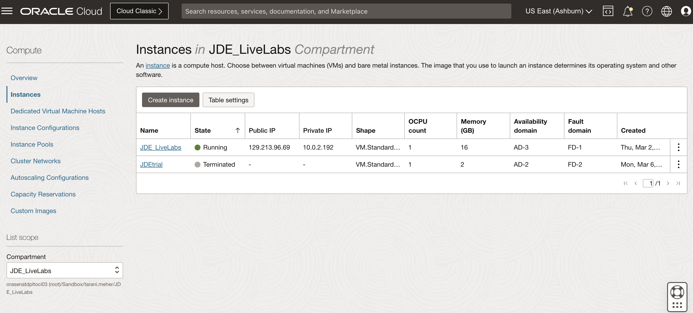
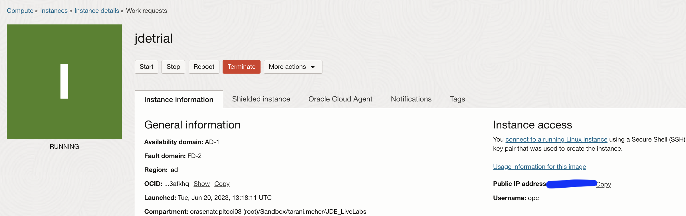
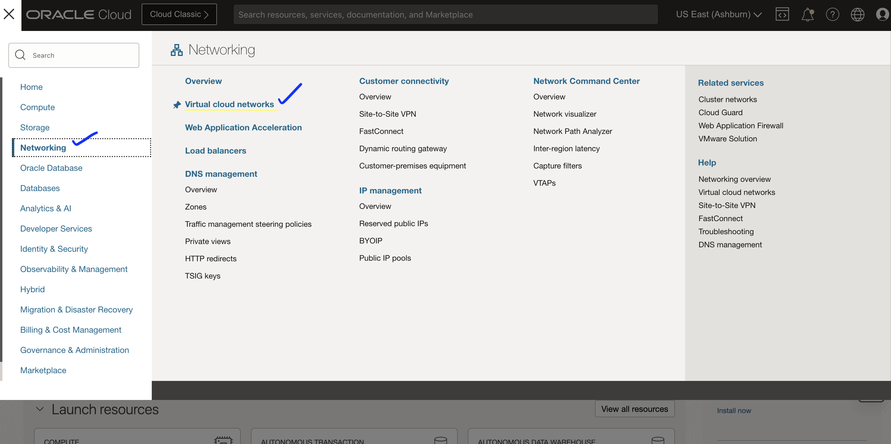
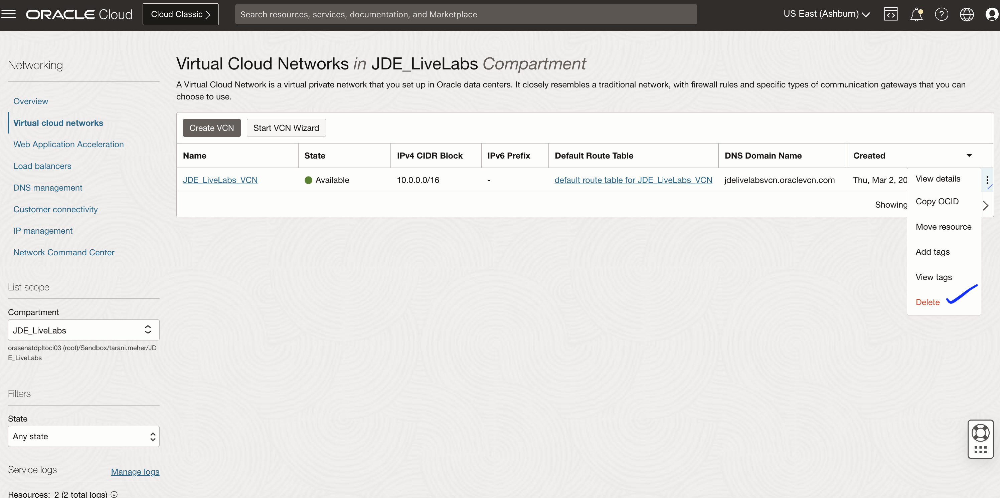
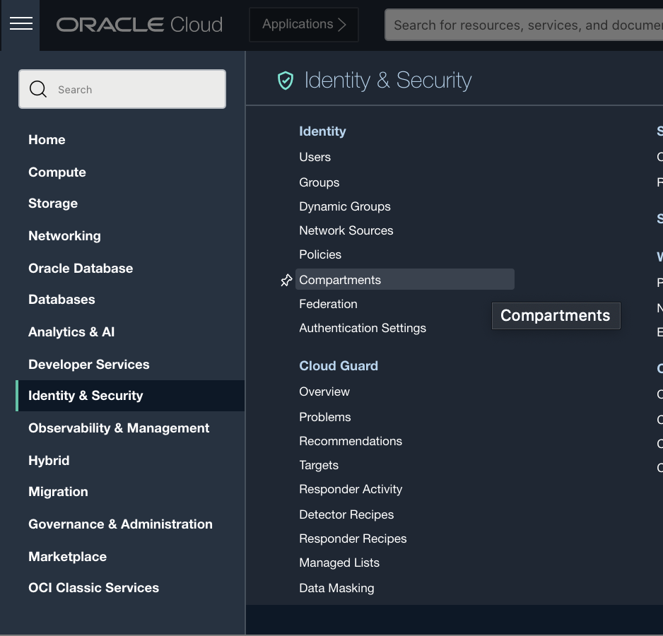
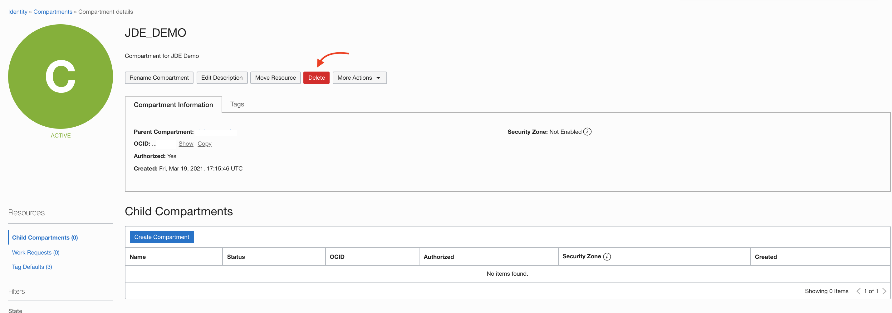

# Tear down Your JDE Environment

## Introduction
Now that the tutorial has been completed, we will use the Oracle Cloud Console to destroy your JD Edwards (JDE) Trial Edition to make sure all resources are properly managed.

Estimated Time: 5 minutes

### Objectives
* Delete your JDE instance.
* Destroy all associated Oracle Cloud Infrastructure (OCI) resources.

### Prerequisites
* Tenancy admin user name
* Tenancy admin password

## Task 1: Delete the JDE instance

1. If you are not already, sign in to your OCI tenancy.

2. On the Oracle Cloud Console home page, click the navigation menu in the upper-left corner and select **Compute** and then select **Instances**.

3. Select the JDE trial instance in the list of instances.

   Note: If you cannot see your instance, make sure you have selected the correct compartment on the lefthand side.

   

4. Select the instance and click **Terminate** to terminate the instance.

    

5. Wait for the instance to terminate. Once terminated, your instance should be gone from the instance list.

## Task 2: Delete the Associated Oracle Cloud Infrastructure Resources

1. To delete your virtual cloud network (VCN) you must click on the drop down menu in the upper left corner of your screen, click on **Networking**, and then select **Virtual Cloud Networks**.

   

2. Under the list of VCN, click **Action** on the right-side and select **Delete**.

    

3. Wait for the VCN to finish deleting and reload the page. The item should be removed from the list.

## Task 3: Delete the Compartment

1. To delete your compartment you must click on the drop down menu in the upper left corner of your screen, click on **Identity and Security**, and then select **Compartments**.

   

2. Then find the JDE compartment you created earlier and click on its name.

3. You are now in the compartment details menu and can select the red delete button to delete the compartment.

   

   Note: The compartment must be completely empty to be deleted. If not, its deletion will fail.

*Congratulations*! You have completed the workshop!

Thank you for your time, I hope you enjoyed using Oracle Cloud and JDE.

## Acknowledgements
* **Author:** Tarani Meher, Principal JDE Specialist
* **Contributors:**
    * Jeff Kalowes, Principal JDE Specialist
    * Tarani Meher, Principal JDE Specialist
    * Mani Julakanti, Principal JDE Specialist
* **Last Updated By/Date:** Tarani Meher, Principal JDE Specialist, 03/2023
