# High Availability for the E-Commerce instance

## Introduction
In this lab, you will learn how you can setup disaster recovery for your app in Oracle Cloud leveraging different availability domains (or across regions). One of the fundamental principles of designing high availability solutions is to avoid a single point of failure. You will deploy Compute instances that perform the same tasks in multiple availability domains. You can use the custom image you used for the primary compute instance to deploy a secondary compute instance in a different Availability domain. This design removes a single point of failure by introducing redundancy. The following diagram illustrates how you can achieve high availability.
    

For technical videos that walk through this portion of the lab, please see the links below:

* [Creating Secondary Application](https://video.oracle.com/detail/video/6164388509001/lab-200-creating-a-secondary-application-instance?autoStart=true&q=ocimoveimprove)
* [RSync 1](https://video.oracle.com/detail/video/6164412367001/lab-200-rsync-part-1?autoStart=true&q=ocimoveimprove)
* [RSync 2](https://video.oracle.com/detail/video/6163747278001/lab-200-rsync-part-2?autoStart=true&q=ocimoveimprove)
* [Creating Failover policy](https://video.oracle.com/detail/video/6164412913001/lab-200-creating-a-failover-policy?autoStart=true&q=ocimoveimprove)

### Objectives

* Learn how to leverage Oracle Cloud infrastructure to create a highly available and disaster recovery solution for your applications.
* Learn how to replicate your primary server to a secondary server using Rsync.
* Learn how to provision and configure Load Balancer and setup backend servers.
* Learn how to configure DNS Failover with Traffic Management Steering policy


### Prerequisites
* 2 OsCommerce compute servers (You already have a primary OsCommerce compute instance. Spin up a secondary compute instance from your OsCommerce custom image into a different Availability domain than the AD where your primary compute reside)
* Make sure you have setup ssh access from local to both the servers and from the primary server to secondary server and vice-versa (More information in the lab below)
* A Domain name (To demonstrate failover)

Estimated Lab Time: 2 hour
## Task 1: Transfer Files And Synchronize Servers

### **Installing rsync utility on primary and secondary compute instances**

1. Run the following command on the primary compute instance.
    ```
    <copy>
    sudo apt-get install rsync
    </copy>
    ```

2. Repeat the same for the secondary compute instance.

### **Securely copy your private ssh key to primary compute OR Generate new ssh key pair**

3. As written in the prereqs, you will require to setup ssh access from the primary server to the secondary server and vice-versa. If you want to use the same ssh keys as the one you are using to ssh into OsCommerce compute, you can scp the private key file from local to primary oscommerce instance by using the following:
Run the following command in your local terminal

    ```
    <copy>
    scp -i < private_key > id_rsa oscommerce@your-ip-address:/home/oscommerce/.ssh/
    </copy>
    ```

    Note: scp command is included in mac/Linux, so need to download anything. However, if you are using Windows, install PuTTy, which includes PSCP, or you can also use [WinSCP](https://winscp.net/eng/index.php)
    

4. If you want to use new ssh keys, use Method 2 - Create new keys. And on each server run

    ```
    <copy>
    ssh-keygen
    </copy>
    ```

    Hit enter. You'll have two files:

    .ssh/id_rsa & .ssh/id_rsa.pub

5. On Server A, cat and copy to clipboard the public key:

    ```
    <copy>
    cat ~/.ssh/id_rsa.pub
    </copy>
    ```

6. ssh into Server B, and append the contents of that to the it's authorized_keys file:

    ```
    <copy>
    cat >> ~/.ssh/authorized_keys
    </copy>
    ```

7. Paste your clipboard contents.

### **Replicate web server files and database files**

8. Our web server files are located at /var/www/html. To demonstrate replication of web server files from primary server to secondary server, let's delete all the webserver files from the secondary server and then set up replication from the primary server using rsync.

9. On the secondary server, run the following command.
    ```
    <copy>
    sudo rm -rf /var/www/html
    </copy>
    ```

10. This will delete all the web server files from secondary server. Now, go to /var/www folder and create an empty folder:

    ```
    <copy>
    sudo mkdir html
    </copy>
    ```

11. Now give the following permissions to the folder:

    ```
    <copy>
    sudo chmod 777 /var/www/html/
    </copy>
    ```

12. Please note: For this lab, you can use chmod 777; however, setting up 777 permissions is not recommended for production environments. The intention here is to demonstrate replication and failover quickly.


    

13. Now, you will perform the rsync command from primary server to secondary server to replicate the files. Run the following command on server 1 (primary). The IP address below is for the secondary server.

    ```
    <copy>
    rsync -r /var/www/html/ oscommerce@secondary-sercer-ip:/var/www/html/
    </copy>
    ```

14. If you go to the secondary server, you can see the following files in the /var/www/html directory

    

### **Replicate mysql database files**

15. Run the following command on primary server:

    ```
    <copy>
    sudo nano /etc/mysql/my.cnf
    </copy>
    ```

17. Comment out the line which says

    ```
    <copy>
    bind-address = 127.0.0.1
    </copy>
    ```

    


18. Restart MySQL

    ```
    <copy>
    sudo service mysql restart
    </copy>
    ```

## Task 2: Configure Load Balancer
Let's proceed and configure the failover from the Oracle Cloud console. There are multiple ways to setup a failover, like using keepalived, using load balancers, and using DNS Traffic Management Steering policies in OCI. For this lab, you will use the Load Balancer service, which provides automated traffic distribution. 

### **Make your application accessible from your IP address**

1. ssh into your primary compute instance

    ```
    <copy>
    ssh oscommerce@<public ip-add>
    </copy>
    ```

2. Edit Apache config file. Change from ```"DocumentRoot /var/www/html" ``` to ```"DocumentRoot /var/www/html/catalog"``` 

    ```
    <copy>
    sudo nano /etc/apache2/sites-available/000-default.conf
    </copy>
    ```

    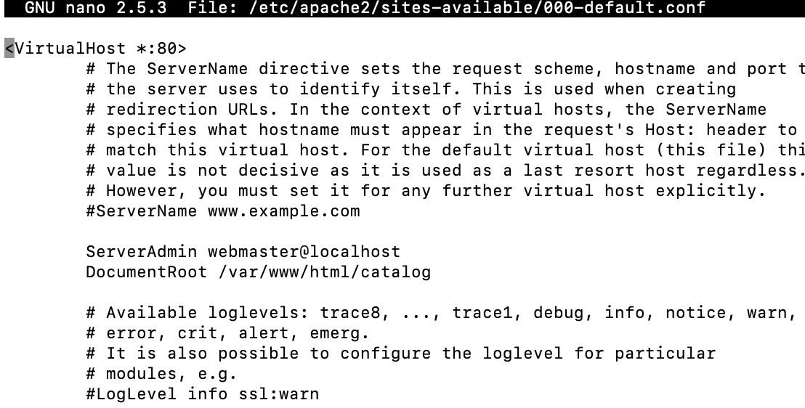

3. Replace localhost with your primary ip address remove /catalog from ```HTTP_PATH```, ```HTTP_COOKIE_PATH```

    ```
    <copy>
    sudo nano /var/www/html/catalog/includes/OSC/Sites/Shop/site_conf.php
    </copy>
    ```

    Example

    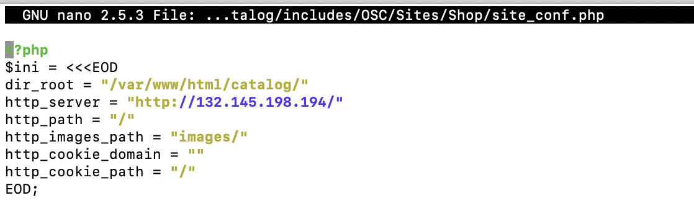

    Restart the server using the command

    ```
    <copy>
    sudo service apache2 restart
    </copy>
    ```

4. Now, if you hit your public IP address in the browser, you should be able to see your app running.
    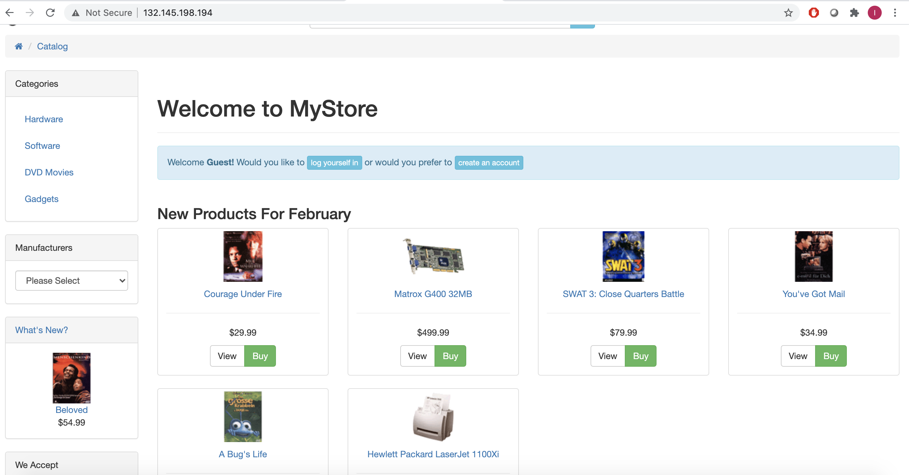

5. Repeat the procedure for your secondary server too. So you will have two servers up and running in two different AD's. In next part you will create loadbalancer and route traffic between the two servers.

### **Create Load Balancer**

6. The Oracle Cloud Infrastructure Load Balancing service provides automated traffic distribution from one entry point to multiple servers reachable from your virtual cloud network (VCN). The service offers a load balancer with your choice of a public or private IP address and provisioned bandwidth.

7. To create a load balancer, please goto Networking >> Load Balancer as shown below. 
    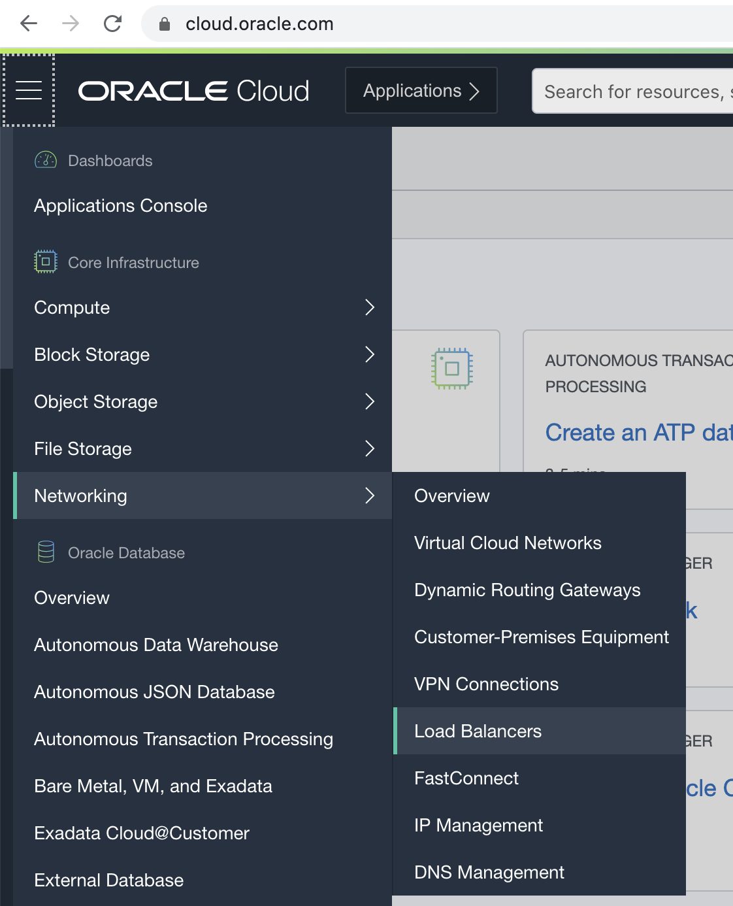

8. Click Create Load Balancer and give your name to your load balancer. Select visibility as public and assign an Ephemeral IP Address. Also, select a dynamic shape of 10mbps. Please select the VCN you have created for the workshop and a regional public subnet. Kindly refer below.
    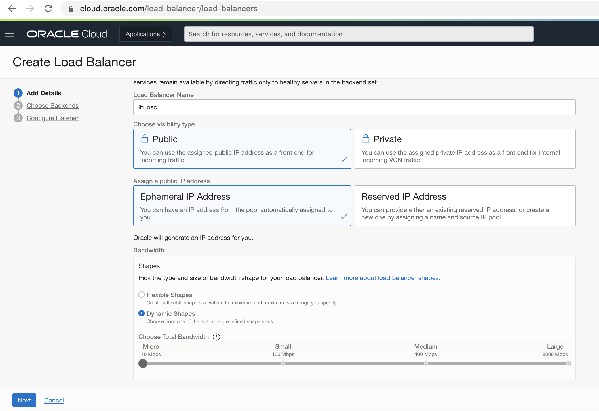

    **Note:** It is recommended to have the load balancer in a different public regional subnet than your compute instance's subnet.

9. A load balancer will distribute the traffic according to the selected policy. For this lab, please select Weighted Round Robin. Keep everything default. To learn more about load balancer policies, refer [here](https://docs.oracle.com/en-us/iaas/Content/Balance/Reference/lbpolicies.htm)
    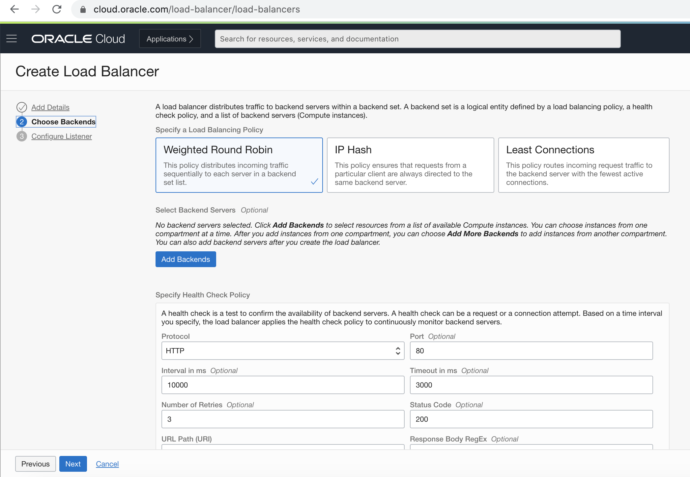

10. Please name your load balancer listener and select HTTP as the type of traffic your listener will handle.
    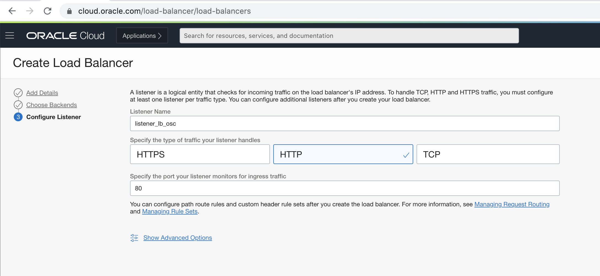

11. Click Submit, and this will create your load balancer.

12. Open your load balancer. Under resources, you will find the option to add backend sets. Please click your Backend Sets.
    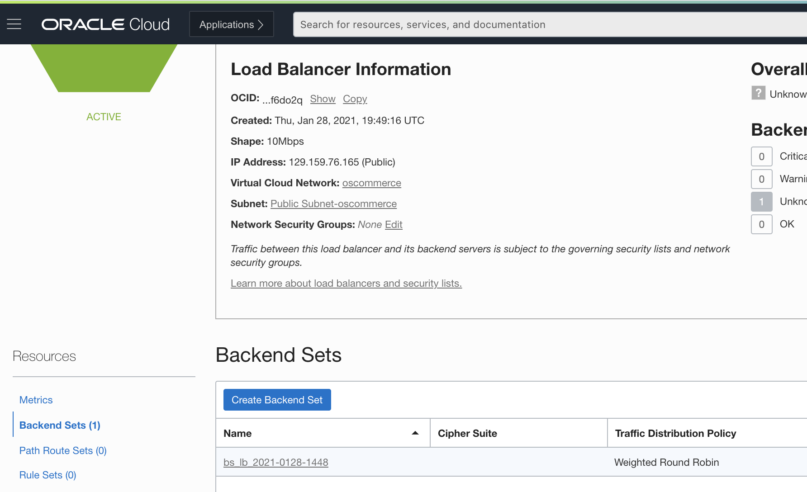

13. Click Add Backends. Here you can select your two compute VM's you created in earlier steps. And select the default security list for each of the compute VM's.
    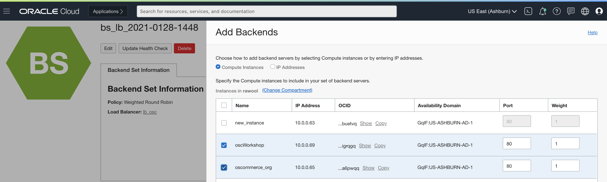

14. It will take few minutes to setup the backend servers. After few minutes refresh your browser, you will be able to see backend health as OK. Overall Health as OK. Please check below.
    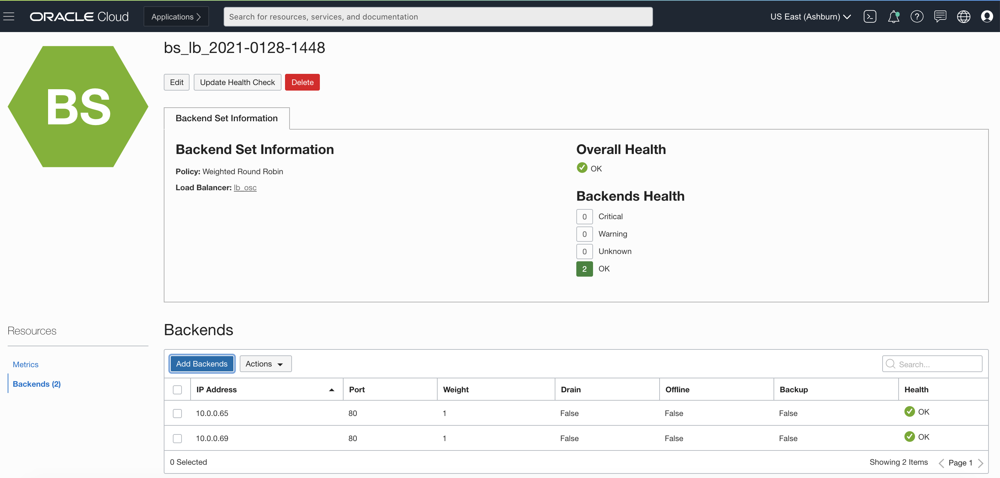

15. Now grab your Load Balancer IP Address and open the IP address on the browser. You will be able to see your E-Commerce web page. Let's test the load balancer.
    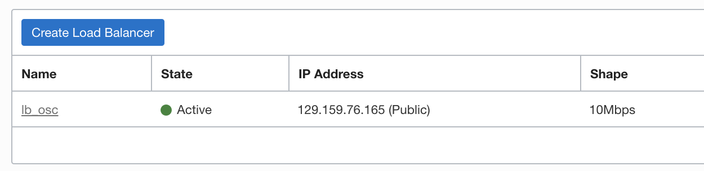
    

16. Now, you can go back to compute console and stop your primary Compute Instance. Once your compute instance has stopped. Please check your load balancer IP address on the browser. It will still open the E-Commerce website as the load balancer will automatically redirect you to the secondary server. This way, you can achieve high availability even when one of the compute nodes is down.

17. Congratulations, you have successfully configured Load Balancer. The next step is optional. It will explore how to use DNS and Traffic Management Steering Policy.

## Task 3: Configure DNS failover [Optional]

### **Export DNS zone file**

**Prerequisites**

1. For this section of a lab, you will need a domain name. There are many domain name registrars like GoDaddy, NameCheap, or Google, where you will be able to purchase domain names for about $2-3. You can Google as the domain name registrar for this lab. Any domain name should work for this exercise.

    Please watch the following videos to get an idea about OCI DNS and how failover works.

    * [What is DNS?](https://www.youtube.com/watch?v=SnMumcIE1aw)
    * [DNS overview & Demo](https://www.youtube.com/watch?v=dfKeDh79HdQ)
    * Note: DNS will take few mins to an hour to make changes

2. Export the resource record. This file would be exported as a .txt file. Store in a secure location, you would need the file later in the lab.
    
    

### **Create Zone on Oracle Cloud infrastructure**

3. In this step, you will create a zone. A zone holds the trusted DNS records that will reside on Oracle Cloud Infrastructure's nameservers. Navigate back to the OCI console to create a zone using the exported file
    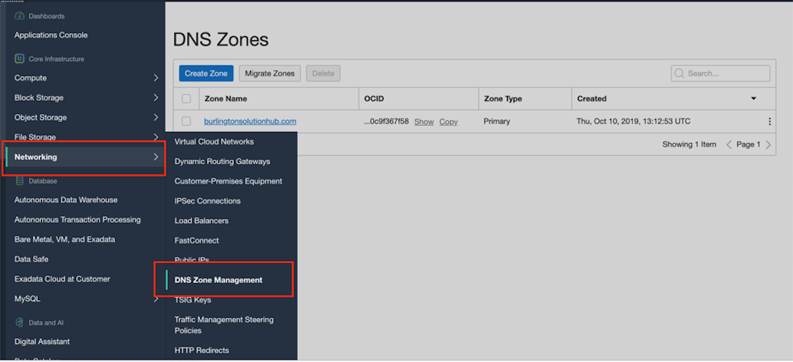

4. Import file and create a zone  
Import - Drag and drop, select, or paste a valid zone file into the Import Zone File window. The zone is imported as a primary zone.

    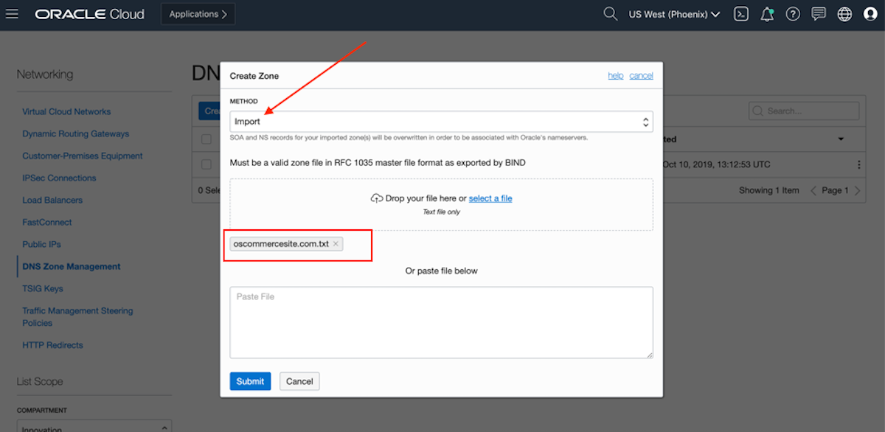

5. Navigate into the zone you just created

    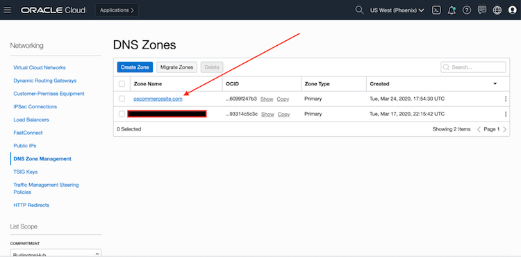

6. To make your Oracle Cloud Infrastructure hosted zone accessible through the internet, you must delegate your domain with your domain's registrar. to do that,
Open the navigation menu. Under Core Infrastructure, go to Networking and click DNS Zone Management. Click the Zone Name for the zone you want to delegate.

7. Use the Type sort filter to locate the NS records for your zone.
Note the name servers. You can use the noted name servers to change your domain's DNS delegation. Refer to your registrar's documentation for instructions.

    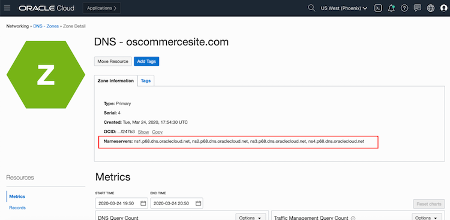

8. I'm using google-domain in this case. Add name servers to your domain name server's management console, as shown below

    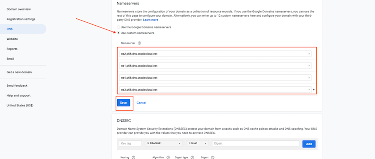


### **Add an "A" record to DNS zone**

9. You can add many record types to your zone, depending on your goals for the zone and its DNS management. For this Lab, you would add an "A" record. For more information about record types, refer to [Supported Resource Records](https://docs.cloud.oracle.com/en-us/iaas/Content/DNS/Tasks/managingdnszones.htm)

10. Navigate back to the Oracle cloud console, open the navigation menu. Under Core Infrastructure, go to Networking and click DNS Zone Management.

    

11. Click the Zone Name in which you want to add a record. Zone details and a list of records appear. Click Add Record.

    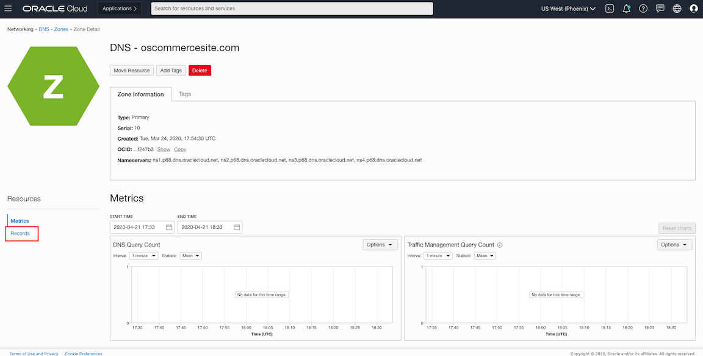

    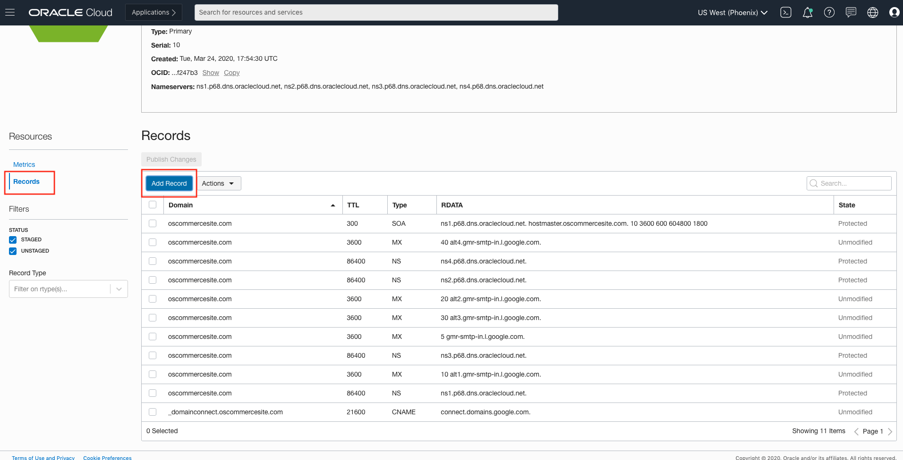

12. In the Add Record dialog box, select a record type from the drop-down list, and then enter the record's information. Under address, enter the public address of your primary server. Note the "NAME" box, where you would create a sub-domain name that would be used later in this lab. Click Submit.
    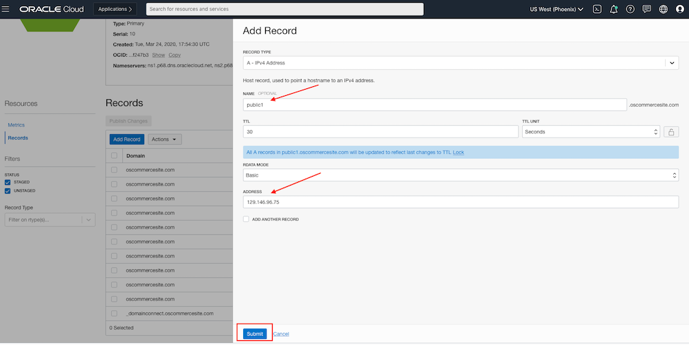

13. Once your records have been added, click Publish Changes.

    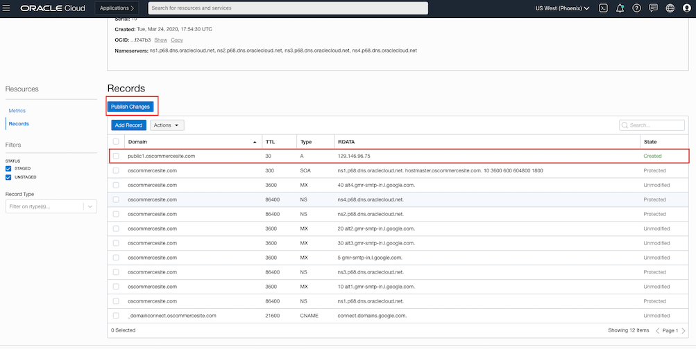

14. In the confirmation dialog box, click Publish Changes.

    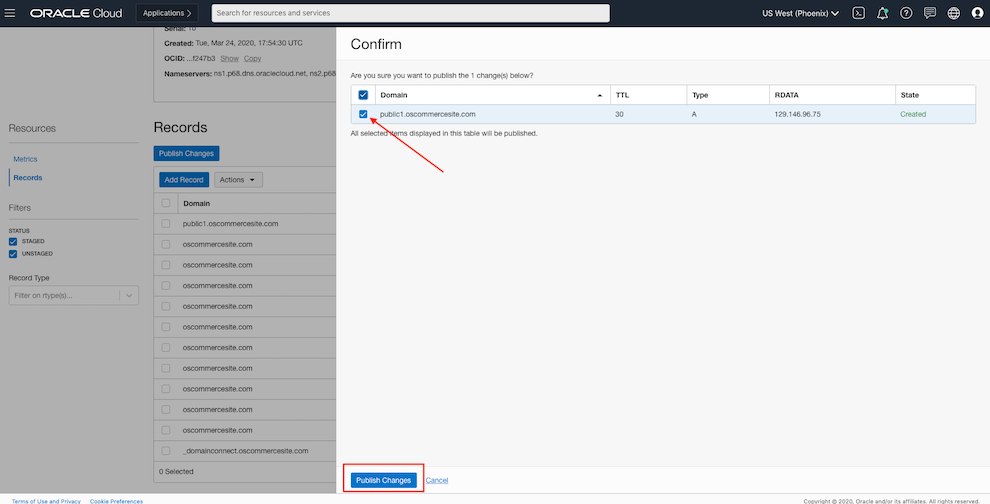

### **Create a failover traffic steering policy on OCI console**

15. Traffic Management Steering Policies enable you to configure policies to serve intelligent responses to DNS queries, meaning different answers (endpoints) may be served for the query depending on the logic you define in the policy. Traffic Management Steering Policies can account for the health of the responses to provide failover capabilities

    

    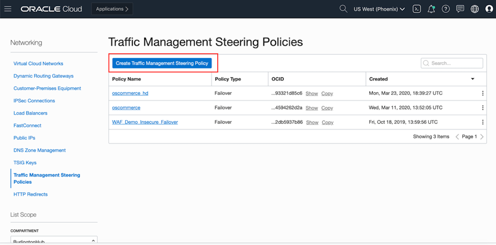

    There are other options here, so make sure to select "failover."

16. Failover policies allow you to prioritize the order you want answers to be served in a policy (for example, Primary and Secondary). Oracle Cloud Infrastructure Health Checks are leveraged to determine the health of responses in the policy. If the Primary Answer is determined to be unhealthy, DNS traffic will automatically be steered to the Secondary Answer.

    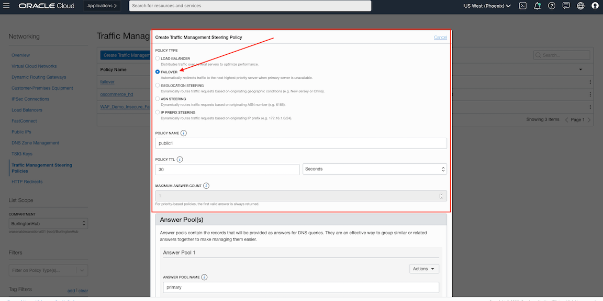

17. Configure the answer pools by filling in the OsCommerce compute instance's name and public IP address. In my case, I have a pool of 2 compute instances

    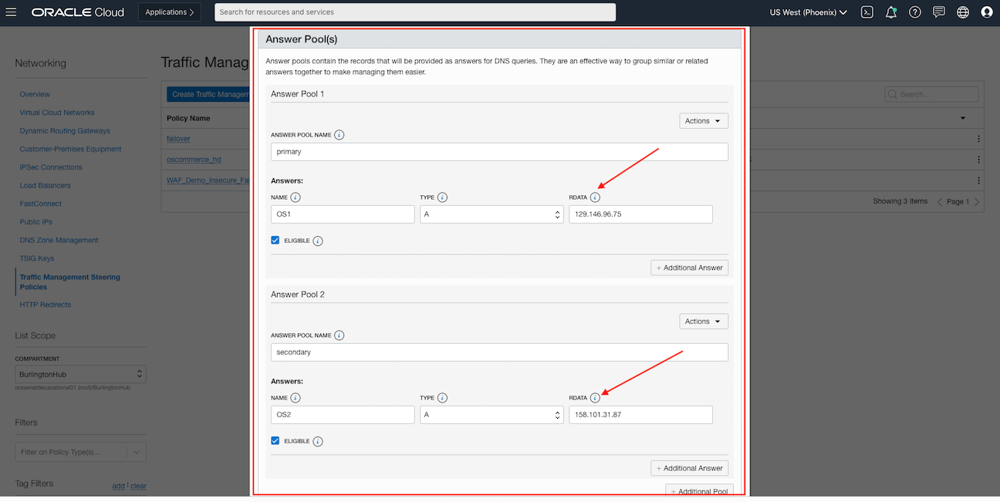

18. Set the priority of the pools you created in the previous step
Pool Priority: Failover priority rules specify the priority of answers that are served in a policy. If the primary response is unavailable, traffic is steered to the next answer in the list.

    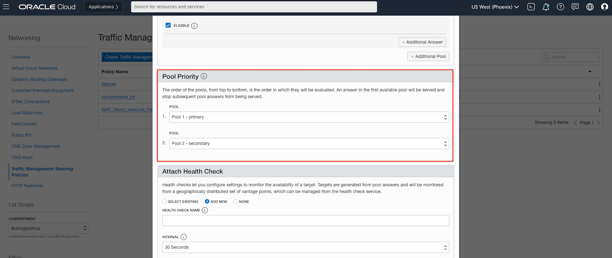

### **About Health Check**

19. A health check is a test to confirm the availability of backend servers. A health check can be a request or a connection attempt. In the Create Health Check dialog box, enter the following:
* Health Check Name: The name used for the health check. Avoid entering confidential information.
* Interval: Select the interval between health checks of the target.
* Protocol: The network protocol used to interact with your endpoint, such as HTTP protocol, which initializes an HTTP handshake with your endpoint.
* Port: The port for the monitor to look for a connection. The default is port 80 for HTTP. For HTTPS, use port 443.
* Path: The specific path on the monitored target.
* Method: Select the HTTP method used for the health check.
* Timeout: Select the maximum time to wait for a reply before marking the health check as failed.
    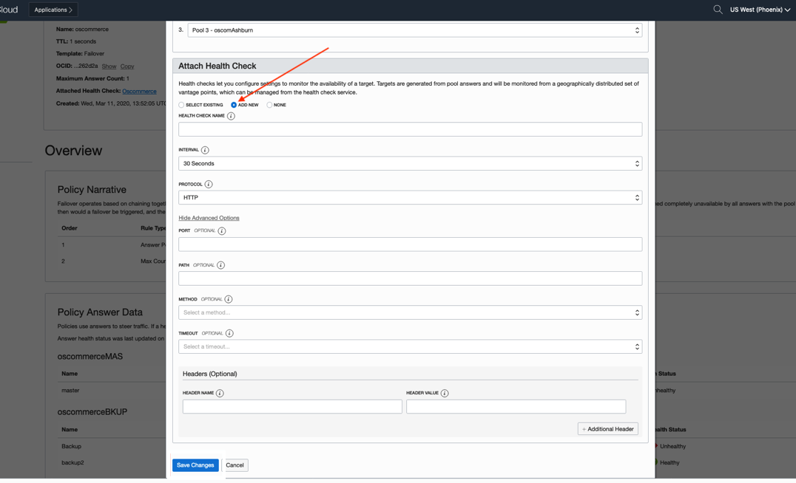

### **Create Health Check**

20. Attach the sub-domain name you created earlier to the policy

    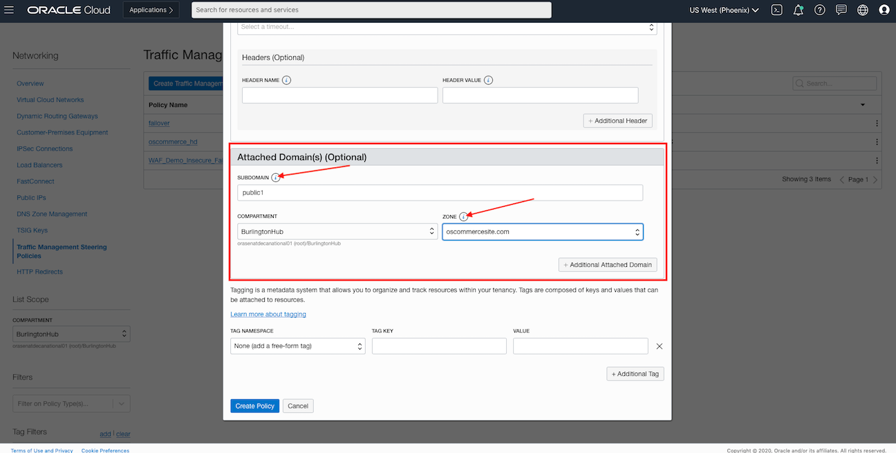

21. Once you've created a traffic management steering policy, Click on the overview. Make sure the health status is "Healthy".

    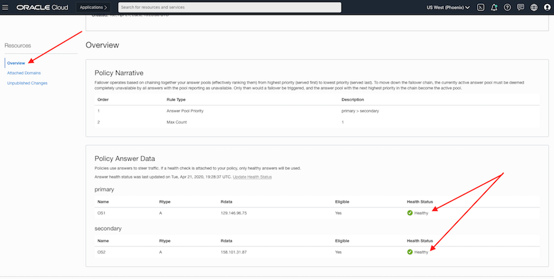

22. With a  web browser, access the OsCommerce application using the sub-domain name

    Example: "public1.oscommercesite.com"

    Test the failover mechanism by stopping the apache2 service on the master node (primary server)

23. Login into the master node and stop the apache service

    ```
    <copy>
    sudo /etc/init.d/apache2 stop
    </copy>
    ```

    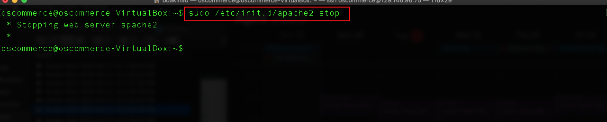

24. Check the failover policy overview; the master node's health-check status should have changed from "healthy" to "unhealthy".

    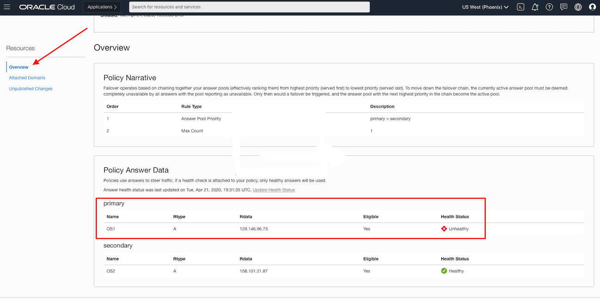

25. However, if you go to your domain name - public1.oscommercesite.com, your website should still be running (after 30 seconds) since you configured a failover. Thus, you can easily set up disaster recovery for your app in OCI and avoid a single point of failure.

## Learn More
* To learn about provisioning Networks and Network Security, check out this [link](https://docs.cloud.oracle.com/en-us/iaas/Content/Network/Concepts/overview.htm)

* To learn about Oracle's Load Balancer, check out this [link](https://docs.oracle.com/en-us/iaas/Content/Balance/Concepts/balanceoverview.htm)

* To learn about Oracle's DNS and Traffic Management, check out this [link](https://docs.cloud.oracle.com/en-us/iaas/Content/EdgeServices/overview.htm)

## Acknowledgements
* **Author** - Rajsagar Rawool, Oladipupo Akinade, Saurabh Salunkhe
* **Last Updated By/Date** - Rajsagar Rawool, January 2021
