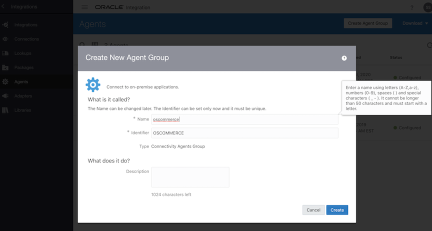
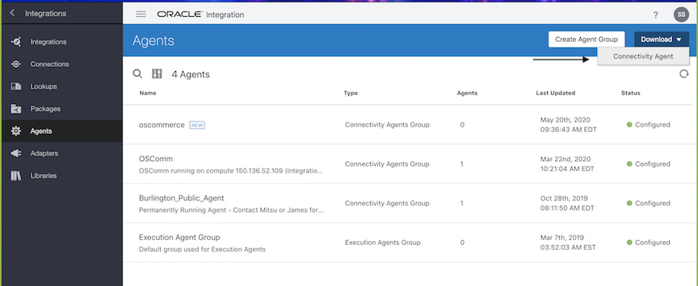
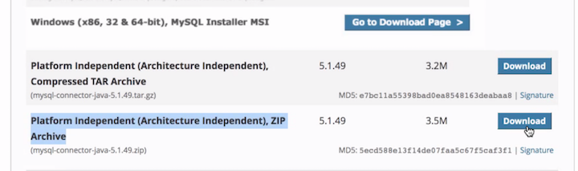
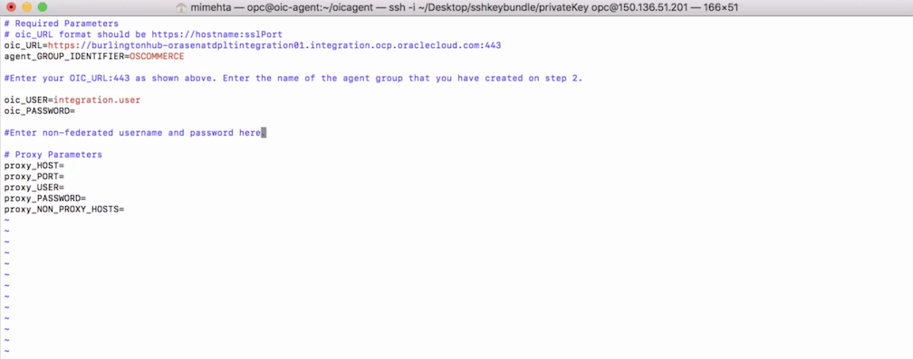
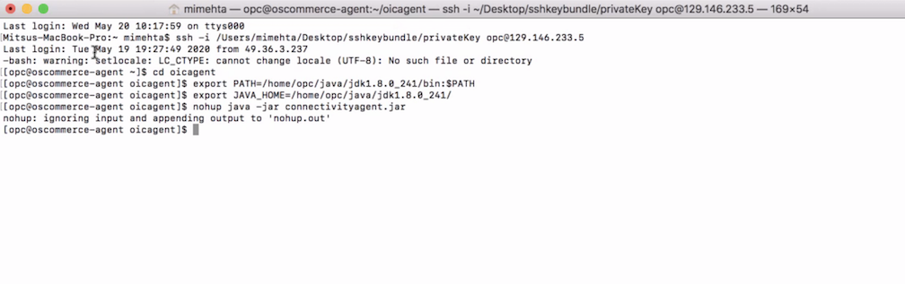
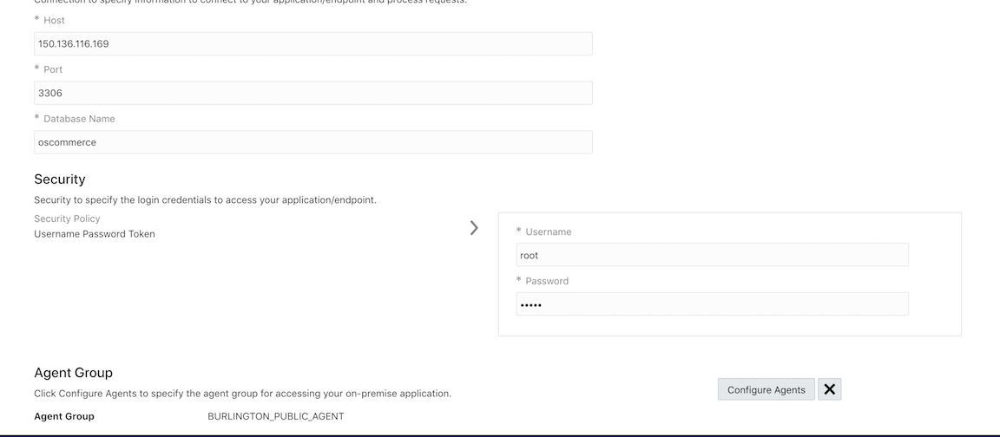
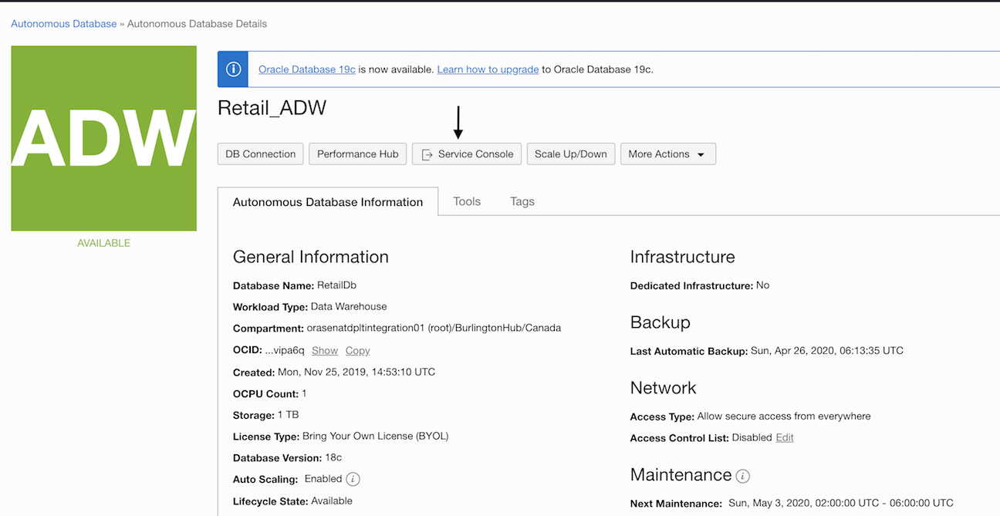
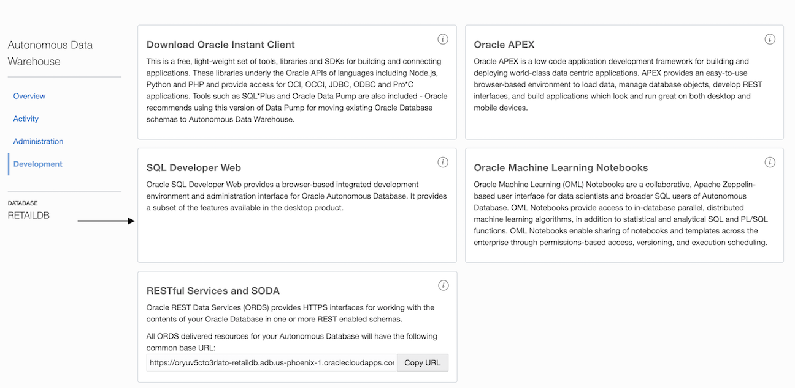
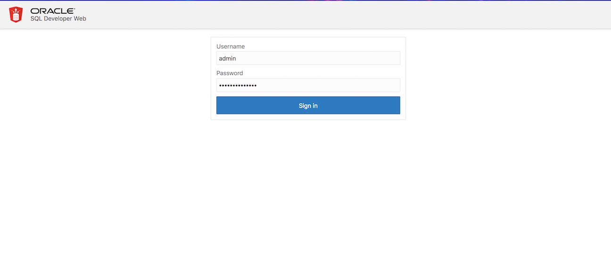
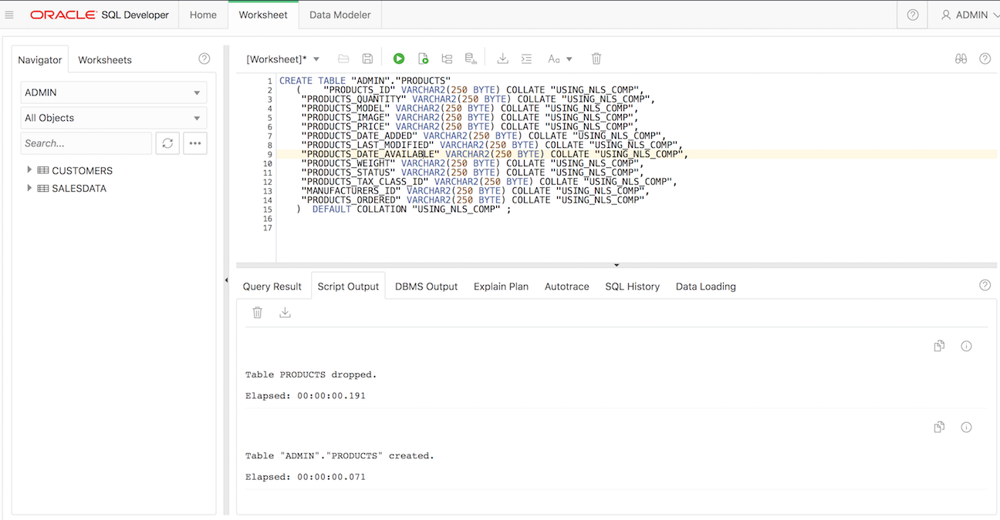

# Integrate Oracle Cloud Platform services with your app

## Introduction
This lab walks you through the steps to integrate your third party app with Oracle Cloud PaaS. First, you will connect MySQL database and then Oracle Autonomous Data warehouse to Oracle Integration Cloud. After both the connections have been established, you will migrate the data from the MySQL database to Oracle Autonomous Datawarehouse(ADW). Lastly, you will connect Oracle Analytics Cloud service to Oracle Autonomous Data warehouse to perform some analytics. For a technical video that walks through this portion of the lab, please see the below link:<br>
[Integration Between MySQL and ADW](https://video.oracle.com/detail/video/6164371972001/lab-300-oic-adw-and-oac?autoStart=true&q=ocimoveimprove)

### Objectives
* Establish the connection from MySQL to Oracle Integration Cloud
* Establish the connection from Oracle Autonomous Database and Oracle Integration Cloud
* Establish an integration between the Autonomous Data Warehouse and MySQL connections
* Create an Oracle Analytics Cloud Instance
* Access your new Oracle Analytics Cloud Instance
* Connect an Autonomous Data Warehouse/Autonomous Transaction Processing Instance to OAC


### Prerequisites

* Complete Lab 1 and 2
* Access to Oracle Integration Cloud Service
* Access to Oracle Autonomous Data Warehouse
* Access to Oracle Analytics Cloud Service

Estimated Lab Time: 2 hour

## Task 1: Establish connections in Oracle Integration Cloud

### **Install OIC Connectivity Agent on MySQL**

1. Before moving forward, if provided, please keep handy the information with the wallet file (username and password to an ADW or ATP) and continue to the next step. Otherwise, read the step below:

2. If you do not have this information, please follow the lab guide (Part 1 and Part 2) here [link](https://github.com/oracle/learning-library/blob/master/workshops/erp-adw-oac/LabGuide100ProvisionAnADWDatabase.md). Once you complete making an ADW or ATP instance, please download the Wallet file from the console. [More info](https://docs.oracle.com/en/cloud/paas/autonomous-data-warehouse-cloud/user/connect-download-wallet.html#GUID-B06202D2-0597-41AA-9481-3B174F75D4B1)

3. Here, you will establish a connection between our MySQL Database and Oracle Integration Cloud. An Oracle Integration Cloud instance will be provided to you. If you do not have an Oracle Integration Cloud instance, follow instructions from [here](https://docs.cloud.oracle.com/en-us/iaas/integration/doc/creating-oracle-integration-instance.html) and create one.

4. For this lab, you will also need an OIC agent to perform connections to the web app's database. Make one by following the instructions below:

5. Login to your OIC instance. In the left navigation pane, click Integrations, then click Agents.

6. Create a new agent by clicking the button - Create Agent Group. Give the agent name as "oscommerce." And click on Create button.

	

7. Next, download the agent zip folder by clicking on Download > Connectivity Agent.

	

8. SSH to the OsCommerce primary instance. Create a directory in OsCommerce compute for oic agent. For example - /home/oscommerce/oicagent

9. Secure copy (scp/WinSCP) file from your local computer to the OsCommerce instance by running the following command in a terminal window -

	```
	<copy>
	scp -i /Users/mimehta/Desktop/sshkeybundle/privateKey /Users/mimehta/Desktop/oic_connectivity_agent opc@132.145.167.51:/home/opc/oicagent
	</copy>
	```

10. Unzip oic_connectivity_agent.zip using the command

	```
	<copy>
	unzip oic_connectivity_agent.zip
	</copy>
	```

11. Download [JDK](https://www.oracle.com/java/technologies/javase/javase8u211-later-archive-downloads.html) and [MySQL](https://dev.mysql.com/downloads/connector/j/5.1.html) agent from the links below and copy it to the OsCommerce compute using scp command as step 4.

	

	

12. Create another directory for Java installation - /home/opc/java.

13. Copy JDK in the /home/opc/java directory and MySQL agent in the directory - /home/oscommerce/oicagent/agenthome/thirdparty/lib folder.

14. Unzip and install JDK on OsCommerce compute by navigating to the Java directory and running the command -

	```
	<copy>
	tar zxvf jdk-8u241-linux-x64.tar.gz
	</copy>
	```

15. Navigate to oicagent and Modify InstallerProfile.cfg file to include the following information:

	```
	oic_URL= https://oic_host:ssl_port

	agent_GROUP_IDENTIFIER= Agent group identifier created on step 2

	oic_USER= non-federated user

	oic_PASSWORD= non-federated password
	```

	

16. Now, within the oicagent directory, run the following two commands to set the Java home directory.

	```
	export PATH=/home/opc/java/jdk1.8.0_241/bin:$PATH

	export JAVA_HOME=/home/opc/java/jdk1.8.0_241/

	Run the following command to start the agent -

	nohup java -jar connectivityagent.jar
	```

	

### **Establish Connections Between MySQL and OIC**

17. On the Oracle Integration Cloud home page, click on the Menu icon in the top left and click on Integration.

	

18. When the webpage finishes loading, click on "Connections" and click on create.

	

19. A new window will load. On the top right, search for "MySQL," and you will be able to select MySQL as your adapter. Click on the "Select" button, and you will be redirected to the "Trigger and Invoke" page.

	

20. On this page, name your connection. In this lab, you used "MySQL_osCommerce." You can optionally add a description to this connection. For the role, make sure that "Trigger and Invoke" is enabled.

	


21. On the next page, you will be asked to provide information for Connection Properties, Security, and Agent Group. To edit these, click on their respective Configure button and enter the following information:

	```
	Host: This will be the public IP to your compute instance

	Port: Use port 3306 since this is a MySQL database

	Database Name: oscommerce. This is the database name you used in Lab 2

	Username & Password: Use the credentials that you used in Lab 2
	```

22. Agent Group: In the Oracle Integration Cloud instance, there will be an Agent Group preconfigured for you. Select that one. If there is no agent, access this [link](https://docs.oracle.com/en/cloud/paas/integration-cloud/integrations-user/agent-download-and-installation.html#GUID-72491B67-7445-4B52-94FA-CEC8488E0F4A) and follow the steps to install a new agent.

23. Please note: For our OIC instance to communicate with the MySQL database, make sure the agent has write permissions to your MySQL database. Please perform the following steps to do that:

24. In your primary compute instance, go to MySQL console and execute the following command:
Here, IP address is the IP address of your agent

	```
	<copy>
	CREATE USER 'root'@'ip_address' IDENTIFIED BY 'some_pass';
	</copy>
	```
	```
	<copy>
	GRANT ALL PRIVILEGES ON *.* TO 'root'@'ip_address';
	</copy>
	```

	

### **Establish connection from Oracle ADB and OIC**

25. Creating a connection between an Oracle Autonomous Database and Oracle Integration Cloud is a very similar process to creating a connection between our MySQL database and OIC.

26. Click on the same create button under the Connections tab and search for your respective Oracle Autonomous Database, either Autonomous Transaction Processing or Autonomous Warehouse.

	

27. In the next window, you will need to provide your Oracle Database wallet file and its respective credentials. You will need to manually type in the Service Name, either High, Medium, or Low (these are specific to concurrent queries, but for our purposes, it does not matter).

	

### **Establish an integration between the ADW and MySQL connections**

28. Now that you have connections made in Oracle Integration Cloud for our MySQL and Autonomous Database, you will need to establish an integration with both to communicate with each other. Before making a connection, you have to ensure the target database table exists in ADW. For that, follow the instructions here:

29. On your ADW console home page, click service console

	

30. Click SQL Developer Web

	

31. In this screen, use your ADW credentials

	

32. Use the following code to generate the Products table

	

	```
	<copy>
	CREATE TABLE "ADMIN"."PRODUCTS"
	(	"PRODUCTS_ID" VARCHAR2(250 BYTE) COLLATE "USING_NLS_COMP",
		"PRODUCTS_QUANTITY" VARCHAR2(250 BYTE) COLLATE "USING_NLS_COMP",
		"PRODUCTS_MODEL" VARCHAR2(250 BYTE) COLLATE "USING_NLS_COMP",
		"PRODUCTS_IMAGE" VARCHAR2(250 BYTE) COLLATE "USING_NLS_COMP",
		"PRODUCTS_PRICE" VARCHAR2(250 BYTE) COLLATE "USING_NLS_COMP",
		"PRODUCTS_DATE_ADDED" VARCHAR2(250 BYTE) COLLATE "USING_NLS_COMP",
		"PRODUCTS_LAST_MODIFIED" VARCHAR2(250 BYTE) COLLATE "USING_NLS_COMP",
		"PRODUCTS_DATE_AVAILABLE" VARCHAR2(250 BYTE) COLLATE "USING_NLS_COMP",
		"PRODUCTS_WEIGHT" VARCHAR2(250 BYTE) COLLATE "USING_NLS_COMP",
		"PRODUCTS_STATUS" VARCHAR2(250 BYTE) COLLATE "USING_NLS_COMP",
		"PRODUCTS_TAX_CLASS_ID" VARCHAR2(250 BYTE) COLLATE "USING_NLS_COMP",
		"MANUFACTURERS_ID" VARCHAR2(250 BYTE) COLLATE "USING_NLS_COMP",
		"PRODUCTS_ORDERED" VARCHAR2(250 BYTE) COLLATE "USING_NLS_COMP"
	)  DEFAULT COLLATION "USING_NLS_COMP" ;
	</copy>
	```

33. Back on the Designer tab, click on "Integrations." When you are in the Integrations tab, click on create

	

34. When you click on Create, you will need to select a Style. Select Scheduled Orchestration
and click on the Select button.

	

35. For your new integration, give it a name of your choosing. In this lab, choose MySQL_to_ADW_OIC.

	

36. After clicking on create, it will show a scheduled operation map. Click on the plus icon and search for the MySQL connection that you made earlier.

	

37. Name the endpoint and give the endpoint a description. Make sure that "Perform an Operation On a Table is selected. Lastly, make sure that the "Select" button is selected. Once you have put in the correct information, click on the "Next" button.

	

38. Under Schema, select osCommerce". Next, you will need to select from which tables you would like to pull the information. In this lab, you can choose the "Products" table. When you have determined what table you would like to use, click on the > icon in the middle, and it will add your selected table to the Selected list box. Then, click on Import Tables. Once that is complete, click on "Next," as well as on the next window that shows up.

	

39. When you finish, click on Next, make sure that all the information on the last page is correct.
Click "Done" if all information is correct.

	

40. After completing the first step in the Orchestration, you will see the MySQL endpoint on the map. Between the MySQL source and the stop icon, you will click on the plus icon and search for the ADW connection you made previously.

	

41. Name this endpoint and add a description if you'd like. Make sure that the "What operation do you want to perform?" option is "Perform an Operation on a table." Next, select "Insert." Click Next to continue.

42. For the schema, select "osCommerce." Next, search for the Products tables and click on the > icon in the middle, and it will add your selected table to the Selected list box. Click on Import Tables and click on Next to continue. Once that is complete, click on "Next," as well as on the next window that shows up.

	

43. When you finish,  click on Next, make sure that all the information on the last page is correct.
Click "Done" if all information is correct.

	

44. After clicking Done, you will be taken to the orchestration map. Click on "Make to Destination," and then click on the pencil icon. Here, you will map the columns from the Products table in our MySQL database to the columns from the Products table in the ADW instance you have.

	

45. To map the Products table in the MySQL database to its respective Products table in the ADW, you will have to drag and drop each column individually to its respect column from the Source field to the Target field, as shown in the image below. Once that has been completed, click on Validate to make sure there are no errors. When you are complete, click Close. It will save any changes made.

	

46. Back on the orchestration map, click on the Menu icon on the top right of the map window. Click on "Tracking."

	

47. After clicking on "Tracking," you will be prompted with this window. You will need to drag and drop the "<> startTime" item to the first line in the Tracking Field column.

	

48. Once all mapping is complete; you will need to go back to the integration tab to view the list of all integration in the OIC instance you are in. If everything is set correctly, you will see a Slider. Click on the slider to begin the Integration.

	

49. Once the slider is clicked, you will be prompted with this window below. Click on Enable tracing and Include Payload. Once both are selected, click on Activate.

	

50. Once you click on Activate, the slider should now be moved to the right and be highlighted in Green. To submit the integration and run it, click on the menu icon on the same row as the integration you just created. Click on Submit Now.

	

## Task 2: Connect your app to Oracle Analytics Cloud

### **Create an OAC Instance**

1. Go to cloud.oracle.com, click the Sign In icon to sign in with your Oracle Cloud account. From here, click on Sign in to Cloud

	

2. Enter your Cloud Account Name and click on Next

	

3. Enter your Oracle Cloud username and password, and click Sign In

	

4. Once you log in, you are taken to the cloud services dashboard, where you can see all the available services. Click the navigation menu in the upper left to show top-level navigation choices.

	

5. Scroll down and under More Oracle Cloud Services, hover your cursor on top of Platform Services. Click on Analytics, and a new tab will open in your browser

	

6. The Oracle Analytics console will list any existing Analytics Instances below. Here, you can search for a specific instance that you are looking for. If this is your first time setting up an instance, there will be none listed. To create a new Oracle Analytics Cloud instance, click on Create Instance

	

7. On this new page, you will need to put in information related to the OAC instance you are creating. For Region, pick which data center you would like this OAC to be on. For License Type, if your company owns Oracle middleware, you can Bring Your Own License (BYOL). If you or your company does not own any Oracle Middleware, provide that information when prompted. For Edition, select which edition that is best suited for your needs. Hover your cursor over each Edition or click on the "?" icon to read a short description of each. For Feature Set, pick which one is best suited for your business needs. Lastly, choose the Number of Oracle CPUs (CPUs) you need based on your business needs. Once you type in the required information and select your preferred options, click Next

	

8. Confirm that all information is correct. If you need to make any additional changes, click the
Previous button. Once confirmed, click on Create

	

9. Once you click Create, you will be redirected to the first dashboard that lists all instances. As you can see, since you just began provisioning our instance, the current status says: Creating service. Once your instance is ready to be used, you will receive an email to the email address you provided when creating the instance.

	

### **Access your new OAC Instance**

10. Make sure you are on the dashboard for Oracle Analytics cloud. Click on the Hamburger icon on the same line as the instance you recently made. Click on Oracle Analytics Cloud URL. You will be redirected to the main page for your OAC Instance

	

11. When redirected, your page should look similar to the picture below. If you get a similar page, congratulations! You can now start using OAC for your business needs!

	

12. Note: If your page is not loading correctly, or you are unable to access this page, disable any AdBlock extensions or programs that are running in the background, and refresh the page.

### **Connect an ADW/ATP Instance to OAC**

13. To connect an ADW instance to OAC, from the dashboard, click on Create. A new window will open, where you will need to select what type of database you are using. In this example, you picked Oracle ADW.

	

14. Fill in all required information to establish a connection to your ADW/ATP instance.
Select the wallet that you downloaded in the previous step. The credentials for username and password will be specific to the user you want to authenticate to the database, NOT the administrator credentials. For the Service Name, search for the name of the ADW/ATP instance name and select either high, medium, or low. Click on save, and your connection should be established.

	

15. To see if your connection to your ADW/ATP instance was successful, go back to the OAC Dashboard, click on the hamburger menu in the top left, and click on Data. From there, you will need to click on the Connections tab. Your connection should be listed below

	

	

## Learn More
* To learn about Oracle Integration Cloud Service, check out this [link](https://docs.oracle.com/en/cloud/paas/integration-cloud/index.html)
* To learn about Autonomous Database, see the following [link](https://www.oracle.com/database/autonomous-database.html)

## Acknowledgements
* **Author** - Mitsu Mehta, Saurabh Salunkhe
* **Last Updated By/Date** - Rajsagar Rawool, January 2021
