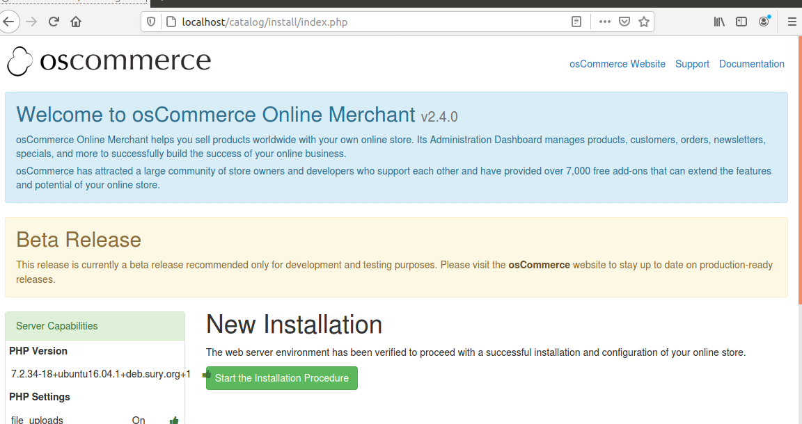
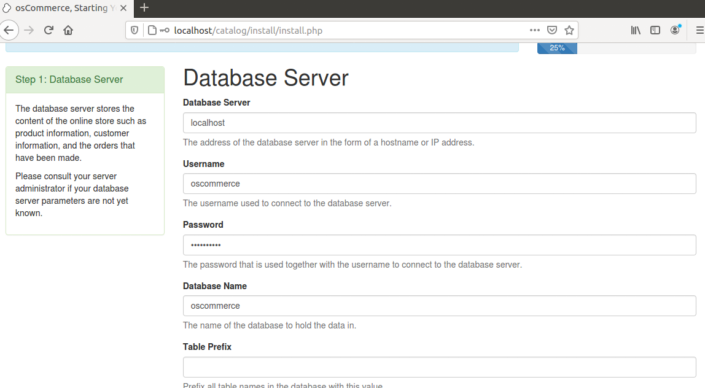
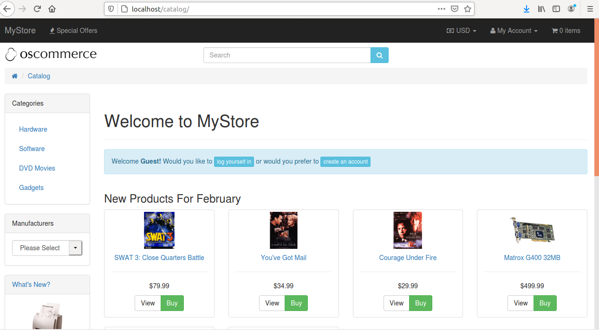
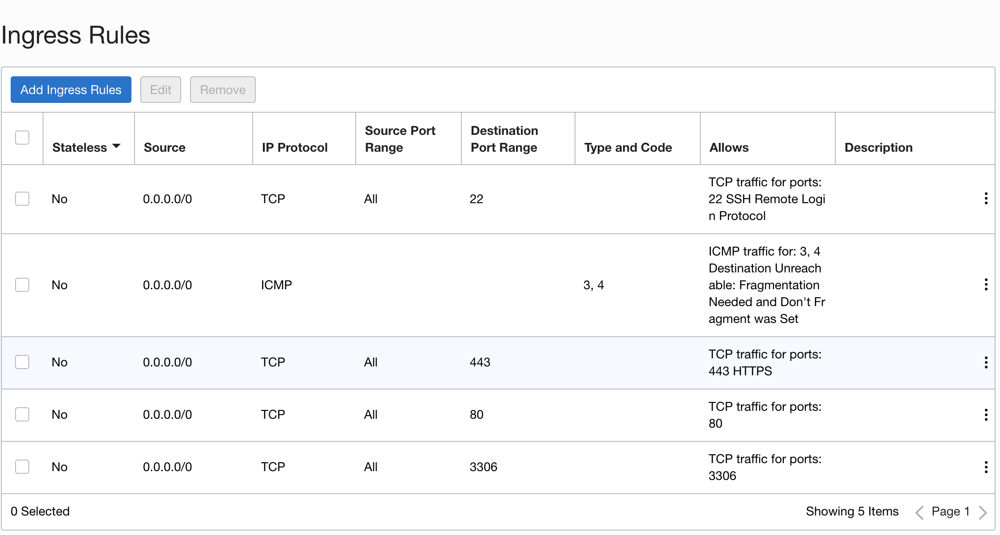
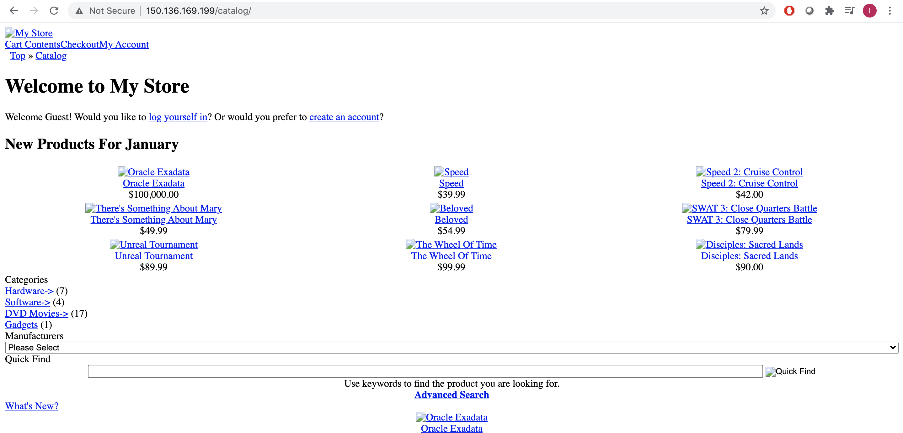

# Lifting a Third Party Application to the Cloud

## Introduction
This lab walks you through the steps to capture an image of an existing, on-prem third party application. First, you will capture a .ova file of the application and convert it to a cloud compatible .vmdk file. From there, you will import the .vmdk to Object Storage and then create a cloud-native server that will use the file as a custom image. For a technical overview of this portion of the lab, see the following videos:
* [Uploading a VMDK to OCI](https://video.oracle.com/detail/video/6164374092001/lab-100-uploading-a-vmdk-to-oci?autoStart=true&q=ocimoveimprove)
* [Creating a Custom Image](https://video.oracle.com/detail/video/6164371967001/lab-100-creating-a-custom-image?autoStart=true&q=ocimoveimprove)
* [Provisioning a VM with custom image](https://video.oracle.com/detail/video/6164386994001/lab-100-provisioning-a-vm-with-a-custom-image?autoStart=true&q=ocimoveimprove)
* [Accessing the cloud-native application](https://video.oracle.com/detail/video/6164388506001/lab-100-accessing-the-cloud-native-application-instance?autoStart=true&q=ocimoveimprove)

Estimated Lab Time: 2 hour

### Objectives
* Create a cloud-compatible VMDK file
* Leverage Object Storage
* Provision cloud infrastructure (networking, routing, compute)
* Deploy cloud-native servers

### Prerequisites
* An Oracle Paid or LiveLabs Cloud account.
* [VirtualBox](https://www.virtualbox.org/wiki/Downloads)
* Preinstalled Ubuntu Virtual Image (it is provided to you during the workshop from OraDocs repository)
* VNC Viewer

### Administrative Notes
Step 1 of Lab 1 is optional. This section outlines how to configure an On-Premises E-Commerce application and capture a snapshot in the form of a .ova file, and convert it to a cloud-compatible VMDK. Should you wish to skip this part of the lab and proceed directly to Step 2, download the VMDK file contained [here](https://objectstorage.us-ashburn-1.oraclecloud.com/p/FEBPspM96RVKRDzdnhbGbm3xlxazyLnK1TGhOGcFCOPDgEMcFJsT2fchnWyu7K94/n/orasenatdpltintegration03/b/workshop16/o/osCommerceDemo%201-disk001Ubuntu.vmdk). The VMDK is a large file (~2GB) and may take a significant time to download depending on your network speed.

## Task 1: Configuration of E-Commerce application [Optional]
### **Download VirtualBox and Import Ubuntu Instance**
1. If you do not have it on your local machine, make sure to download [VirtualBox](https://www.virtualbox.org/wiki/Downloads). VirtualBox is free, open-source software that allows users to run multiple operating systems on a single machine and switch between OS Instances. Additionally, download the [osCommerceDemo.ova file](https://objectstorage.us-ashburn-1.oraclecloud.com/p/UOSAMIIZo-LhKlVvAaq7TJjeEyvVHK8Bahl6tLml-XWsEbCmHee2xYhrb2reWIXK/n/orasenatdpltintegration03/b/workshop16/o/osCommerceDemoUbuntu16.ova). Please reach out to your lab facilitator should you have any issues downloading the .ova file.

    

2. Open Virtualbox and click File > Import Appliance. Select the .ova file downloaded earlier.

    

3. Double check that your settings match the screenshot below. Once confirmed, click the import button. This process should take approximately 5 minutes.

    

4. Once complete, you will see the osCommerceDemo virtual box listed. Hit the Green Start Arrow, and you will be prompted with a login screen with username *oscommerce*. The default password is *oscommerce*. 

5. If you would like to increase the desktop view of the VirtualBox, click on the Gear icon on the top right of the Ubuntu instance. When the System Settings window opens, click on Displays. From here, click on your preferred resolution and click apply. The resolution will then change. Click on “Keep This Configuration” to save changes. This will give you more screen space if the default 800x600 (4:3) resolution was too small.

    

    

### **LAMP Stack Prereqs**

6. The LAMP stack stands for Linux, Apache, MySQL, PHP, and SSH. In this section, you need to verify your internet connection.

7. Before installing any of the packages on the Ubuntu image on VirtualBox, make sure that you are connected to the public internet. Shut down the virtual machine, then disable/turn off any VPN applications/programs, then start up the Ubuntu Virtual machine. This will allow the Ubuntu Virtual Machine to download and install Linux packages.

### **Install MySQL5**

8. Run this terminal(ctrl+atl+T) command to install MySQL:
    ```
    <copy>
    sudo apt-get install mysql-server mysql-client
    </copy>
    ```

9. You will be prompted for the MySQL “root” user password – this password is valid for the user root@localhost and root@server1.example.com, so you don't have to specify a MySQL root password manually later on. NOTE: Write this password down. You will need it for multiple parts of the lab as we advance.

10. Run this command to complete the installation:
    ```
    <copy>
    mysql_secure_installation
    </copy>
    ```

11. After running the command, you will need to answer several prompts within the terminal window. Enter the following answers. The password is the one you just set:
    ```
    Enter current password for root (enter for none): Type Root Password

    Change The Root Password? **N**

    Remove Anonymous Users? **Y**

    Disallow Root Login Remotely? **Y**

    Remove test database and access to it? **Y**

    Reload Privilege Tables now? **Y**
    ```

### **Install Apache2**

12. Run this command within the terminal on the VirtualBox environment:

    ```
    <copy>
    sudo apt-get install apache2
    </copy>
    ```

13. If you direct your browser to localhost, you will see the Apache2 placeholder page.
    

### **Install PHP 7.2**

14. Install PHP and Apache PHP modules with the command below:

    ```
    <copy>
    sudo apt-get update
    </copy>
    ```

    ```
    <copy>
    sudo apt-get upgrade
    </copy>
    ```

    ```
    <copy>
    sudo systemctl start apache2
    </copy>
    ```

    ```
    <copy>
    sudo systemctl enable apache2
    </copy>
    ```

    ```
    <copy>
    sudo apt-get install software-properties-common python-software-properties
    </copy>
    ```

    ```
    <copy>
    sudo add-apt-repository -y ppa:ondrej/php
    </copy>
    ```

    ```
    <copy>
    sudo apt-get update
    </copy>
    ```

    ```
    <copy>
    sudo apt-get install php7.2 php7.2-cli php7.2-common
    </copy>
    ```

15. After installing PHP, you would need to add mysql extension for php.

    ```
    <copy>
    sudo apt-get install php7.2-mysqli
    </copy>
    ```

    ```
    <copy>
    sudo phpenmod mysqli
    </copy>
    ```

    ```
    <copy>
    sudo a2enmod php7.2
    </copy>
    ```

16. Restart Apache:

    ```
    <copy>
    sudo service apache2 restart
    </copy>
    ```

### **Configure osCommerce Database and User**

17. Log on to the database as an administrator using the terminal within the VirtualBox environment:
    ```
    <copy>
    mysql -u root -p
    </copy>
    ```

18. Create a database named oscommerce:

    ```
    <copy>
    CREATE DATABASE oscommerce;
    </copy>
    ```

19. Create a database user named oscommerceuser . Replace "type password here" with a password of your choice. In this example, use *oscommerce*  as our password for the sake of simplicity. Regardless of what you choose, it is highly recommended that you **copy down your password** as you will need it for other portions of the lab—please manually typing the following commands due to the formatting of apostrophes.

    ```
    <copy>
    CREATE USER oscommerce@'%' IDENTIFIED WITH mysql_native_password BY 'type_password_here';
    </copy>
    ```

20. Grant the user access to the database & flush privileges:

    ```
    <copy>
    GRANT ALL PRIVILEGES ON oscommerce.* TO oscommerce@'%';
    </copy>
    ```
    ```
    <copy>
    FLUSH PRIVILEGES;
    </copy>
    ```

21. Exit with Control + C
    ```
    <copy>
    mysql> exit
    </copy>
    ```

### **Configure Ubuntu for SSH Connections**

22. Setup SSH:

    ```
    <copy>
    sudo apt-get install openssh-server
    </copy>
    ```
    ```
    <copy>
    sudo apt-get install ssh
    </copy>
    ```

23. Install the below package to save persistent iptables updates. Select 'Yes' to save Firewall rules.

    ```
    <copy>
    sudo apt-get install iptables-persistent
    </copy>
    ```

24. Allow SSH Connection:

    ```
    <copy>
    sudo iptables -A INPUT -p tcp --dport 22 -j ACCEPT
    </copy>
    ```
    ```
    <copy>
    sudo iptables -A INPUT -p tcp --dport 80 -j ACCEPT
    </copy>
    ```

25. Check your iptables is updated with SSH access rules & save the updated rules:

    ```
    <copy>
    sudo iptables -L
    </copy>
    ```
    ```
    <copy>
    sudo netfilter-persistent save
    </copy>
    ```
    ```
    <copy>
    sudo netfilter-persistent reload
    </copy>
    ```

    

### **OSCommerce Setup**

26. Make a temporary folder named “tmp” where you will download osCommerce to download the zip and extract.

    ```
    <copy>
    mkdir tmp
    </copy>
    ```
    ```
    <copy>
    cd /tmp/ && wget http://www.oscommerce.com/files/oscommerce-2.4.0.zip
    </copy>
    ```
    ```
    <copy>
    unzip oscommerce-2.4.0.zip
    </copy>
    ```

27. Next, run the commands below to copy osCommerce content to the default root directory for Apache2. You can customize the Apache2 root directory; here, you can use the default location, which is at /var/www/html

    ```
    <copy>
    sudo cp -rf oscommerce-2.4.0/* /var/www/html/
    </copy>
    ```

28. Change permissions on the files and give apache2 ownership of the root directory. Restart Apache:

    ```
    <copy>
    sudo chmod 777 /var/www/html/catalog/includes/OSC/Conf/global.php
    </copy>
    ```
    ```
    <copy>
    sudo chmod 777 /var/www/html/catalog/admin/includes/configure.php
    </copy>
    ```
    ```
    <copy>
    sudo chown www-data:www-data -R /var/www/html/
    </copy>
    ```
    ```
    <copy>
    sudo service apache2 start
    </copy>
    ```

29. Open Firefox and navigate to localhost/catalog. You should see the setup wizard; all steps in this installation need to be completed before moving forward. Follow the screenshots below to make sure settings are consistent.

    

30. Start the new installation and log in to the MySQL database using the credentials created earlier. If values differ from those in the screenshot, please make sure you enter them appropriately.

    

31. Set where the www address and web server root directory should be saved

    

32. Finally, set the OSCommerce online store settings info. Please make a note of the administrator username and password for later reference. You can access admin console at localhost/catalog/admin

    

33. After installation, remove the installation directory to protect your site and change the permissions on sensitive files:

    ```
    <copy>
    sudo rm -rf /var/www/html/catalog/install
    </copy>
    ```
    ```
    <copy>
    sudo chmod 644 /var/www/html/catalog/includes/OSC/Conf/global.php
    </copy>
    ```
    
### **Configure OsCommerce for End User Use**

34. In the address bar of the Firefox browser, enter localhost/catalog/admin. You'll need to log in with the admin username and password you entered when setting up your osCommerce Online Store Settings. After logging in, you will be redirected to a page that looks similar to the second photo below.
    
    

35. Navigate to localhost/catalog/index.php. This is what you should see as a final product:

    

### **Export .Ova File From VirtualBox & Extract VMDK**

39. From VirtualBox, shut down the osCommerce image (quitting out will also do this). Export the appliance from VirtualBox. Copy as seen in the image and set the file location for the .ova export. Remember the directory you are exporting to. The export will take about 5 minutes.

    
    

40. Open a Terminal window (on your local machine, **NOT in Virtualbox**)  and change directories to where the .ova file was exported. The pwd command was used to show you the current directory that the terminal was in. Use the command below to unzip the .ova file:

    ```
    <copy>
    tar -xvf [.ova file]
    </copy>
    ```

41. You should expect to see a .vmdk file after it unzips.

    

## Task 2: Bringing Snapshot to the Cloud

### **Create a Virtual Cloud Network (VCN)**

**Note: At your discretion, it may make sense to organize resources in a dedicated “OSCommerce” compartment. If you choose so,  choose Identity->Compartments->Create Compartment. This will be the compartment where all resources for the lab will be placed.**

1. Login to your Oracle Cloud tenancy, and in the top-left hamburger menu, you will find
“Networking.” Choose “Virtual Cloud Networks” from the list.

    

2. If you want to make a compartment, please refer to this [link](https://oracle-base.com/articles/vm/oracle-cloud-infrastructure-oci-create-a-compartment) to see how to make a compartment.

3. Select the option “Create Virtual Cloud Network.”

    

4. Select the option “Create Virtual Cloud Network Plus Related Resources.” This will generate the required resources for a publicly accessible subnet, including default route tables, internet gateways, and security lists. All pre-generated resources will be displayed, e.g., “Create Internet Gateway.” By choosing the related resources option, you will minimize additional config. If this option is not available, you will need to create an internet gateway and a route table that sends all traffic to the IGW.

    

### **Security List Config**

5. It's vitally important that you lock down this application as malicious third parties will exploit open ports if not configured correctly. In this instance, you need to set security list ingress and egress rules to control the traffic types allowed in and out of the subnet and OSCommerce instance. Specifically:
    * Allow Port 22 for SSH and 443 for HTTPS
    * Allow port 3306 for
    * Alow port 80 for http
    * Allow Port 5901 for VNC

6. For production instances **never** open up all traffic via 0.0.0.0/0 on a given port. This will make your application extremely vulnerable to third party attackers. In this lab, you will do this for easy configuration, but it is highly recommended that after the lab, you lock these ports down.

    
    

### **Create Object Storage Bucket**

7. From the top left hamburger menu, expand the list and find “Object Storage.” Select Object
Storage from the secondary list and choose "create bucket." Enter a name for the bucket and click create Bucket with default settings for storage tier and encryption.
    
    
    

### **Upload VMDK File to Bucket & Create PAR**

8. Select the bucket you created and then click the blue bottom within Objects named “Upload Objects.” Click “select files” and then locate the .vmdk file created previously from the unzipped .ova.
Note: This step can take a significant amount of time depending on your internet speed. In rare instances, the upload has taken over an hour, but typically this is much quicker.
    
    

9. Click the three dots next to the .vmdk file and select Create Pre-Authenticated Request. Leave the default selections and click Create Pre-Authenticated Request. If you would like this PAR to exist for an extended period, adjust the expiration date accordingly.

    
    

10. Copy the pre-authenticated request URL. This will be used later when creating the custom image.

    

## Task 3: Create Custom Image and Instance

### **Import the image**

1. From the top-left hamburger menu, locate “Compute” and select “Custom Images” from the
dropdown. Click the blue button and select "Import Image."

    
    

2. Select which compartment where the image will be created (if a dedicated compartment exists, choose this one). Name the image & Select Linux for the operating system. Paste the Pre-Authenticated Request URL that was copied in the last step into the Object Storage URL field. Leave the default image type (VMDK) and Launch Mode (Paravirtualized). The process will take about 30 minutes to complete.

    

### **Create Instance with Custom Image** 

3. Click "Compute" -> "Instances." Click “Create Instance,” then “Change Image Source,” then “Custom Images,” and select the osCommerce custom image.

    

4. In “Configuring Network,” select the VCN created earlier and subnet. Make sure you click on the button for “Assign a public IP address.” Click the “Create” blue button at the bottom of the screen to create the instance.

    

5. Next, browse for your public SSH key on your computer. Drag and drop that public SSH key file. Locate this file to drop the public key, ‘.pub,’ or paste the key's contents.

    

6. If you need to generate an SSH key pair, use the command below and follow on screen instructions for:

    ```
    <copy>
    ssh-keygen -t rsa -N "" -b "2048"
    </copy>
    ```

7. Press ‘Enter’ key for the default file location. For Mac users, your public SSH key can be found in Users/<your name>/.ssh. If you cannot find this directory because it is hidden, run the following command to open the ssh folder:

    ```
    <copy>
    open . ~/.ssh
    </copy>
    ```

### **Connect to Instance and Validate that it's Online**

8. After the instance has been created, open terminal on your local machine and run this command to connect via SSH:
    ```
    <copy>
    ssh –i <private_key_name> oscommerce@<public-ip-address>
    </copy>
    ```

9. Where < private_key_name > is the key linked to the instance and the public IP address can be pulled from the OCI console. The default password is *oscommerce*.

### **Enable SSH and Disable Password Access**

10. From the connected instance open the sshd_config file (see command). Enter your administrative login password when prompted:
    ```
    <copy>
    sudo nano /etc/ssh/sshd_config
    </copy>
    ```

11. Remove the "#" sign at the start of the PasswordAuthentication label and replace "Yes" with "No." The line should read PasswordAuthentication no.
    

12. Find the “UsePAM” label, and then replace "Yes" with "No" so that the line reads: UsePAM no
    

13. Run the following commands to save the file, restart the server and create the appropriate directories:

    ```
    <copy>
    sudo service ssh restart
    </copy>
    ```
    ```
    <copy>
    mkdir ~/.ssh
    </copy>
    ```

14. Open the (authorizedkeys) file and past your public key. Make sure to save and exit. Change permissions on the file. Make sure you have the public key, to copy its contents to authorized_keys.

    ```
    <copy>
    sudo nano ~/.ssh/authorized_keys
    </copy>
    ```

    ```
    <copy>
    sudo chmod 600 authorized_keys
    </copy>
    ```
### **Confirm Customized OsCommerce App is Running**

15. Open Firefox and enter in instance's IP Address.
16. If you see a similar window as shown in the photo below, you have successfully completed this lab! In the next lab, you will make changes to the apache configuration file to resolve the broken url's issue.

    

17. You may now **proceed to the next lab**.

## Learn More
* To learn about provisioning Networks and Network Security, check out this [link](https://docs.cloud.oracle.com/en-us/iaas/Content/Network/Concepts/overview.htm)
* To learn about Object Storage in the cloud, please see the following [link](https://docs.cloud.oracle.com/en-us/iaas/Content/Object/Concepts/objectstorageoverview.htm)
* Oracle VirtualBox [link](https://www.oracle.com/virtualization/virtualbox/)

## Acknowledgements
* **Author** - Rajsagar Rawool, Mitsu Mehta, Oladipupo Akinade, Saurabh Salunkhe
* **Last Updated By/Date** - Rajsagar Rawool, January 2021
