# Connecting your application with MDS (MySQL Database Cloud Service) on OCI

## Introduction
This lab walks you through creating an MDS instance on OCI and how to migrate your database from your E-Commerce App MySQL to MDS on OCI. The lab will also focus on how to connect your E-Commerce application with MDS. In this lab, you will learn how to use MySQL-Shell tool to migrate your database. This lab contains optional step 5 of MDS Heatwave. When a HeatWave cluster is enabled, queries that meet certain prerequisites are automatically offloaded from the MySQL DB System to the HeatWave cluster for accelerated execution.

Estimated Lab Time: 2 hour

### Objectives
* Create an MDS (MySQL Database Cloud Service)
* Migrate E-Commerce MySQL Database to MDS
* Connect your E-Commerce App with MDS

### Prerequisites
* Complete Lab 1
* Access to MySQL Database
* Create PEM Keys and configure OCI API Signing Key - [link](https://docs.oracle.com/en-us/iaas/Content/Functions/Tasks/functionssetupapikey.htm)
* Install OCI CLI on OSCommerce VM - [link](https://docs.oracle.com/en-us/iaas/Content/API/SDKDocs/cliinstall.htm)
* If you need to test MDS Heatwave (Step 5 of Lab), spin up MDS instance with shape - MySQL.HeatWave.VM.Standard.E3


## Task 1: Create MDS Instance on OCI
1. Please login to OCI Console and click MySQL > DB Systems. And click Create MySQL DB System.

    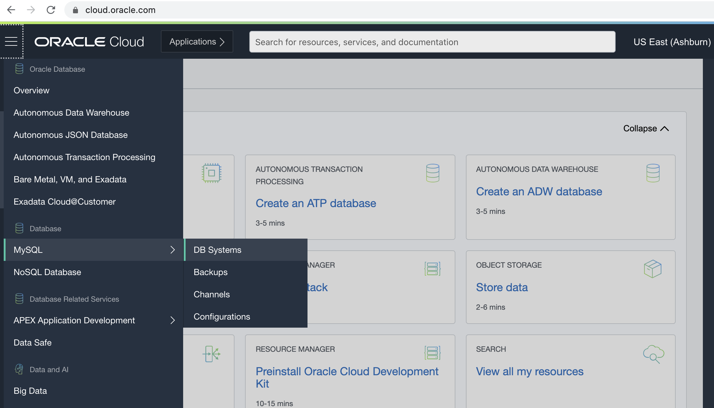

2. Please provide the name for the MySQL instance. Select your compartment, Availability Domain, and shape. And click Next. If you are interested to test MDS Heatwave, please select MySQL.HeatWave.VM.Standard.E3 shape.

    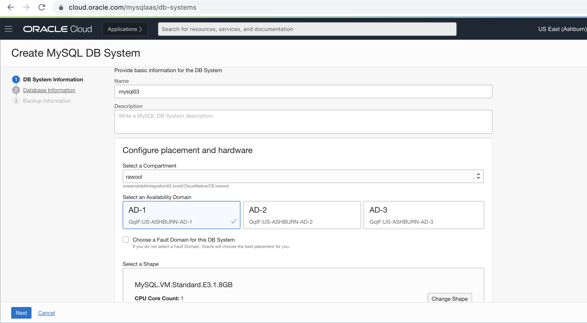

3. Now, enter the credentials for MDS Instance. Please select the same VCN and public subnet you created in the previous lab. And click Next.

    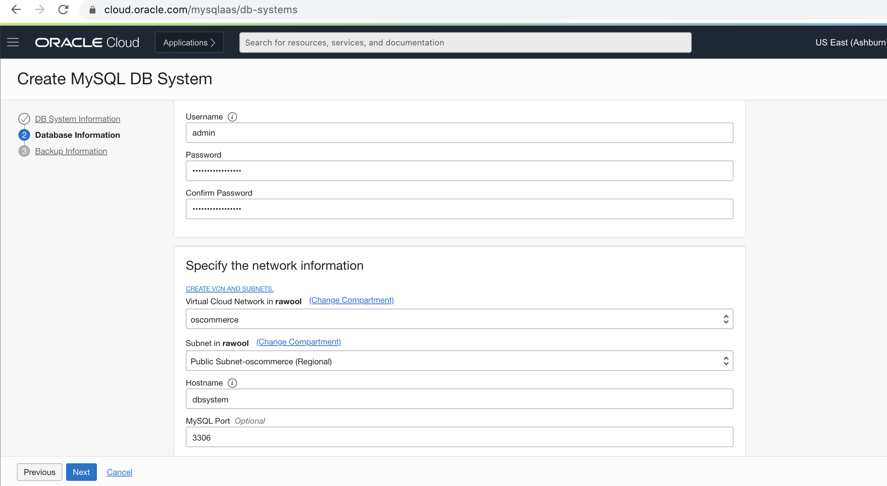

4. Once complete, Please click create button. This will take few minutes to spin up the MDS Instance on OCI.

    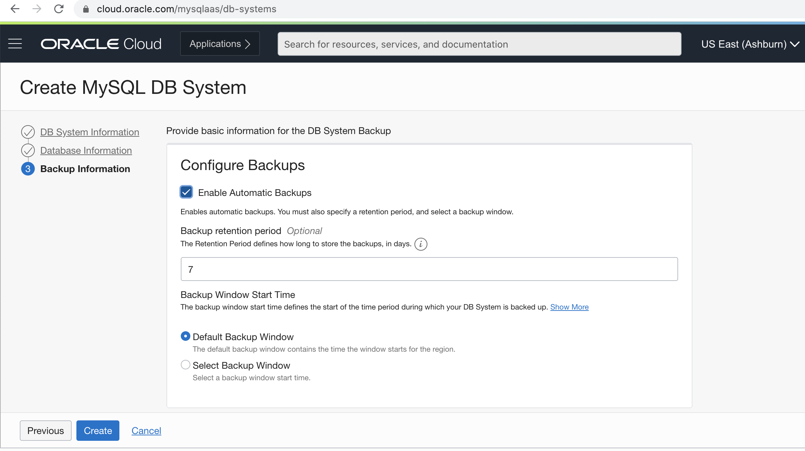

## Task 2: OCI CLI & MySQL Shell Setup

### **OCI CLI Setup**
1. Please ssh in your primary instance. Run the following command in the terminal. For more information on how to setup OCI CLI for Ubuntu - [link](https://docs.oracle.com/en-us/iaas/Content/API/SDKDocs/climanualinst.htm)

    ```
    <copy>
    sudo apt update
    </copy>
    ```

    ```
    <copy>
    sudo apt install build-essential zlib1g-dev libncurses5-dev libgdbm-dev libnss3-dev libssl-dev libreadline-dev libffi-dev libsqlite3-dev wget libbz2-dev
    </copy>
    ```

    ```
    <copy>
    mkdir python_tmp
    </copy>
    ```

    ```
    <copy>
    cd python_tmp
    </copy>
    ```

    ```
    <copy>
    wget https://www.python.org/ftp/python/3.8.3/Python-3.8.3.tgz
    </copy>
    ```

    ```
    <copy>
    tar -xf Python-3.8.3.tgz
    </copy>
    ```

    ```
    <copy>
    cd Python-3.8.3
    </copy>
    ```

    ```
    <copy>
    ./configure --enable-optimizations
    </copy>
    ```
    ```
    <copy>
    sudo make altinstall
    </copy>
    ```

    ```
    <copy>
    sudo pip install oci-cli
    </copy>
    ```

2. To confirm whether OCI CLI is correctly installed run below command it will display the OCI CLI version.

    ```
    <copy>
    oci -v
    </copy>
    ```

3. Now you have to setup configuration file for OCI CLI.

    ```
    <copy>
    mkdir /home/oscommerce/.oci/
    </copy>
    ```
    ```
    <copy>
    cd /home/oscommerce/.oci/
    </copy>
    ```
    ```
    <copy>
    sudo nano config 
    </copy>
    ```
4. Copy below contents to config file. Make sure you have the OCID's of user, tenancy, compartment-id. Save and exit from the file.

    ```
    [DEFAULT]
    user = ocid1.user.oc1...
    fingerprint = 
    key_file = <pem_file_path> example - /home/oscommerce/.oci/oci_api_key.pem
    tenancy = 
    region = 
    compartment_id = 
    ```

5. On your local terminal, run below command to move the .pem file from your local system to OSCommerce VM.

    ```
    <copy>
    scp -i <private_key_file> <pem_file_path> oscommerce@<ip_address>:/home/oscommerce/.oci
    </copy>
    ```

6. Now run below commands in OSCommerce VM. You can suppress the warnings with below command.

    ```
    <copy>
    export OCI_CLI_SUPPRESS_FILE_PERMISSIONS_WARNING=True
    </copy>
    ```

7. To confirm whether you are able to connect to your tenancy, run below command it will display your tenancy namespace.

    ```
    <copy>
    oci os ns get
    </copy>
    ```

### **MySQL Shell Setup**

8. MySQL Shell is recommended tool for data migrations between MySQL Databases. You can download the shell [here](https://downloads.mysql.com/archives/shell/)

    ```
    <copy>
    cd /home/oscommerce
    </copy>
    ```
    ```
    <copy>
    mkdir mysql-shell
    </copy>
    ```
    ```
    <copy>
    cd mysql-shell
    </copy>
    ```
    ```
    <copy>
    wget https://dev.mysql.com/get/mysql-apt-config_0.8.16-1_all.deb
    </copy>
    ```
    ```
    <copy>
    ls
    </copy>
    ```

9. Run below command to install mysql-shell package for Ubuntu. Make sure the configurations are set to MySQL 5.7

    ```
    <copy>
    sudo dpkg -i mysql-apt-config_0.8.16-1_all.deb
    </copy>
    ```

    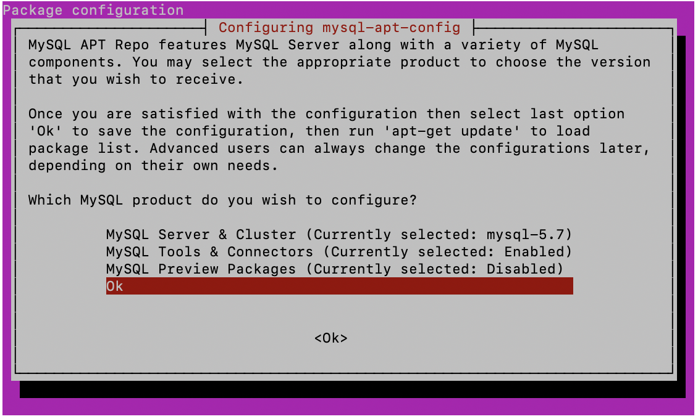

10. Run below commands to complete mysql-shell installation.

    ```
    <copy>
    sudo apt-get update
    </copy>
    ```
    ```
    <copy>
    sudo apt-get install mysql-shell
    </copy>
    ```

11. Once MySQL Shell is installed, you can confirm if MySQL-Shell is properly configured and running with following command. This will open MySQL-Shell. You can exit from shell by pressing (Cntrl+Z)

    ```
    <copy>
    mysqlsh
    </copy>
    ```

## Task 3: Migrating Database to MDS

1. For database migration, you would use MySQL Shell and Object Storage as repository for database dump during the migration process. You would need to create bucket in Object Storage. Go to your OCI Console and create bucket as shown below. 

    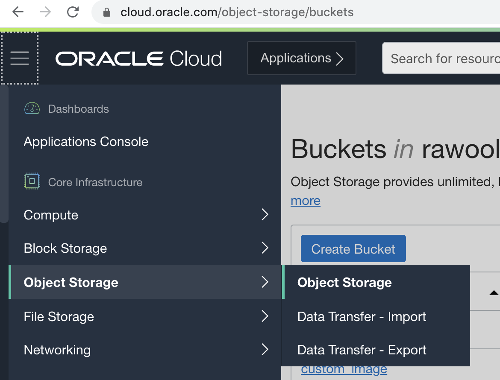
    

2. Run below command to connect to OSCommerce MySQL Database. The default password of root and oscommerce user is *oscommerce*

    ```
    <copy>
    mysqlsh oscommerce@127.0.0.1
    </copy>
    ```
    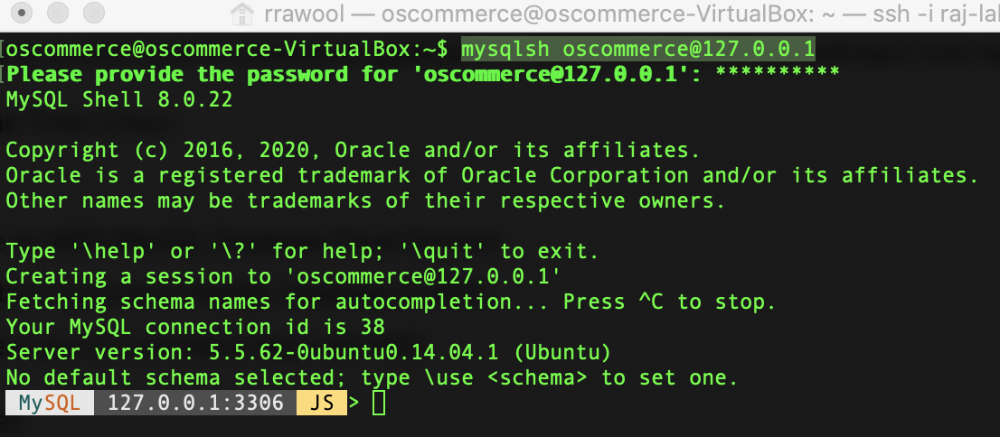

3. Now you will migrate the data from local MySQL to Object Storage of OCI. For migrating the database we will use the dumpSchema Utility of MySQL-Shell. Provide any name for ```<dump_folder_name>```. Run below command in MySQL-Shell.

    ```
    <copy>
    util.dumpSchemas(["oscommerce"],"<dump_folder_name>",{"osBucketName":"<bucket_name>","osNamespace": "<tenancy_name>","ocimds": "true", "compatibility": ["strip_definers", "strip_restricted_grants"]})
    </copy>
    ```

4. Once you execute the dumpSchema Utility, you will get response as below. Also check your OCI Bucket, you will see the dump database of oscommerce.

    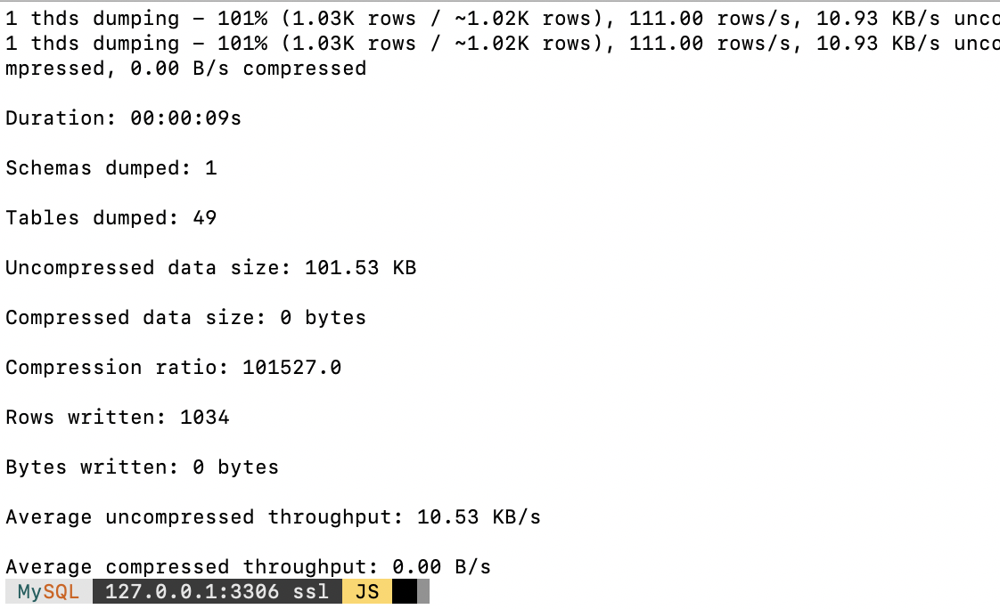
    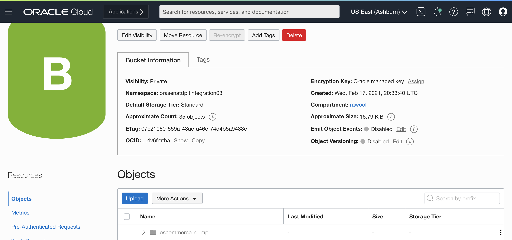

5. Now you will exit from local MySQL-Shell(Cntrl+Z) and connect MySQL-Shell to MDS Database. Run below command to connect MySQL-Shell with MDS you created earlier. Enter the password you created earlier.

    ```
    <copy>
    mysqlsh admin@<ip_address_mds>
    </copy>
    ```

6. Now we will use LoadDump Utlity of MySQL-Shell to import the database schema from OCI Bucket to MDS Database. Run below command in MySQL-Shell.

    ```
    <copy>
    util.loadDump("<dump_folder_name>",{threads: 8, osBucketName: "<bucket_name>", osNamespace: "<tenancy_name>", ignoreVersion:true})
    </copy>
    ```

7. Once you execute the LoadDump Utility of MySQL-Shell, you can check the migrated oscommerce database using below commands.

    ```
    MySQL  10.0.0.99:3306 ssl JS> \sql
    MySQL  10.0.0.99:3306 ssl  SQL> show databases;
    ```
    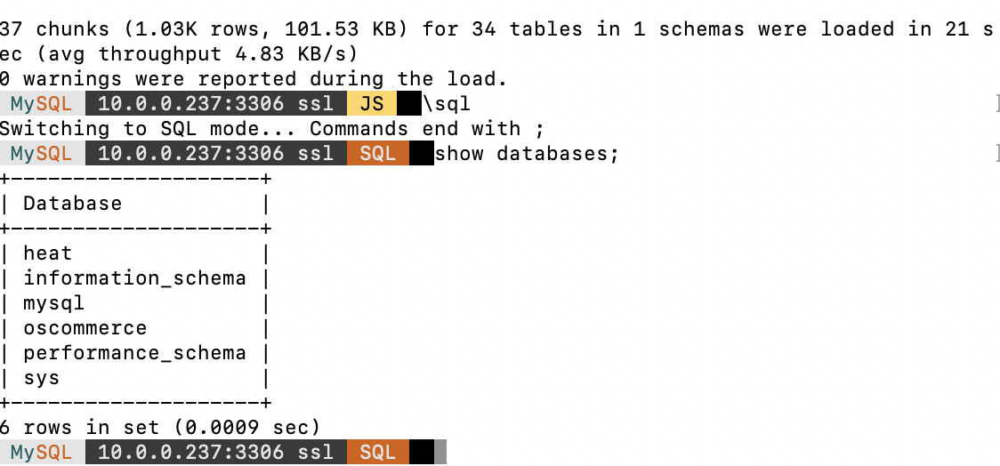

8. Make user the MDS user has all Grant and privileges for oscommerce database.

    ```
    MySQL  10.0.0.99:3306 ssl JS> ALTER USER 'oscommerce'@'%' IDENTIFIED WITH mysql_native_password BY '<mds_password>';  
    MySQL  10.0.0.99:3306 ssl JS> GRANT ALL PRIVILEGES ON oscommerce.* TO oscommerce@'%';
    ```

## Task 4: Connecting your E-Commerce App with MDS

1. Now, you would need to update the global.php file of the OsCommerce application to point to the MDS Database. Run the following command in the terminal.

    ```
    <copy>
    cd /var/www/html/catalog/includes/OSC/Conf
    </copy>
    ```
    ```
    <copy>
    sudo nano global.php
    </copy>
    ```
    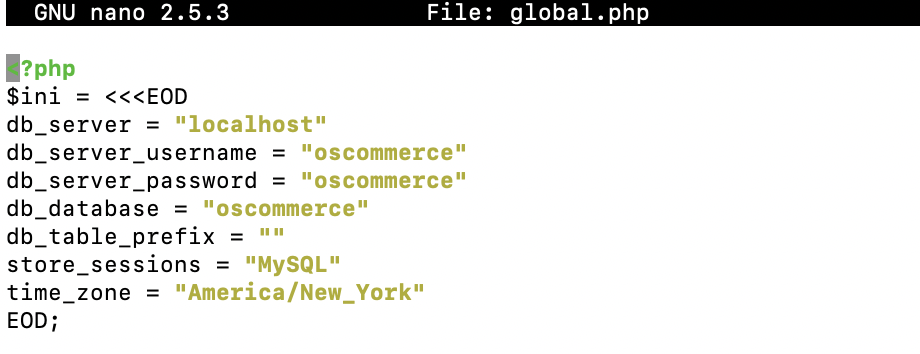

2. Update following parameters:

    ```
    db_server = "10.0.0.99"              # IP address of MDS
    db_server_username = "oscommerce"    # username of MDS
    db_server_password = "oscommerce"    # password of MDS
    ```

3. Save the file and proceed to the next steps.

4. Goto the browser and open the IP address. You would see the OsCommerce website up and running as below. Now the E-Commerce application is connected to MDS Database.

    

5. Congrats! You've successfully connected your primary instance of the E-Commerce application with MDS. You can repeat step 4 of this lab for your secondary instance.

## Task 5: Enabling Heatwave Cluster [Optional]

1. When a HeatWave cluster is enabled, queries that meet certain prerequisites are automatically offloaded from the MySQL DB System to the HeatWave cluster for accelerated execution. In order to enable the heatwave cluster, go to your OCI Console and Open your MDS MySQL Database. From resources select Heatwave and click enable Heatwave cluster. Select the minimum number of nodes as 2 and click create.

    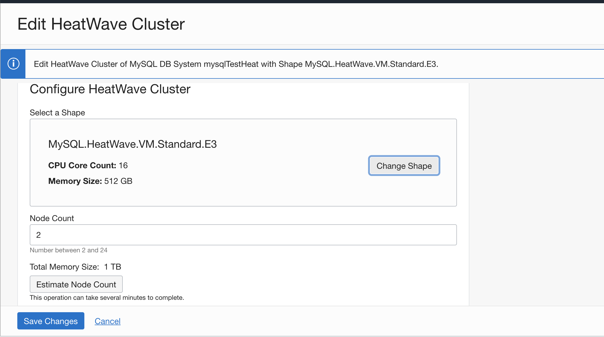

2. Login to primary instance VM and run below commands.
    ```
    <copy>
    mkdir /home/oscommerce/heatwave
    </copy>
    ```
    ```
    <copy>
    cd /home/oscommerce/heatwave
    </copy>
    ```

3. Now to test the performance of Heatwave Cluster, you would need to add millions of records to the OSCommerce tables. In this example, you will add records to Product tables. This are millions of records related to product movies. Please download this 3 files.

    * Product Movies - [link](https://objectstorage.us-ashburn-1.oraclecloud.com/p/x56TinbHz2sVQv9kfsEibGD1zBv8hTnyvYCkDr27UQndYqzyGhNsv1Begb5eM47v/n/orasenatdpltintegration03/b/workshop16/o/product_movies.csv)
    * Product Description - [link](https://objectstorage.us-ashburn-1.oraclecloud.com/p/jClT9XF8DpN6IrGohaWUdg5xtrDJ8b7D2UcHfnEK_DcEOk082SIgHIVbdrHx5ubE/n/orasenatdpltintegration03/b/workshop16/o/product_desc_movies.csv)
    * Product Categories - [link](https://objectstorage.us-ashburn-1.oraclecloud.com/p/A0WKof54sP5L0LJm3guyFxlk2DQYq3fh2NViO27niJrCfY9ZkeIkI2co2DOIfbOl/n/orasenatdpltintegration03/b/workshop16/o/product_cat_movies.csv)

4. From your local terminal copy the files to Heatwave directoy of primary VM Instance.
    ```
    scp -i < private_key > <Product_movies_file_path> oscommerce@your-ip-address:/home/oscommerce/heatwave
    scp -i < private_key > <Product_description_file_path> oscommerce@your-ip-address:/home/oscommerce/heatwave
    scp -i < private_key > <Product_categories_file_path> oscommerce@your-ip-address:/home/oscommerce/heatwave
    ```
    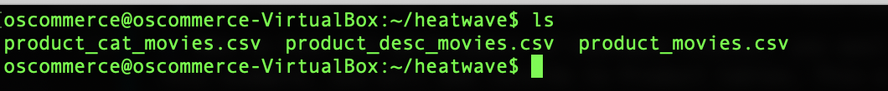

5. Now login to Primary VM and goto Heatwave cluster directory.

    ```
    cd /home/oscommerce/heatwave
    ```
6. Let's login to MDS Heatwave instance through MySQL-Shell. 

    ```
    mysqlsh oscommerce@<ip_address_mds>
    ```

7. Now you will load the 3 CSV files data to OSCommerce database in 3 product tables. Run below queries in MySQL-Shell. This queries will load data from CSV files to product tables.

    ```
    <copy>
    util.importTable ("/home/oscommerce/heatwave/product_movies.csv",{ schema: "oscommerce", table: "products", "dialect": "csv-unix", "skipRows": 1, "showProgress": true, columns: ["products_quantity", "products_model","products_image","products_price","products_date_added","products_weight","products_status","products_tax_class_id","manufacturers_id","products_ordered"]});
    </copy>
    ```

    ```
    <copy>
    util.importTable ("/home/oscommerce/heatwave/product_desc_movies.csv",{ schema: "oscommerce", table: "products_description", "dialect": "csv-unix", "skipRows": 1, "showProgress": true, columns: ["products_id","language_id","products_name","products_description","products_url","products_viewed"]});
    </copy>
    ```

    ```
    <copy>
    util.importTable ("/home/oscommerce/heatwave/product_cat_movies.csv",{ schema: "oscommerce", table: "products_to_categories", "dialect": "csv-unix", "skipRows": 1, "showProgress": true, columns: ["products_id","categories_id"]});
    </copy>
    ```

8. Use \sql to switch to sql mode in MySQL-Shell.

    ```
    mysqlsh oscommerce@<ip_address_mds>
    MySQL  10.0.0.99:3306 ssl JS> \sql
    MySQL  10.0.0.99:3306 ssl JS> use oscommerce;
    ```
9. You can verify the records were added to the product tables by checking the number of records in the product tables. Run below query to check the records in product tables.

    ```
    MySQL  10.0.0.99:3306 ssl oscommerce SQL> select count(*) from products;
    MySQL  10.0.0.99:3306 ssl oscommerce SQL> select count(*) from products_description;
    MySQL  10.0.0.99:3306 ssl oscommerce SQL> select count(*) from products_to_categories;
    ```

    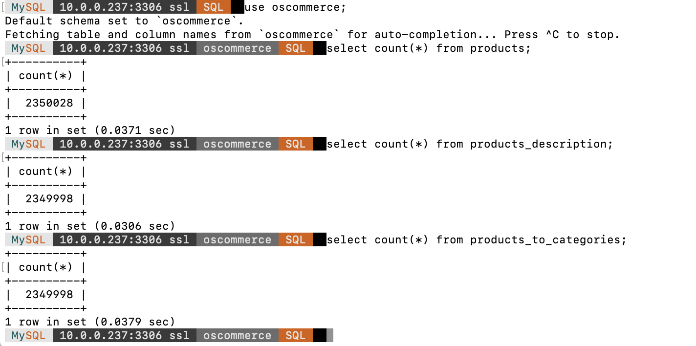

10. Now you need to load this 3 product tables to Heatwave Cluster. Run below queries to load the 3 tables to Heatwave Cluster. This is one time query to assign the tables to RAPID engine of MDS Heatwave. The MDS Heatwave automatically decides when to offload the queries to RAPID Engine of the Cluster based on complexity and amount of data fetched from database.

    ```
    MySQL  10.0.0.99:3306 ssl oscommerce SQL> ALTER TABLE products_description SECONDARY_ENGINE=RAPID;
    MySQL  10.0.0.99:3306 ssl oscommerce SQL> ALTER TABLE products_description SECONDARY_LOAD;

    MySQL  10.0.0.99:3306 ssl oscommerce SQL> ALTER TABLE products_to_categories SECONDARY_ENGINE=RAPID;
    MySQL  10.0.0.99:3306 ssl oscommerce SQL> ALTER TABLE products_to_categories SECONDARY_LOAD;

    MySQL  10.0.0.99:3306 ssl oscommerce SQL> ALTER TABLE products SECONDARY_ENGINE=RAPID;
    MySQL  10.0.0.99:3306 ssl oscommerce SQL> ALTER TABLE products SECONDARY_LOAD;
    ```

11. Explain keyword helps to identify which engine is getting used. You can turn the Heatwave cluster off with below query and then run explain query.

    ```
    MySQL  10.0.0.99:3306 ssl oscommerce SQL> SET SESSION use_secondary_engine=OFF;
    MySQL  10.0.0.99:3306 ssl oscommerce SQL> explain select count(*) from products;
    ```

    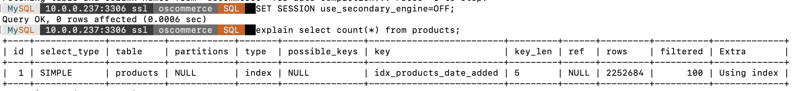

12. Check the Extra column of the query. It won't mention RAPID engine as the secondary engine is turned off. Now you can enable the Heatwave cluster with below command. And then run the explain query.

    ```
    <copy>
    MySQL  10.0.0.99:3306 ssl oscommerce SQL> SET SESSION use_secondary_engine=ON;
    MySQL  10.0.0.99:3306 ssl oscommerce SQL> explain select count(*) from products;
    </copy>
    ```

    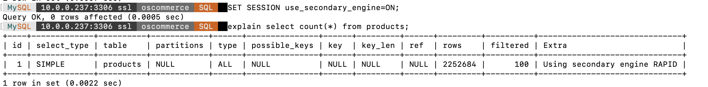

13. In the Extra column you will notice, the query uses secondary engine as RAPID which is the Heatwave Cluster. If you run simple query, Heatwave Cluster would automatically offload the query to InnoDB of MySQL Database. You can play some sample queries to see how Heatwave automatically decides the execution engine to process the queries.


    ```
    <copy>
    MySQL  10.0.0.99:3306 ssl oscommerce SQL> explain select * from products where products_id < 100;
    </copy>
    ```

    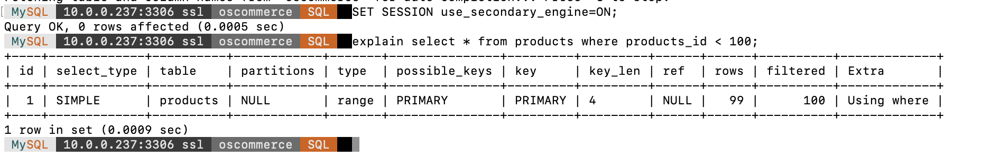

14. You will notice in Extra Column, the Heatwave Cluster won't send the query to secondary engine RAPID instead it executes as normal query since the sql query is not complex enough to excute under Heatwave cluster. Heatwave automatically decides when to send the query to the secondary engine cluster. Let's execute a complex query with heatwave disabled. Note the time it takes to execute the query.

    ```
    <copy>
    MySQL  10.0.0.99:3306 ssl oscommerce SQL> SET SESSION use_secondary_engine=OFF;
    MySQL  10.0.0.99:3306 ssl oscommerce SQL> select pc.categories_id,avg(p.products_price),sum(p.products_price) from products as p join products_to_categories as pc on p.products_id = pc.products_id group by pc.categories_id;
    </copy>
    ```
    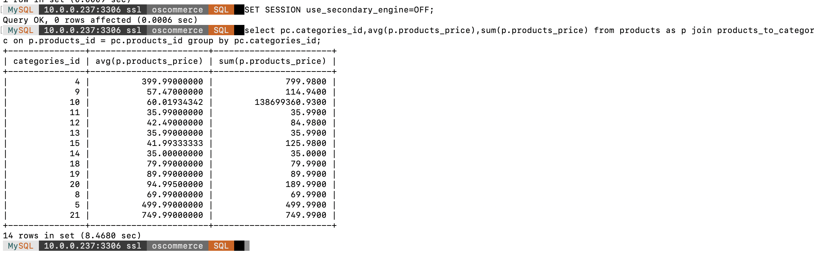

15. Now let's test the performance of same query execution with Heatwave enabled. Please run below query in MySQL-Shell and note the time it takes to execute the query. You can check in attached screenshot the results.

    * Without Heatwave : 8.46 seconds
    * With Heatwave : 0.055 seconds

    ```
    <copy>
    MySQL  10.0.0.99:3306 ssl oscommerce SQL> SET SESSION use_secondary_engine=ON;
    MySQL  10.0.0.99:3306 ssl oscommerce SQL> select pc.categories_id,avg(p.products_price),sum(p.products_price) from products as p join products_to_categories as pc on p.products_id = pc.products_id group by pc.categories_id;
    </copy>
    ```

    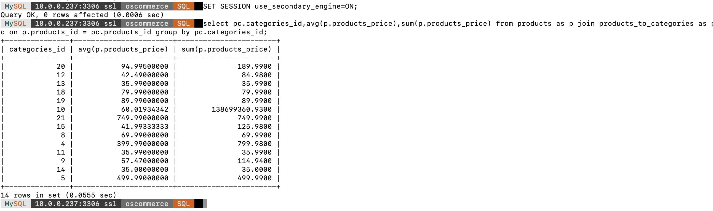

16. You will observe significant improvement in query execution when the Heatwave cluster is enabled. To use Heatwave cluster you dont have to change your sql query, only you need to switch on the Heatwave Cluster and it will automatically load and execute the query.

17. Congrats! You've successfully connected your primary instance of the E-Commerce application with MDS and learned how to enable Heatwave of MDS. You can test query execution performance with and without Heatwave enabled.

## Learn More
* To learn about connecting to MDS on OCI [link](https://docs.oracle.com/en-us/iaas/mysql-database/doc/connecting-db-system.html)
* To learn about MySQL Shell [link](https://dev.mysql.com/doc/mysql-shell/8.0/en/)
* MDS Heatwave - [link](https://docs.oracle.com/en-us/iaas/mysql-database/doc/heatwave1.html)

## Acknowledgements
* **Author** - Rajsagar Rawool
* **Last Updated By/Date** - Rajsagar Rawool, January 2021
