# Monitoring your Application with Oracle Management Cloud

## Introduction
This lab will walk you through installing OCI's monitoring agent in an existing application on the cloud. First, you will download the agent, then move it to your virtual machine with the app from Lab 100, and unzip it. After you have confirmed the agent is monitoring the application, you will utilize entity discovery to monitor the MySQL database in the environment better.

### Objectives
* Learn how to install, move and unzip cloud agents
* Understand some of the dashboards that can be created with OMC
* Learn how the entity discovery process works

### Prerequisites
* The following lab requires an Oracle Public Cloud account. You may use your cloud account, a cloud account that you obtained through a trial, or a training account whose details were given to you by an Oracle instructor.
* [VirtualBox](https://www.virtualbox.org/wiki/Downloads)
* [CyberDuck](https://cyberduck.io/)
* A compute image with the third party application from Lab 1 installed

Estimated Lab Time: 2 hour

## Task 1: Downloading the Agent from Oracle Management Cloud

### **Navigate to the Agents Page**

1. Open Oracle Management Cloud and on the menu on the left-hand side of your screen, click "Administration -> Agents" to get to the agents' page.

2. Once here, click the hamburger menu on the top right-hand side of the screen and click the download agent button.

    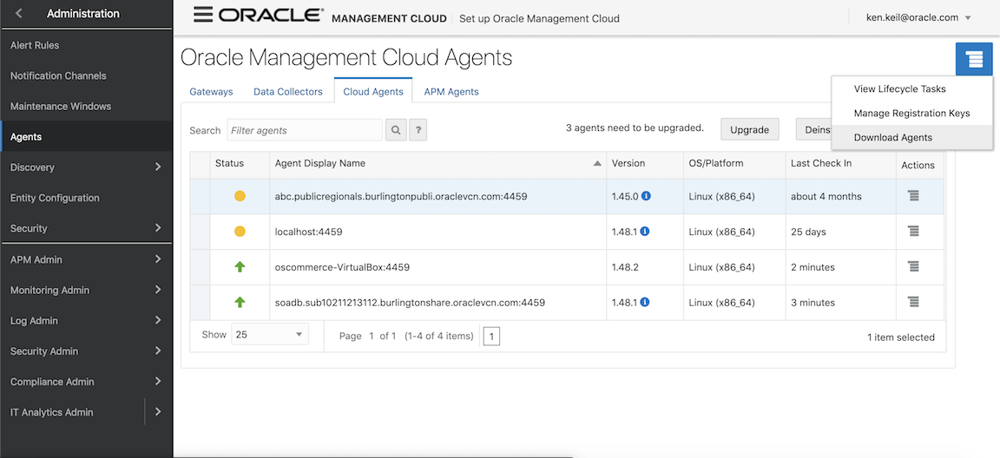

### **Download the agent**

3. For agent type, select "Cloud Agent," and for your operating system, choose "Linux (64 Bit)". Download the "Cloud Agent - Linux (64-bit)" file and save it to your computer.

    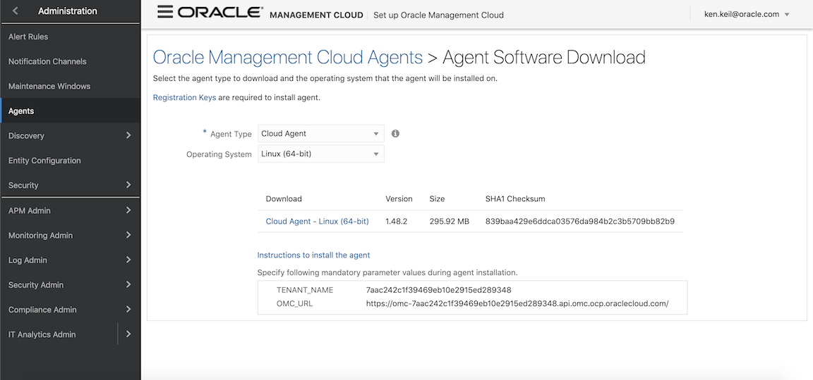

4. Take note of your tenant name and OMC URL; you will need these later.

    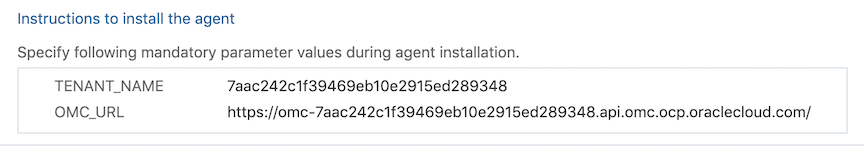

## Task 2: Moving and Unzipping the Agent

### **Installing Cyberduck** 

1. Download the appropriate version of [Cyberduck](https://cyberduck.io/download/) for your system.

### **Connecting to your Application**

2. Open Cyberduck. If prompted to "Set Cyberduck as the default application for FTP and SFTP locations", click cancel.

3. Click the button of the globe with the + sign. In the dropdown menu at the top, please change it to SFTP (SSH File Transfer Protocol).

4. For your server, navigate to your OSCommerce Compute Instance and copy the public IP Address.

    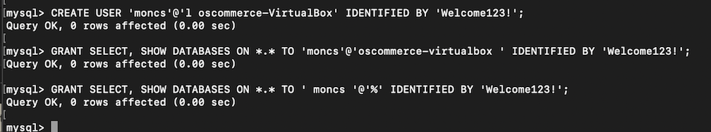

5. Username and password should both be "oscommerce" by default. For SSH Private Key, select your private key from the dropdown menu, then click connect.

    

6. Allow any unknown fingerprints.

7. Once connected, you should see the home directory for OsCommerce. Drag your downloaded cloudagent_linux zip file into the home directory. Please note, **the file must still be zipped.**

    

### **Unzipping the Agent**

8. Open your terminal and type "`cd .ssh` "to change to your ssh directory.

9. Once there, connect to your OsCommerce instance by entering the following command. Replace '&lt;YourPublicIPHere&gt;' with the public IP on your instance

    ```
    <copy>
    ssh oscommerce@<YourPublicIPHere>
    </copy>
    ```

10. If prompted with "the authenticity of the host can't be established", type yes to continue. You then will need to enter your password. By default, it is oscommerce.

    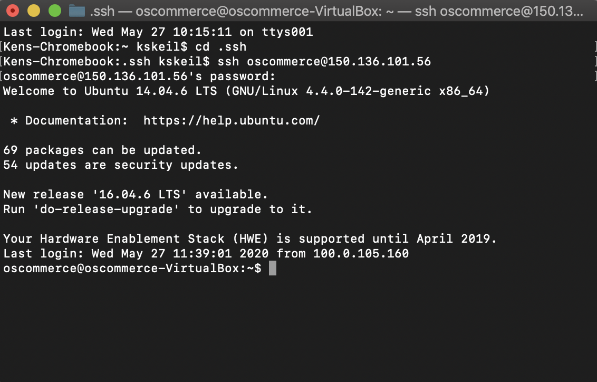

11. Type the command ```ls``` to confirm the cloudagent_linux zip file is still there. Unzip the file by typing:

    ```
    <copy>
    unzip cloudagent_linux.64x.48.2.zip
    </copy>
    ```

12. Note: Your file name may appear slightly different. For a shortcut, type in 'unzip cloudagent,' then press the tab key to autocomplete to the correct file name.

    

13. If you type "`ls` "again, you should see some additional files in your directory. The "agent.rsp" file is the one you are currently interested in.

14. Use your favorite text editor to open the file. In this case, I'm using the command "`nano agent.rsp` "

15. Fill in the tenant name with the details you wrote down in Part 1 Step 2. For the registration key, use:

    ```
    <copy>
    RKsjm7eGyt9igutkdn-RcULYZR
    </copy>
    ```

    For agent base directory type:
    ```
    <copy>
    /home/oscommerce/omcagent/agent_inst/bin
    </copy>
    ```

16. And finally, populate the OMC_URL with the URL saved in Part 1 Step 2.

    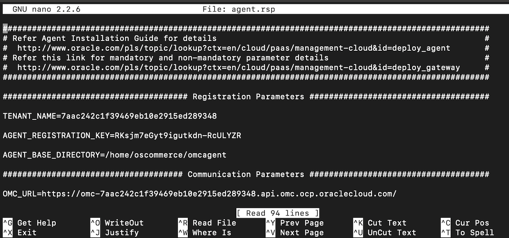

17. Save any changes and exit out. In this case, you can type Control + X to exit, type Y to save, then enter.

18. Next, you’ll execute one of the scripts, by typing:
    
    ```
    <copy>
    ./AgentInstall.sh
    </copy>
    ```

    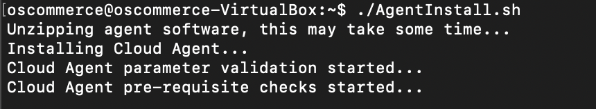

19. To check if this complete properly, change to the bin directory by typing:

    ```
    <copy>
    cd omcagent/agent_inst/bin/
    </copy>
    ```

20. From here, you can check the status of your agent by typing:

    ```
    <copy>
    ./omcli status agent
    </copy>
    ```

    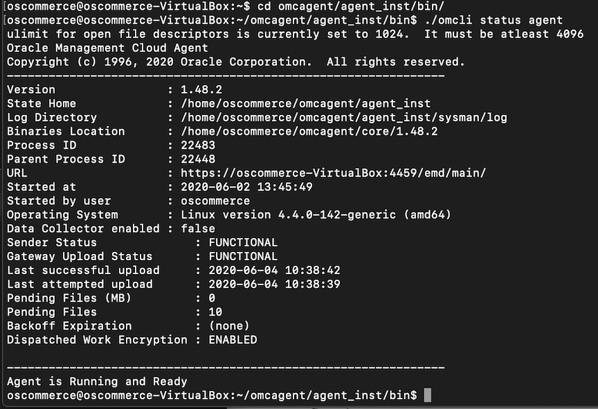

### **Confirming the Agent is Running**

21. Open OMC and navigate to agents by accessing the menu on your screen's left-hand side and clicking Administration -> Agents.

22. At the bar at the top, click Cloud Agents, and you should see your Virtual Box Agent up and running.

23. To monitor your agent, click the hamburger menu on the right-hand side of the agent and click "view in monitoring."

    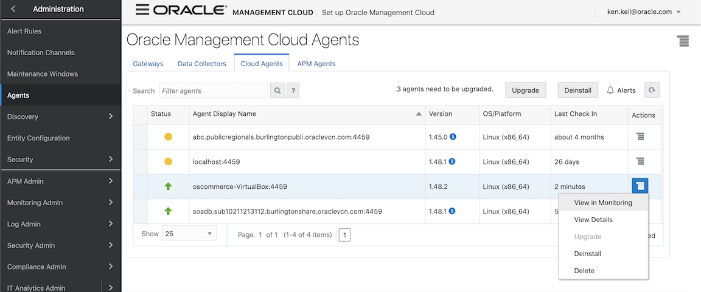

## Task 3: Discovering MySQL

### **Configuring MySQL**

1. SSH into your instance if you aren't already there.

2. Type the command "`mysql -u root -p` "to connect to your MySQL database.

3. When prompted for a password, type in the root password from the initial setup in Lab 100. In this case, my password was 'oscommerce'.

    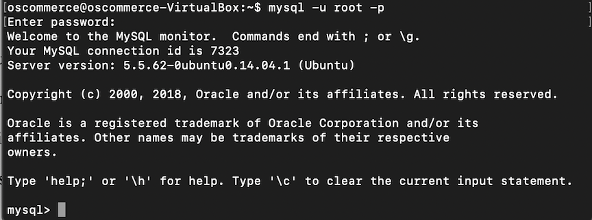

4. Once here, you need to create a user for OMC to use, and give it the appropriate permissions.

5. To create the user, type the command:

    ```
    <copy>
    CREATE USER 'moncs’@'l oscommerce-VirtualBox' IDENTIFIED BY '<yourpasswordhere>';
    </copy>
    ```

6. Replace '&lt;yourpasswordhere&gt;' with a password you can remember. You will need this later. Next, you must give the moncs user appropriate permissions. To do this, type the commands:

    ```
    <copy>
    GRANT SELECT, SHOW DATABASES ON *.* TO ' moncs '@'%' IDENTIFIED BY '<yourpasswordhere>';
    </copy>
    ```

7. Once again, you will need to replace '&lt;yourpasswordhere&gt;' with the password from the create user step.

    

8. Type 'exit' to exit MySQL.

9. Next, you need to update the config file for MySQL to allow for outside connections.

10. First, you need to change to the root directory.

    Type the command:
    ```
    <copy>
    cd ../
    </copy>
    ```

    then again type:
    ```
    <copy>
    cd ../
    </copy>
    ```

11. And finally, to make sure you're in the right folder, type:
    "`ls` "
    and confirm you can see the following folder called 'etc'

    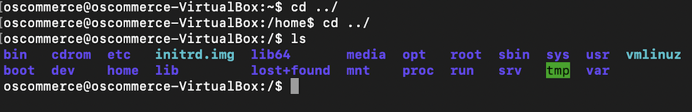

12. Next, you need to navigate to the MySQL folder, which is inside of etc.

    Type the command
    "`cd etc/mysql/` "
    to change to this directory.

13. If you do an "`ls` "here, you should be able to see the my.cnf file.

    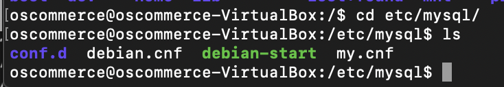

14. Using your favorite text editor, open up the config file. In my case, I'm doing this by typing the command:

    ```
    <copy>
    nano my.cnf
    </copy>
    ```

15. Once here, you need to scroll down and find 'bind-address'. The value needs to be changed here to 0.0.0.0 to allow all connections.

    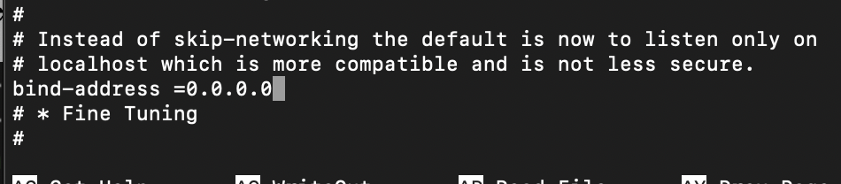

16. Press Control + X to exit; when prompted to save, type 'Y', and then press enter to confirm.


### **Agent Discovery**

17. Navigate to Administration -> Discovery

    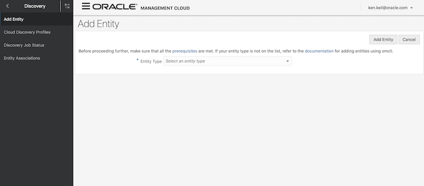

18. Under Entity Type, select 'MySQL Database'. Give your entity a unique name. NOTE: The JDBC URL is case sensitive.

    For JDBC URL, type in ```jdbc:mysql://oscommerce-VirtualBox:3306/mysql```
    
19. For hostname, select the virtual box: 'oscommerce-VirtualBox'

20. For cloud agent, choose the one created, 'oscommerce-VirtualBox:4459'

21. For user name type 'moncs'

22. For password, type whatever you assigned it to earlier in Part 3 Step 1.

23. To complete click 'Add Entity'

    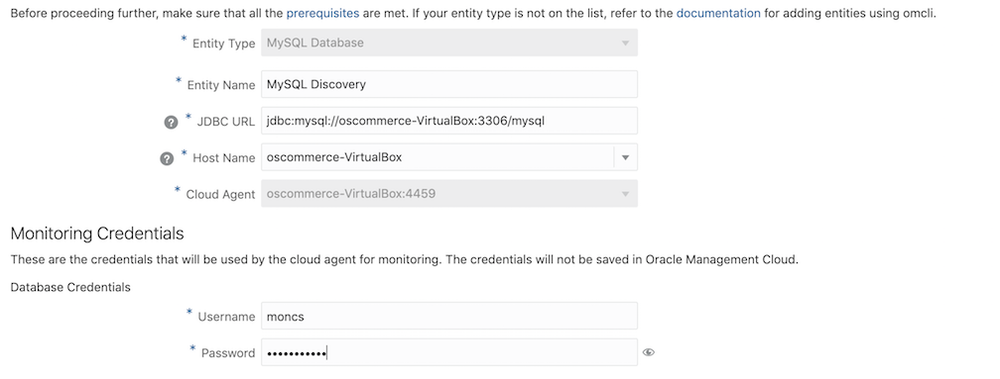

24. When asked what to do in the case of errors, select the option 'Stop. You can retry after you fix the errors.'

25. Wait a minute for the entity to be discovered. After a few moments, you should see your discovery's status as either success or success with warnings. If it fails, you need to go back and fix your issue.

    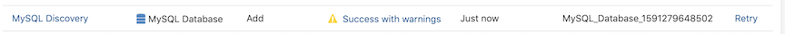

### **Creating Dashboards**

26. Now that our agent is installed on the instance, and you have successfully discovered the MySQL Database, it's time to create some useful visualizations and dashboards.

27. First, head back over to OMC, and on the hamburger menu on the left-hand side of the screen, click 'Data Explorer'.

28. On the top of the screen is a bar called the context bar. This will change what entity you are looking to create visualizations on. Always be mindful of what is in the context bar and the interval on the right of it.

29. On the context bar, type in
    "`MySQL` "
    and select the MySQL Discovery with the matching name to the one you just created.

    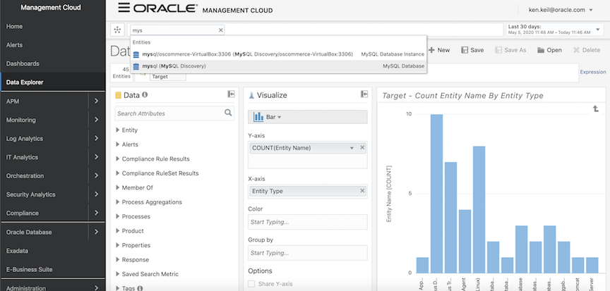

30. Now that you are here, let's create a widget that will monitor our CPU Utilization and our Memory Usage. First, you need to clear out everything in the Visualize panel by clicking the small x on each filter. For the graph type, select the line chart from the dropdown under the visualize panel.

    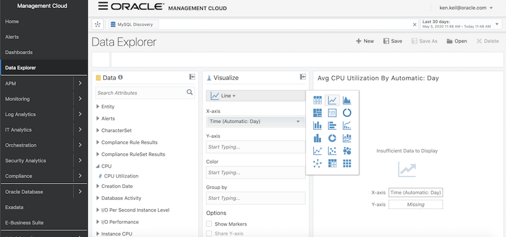

31. From the data panel on the left, search for the attribute "`CPU Utilization` "under the tab labeled 'CPU'. Drag and drop this over to the Y-Axis. Your X-axis should now automatically populate with 'Time (Automatic Day)'

32. Do the same thing for Memory Usage. Under the search bar, type in "`Memory` "and scroll down to find the Physical Memory tab, and drag over 'Memory Usage' to the Y-Axis as well.

    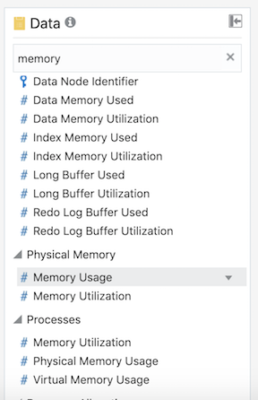

    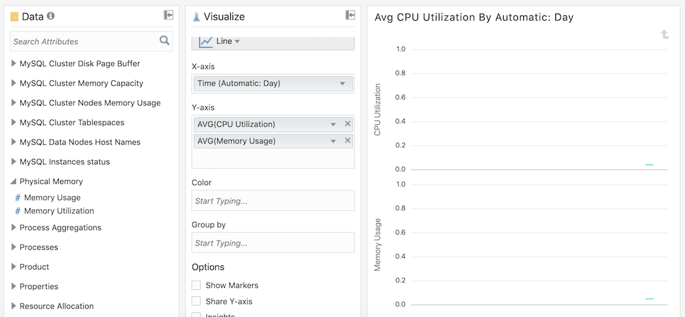

33. Don't worry if your graphs look boring or uneventful now. The agent has only just begun collecting data on MySQL, so there's not much to display right now.

34. This is a great tool to use to create custom, useful dashboards to help provide you with a quick overview of your application's health.

35. Let's now go ahead and save this by clicking the save button at the screen's top. Be sure to give it a name you will be able to remember.

36. Navigate over to the Dashboards page from the menu on the left-hand side of your screen.

37. Click 'Create' at the top of the page.

    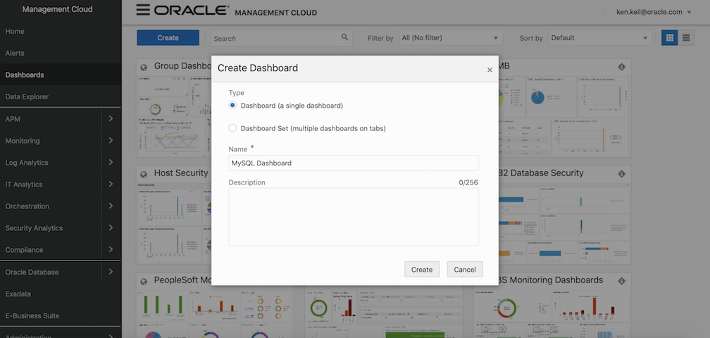

38. Once here, at the top of the page, click the edit button. A panel will appear on the right-hand side of the screen.

39. Search for the widget you just created.

    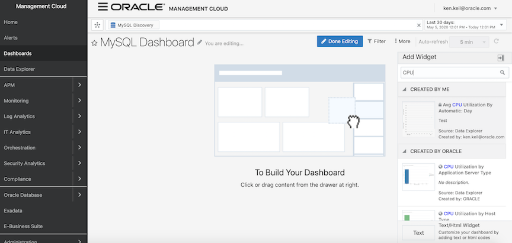

40. Click on the widget you just created on the right to add it to the dashboard. Click done editing.

    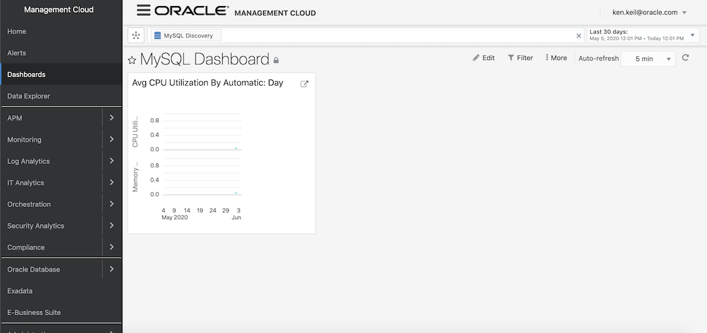

41. Congrats! You've just created a functional dashboard monitoring your MySQL database!

## Learn More
* [OMC Documentation](https://docs.oracle.com/en/cloud/paas/management-cloud/index.html)

## Acknowledgements
* **Author** -  Ken Keil
* **Last Updated By/Date** - Rajsagar Rawool, January 2021
