# Creating Environment in PeopleSoft

## Introduction

This lab walks you through the steps to provision and deploy an HCM PeopleSoft Environment from the previously created environment topology and template.

Estimated Lab Time: 15 minutes + 90 minutes waiting for environment to deploy

### Objectives

The purpose of this lab is to show you how to create a PeopleSoft Environment from an environment template in the PeopleSoft Cloud Manager.

In this lab, you will:
* Create a PeopleSoft Environment

### Prerequisites
- A PeopleSoft Cloud Manager Instance
- A PeopleSoft Environment Topology and Template 

## Task 1: Creating a New PeopleSoft Environment

1. Navigate to Cloud Manager Dashboard > **Environments**  
    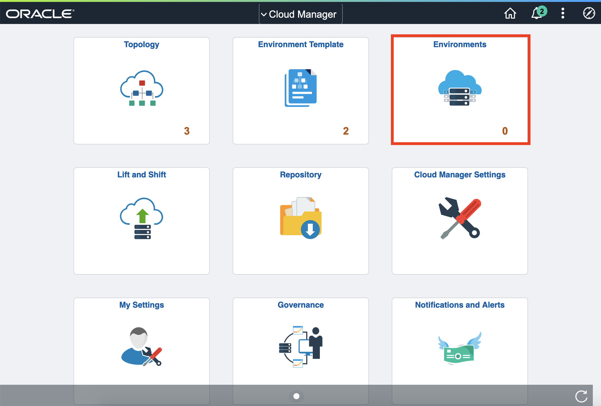

  Click **Create Environment** button.

    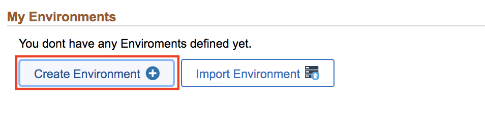

2. Provide a unique Environment Name - **HCMFT**. Select the Template that was created in previous section – **PUMFT**. Click **yes** for **Pause after infra creation**.  

    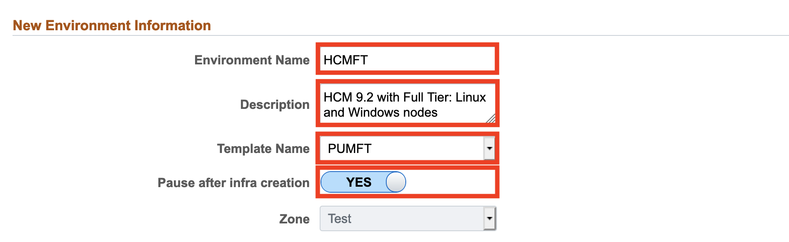

3. Expand **Environment Attributes -> Full Tier -> Credentials**

    Give the following values to the fields:

    No. | Full Tier | Credentials
    --- | --------- | -----------
    2 | Database Operator Password | Psft1234
    4 | Database Access Password | Psft1234
    6 | Weblogic Administrator Password | Psft1234
    7 | Database Administrator Password | **Psft1234#**
    9 | Database Connect Password | Psft1234
    11 | Gateway Administrator Password | Psft1234
    12 | Web Profile Password for user PTWEBSERVER | Psft1234


  (All are the same except Database Administrator Password)

    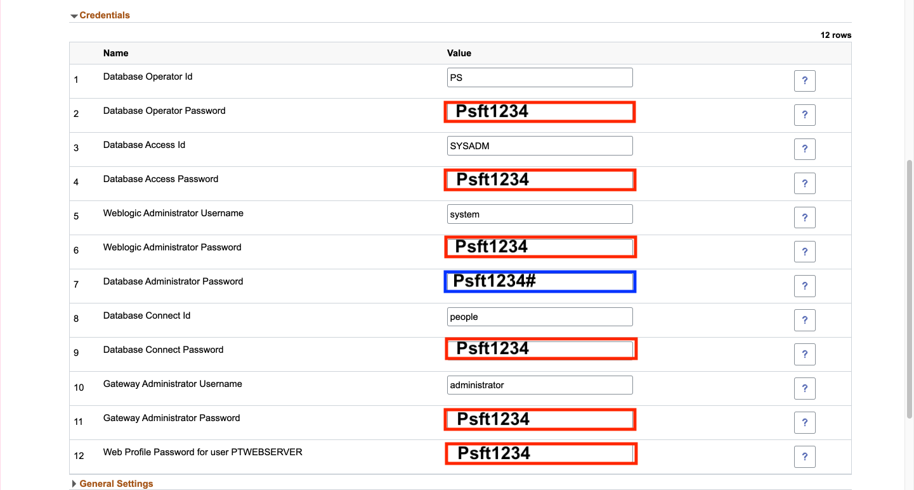

4. Expand PeopleSoft Client -> **Credentials**

  Enter the password: Psft12345678#
    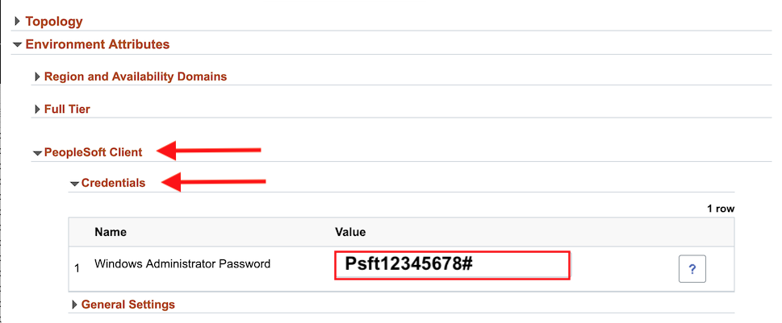

5. Scroll up and click **Done** on the top right to begin the environment creation process. 

    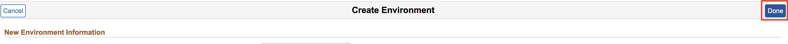

## Task 2: Monitoring Infrastructure Creation

1. Refresh the page, and you'll see the status is **Initiating**.
    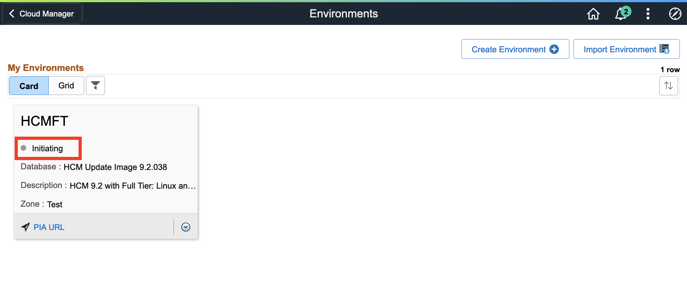

2. Refresh again after a minute, and you'll see the status change to **Infra Creation In Progress**. Now, Click the arrow, and then **Details**
    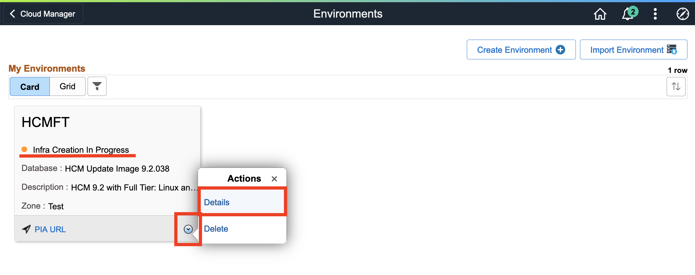

3. On the left, click **Logs**. Then, adjust the Number of Lines to Display and click **Fetch Logs**. You can take a monitor the infrastructure creation here. 
    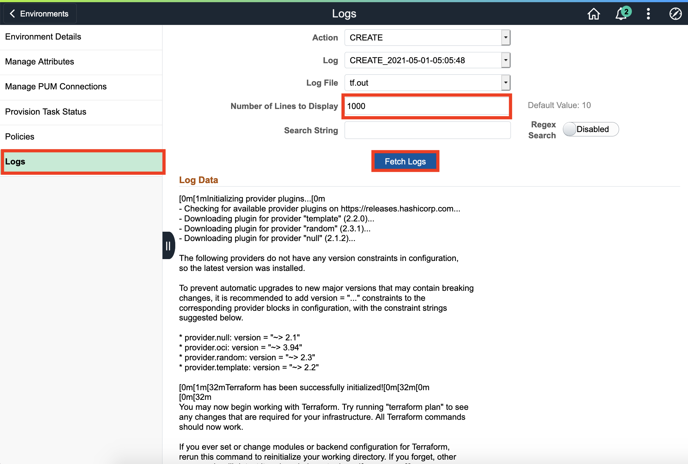

It takes about 10 minutes to see the status change to **Infrastructure Creation Complete**:
    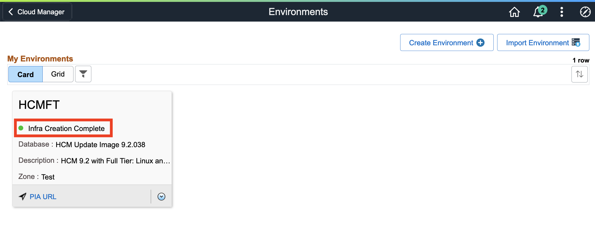


## Task 3: Monitoring Deployment of PeopleSoft Environment

1. Now that the infrastructure has been created, we can deploy our environment. Click the arrow and **Deploy**
    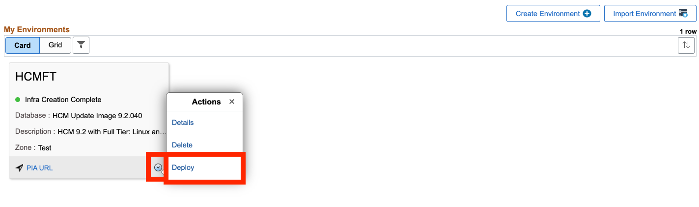

  Then click **Yes** to confirm the provisioning.
    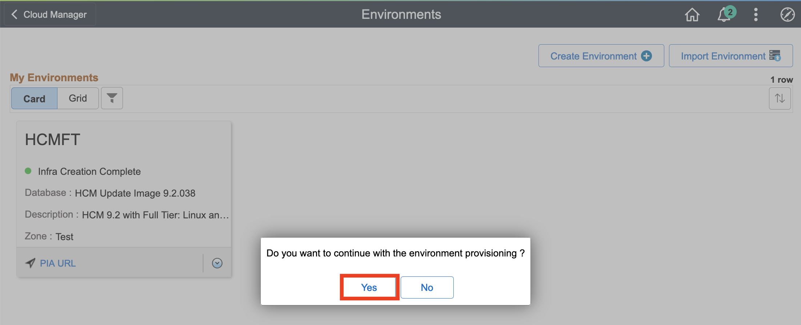

2. Again, click the arrow for the **Details**
    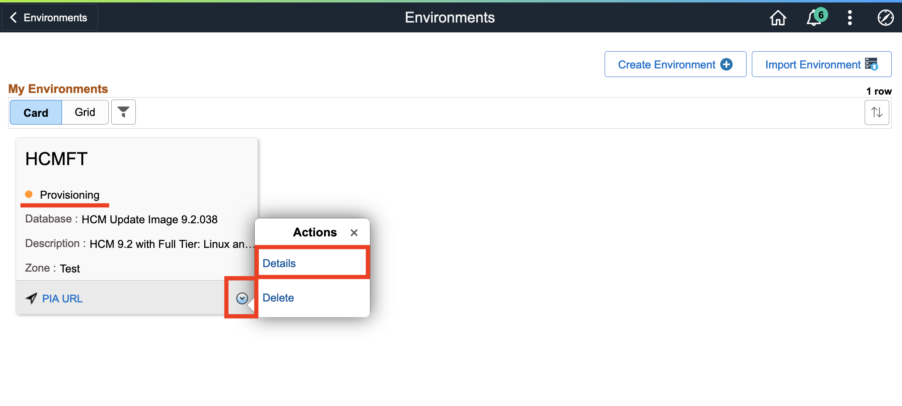

  On the left, click **Provisioning Task Status** to see detailed progress status for every step. Click on **Deployment Tasks**. If any step fails, you can change the attribute as per the error and start the process from where it failed.
    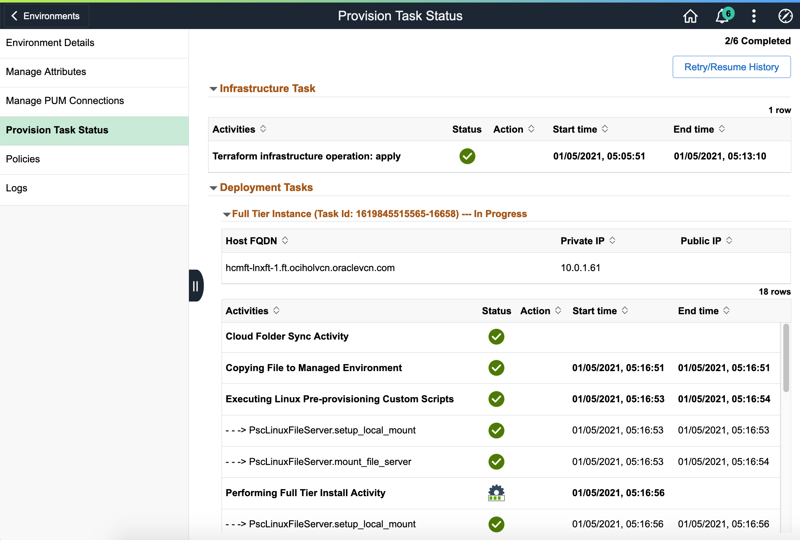

Provisioning takes about 90 minutes. You can monitor throughout this time.

3. Once your environment is in the **Running** status, go to **Details** again.
    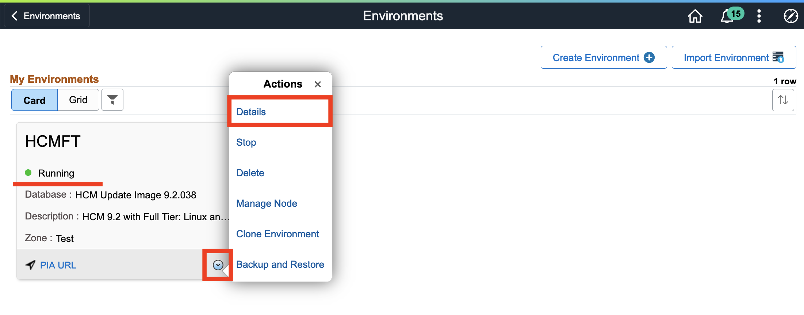

## Task 4: Signing in to PeopleSoft Environment

1. Set up a port forwarding session like we did in Lab 3 (Linux) & Lab 5 (Windows VM), making sure to select **hcm-fulltierlinux-1** in the dropdown of "Compute instance in Demo"
    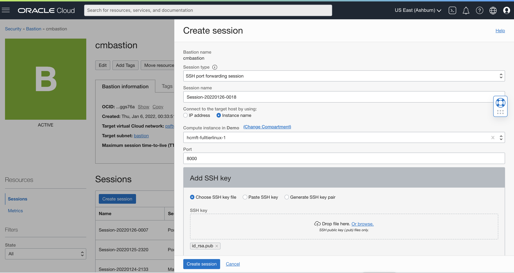

    Next, add to your hosts file like we did previously
    ```
    <copy>
    127.0.0.1  hcmft-fulltierlinux-1.ft.psftvcn.oraclevcn.com
    </copy>
    ```
    Run the SSH port forward command in  Terminal or Git Bash, selecting a new port. (This time, I used 5000)
    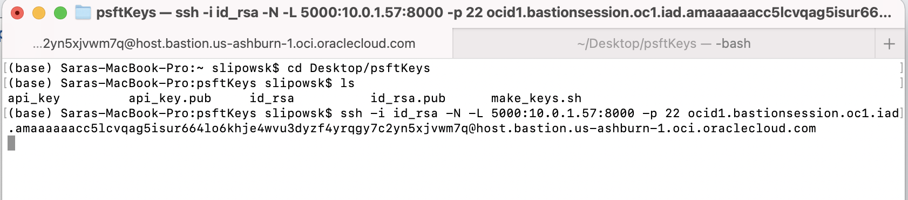
2. Enter the url in a browser
    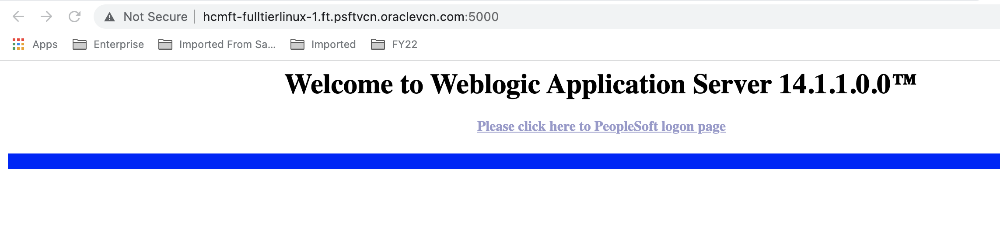

3. Sign in using the following credentials

  ```
  Username : PS    
  Password: Psft1234
  ```
  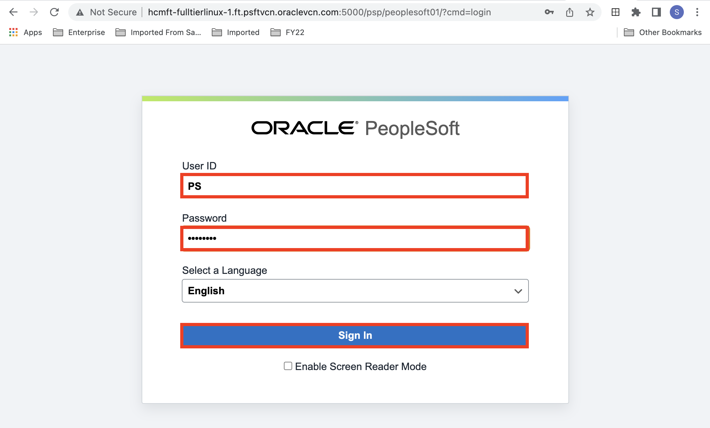
4. And voila- your HCM PeopleSoft Environment:
    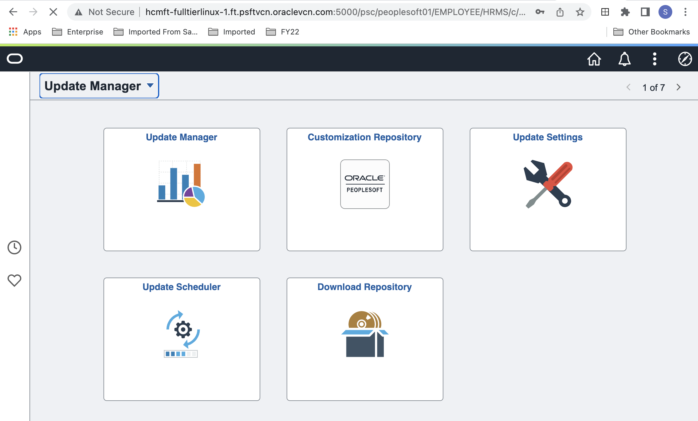


## Task 5: Cloud Manager Actions for PeopleSoft Environment

We will cover the latest Cloud Manager features in depth in the following labs. Here is an **Overview** of the actions you can perform.

  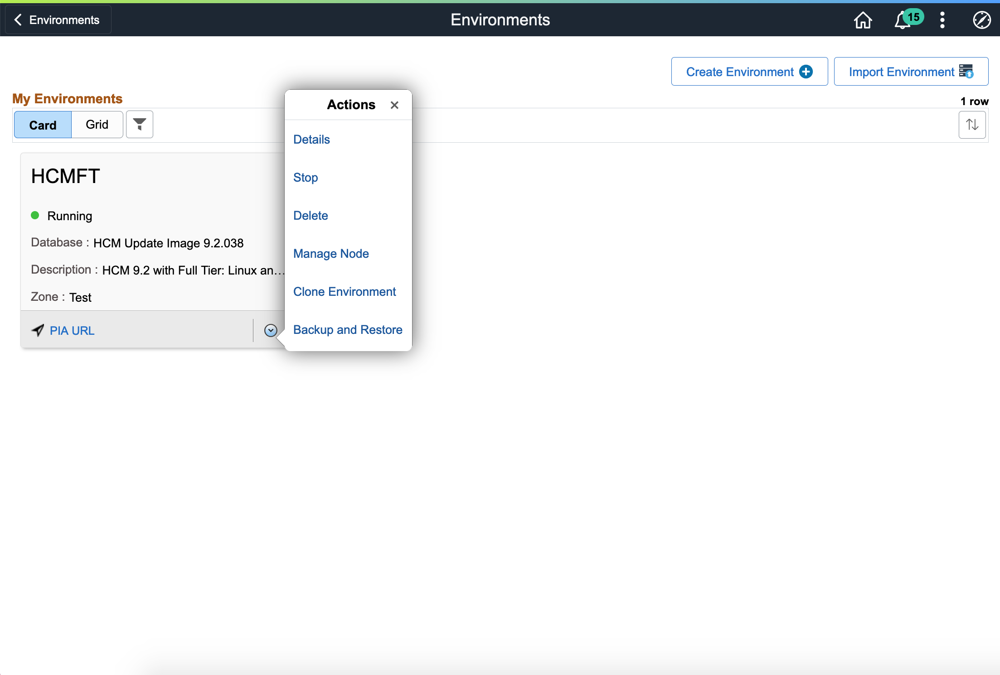
  The actions are:

  • **Details**: Select this option to view environment details and to perform additional actions on the environment such as performing a health check, applying a PeopleTools patch, viewing logs, and managing PUM connections.

  • **Start**: Select this option to start all the instances and then all the domains within them.

  • **Stop**: Select this option to stop all domains and shutdown all the instances. In case of database, only compute database instances are shutdown.

  • **Delete**: Select this option to remove the environment.

  • **Manage Node**: Select this option to scale environment up or down.

  • **Clone Environment** (Lab 12): Select this option to clone an existing environment.

  • **Backup and Restore** (Lab 13): Select this option to backup or restore an environment.

You may follow the rest of the labs for even more features:

  • **Patch Environment** (Lab 14): Patch an environment.

  • **Upgrade Environment** (Lab 15): Upgrade an environment.

  • **Create Policies** (Lab 16): Execute policies such as starting and stopping an environment.

  • **Selective Adoption** (Lab 17): Create a PUM connection between a source and target environment. 

  • **Refresh** (Lab 18): Select this option to refresh the database or the database, PS APP HOME and PS CUST HOME.  
  This option is only available for DBaaS environments.


You may now **proceed to the next lab.**

## Acknowledgments
* **Authors** - Deepak Kumar M, Principal Cloud Architect; Sara Lipowsky, Cloud Engineer
* **Contributors** - Edward Lawson, Master Principal Cloud Architect 
* **Last Updated By/Date** - Deepak Kumar M, Principal Cloud Architect, March 2023
