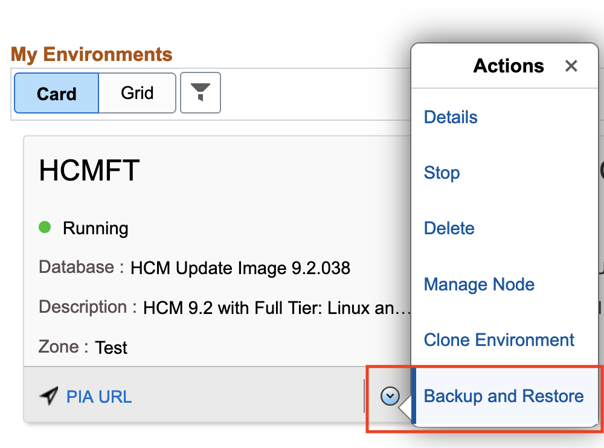
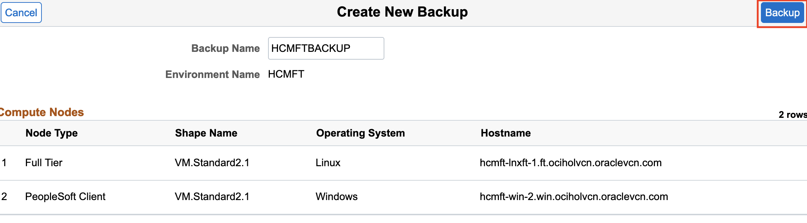
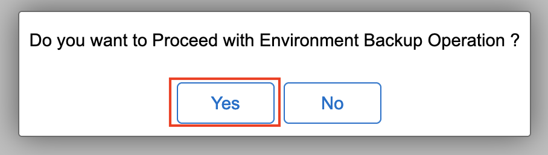
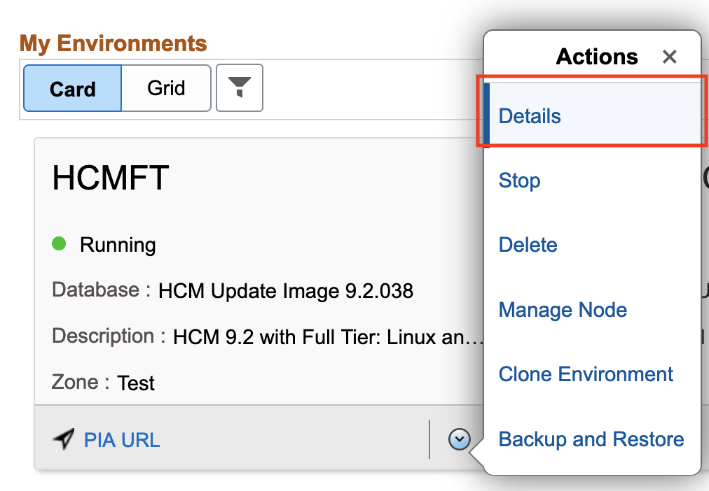
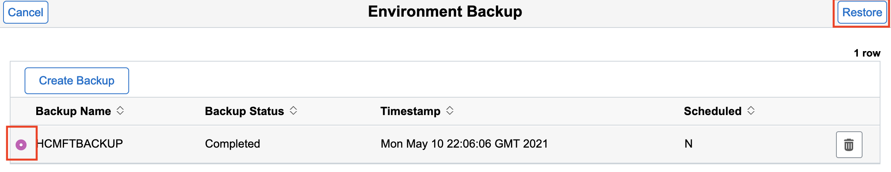

# Backing up and Restoring an Environment

## Introduction
The Backup and Restore action can be used to take a backup or restore an environment from the backup. The Backup action will backup all nodes in the environment. It is recommended to take a backup: before applying a PeopleTools Patch, before applying a PeopleTools upgrade, or before adding or removing a node. When you select to restore an environment from a backup: the Restore overwrites all the data on the target instance, the Target instance will be unavailable during the restore process, and only one instance at a time can be restored on a target instance.

Estimated Lab Time: 5 minutes + 30 minutes for backing up

### Objectives
In this lab you will:
* Take a backup of a running environment
* Restore an environment to a backup

### Prerequisites
- Access to the Cloud Manager console
- A PeopleSoft Environment up and running on Cloud Manager

## Task 1: Backing up an Environment

1.  Navigate to **Dashboard** > **Environments**. On the environment that we just created (**HCMFT**) click the down arrow and then click **Backup and Restore**. 
    

    Provide a unique backup name such as **HCMFTBACKUP**. Leave everything else as default and then click **Backup**.
    

    Click **Yes** when it asks if you want to proceed with backup operation.
    

2.  This backup will take a few minutes to complete. To check the status of the backup click the down arrow on your environment (**HCMFT**) and then click **Details**.
    

    On the side menu select **Provision Task Status**. You will then be able to see the start time and status of your backup. If under **Status** you see a gear icon (like the picture below), this means that the backup is still in progress.
    
    
    You can also select **Logs** on the side menu and follow along from there as well.
    

    Once **Status** changes to a green check mark (like the picture below) you can continue on with this lab. 
       

## Task 2: Restoring an Environment

1.  Navigate to **Dashboard** > **Environments**. On the environment that we just created (**HCMFT**) click the down arrow and then click **Backup and Restore**. 
    

    Here we will see the backup that we just took. Make sure the backup status is **Completed**. Click the checkbox next to **HCMFTBACKUP** and then click **Restore**
    

    Click **Yes** when it asks if you want to proceed.
    

    You have successfully restored an environment from a backup!

You may now **proceed to the next lab.**

## Acknowledgements
* **Authors** - Deepak Kumar M, Principal Cloud Architect; Sara Lipowsky, Cloud Engineer
* **Contributors** - Edward Lawson, Master Principal Cloud Architect 
* **Last Updated By/Date** - Deepak Kumar M, Principal Cloud Architect, March 2023