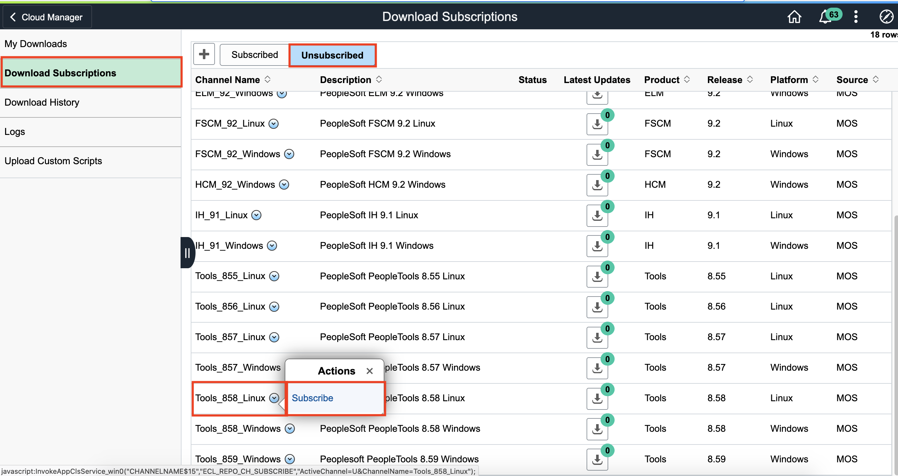
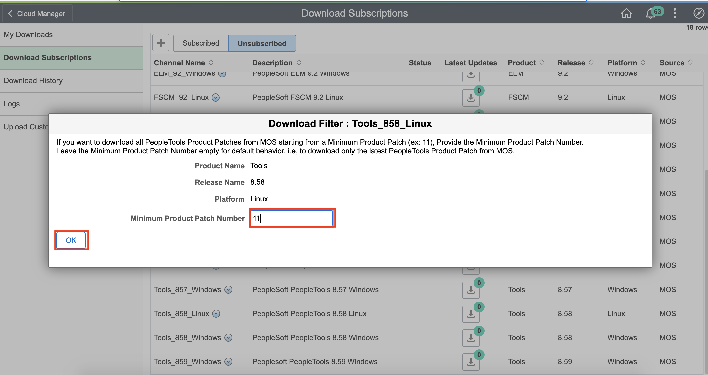
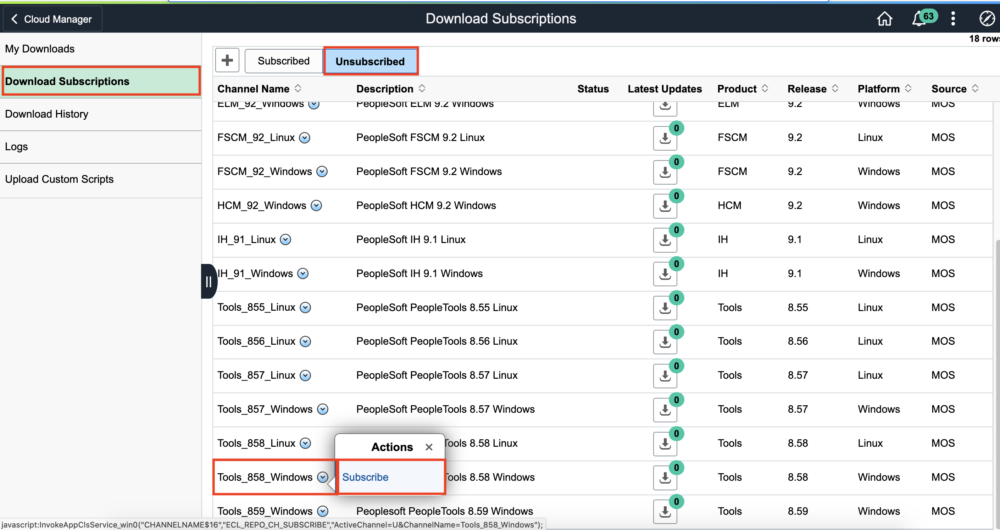
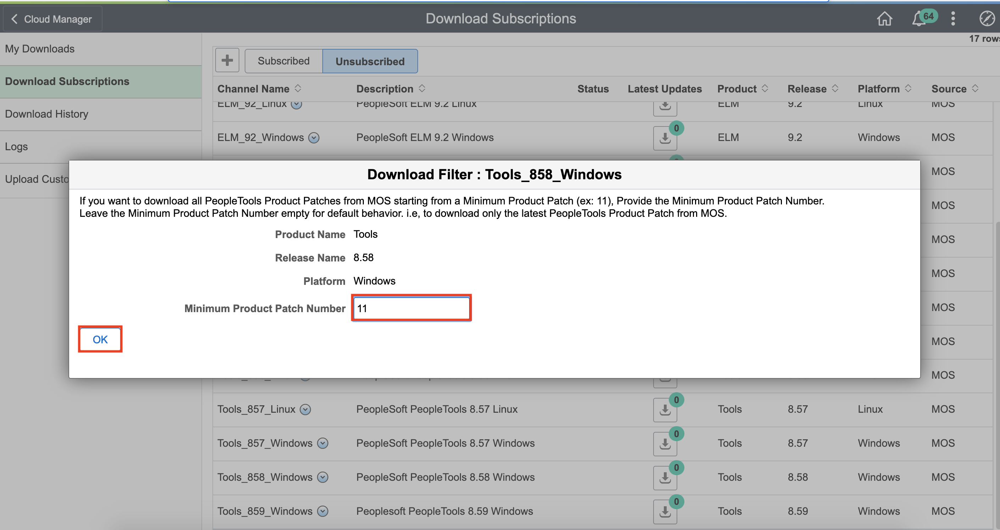
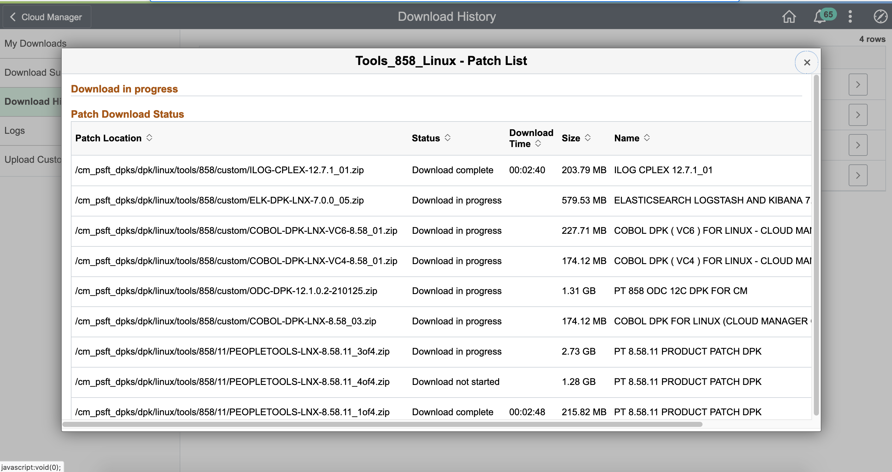
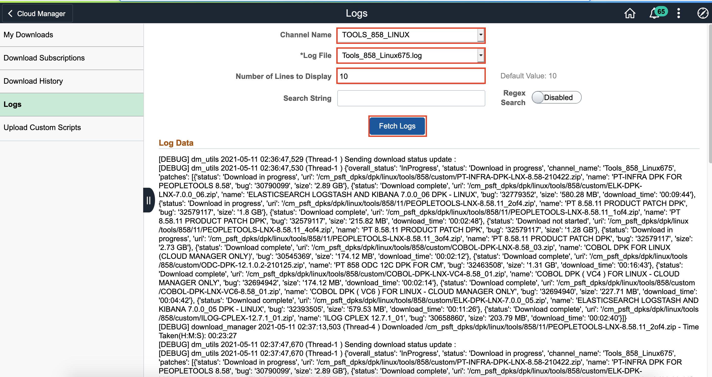
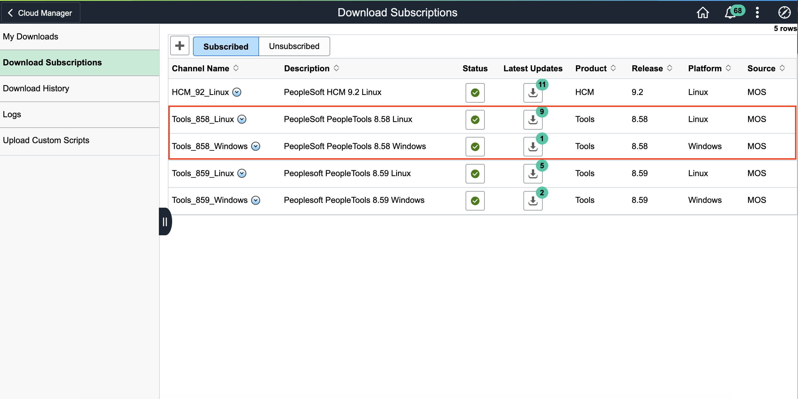
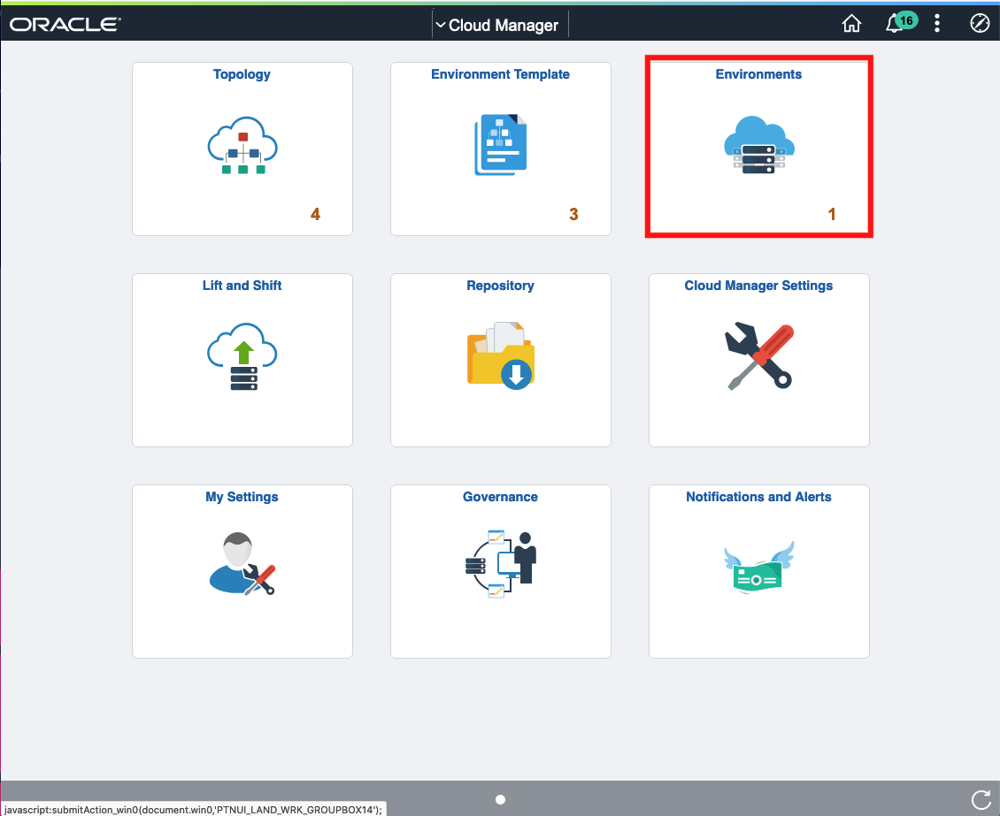
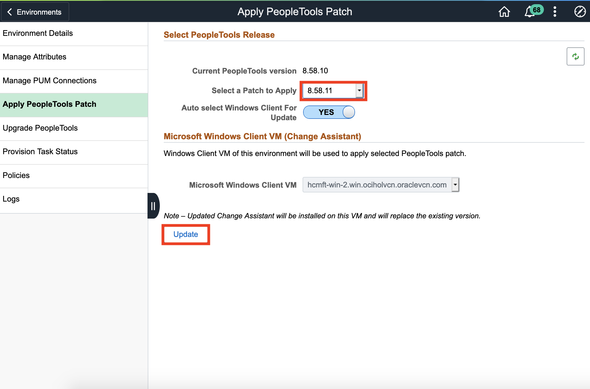
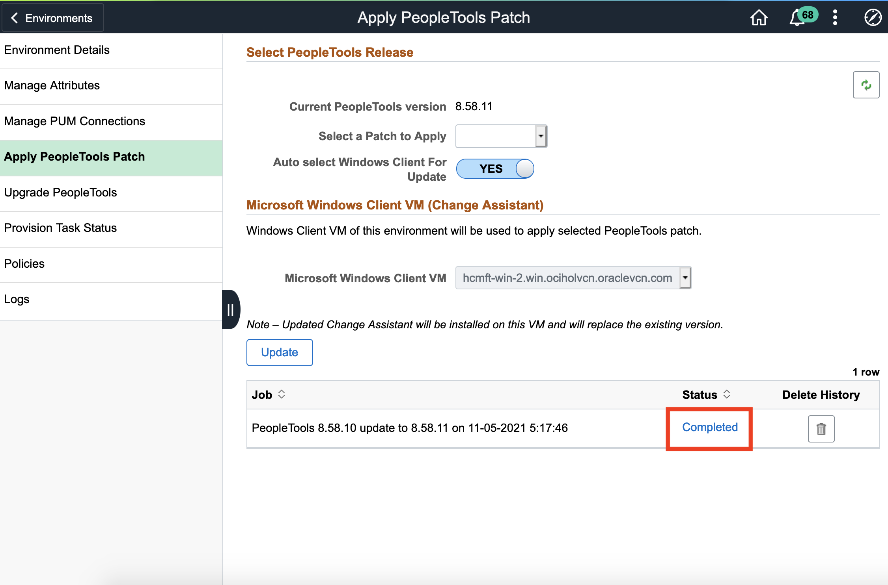

# Patching an Environment

## Introduction
This lab walks you through the steps to patch an environment.

Estimated Lab Time: 10 minutes + 1-2 hours for downloading + 1 hour for patching

### Objectives
In this lab you will:
* Patch an existing environment

### Prerequisites
- Access to the Cloud Manager console.
- Environment up and running

## Task 1: Subscribe to Tools Channels

1.  Navigate to **Cloud Manager Dashboard** > **Repository**. 
    

2.  On **Downloaded Subscriptions**, switch to **Unsubscribed**. Scroll down to find **Tools\_858\_Linux**, click the **V** arrow and then **Subscribe**
    

3. Enter **11** for the minimum patch number, and click **OK**
    

4. Repeat the same steps for **Tools\_858\_Windows**
    
    

## Task 2: Monitor Subscription Progress

1. To monitor progress, you can go to **Download History**, select **Tools\_858\_Linux** and **Tools\_858\_Windows** to see which packages are in progress and which have been completed.

    
2. You can also look at the **Logs**. Select the **Channel Name**, **Log File**, add **Number of Lines to Display**, and click **Fetch Logs**.
    

3. Once you see this, you may apply the patches to your environment:
    

## Task 3: Apply Patch to Environment

1. Navigate to **Cloud Manger Dashboard** > **Environments**
    
2. Find the environment you would like to patch, click **V** and **Details**
    
3. Navigate to **Apply PeopleTools Patch**. In the drop down, select the **8.58.11**, and then click **Update**
    
    - Click **Yes**
    
4. You can track the status below 
    

    - When it's done, it will say **Completed**
    
   
You may now **proceed to the next lab.**

## Acknowledgments

**Created By/Date**   
* **Authors** - Sara Lipowsky, Cloud Engineer
* **Last Updated By/Date** - Sara Lipowsky, Cloud Engineer, May 2021

## Need Help?
Please submit feedback or ask for help using our [LiveLabs Support Forum](https://community.oracle.com/tech/developers/categories/Migrate%20SaaS%20to%20OCI). Please click the **Log In** button and login using your Oracle Account. Click the **Ask A Question** button to the left to start a *New Discussion* or *Ask a Question*.  Please include your workshop name and lab name.  You can also include screenshots and attach files.  Engage directly with the author of the workshop.

If you do not have an Oracle Account, click [here](https://profile.oracle.com/myprofile/account/create-account.jspx) to create one.