# Upgrading an Environment

## Introduction
This lab walks you through the steps to upgrade an environment.

Estimated Lab Time: 10 minutes + 1-2 hours for downloading + 1 hour for upgrading

### Objectives
In this lab you will:
* Upgrade an existing environment

### Prerequisites
- Access to the Cloud Manager console.
- Environment up and running

## Task 1: Subscribe to Tools Channels

1.  Navigate to **Cloud Manager Dashboard** > **Repository**. 
    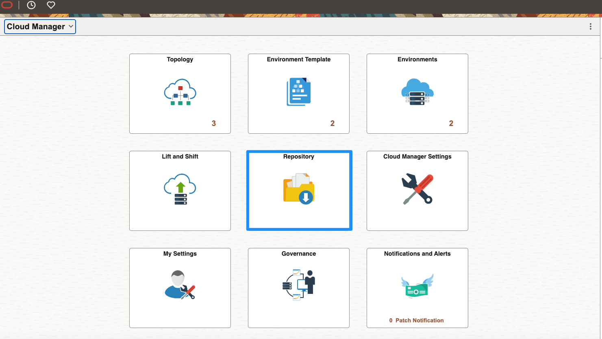

2.  On **Downloaded Subscriptions**, switch to **Unsubscribed**. Scroll down to find **Tools\_860\_Linux**, click the **V** arrow and then **Subscribe**
    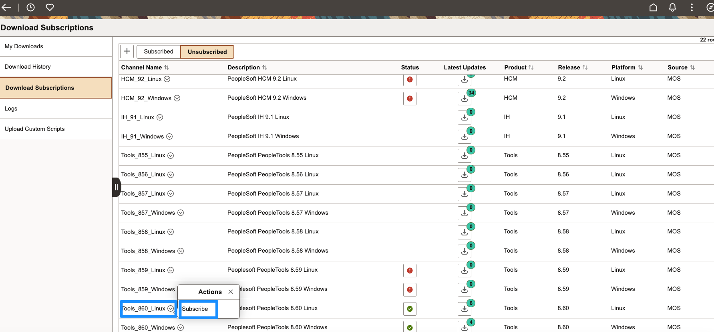

3. Enter **01** for the minimum patch number, and click **OK**
    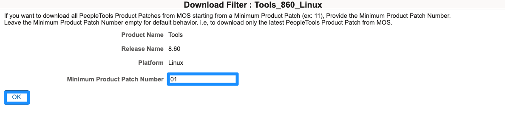

4. Repeat the same steps for **Tools\_860\_Windows**
    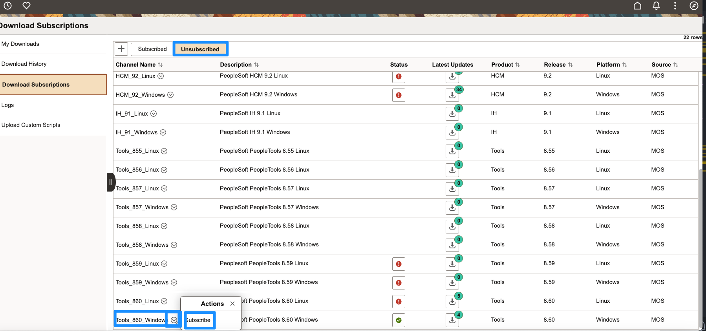
    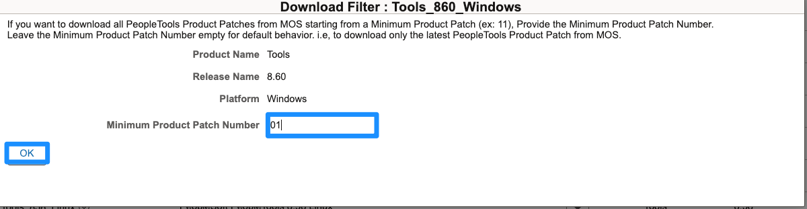

## Task 2: Monitor Subscription Progress

1. To monitor progress, you can go to **Download History**, select **Tools\_860\_Linux** and **Tools\_860\_Windows** to see which packages are in progress and which have been completed.

    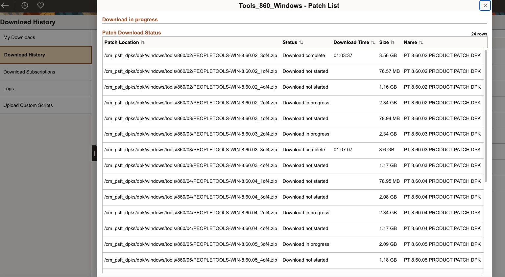
2. You can then look at each patch progress status under **Logs**. Select the **Channel Name**, **Log File**, add **Number of Lines to Display**, and click **Fetch Logs**.
    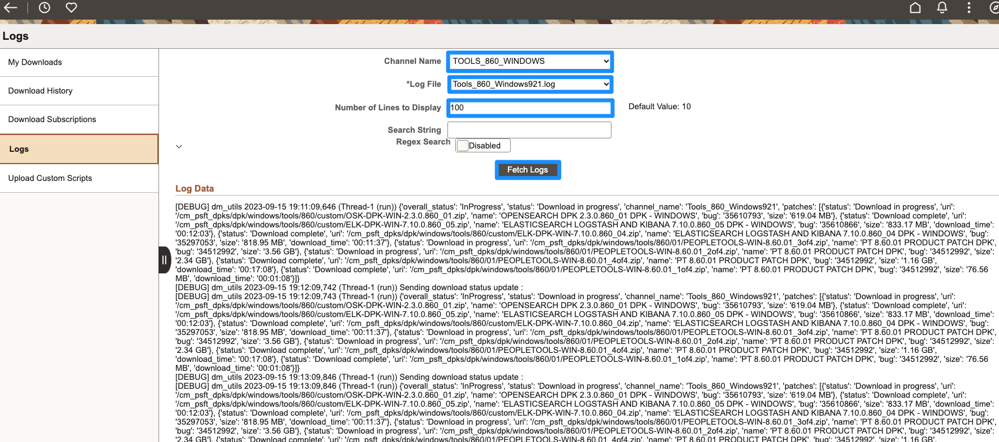

3. Once you see this, you may apply the patches to your environment:
    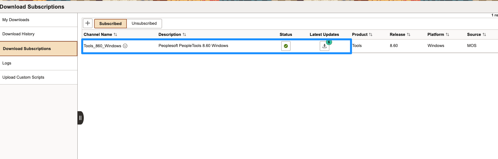

## Task 3: Apply Upgrade to Environment

1. Navigate to **Cloud Manger Dashboard** > **Environments**
    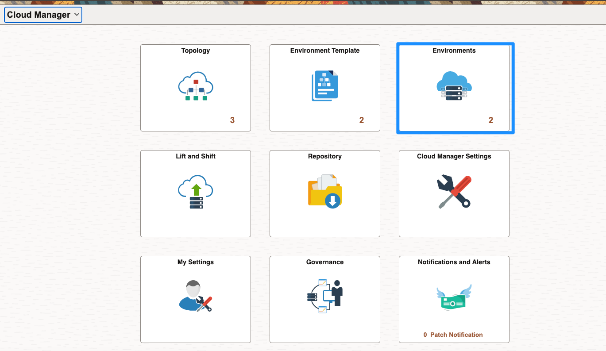

2. Find the environment you would like to patch, click **V** and **Details**
    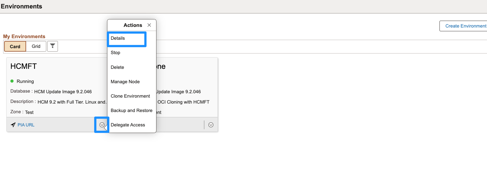
3. Navigate to **Upgrade PeopleTools**. In the drop down, there is nothing to select because we are already at the latest version.
    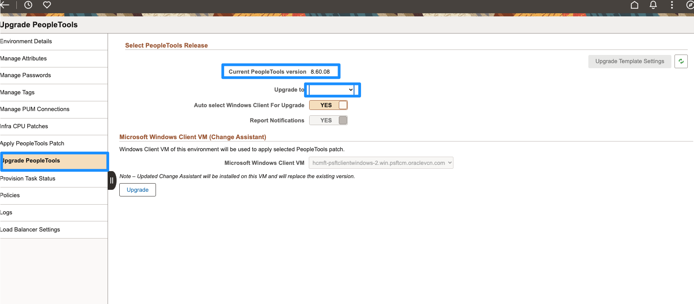
   
   

You may now **proceed to the next lab.**

## Acknowledgements
* **Authors** - Deepak Kumar M, Principal Cloud Architect; Sara Lipowsky, Cloud Engineer
* **Contributors** - Edward Lawson, Master Principal Cloud Architect
* **Last Updated By/Date** - Ziyad Choudhury, Principal Cloud Architect, August 2023
