# Refreshing an Environment

## Introduction
You can refresh DB Systems environments managed by Cloud Manager from a backup in Object Store or from another DB system managed by Cloud Manager. This lab will take you through the steps to refresh from another DB system. If you are wanting to refresh using a backup from object store or are wanting to refresh an ATP-D environment please visit [https://docs.oracle.com/cd/F40091_01/psft/pdf/pcd858cmif-b032021.pdf](https://docs.oracle.com/cd/F40091_01/psft/pdf/pcd858cmif-b032021.pdf) and navigate to page 144.

Estimated Lab Time: 30 minutes + 90 minutes for provisioning + 90 minutes for cloning/backing up/refreshing

### Objectives
In this lab you will:
* Create an environment using DBaaS
* Create a clone and backup of an environment
* Refresh an environment

### Prerequisites
- Access to the Cloud Manager console.

## Task 1: Creating a New Topology With DBaaS

In order to refresh an environment you will need a topology with DBaaS. If you already have a topology with DBaaS you can skip this step.

1.  Navigate to **Dashboard** > **Topology**. Click **Add New Topology**.
    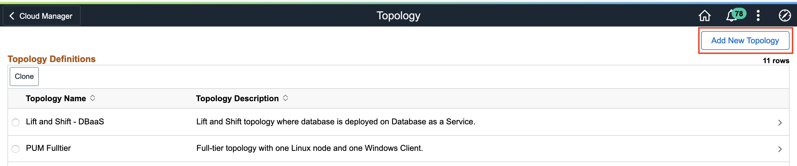

2.  Give the topology a name such as **RefreshDBaaS** and enter a description. Now we will add 3 new nodes. Click **Add Node**.
    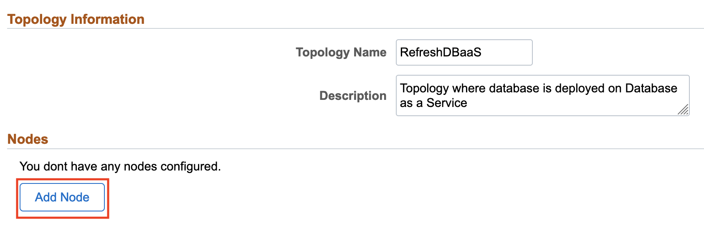

    First we will add the Middle Tier node. Select the following:
    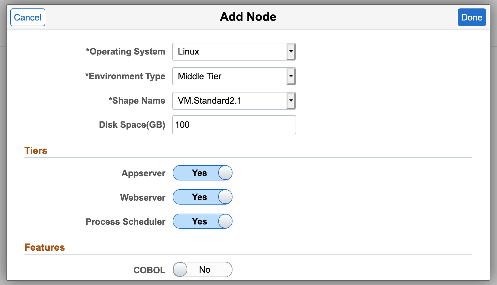
    
    Click **Done**.
    
    Click **Add Node** again and then select the following for the DB Systems node: 
    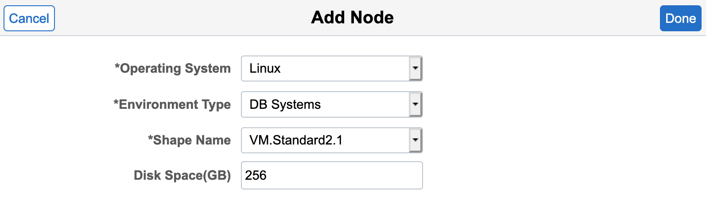
    
    Click **Done**.
    
    Click **Add Node** one last time then select the following for the PeopleSoft Client node: 
    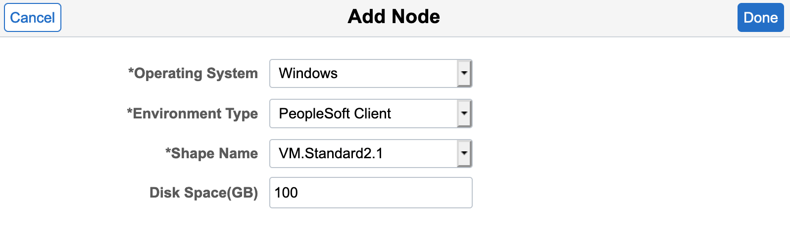
    
    Click **Done**.

    Your topology should look like the following:
    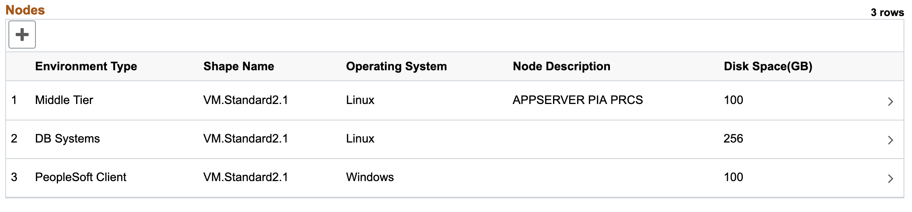
    
    Click **Save**.

## Task 2: Creating a New Environment Template

In order to refresh an environment you will need an environment template that is using a topology with DBaaS. If you already have this you can skip this step.

1.  Navigate to **Dashboard** > **Environment Template**. 
    Click **Add New Template**.
    

2.  On the General Details page:
    * Give the template a name such as **RefreshDBaaS** and enter a description
    * Click on the search icon next to PeopleSoft Image and select **PEOPLESOFT HCM UPDATE IMAGE 9.2.038 - NATIVE OS** 
    * Click **Next**
    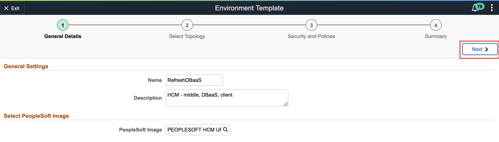

3.  On the Select Topology page:
    * Click on the search icon under Topology Name and select **RefreshDBaaS**
    * Expand the **Custom Attributes** section and select **RefreshDBaaS** again in  the drop down
    * Click on **Edit Custom Attributes**
    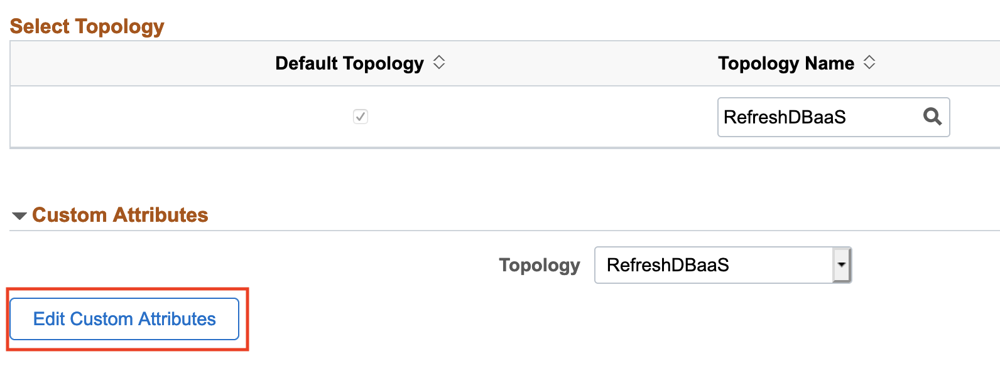   
    * Expand the **Region and Availability Domains** section and select the following: 
    
    * Expand **Middle Tier** > **Network Settings** and select the following:
        * Subnet For Primary Instance: **mt**
    * Expand **DB Systems** > **General Settings** and make the following changes:
        * Database Operator Id: **PS**
        * Database Name: **HCMDBAAS**
    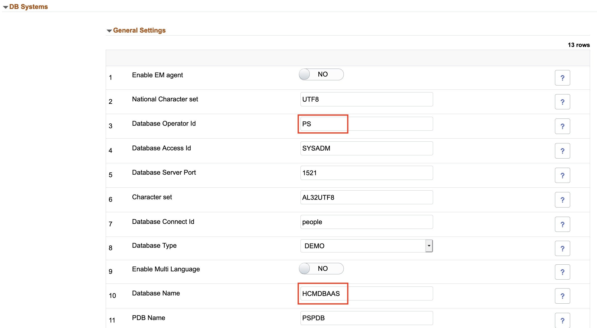
    * Expand **DB Systems** > **Network Settings** and select the following:
        * Subnet For Primary Instance: **db**
    * Expand **DB Systems** > **DB System Options** and select the following:
    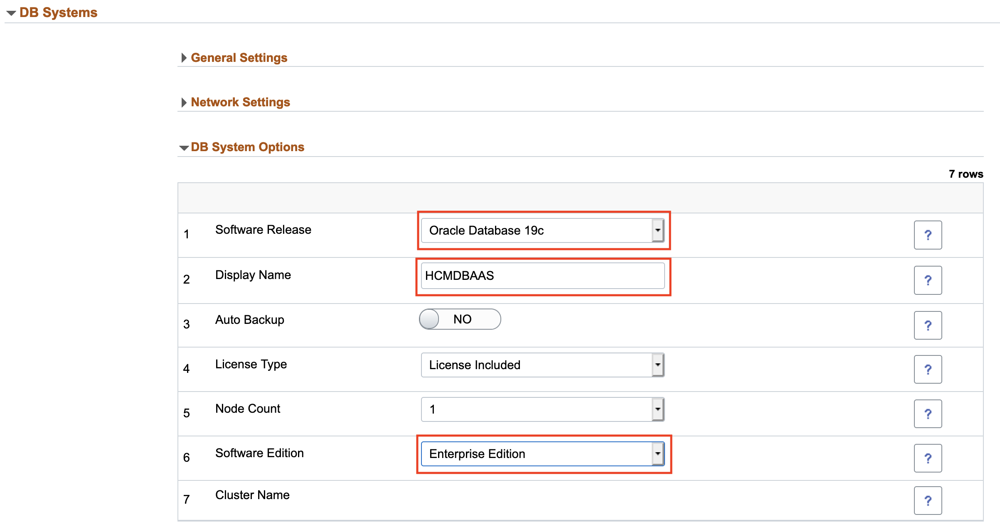
    * Expand **PeopleSoft Client** > **Network Settings** and select the following:
        * Subnet For Primary Instance: **win**
    * Click **Next**.

4.  On the Define Security page:
    * Click on the search icon under Zone Name and select **Test**
    * Click on the search icon under Role Name and select **PACL_CAD**
    * Click **Next**
    

5.  On the Summary page:
    * Review the details and click **Submit**
    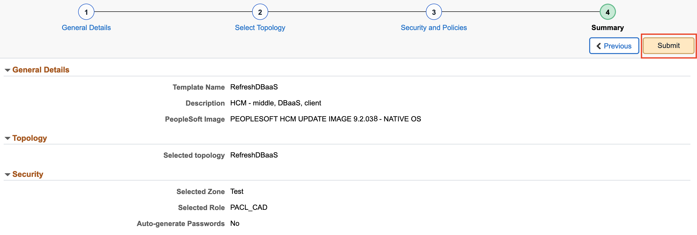

## Task 3: Creating a New Environment

In order to refresh an environment you will need an environment created from a template with DBaaS. If you already have this you can skip this step.

1.  Navigate to **Dashboard** > **Environments**. Click **Create Environment**.
    

2.  Provide a unique environment name such as **RefreshDB** and enter a description. For Template Name select the template we created in the previous step: **RefreshDBaaS**. 
    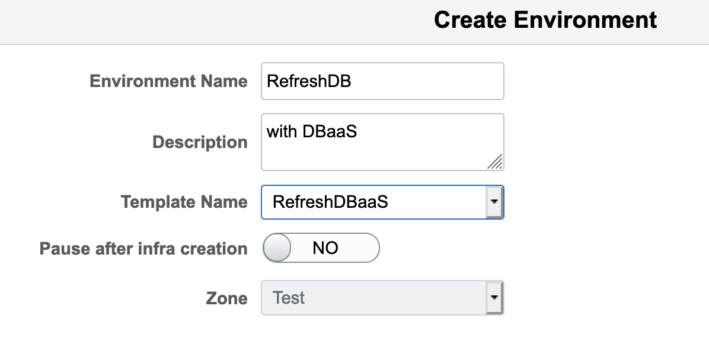

3.  Expand **Environment Attributes** > **Middle Tier**. Assign the following values to each field:
    * Weblogic Administrator Password: **Psft1234**
    * Gateway Administrator Password: **Psft1234**
    * Web Profile Password for user PTWEBSERVER: **Psft1234**
    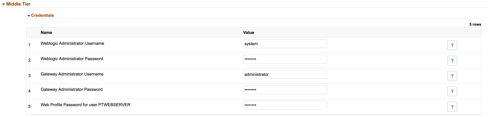

    Expand **Environment Attributes** > **DB Systems**. Assign the following values to each field:
    * Database Administrator Password: **Psft1234##**
    * Database Connect Password: **Psft1234**
    * Database Access Password: **Psft1234**
    * Database Operator Password: **Psft1234**
    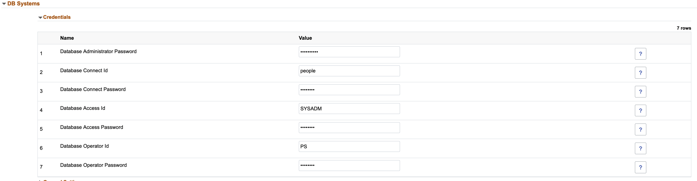

    Expand **Environment Attributes** > **PeopleSoft Client**. Assign the following value to the field:
    * Windows Administrator Password: **Psft12345678#**
    
    
    Scroll up and click **Done** in the top right.

4.  Click **Accept** on the license.
    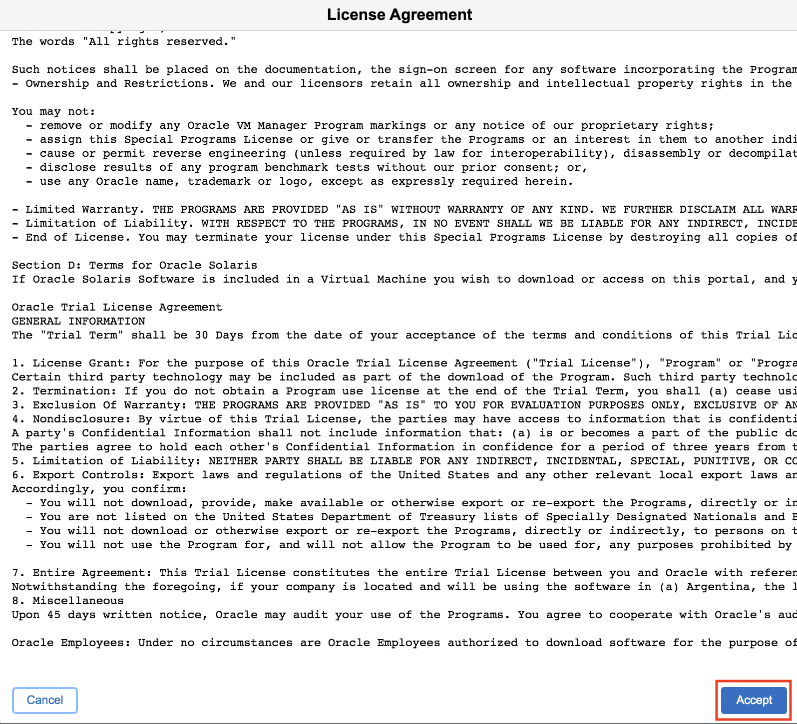

5.  This environment will take a few minutes to provision. Refresh the page. On our newly created **RefreshDB** environment you should see an orange dot with a status of **Infra Creation in Progress**. Click the down arrow button and then **Details**.
    
    
    On the side menu select **Logs** and you can monitor the status of your environment from here.
    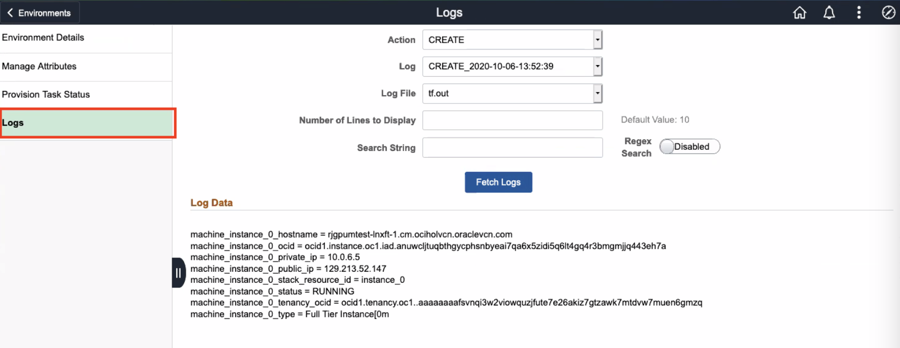
    
    You can also go to **Provision Task Status** on the side menu to see detailed progress status for every step.
    
    
    Once the environment has a green dot with a status of **Running** we are ready to move on to the next step.
    

## Task 4: Refreshing an Environment

1.  First we will create a target environment for our refresh. 
    Navigate to **Dashboard** > **Environment**.
    Click the down arrow on your source environment (**RefreshDB**) and then click **Clone Environment**.
    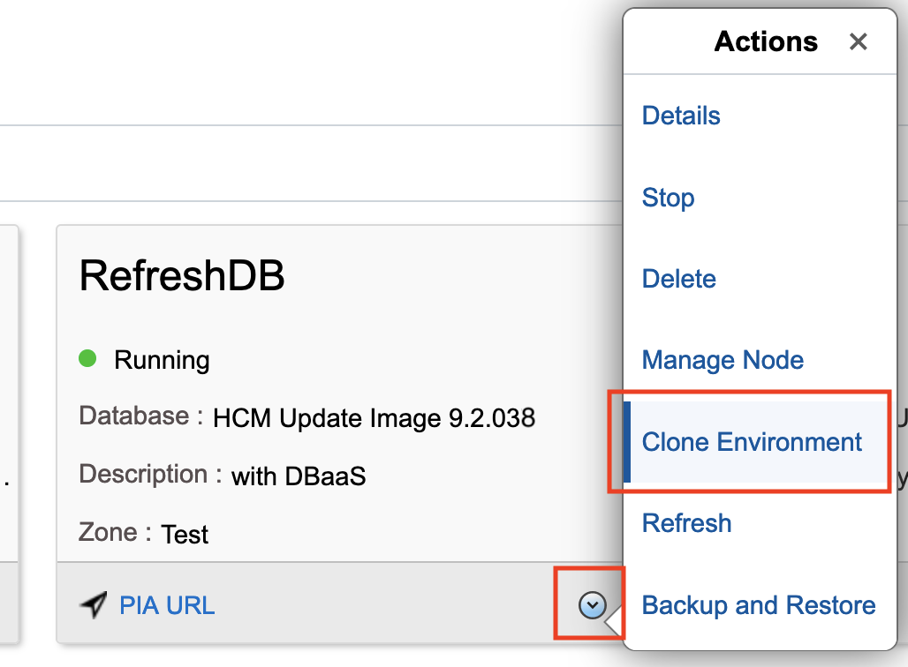

    Provide a unique environment name such as **TestRefresh**. Leave everything else as default and then click **Clone**.
      

2.  Once the source and target environments are both running, we can then create
    a backup from the source environment. We will use this backup to refresh the target environment.
    On your source environment (**RefreshDB**), click the down arrow and then click **Backup and Restore**. 
    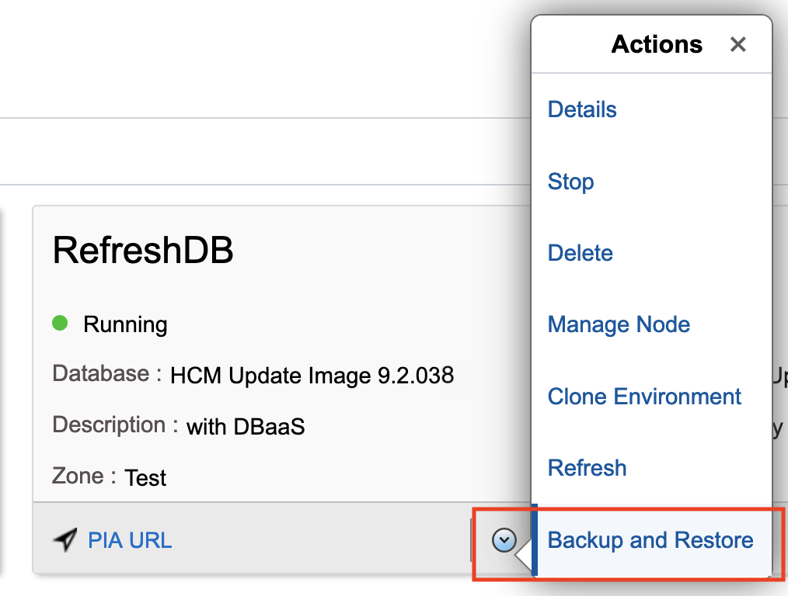

    Provide a unique backup name such as **TestBackup**. Leave everything else as default and then click **Backup**.
    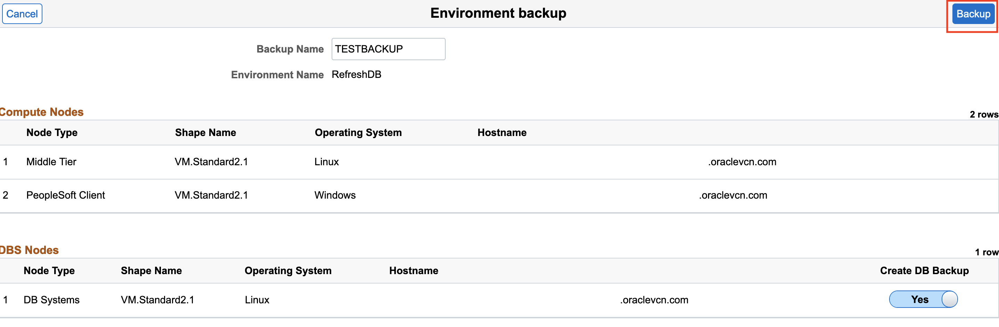

3.  This backup will take a few minutes to complete. To check the status of the backup click the down arrow on your source environment (**RefreshDB**) and then click **Details**.
    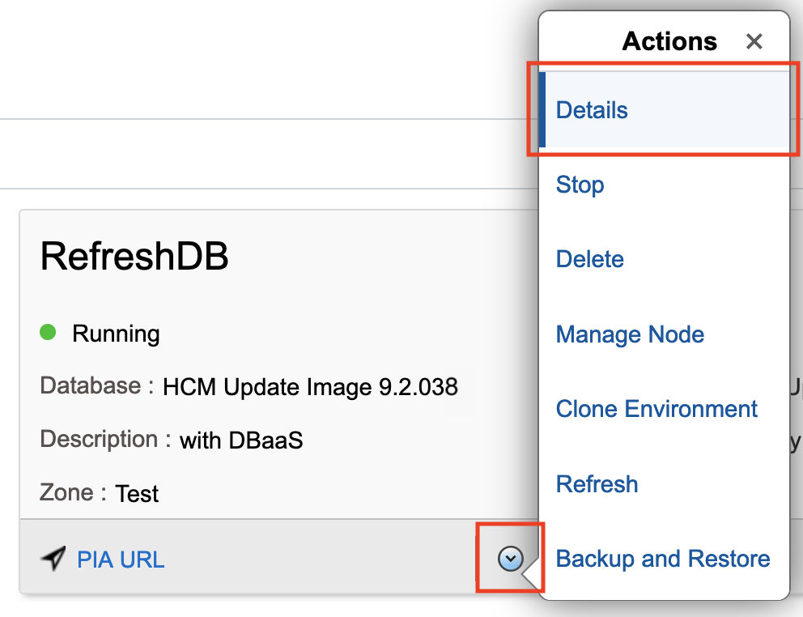

    On the side menu select **Provision Task Status**. You will then be able to see the start time and status of your backup. If under **Status** you see a gear icon (like the picture below), this means that the backup is still in progress.
    
    
    You can also select **Logs** on the side menu and follow along from there as well.
    

    Once **Status** changes to a green check mark (like the picture below) you can continue on with this lab. 
       

4.  Now that the backup has finished we are ready to refresh the target environment. 
    On your target environment (**TestRefresh**), click the down arrow and then click **Refresh**.
    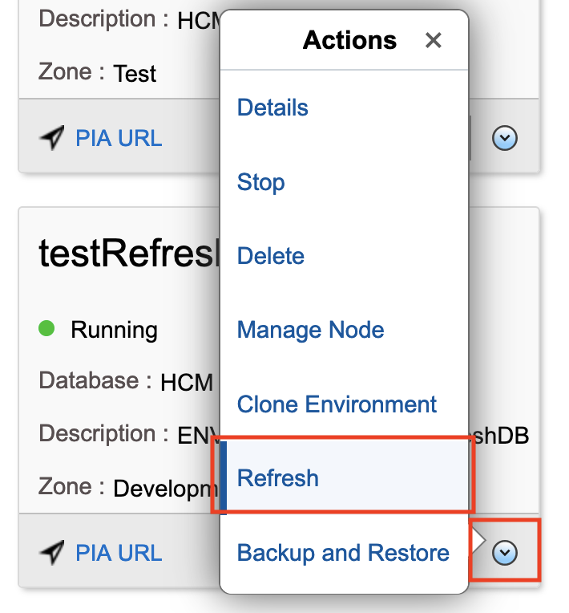

    Enter the following details:
    * Source Type: **OCI Backup**
    * Environment Name: Your source environment (**RefreshDB**)
    * Backup ID: **TestBackup**
    * Use Latest Backup: **YES**
    * App Refresh: **NO**
    * Source TDE KeyStore (Wallet) Password: DB Admin password (**Psft1234##**)
    

    Click **Done**.

    You have now successfully refreshed an environment from a backup!

## Acknowledgments

**Created By/Date**   
* **Authors** - Hayley Allmand, Cloud Engineer; Joowon Cho, Cloud Technologist
* **Last Updated By/Date** - Hayley Allmand, Cloud Engineer, May 2021

## Need Help?
Please submit feedback or ask for help using our [LiveLabs Support Forum](https://community.oracle.com/tech/developers/categories/Migrate%20SaaS%20to%20OCI). Please click the **Log In** button and login using your Oracle Account. Click the **Ask A Question** button to the left to start a *New Discussion* or *Ask a Question*.  Please include your workshop name and lab name.  You can also include screenshots and attach files.  Engage directly with the author of the workshop.

If you do not have an Oracle Account, click [here](https://profile.oracle.com/myprofile/account/create-account.jspx) to create one.