# Creating Identity and Access Management (IAM) Resources

## Introduction
This lab walks you through the steps to prepare your Oracle Cloud Infrastructure Tenancy

Estimated Lab Time: 30 minutes

### About Identity and Access Management (IAM)
The Oracle Cloud Infrastructure (OCI) Identity and Access Management (IAM) Service allows you to control who has access to your cloud resources. You control the types of access a group of users has and to which specific resources. 

### Objectives

The purpose of this lab is to give you an overview of the IAM Service components and an example scenario to help you understand how they work together.

In this lab, you will:
* Sign-in to your OCI Tenancy to access the Console
* Manage access by creating 
    - Demo Compartment
    - OCI Group
    - Policies
    - New Local User


### Prerequisites

* Oracle Cloud Infrastructure administrator account credentials (User, Password, and Tenancy)

* To sign in to the Console, you need the following: 

    - Tenant, Username and Password
    - URL for the Console: [https://cloud.oracle.com] (https://cloud.oracle.com)
    - Oracle Cloud Infrastructure supports the latest versions of Google Chrome, Firefox, and Internet Explorer 11

## Task 0: Signing in to the Console
Please follow the **Getting Started** lab above to sign into the Oracle Cloud Infrastrcuture (OCI) Console.

## Task 1: Creating a Demo Compartment

**Compartments Overview:**
A compartment is a collection of cloud assets, like compute instances, load balancers, databases, etc. By default, a root compartment was created for you when you created your tenancy (ie, when you registered for the trial account). It is possible to create everything in the root compartment, but Oracle recommends that you create sub-compartments to help manage your resources more efficiently. If we were to begin creating a project on our desktops, we would first create a folder to house our project. This is essentially what we are doing on OCI.
More on compartments [here](https://docs.oracle.com/en-us/iaas/Content/Identity/Tasks/managingcompartments.htm)

1.	Sign into the OCI console and click on the three-line menu, which is located on the top left. Scroll down till the bottom of the menu, click on **Identity & Security** -> **Compartments**. 
    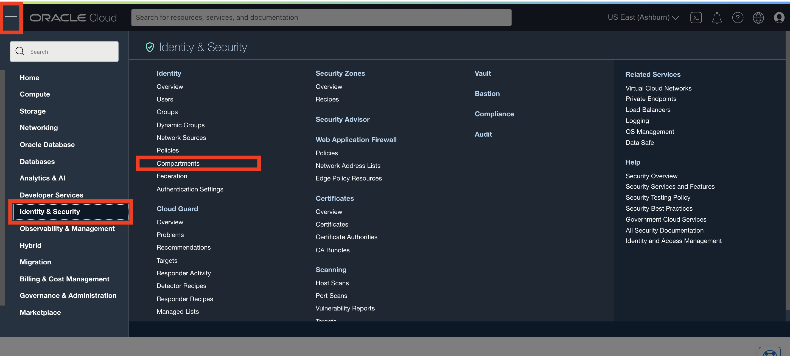
2.  Click on the blue **Create Compartment** button to create a new one.

    

3.	Give the Compartment a Name and Description 
    Copy the fields below
    Name:
    ```
    <copy>Demo</copy>
    ``` 
    Description:
    ```
    <copy>This is our main compartment for test drive</copy>
    ``` 

    Be sure your root compartment is shown as the parent compartment. Press the blue **Create Compartment button** when ready.

    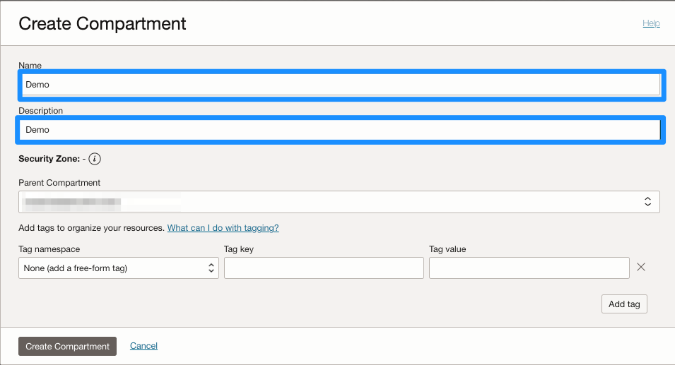

    You have just created a compartment for all of your work in this Test Drive.
    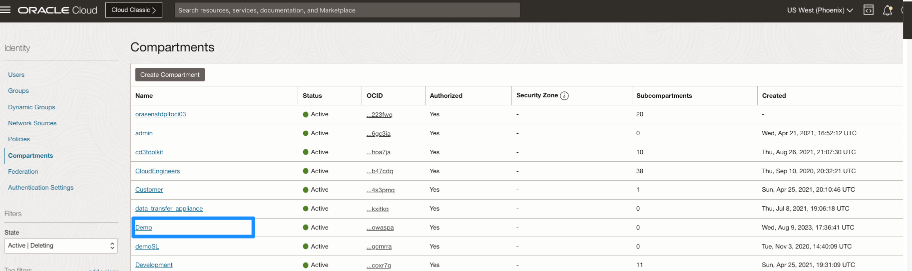

## Task 2: Creating a Group
**Group Overview:** 
A user's permissions to access services come from the group(s) to which they belong. More on groups [here](https://docs.oracle.com/en-us/iaas/Content/Identity/Tasks/managinggroups.htm)

1.	After creating the compartment, you should see the **Identity** column on the left. Under it, navigate to **Groups**. 
(Alternatively, you can go to the three-line menu on the top -> **Identity & Security** -> **Groups**.)

    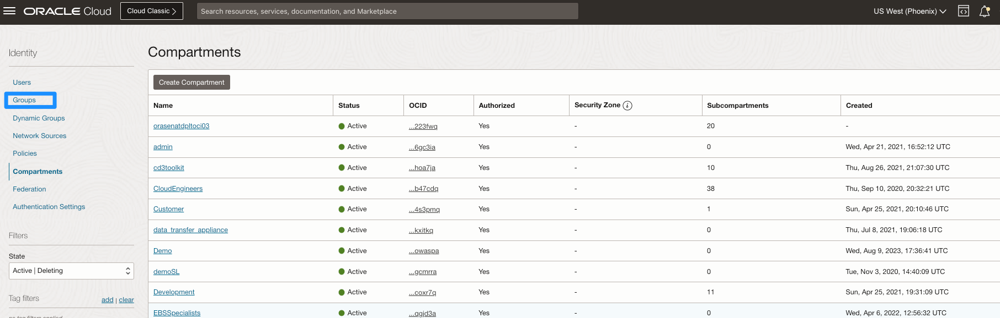

2.	As you see here, we only have an Administrators group. OCI's best practices advise us to not rely on the Admins to create resources. 
Click **Create Group**.
    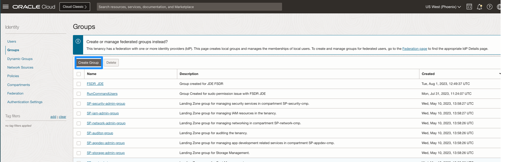

3.	Give the Group a name and description
    Copy the fields below
    
    Name:
    ```
    <copy>oci-group</copy>
    ``` 
    Description:
    ```
    <copy>New group for OCI users</copy>
    ``` 

    Click **Create**

    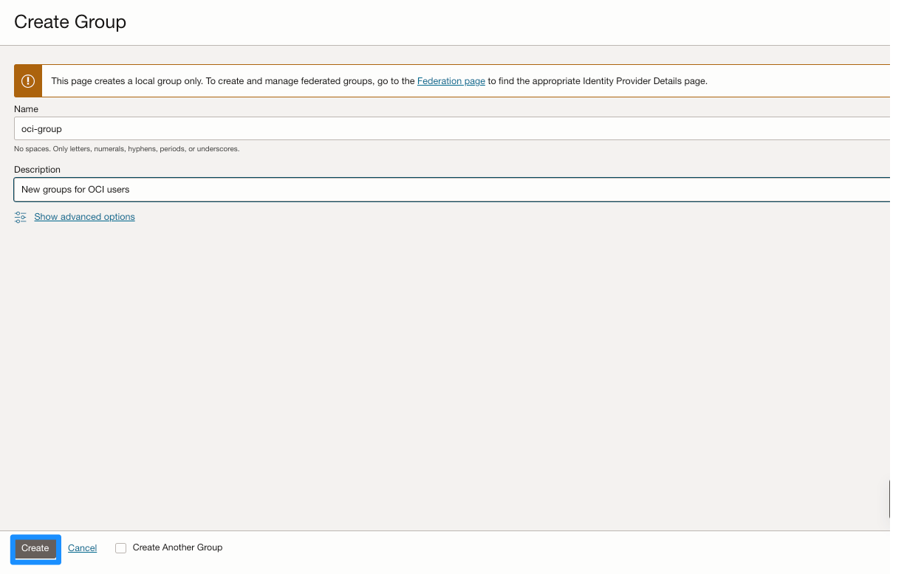

4.	Your new group is displayed.

    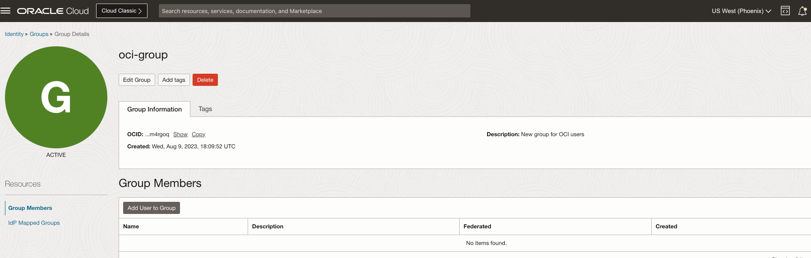
   
## Task 3: Creating a Policy
**Policies Overview**:
Policies define the permissions for a group Policies explain what actions members of a group can perform, and in which compartments. Users can access services and perform operations based on the policies set for the groups.
More on policies [here](https://docs.oracle.com/en-us/iaas/Content/Identity/Concepts/policies.htm)

Now, let’s create a security policy that gives users in your group (oci-group), permissions to provision PeoplSoft Cloud Manager, in your assigned Compartment (Demo). 

1. Navigate to **Policies** under **Identity**. 
(Alternatively, you can go to the three-line menu on the top -> **Identity & Security** -> **Policies**.)
    
    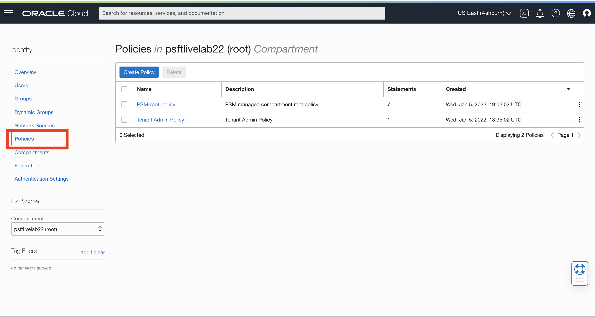    

2. On the left side, navigate to **COMPARTMENT** and select **ROOT compartment**. 

    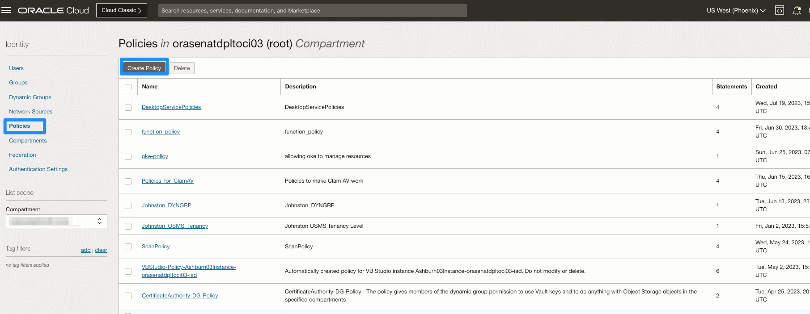

3. After you have selected the **ROOT** compartment, click **Create Policy**.

    Copy the fields below. Give the group a
        
    a) Name:
    ```
    <copy>Policy-for-oci-group</copy>
    ``` 
    b) Description:
    ```
    <copy>Policy for OCI Group</copy>
    ``` 
    c) Verify it's in the **root** compartment

    d) Toggle the radio button to **"Show manual editor"**

    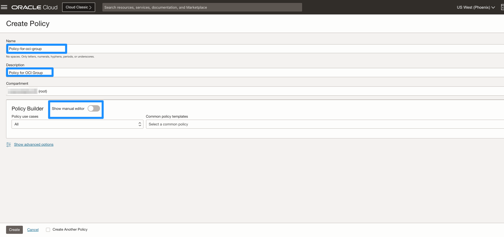

4. Add Policy Statements **Show manual editor**
    
    a) Enter the following Statements to the empty field:
    
    ```
    <copy>Allow group oci-group to manage all-resources in compartment Demo
    Allow group oci-group to read all-resources in tenancy
    Allow group oci-group to manage App-catalog-listing in tenancy
    Allow group oci-group to use tag-namespaces in tenancy</copy>
    ```  

    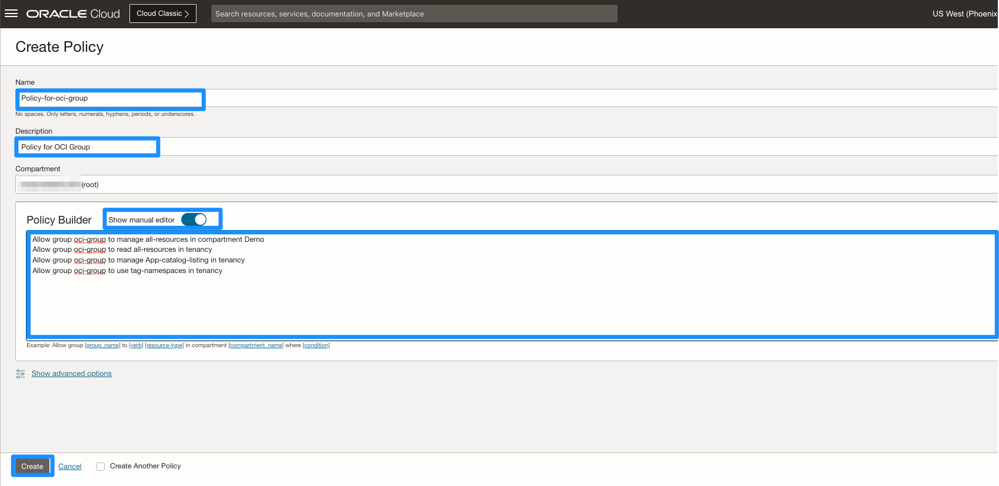    

    b) Click **Create**.

    *NOTE*: If you used a different name for the group and/or compartment, then you'll need to adjust these statements accordingly.

## Task 4: Creating a User

Currently, we are signed in as an Administrator. Since we don't want Admins creating all the resources, we will create a **New User** that will install Cloud Manager.
   
1. Navigate to **Users** under **Identity**.
 Alternatively, you can go to the three-line menu on the top -> **Identity & Security** -> **Users**. 
2. Click **Create User**.
    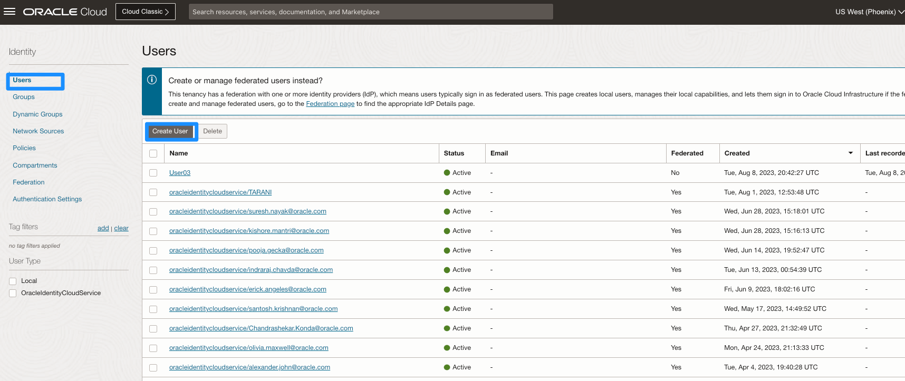 
3. Select **IAM user** on the right. This is crucial. Do *NOT* create an IDCS user.

    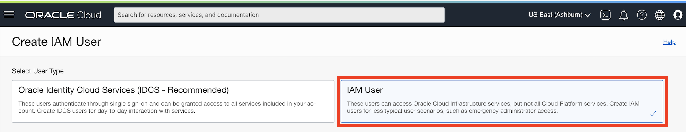    

4. In the New User dialog box, copy the fields below to give the user a 
        
    a) Name:
    ```
    <copy>User01</copy>
    ``` 
    b) Description:
    ```
    <copy>User 01</copy>
    ``` 

    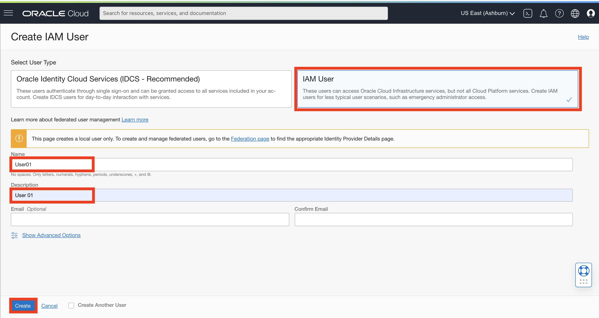

5. Click **Create**.

## Task 5: Managing User

1. Now, let's set a password. Click **Create/Reset Password**.

    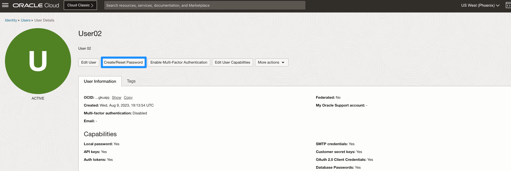

3. In the dialog, click **Create/Reset Password**.

    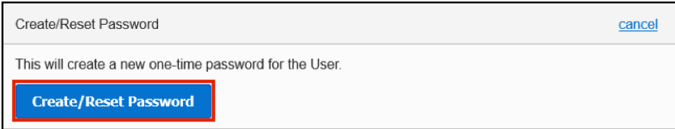

4. The new one-time password is displayed. Click the **Copy** button, save this in a notepad for later, and then click **Close**.
    
    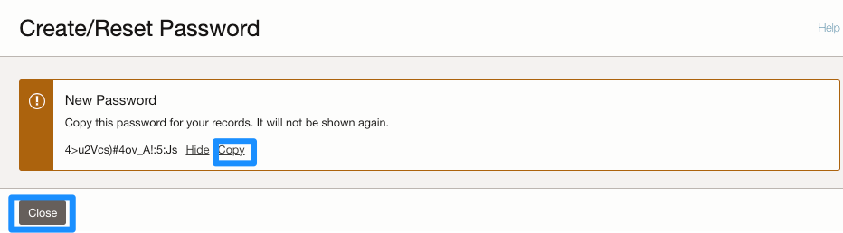

5. Scroll down and click on **Add User to Group**.

    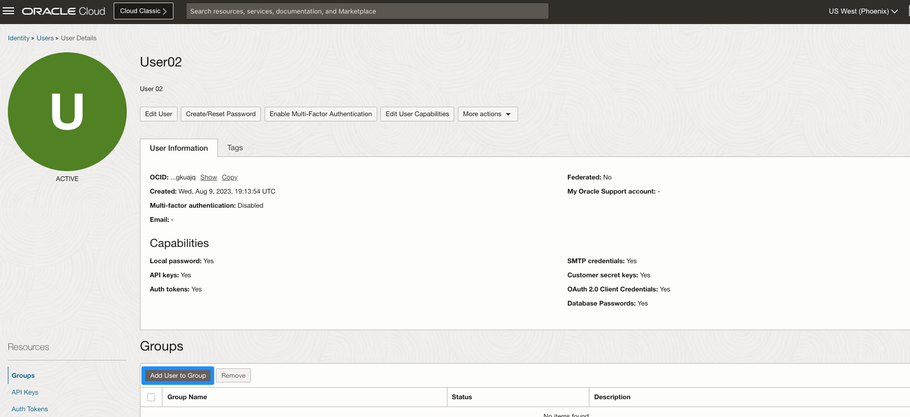

6. Select the group you just created, and click on **Add**.

    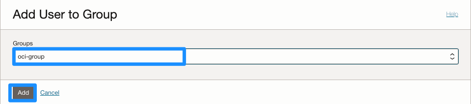

7. Click on **top-right icon button** and **Sign out** of the admin user account.

    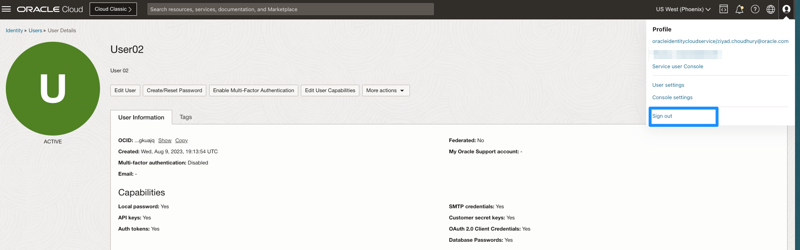

    This time, you will sign in using the local credentials box with the user you created. Note that the user you created is not part of the Identity Cloud Services.

8. Click **Oracle Cloud Infrastructure Direct Sign-In** 
    
    This will expand fields for non-federated accounts. Enter the username **User01** and the password that you copied to a note in step 4.

    


    *Note*: Since this is the first-time sign-in, the user will be prompted to change the temporary password, as shown in the screen capture below.
    

9. Set the new password to **Psft@1234** (or create your own but be sure to note it down). Click on **Save New Password**. 
    ```
    <copy>Psft@1234</copy>
    ```
    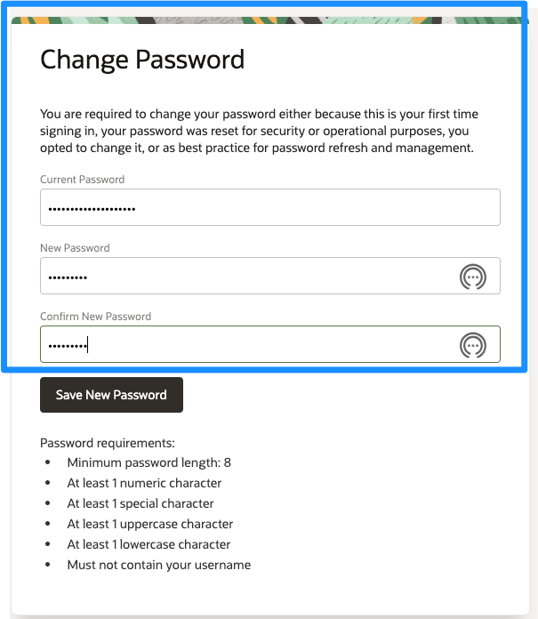


    You are now logged in as local user: **User01**

## Task 6: Setting API Keys for User01

You will need a pair of SSH Keys, as well as a pair of API keys. 

**Option A:** Generate them yourself:
* SSH Keys [https://docs.oracle.com/en/cloud/cloud-at-customer/occ-get-started/generate-ssh-key-pair.html](https://docs.oracle.com/en/cloud/cloud-at-customer/occ-get-started/generate-ssh-key-pair.html)
* API Keys [https://docs.oracle.com/en-us/iaas/Content/API/Concepts/apisigningkey.htm](https://docs.oracle.com/en-us/iaas/Content/API/Concepts/apisigningkey.htm)

**Option B:** Download them here easily for purpose of the demo: [psftKeys.zip](https://objectstorage.us-ashburn-1.oraclecloud.com/p/EdvfkO_9hQ0wuuvzrdquIygg0_VLwhseqc_McHomf_UZYFF4e2fEX0HAUjuUpo4v/n/orasenatdpltoci03/b/TestDrive/o/psftKeys.zip)

    
1. Verify you have the following 4 keys: 
    * **API Signing keys**: ``api_key`` and ``api_key.pub``
    * **SSH key pair**: ``id_rsa`` and ``id_rsa.pub``

2. Now, go back to the OCI console where you should still be logged in as **User01**. Click on the **profile button on top right**. Click on your user name - **User01**.

    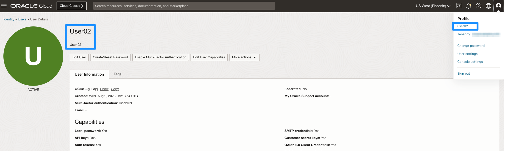

3. Scroll to the bottom, on the left side click on **API Keys** and then click on **Add Public Key**

    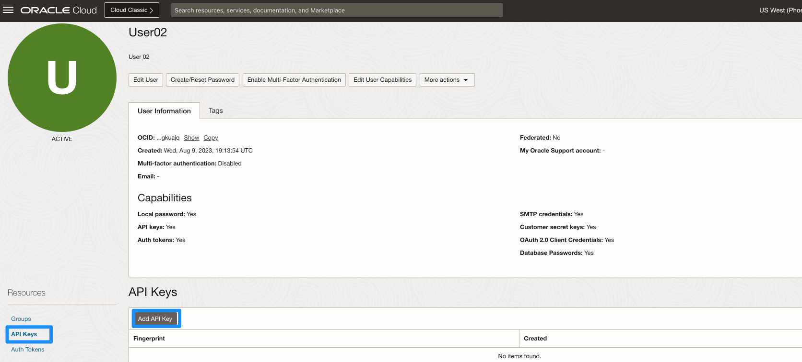

4. Click on **Paste public keys** and paste the contents of **api_key.pub**. Click on **Add**.  

    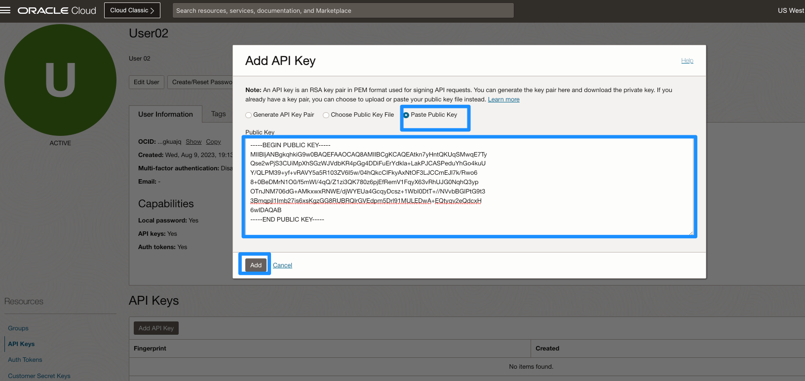


You may now **proceed to the next lab.**


## Acknowledgments
* **Authors** - Megha Gajbhiye, Cloud Solutions Engineer; Sara Lipowsky, Cloud Engineer
* **Last Updated By/Date** - Sara Lipowsky, Cloud Engineer, January 2022
* **Lab Expiry Date** - December 31, 2022 

## Need Help?
Please submit feedback or ask for help using our [LiveLabs Support Forum](https://community.oracle.com/tech/developers/categories/Migrate%20SaaS%20to%20OCI). Please click the **Log In** button and login using your Oracle Account. Click the **Ask A Question** button to the left to start a *New Discussion* or *Ask a Question*.  Please include your workshop name and lab name.  You can also include screenshots and attach files.  Engage directly with the author of the workshop.

If you do not have an Oracle Account, click [here](https://profile.oracle.com/myprofile/account/create-account.jspx) to create one.