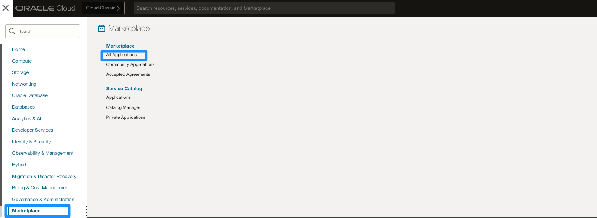
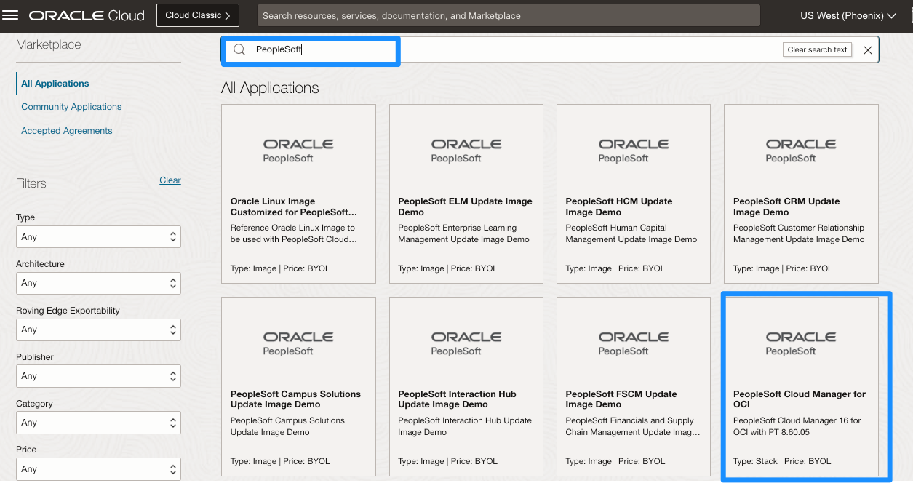
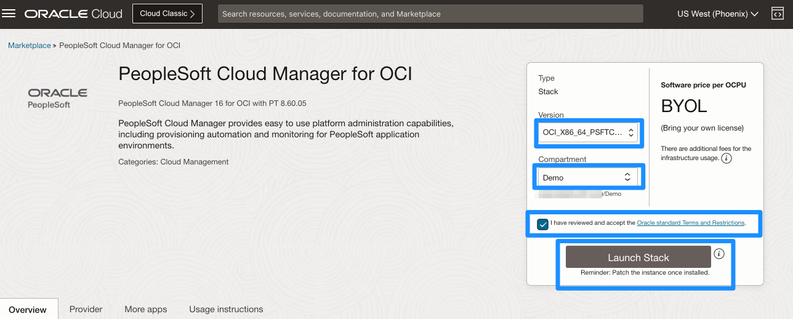
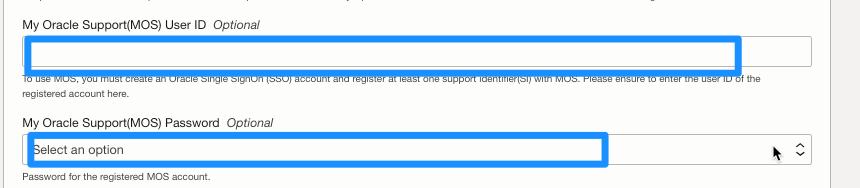

# Provisioning Cloud Manager from Resource Manager 

## Introduction
Resource Manager is an Oracle Cloud Infrastructure service that helps you install, configure, and manage resources. Resource Manager uses Terraform (which is part of the service) to codify your infrastructure in declarative configuration files, which allows you to review and edit, version, persist, reuse, and share them across teams. You can then use Resource Manager to provision Oracle Cloud Infrastructure resources using your Terraform configurations.

In this tutorial, you obtain the configuration files, or stack, for Cloud Manager from the Oracle Cloud Infrastructure Marketplace, and use Resource Manager to create an instance and link it with associated resources such as a Virtual Cloud Network (VCN), subnet, gateways, and route tables. You enter the necessary passwords and other information in the Resource Manager interface and choose the types of resources created.

Estimated Lab Time: 30 minutes + 90 minutes for provisioning

### Objectives
The purpose of this lab is to show you how to create a PeopleSoft Cloud Manager instance from the Marketplace. 

In this lab, you will:
* Configure a stack for the Cloud Manager 

### Prerequisties
* Oracle Cloud Infrastructure account credentials
* SSH and API Keys
* My Oracle Support credentials
    - Verify you have a qualifying username and password here: [http://support.oracle.com](http://support.oracle.com)

## Task 1: Obtain the PeopleSoft Cloud Manager Stack from the Marketplace

To obtain the PeopleSoft Cloud Manager stack:

1. On the Oracle Cloud Infrastructure console home page, click the top left three-line menu icon and select **Marketplace** > **All Applications**.

    

2. Under Filters on the left, select **Stack** from the Type drop-down list. Search for **Peoplesoft** on the search bar. Select **PeopleSoft Cloud Manager for OCI**.

    

3. On the Overview page for the PeopleSoft Cloud Manager stack:
    * select the **Demo** compartment to install the instance inside of. (Click the dropdown and then the **+** to navigate to your **Demo** sub-compartment)  
    * review the **Oracle terms**, and then select the option indicating that you have reviewed and understand the conditions.
    * Click **Launch Stack**. 

    

4. On the Create Stack, Stack Information page, enter a stack name and description if desired.

    Click **Next** 

    

## Task 2: Configure Cloud Manager Instance Variables

The Create Stack, Configure Variables page includes a list of the parameters needed to create and configure the Cloud Manager instance.

1. In the Cloud Manager Instance section, select the **Availability Domain** as **US-ASHBURN-AD-1** (or AD-1 of your selected region found on the top bar of OCI console)
2. For **Shape**, select **VM.Standard.E2.2**. 
3. Select the **storage volume size in GBs** for the secondary block volume for the Cloud Manager instance. We will set it as **200 GBs**.
4. For SSH public key, enter the contents of your **``id_rsa.pub``** from your keys folder in a single line, with no line feeds or spaces.
5. For API private key, enter the contents of your **``api_key``** file.
6. Leave API Private passphrase as blank (Enter if you have created one).
7. For **Tenancy Home Region**, select the home region for your tenancy from the drop-down list. This can again be found on the top bar of the OCI console.

    

## Task 3: Enter Cloud Manager Passwords

Each password has a requirement that can be found below each of the fields. For your convenience, you may use the passwords below as they satisfy the requirements. If you should use your own, please note them down somewhere you can refer back to.

1. Enter following password values:

    *Note*: They are all the same **except** DB Admin Password (in screenshot it is blue)

    Attribute | Value
    --------- | -----
    DB CONNECT PASSWORD	| Psft1234
    ACCESS PASSWORD | Psft1234
    DB ADMIN PASSWORD | Psft1234#
    CLOUD MANAGER ADMINISTRATOR PASSWORD | Psft1234
    INTEGRATION GATEWAY USER PASSWORD | Psft1234
    WEBLOGIC ADMINISTRATOR USER PASSWORD | Psft1234
    WEB PROFILE USER PASSWORD | Psft1234
    DOMAIN CONNECT PASSWORD | Psft1234

    

## Task 4: Enter My Oracle Support Credentials

1. My Oracle Support (MOS) credentials are the same as the username and password you enter when you access [http://support.oracle.com](http://support.oracle.com). Please sign in now to ensure that you have an account and the accurate credentials for My Oracle Support. This is required to download DPKs and PRPs automatically. 

    

## Task 5: Enter Networking Information

We will be provisioning our Cloud Manager instance in Private Cloud. Click [here](https://docs.oracle.com/en/applications/peoplesoft/cloud-manager/tutorial-plan-vcn-cloud-manager/index.html#before_you_begin) for more information on planning a VCN. For now, we will use the default configuration.

1. In the Networking section, enter a host name for the Cloud Manager instance. We'll use **psftcm** (PSFT Cloud Manager)
2. Select the option **Create Network Resources**
3. For **Network Name**, enter **psftvcn** (PSFT Virtual Cloud Network)
4. Select the option **Create Private Subnets**
5. Select the option **Create Subnets for Peoplesoft Components**
6. Select the option for **Create a Bastion**
7. For **Bastion Name**, enter **cmbastion** (Cloud Manager Bastion)

    

8. Click **Next**. 
9. Review the configuration variables, ensure that **Run Apply** is selected, and then click **Create**. 
    

## Task 6: Monitor Stack Creation

This page shows the terraform job status and details. Under the yellow box that has **RMJ** (Resource Manager Job), you'll see the status is **"Accepted"** 

Refresh the page, and you should see the status has now changed to **"In Progress"**. All the information we provided in the Marketplace is now being used to create our Cloud Manager Stack.
Spinning up resources, such as our Virtual Cloud Network, Bastion and Cloud Manager will take a few minutes. 
    

Over these few minutes, you can refresh the page until you see the **RMJ** has succeeded as indicated with a green box and **Succeeded** status. 
    

If you are using a Windows machine OR do not have administrator access, please complete the **Windows VM Compute Lab** and skip Lab 3.

You may now **proceed to the next lab** if you are using a Linux Machine with Admin access.

## Acknowledgments

**Created By/Date**   
* **Authors** - Megha Gajbhiye, Cloud Solutions Engineer; Sara Lipowsky, Cloud Engineer
* **Last Updated By/Date** - Sara Lipowsky, Cloud Engineer, January 2022

## Need Help?
Please submit feedback or ask for help using our [LiveLabs Support Forum](https://community.oracle.com/tech/developers/categories/Migrate%20SaaS%20to%20OCI). Please click the **Log In** button and login using your Oracle Account. Click the **Ask A Question** button to the left to start a *New Discussion* or *Ask a Question*.  Please include your workshop name and lab name.  You can also include screenshots and attach files.  Engage directly with the author of the workshop.

If you do not have an Oracle Account, click [here](https://profile.oracle.com/myprofile/account/create-account.jspx) to create one.

