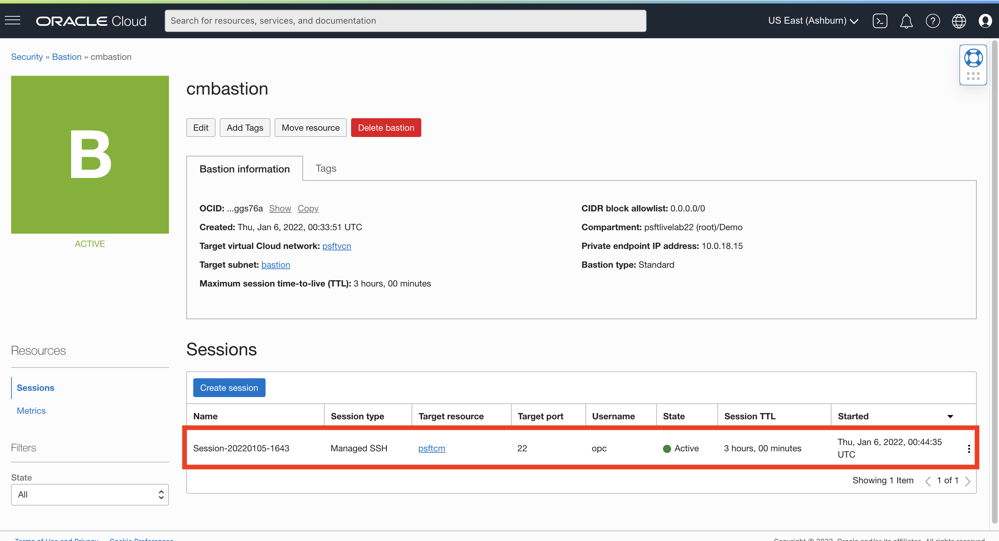
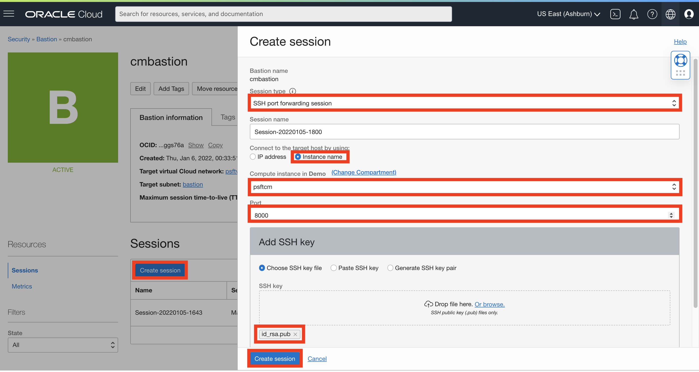
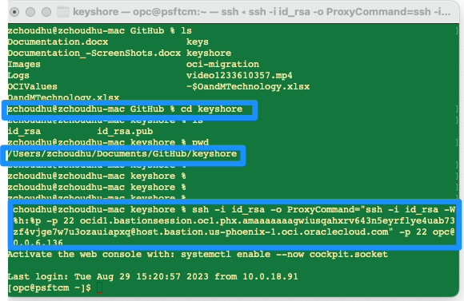
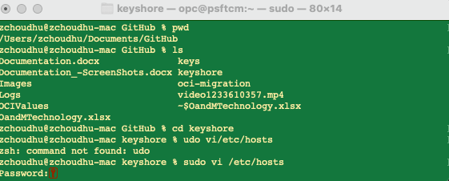
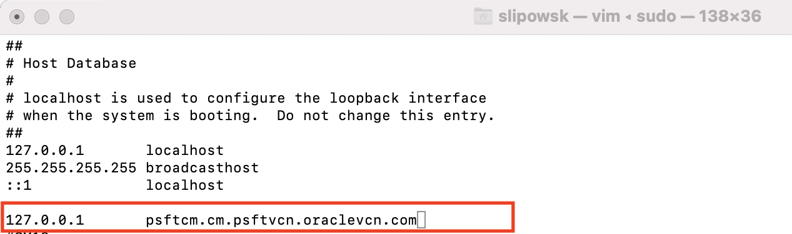
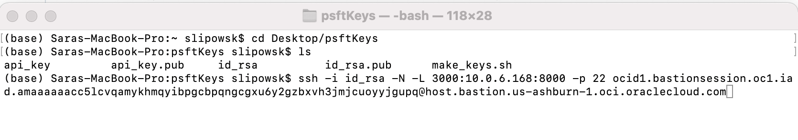
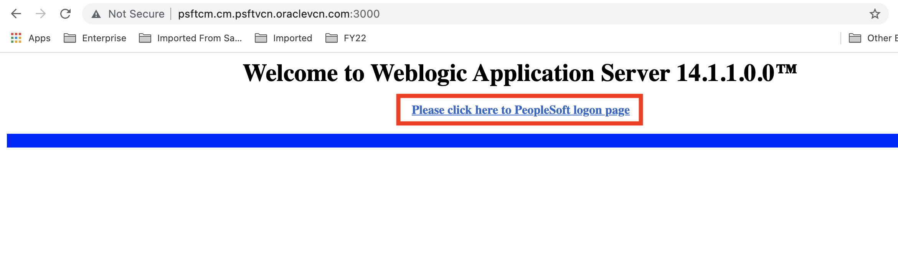
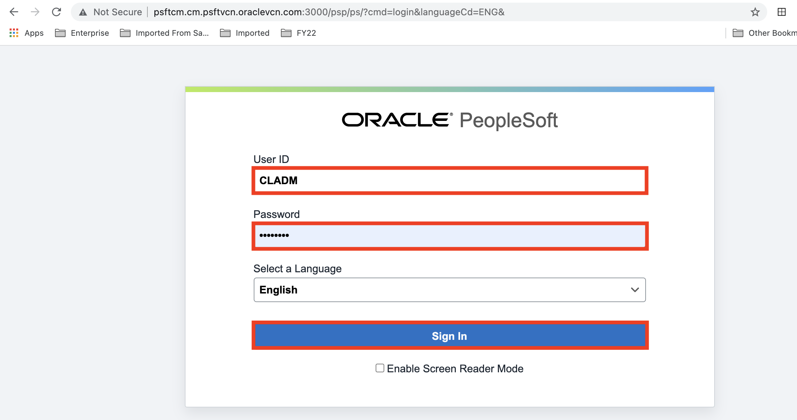

# FOR MAC USERS ONLY: Accessing Private Cloud Manager Instance via SSH and Logging in via Browser

## Introduction
This lab walks you through the steps to instantiating two types of SSH Sessions (Managed and Port Forwarding) in the Bastion Service on OCI to connect to Cloud Manager.

Estimated Lab Time: 30 minutes

### About Bastion
The Cloud Manager stack includes a instance configuration ("bootstrap") script that runs in the VM for the Cloud Manager instance after the Resource Manager Apply job completes successfully. The instance can be accessed directly from a Linux machine. 

### Objectives

The purpose of this lab is to guide you using the Bastion Service to connect to the Private Cloud Manager Instance through SSH and logging in through the browser.

In this lab, you will:
* Create a Managed SSH Session using the Bastion Service on OCI
* Use Terminal to connect to Cloud Manger Instance directly on Linux 
* Monitor the creation of Cloud Manager
* Create an SSH Port Forwarding Session using the Bastion Service on OCI
* Update hosts file
* Access the PIA URL to log into Cloud Manager in the Browser


### Prerequisites
* Oracle Cloud Infrastructure account 
* SSH Keys 
* Linux Machine with Admin access
    - Terminal

## Task 1: Enabling Bastion Plugin

We need to enable the Bastion plugin on our PSFT CM compute instance. 

1.	Navigate to the three-line menu on the top -> **Compute** -> **Instances**.
    

2.	On the left column, select **Demo** from the drop down. This should list the compute instances in our Demo Compartment. Then click **psftcm**

    

3.	This is the Cloud Manager instance we spun up. Click the **Oracle Cloud Agent** tab and ensure that the **Bastion plugin** is enabled.

    


## Task 2: Creating Managed SSH Session

*NOTE*: Ensure you are NOT on VPN
1.	Navigate to the three-line menu on the top -> **Identity & Security** -> **Bastion**.

    

2. Again, using the dropdowns on the left, select the **Demo** compartment. Then click on **cmbastion**
    

3. This is Bastion Instance we created in the last lab. Click the blue button to **Create Session**.

    * Session Type: **Managed SSH session** 
    * Session name:  can leave as is
    * Username:  **opc** 
    * Compute Instance in Demo: **psftcm**
    * Add SSH key: select the **id_rsa.pub** file downloaded earlier.

    Click **Create session** here as well.
    


4. Verify that the session is in the **Active** state, and the row looks something like this: 
    

5. Click on the 3 dots on the right of the row, then **Copy SSH Command**

    

6. Paste your command in a text editor, and replace <**privateKey**> with the name of your private key file, id_rsa.
    

The session will remain active for 3 hours. After then, you will need to create a new one the same way and generate a new command.


## Task 3: Access Managed SSH Session

Remain off VPN.

1. Open up **Terminal** and change directory to your psftKeys folder. (For example: ```cd ~/Downloads/psftKeys ```)
2. Paste in edited SSH command from the previous task and run it.
3. Type in **"yes"** to authenticate the host.

    All together, it should look like this:
    

4. Now that you've SSH'ed into your Cloud Manager instance, let's check the status of the deployment. Monitor Cloud Manager bootstrap installation using the below command.

    ```
    <copy>
    tail -f /home/opc/bootstrap/CloudManagerStatus.log
    </copy>
    ```
    As you can see, Cloud Manager is being set up and it is still progress.
    
5. Keep checking the status untill you see **CM installed successfully** with the PIA URLs. After Cloud Manager bootstrap is complete, the CloudManagerStatus.log will show the following messages. 

		The PeopleSoft Environment Setup Process Ended.
		CM installed successfully
		Cloud Manager PIA URL: http://psftcm.cm.psftvcn.oraclevcn.com:8000 
		Cloud Manager PIA SSL URL: https://psftcm.cm.psftvcn.oraclevcn.com:8443
This screenshot shows that the connection closed and the ssh command had to be re-entered. The tail command had to be entered as well to see the expected output:
    
    
    *NOTE*: Usually, it takes an hour for Cloud Manager to finish the bootstrap script. Until the script is successfully executed and you get the above message, you won't be able to access cloud manager URL. This is a long process. 

## Task 4: Creating Port Forwarding SSH Session

1.	Navigate to the three-line menu on the top -> **Identity & Security** -> **Bastion**.

    

2. Again, using the dropdowns on the left, select the **Demo** compartment. Then click on **cmbastion**
    

3. This is Bastion Instance we created in the last lab. Click the blue button to **Create Session**.

    * Session Type: **SSH port forwarding session** 
    * Session name:  can leave as is
    * Connect to the target host by using :  **instance name** 
    * Compute Instance in Demo: **psftcm**
    * Port: **8000**
    * Add SSH key: select the **id_rsa.pub** file downloaded earlier.

    Click **Create session** here as well.
    


4. When the session is in the **Active** state, and the row looks something like this, click on the 3 dots on the right of the row, then **Copy SSH Command**
    


5. Paste your command in a text editor, and replace the following variables:
    * <**privateKey**> : with the name of your private key file, id_rsa 
    * <**localPort**> : with a port to access CM PIA URL through the bastion, which should be a value greater than 1024. I'm choosing 3000.

    

The session will remain active for 3 hours. After then, you will need to create a new one the same way and generate a new command.

## Task 5: Adding Entry to Hosts File
You need **Administrator Access** to your machine for this

1. Open up **Terminal** and edit your hosts file
    ```
    <copy>
    sudo vi /private/etc/hosts
    </copy>
    ```
    You will then be prompted to enter in your password for your machine

    
2. Bring your cursor to the bottom and press **i** to insert an entry. This should include the localhost IP address, tab, and then the fully-qualified domain name (FQDN) for the Cloud Manager instance such as:
    ```
    <copy>
    127.0.0.1  psftcm.cm.psftvcn.oraclevcn.com
    </copy>
    ```
    

3. To write and save to the file, press **esc**, then type **:wq**

## Task 6: Setting up Session

1. Open up **Terminal** and change directory to your psftKeys folder. 
2. Paste in edited SSH command from the Task #4 and run it.
    


## Task 7: Access Cloud Manager in Browser

1.	Open up your browser (Chrome or Firefox) and paste in the PIA URL with the specified port (3000) in your SSH command such as:
    ```
    <copy>
    http://psftcm.cm.psftvcn.oraclevcn.com:3000
    </copy>
    ```


2. Click on **Please click here to PeopleSoft logon page** to sign in to Cloud Manager.
    

3. To login, use the username **CLADM** and password as **Psft1234** if you didn't choose your own password
    ```
    <copy>CLADM</copy>
    ```
    ```
    <copy>Psft1234</copy>

    ```
     
    
You have now signed into Cloud Manager 13.

You may now proceed to the Lab 6: Configuring Cloud Manager Settings.


## Acknowledgments
* **Authors** - Megha Gajbhiye, Cloud Solutions Engineer; Sara Lipowsky, Cloud Engineer
* **Last Updated By/Date** - Sara Lipowsky, Cloud Engineer, January 2022

