# Provisioning Windows VM Compute in OCI

## Introduction

For individuals who might not have Admin access to their local machine, this lab walks you through the steps to provision a Windows compute instance in OCI, and access it through a Remote Desktop Connection

Estimated Lab Time: 20 minutes

### Objectives

This lab will show you how to create a Windows compute instance in OCI, and how to access it through a Remote Desktop Connection.

In this lab, you will:
* Create a Windows Instance
* Access the Windows Instance with Remote Desktop Connection

### Prerequisites
- Permissions to create compute instances in OCI
- Remote Desktop Connection downloaded
- VCN spun up in Lab 2, where PSFT CM resides

## Task 1: Create a Public Subnet in VCN
1. On OCI console, navigate to the three-line menu on the top -> **Networking** -> **Virtual Cloud Networks**.
  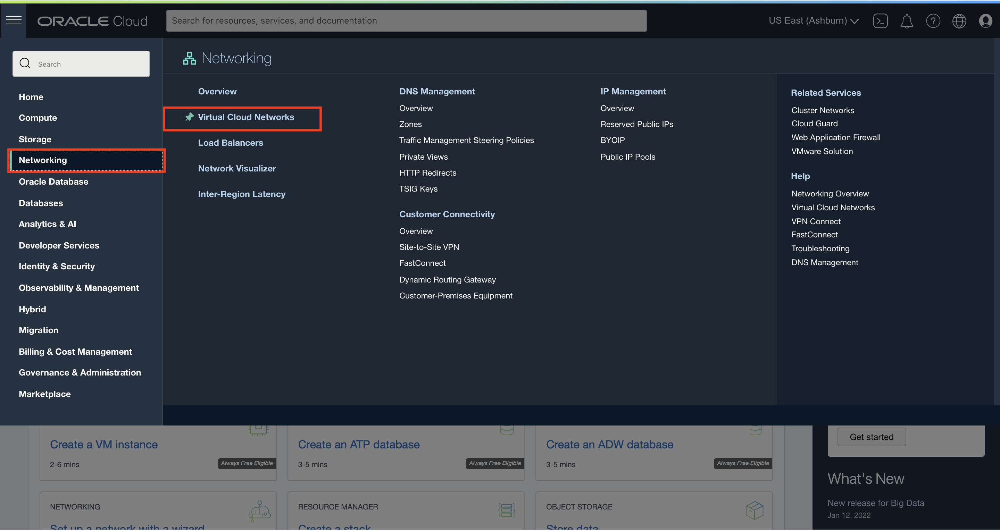

2. Change the compartment to **Demo** in the dropdown on the left and then click **psftcm**
  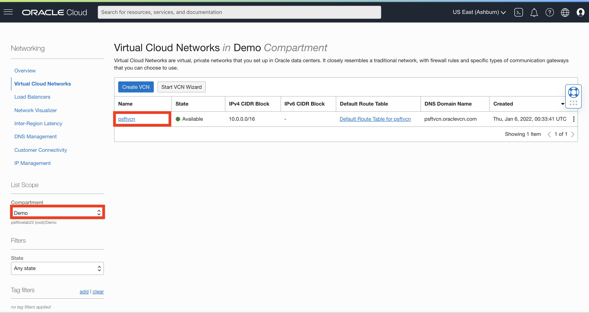

3. On the left column, navigate to Subnets. Then, click **Create Subnet**.
  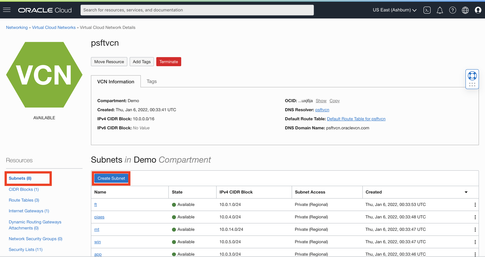

4. Fill in the following values
  * Name: **windows-pub**
  * Create in Compartment: **Demo**
  * Subnet Type: **Regional**
  * CIDR Block: **10.0.20.0/24**
  * Route Table: **rt\_with\_igw**
  * Subnet Access: **Public**
  * Security List Compartment in Demo: **Default Security List for psftvcn**

  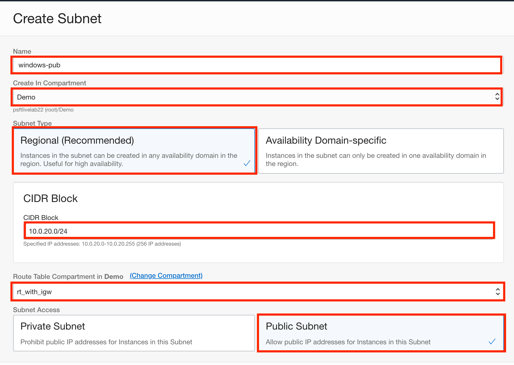
  

## Task 2: Add Ingress Rule to Default Security List


1. Click **Default Security List for psftvcn**
  

2. On the bottom, click **Add Ingress Rules**
  

3. Fill in the following values:
  * Source CIDR: **0.0.0.0/0**
  * IP Protocol: **RDP (TCP/3389)**
  * Destination Port Range: **3389**

  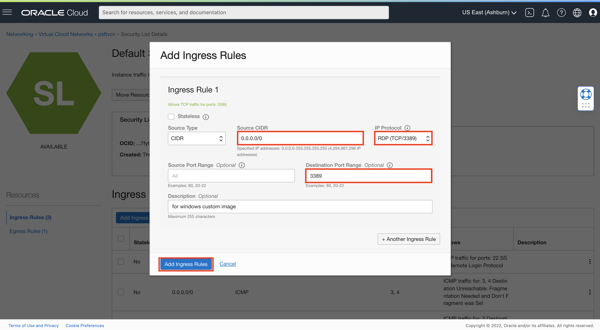

Now, click **Add Ingress Rule**

## Task 3: Add Ingress Rule to cm_sec Security List

Navigate back to the list of Security Lists
1. Select **cm_sec**
  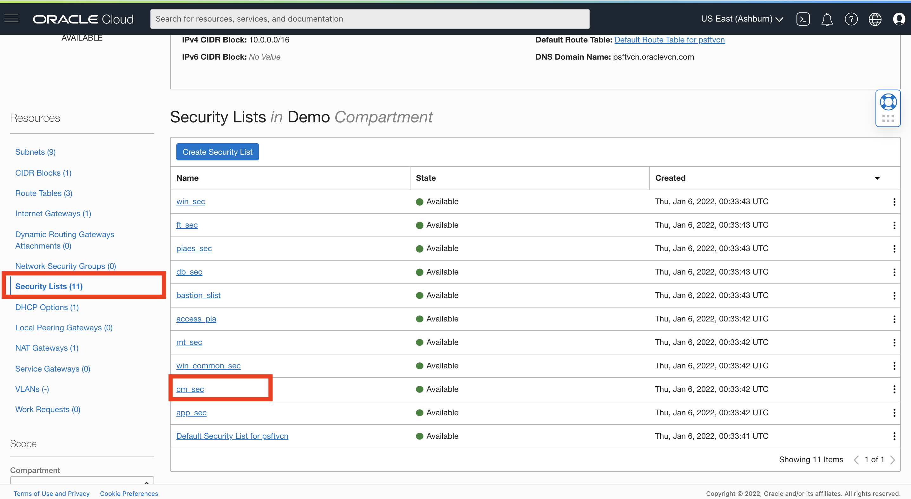

2. On the bottom, click **Add Ingress Rules**
  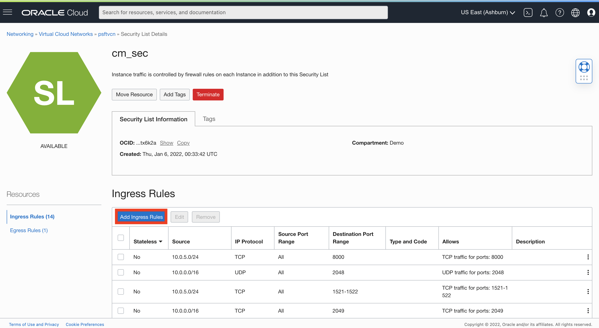

3. Fill in the following values:
  * Source CIDR: **10.0.20.0/24**
  * IP Protocol: **TCP**
  * Destination Port Range: **8000**

  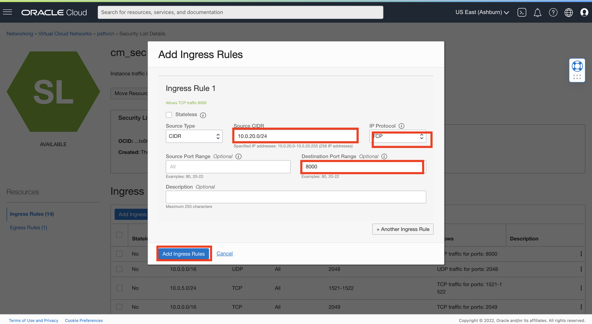

Now, click **Add Ingress Rules**


## Task 4: Create Windows Instance

1. On the Oracle Cloud Infrastructure console home page, scroll down to the **Launch Resources** options. Now, click on the **Create a VM Instance** box

  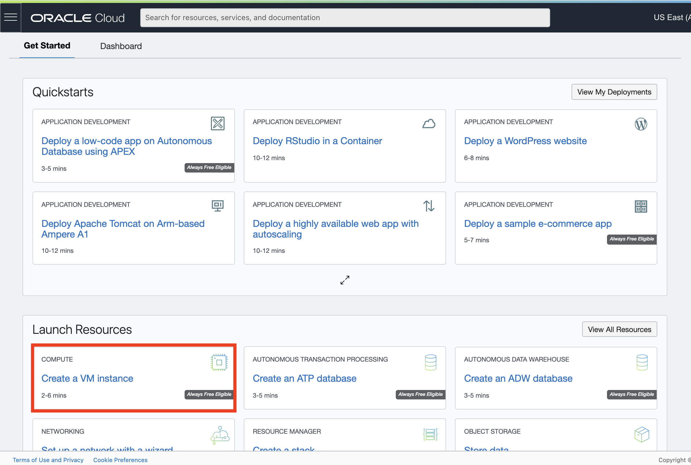 

2. On the Create ompute instance page, enter 
  * Name: **windows-custom-image**
  * Create in compartment: **Demo**

  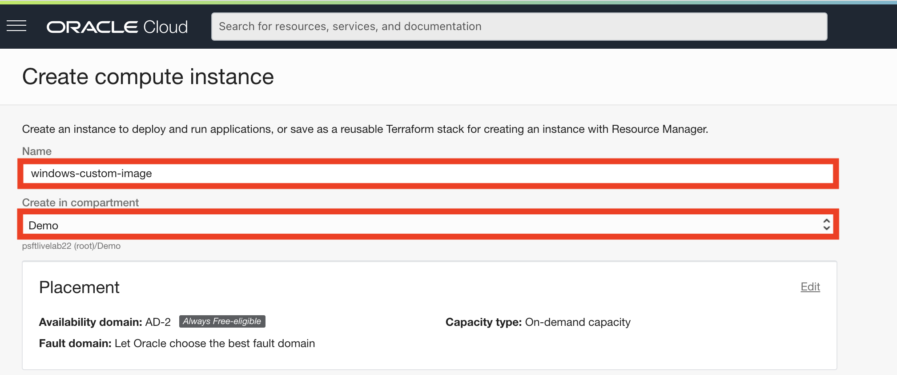 

  Leave the Placement settings alone.
3. In the **Image and shape** secition, click **Edit** in the top right corner. 
  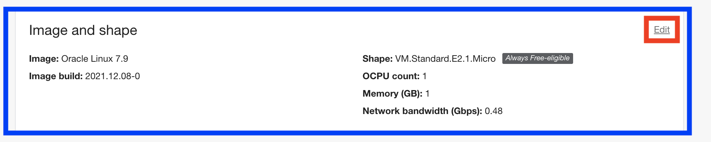

4. The shape is currently set to Linux and we want to **Change Image**
  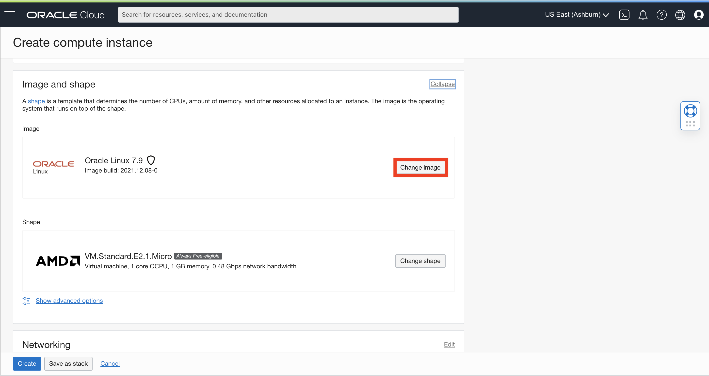

5. Change the selection to **Windows** and find **Server 2019 Standard** in the dropdown.
  Check the box that you have reviewed and accept the documents, then click **Select Image**
  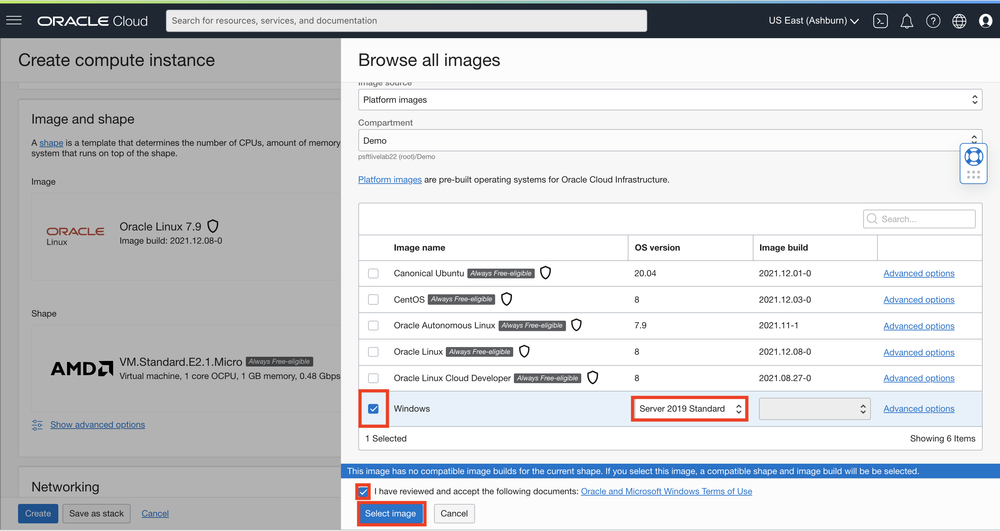

  *NOTE*: Please ignore the warning about the current shape not being compatible. It will change the shape to a compatible one for us.

  Verify the Image and Shape selection
  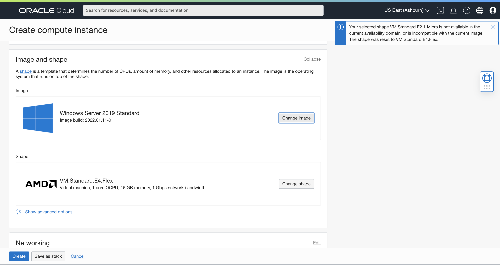

6. Now let's **Edit** the **Networking** selections.

   

7. Make the following changes:
  * Primary netowrk: **Select existing virtual cloud network** 
  * Virtual cloud network in Demo: **psftvcn**
  * Subnet in Demo: **windows-pub** (the one we created earlier)
  * Public IP address: **Assign a public IPv4 address**
  

  Click **Create**.

8. Wait a few minutes for the instance to complete provisioning. Once the status has changed to **Running**, copy and paste the Public IP Address and Initial Password to a Note for later use.

  

## Task 5: Access the Windows Instance with Remote Desktop Connection

1. Launch Remote Desktop Connection, for example from the Start menu of a local machine.

  NOTE: If you have not installed Remote Desktop Connection, please do so through this [link](https://www.microsoft.com/en-us/p/microsoft-remote-desktop/9wzdncrfj3ps)

  

2. **Steps for Windows machine**: 
  * Computer: the Public IP address of the Microsoft Windows VM that you copied in the previous section. 
  * User name: opc

  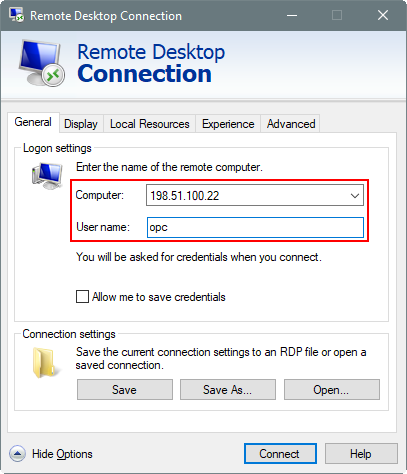

	Click **Connect**
  Enter the default password you noted down in the previous section 

	**Steps for Mac machine**: Depending on the software, these steps might differ. Click on + sign and select Desktop or Add PC.
  * PC Name: the Public IP address of the Microsoft Windows VM that you copied in the previous section. 
  * User name: opc
  
  
  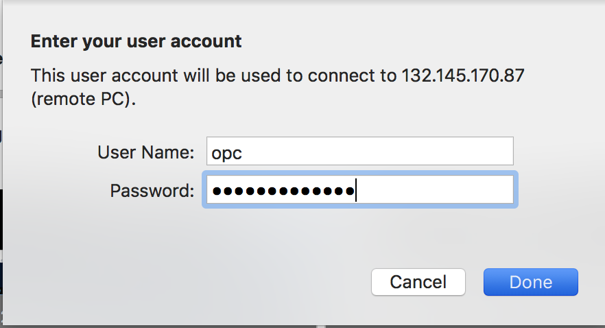
  Click **Add**

3. Click Yes on the security message, which mentions that the identity of the remote computer cannot be verified.

4. Change the password to one of your liking or:

	```
	<copy>Psft@12345678</copy>
	```

You may proceed to the next lab. (Lab 5)

## Acknowledgments
* **Authors** - Rich Konopka, Peoplesoft Specialist, Megha Gajbhiye, Cloud Solutions Engineer, Sara Lipowsky, Cloud Engineer
* **Last Updated By/Date** - Sara Lipowsky, Cloud Engineer, January 2022

