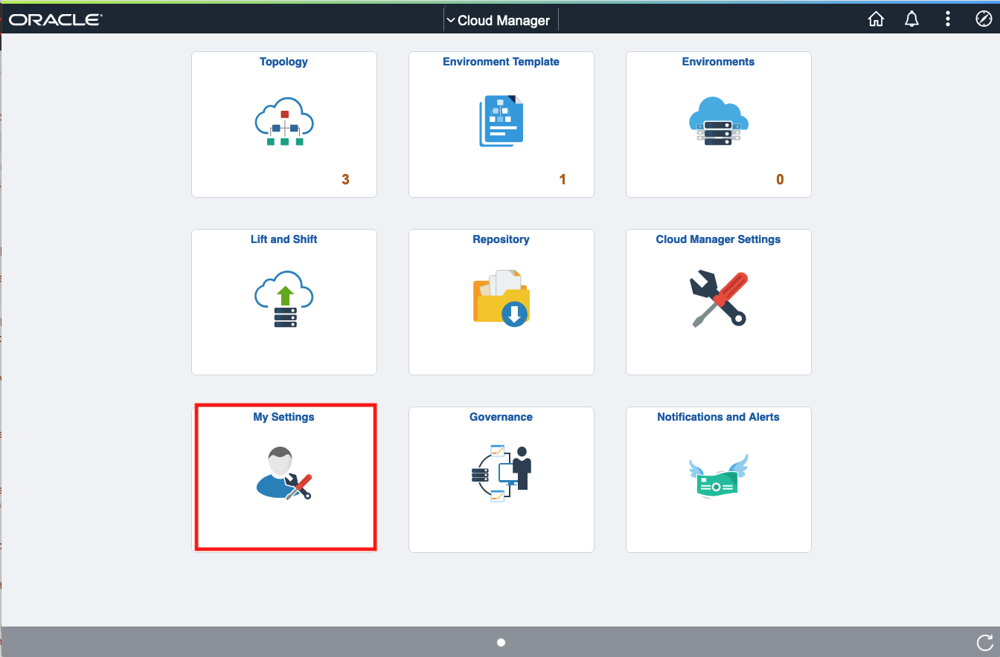
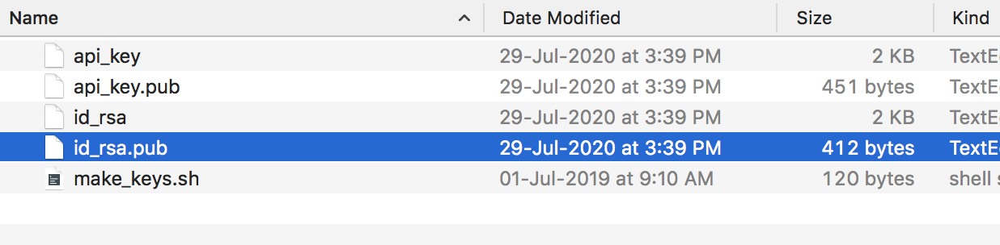
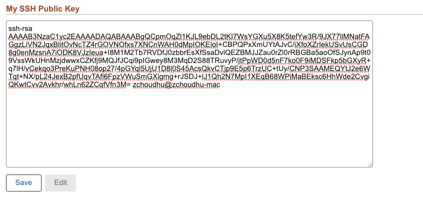
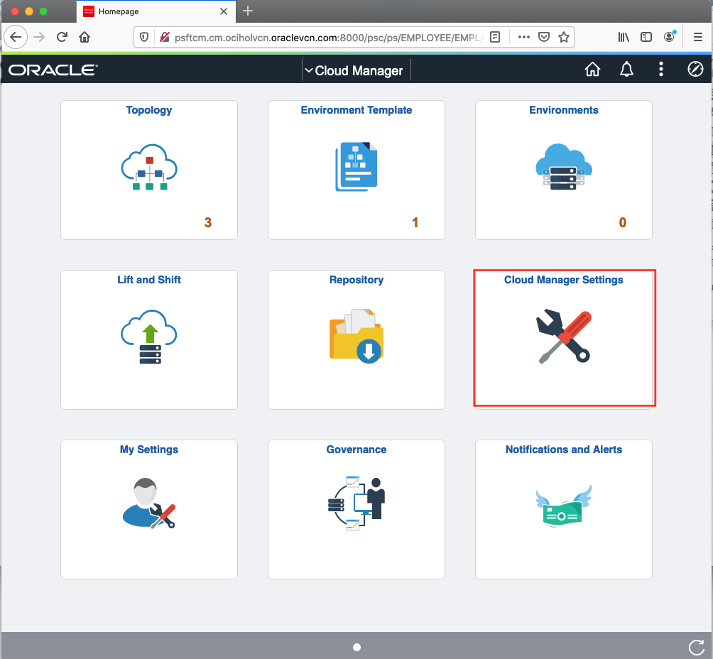
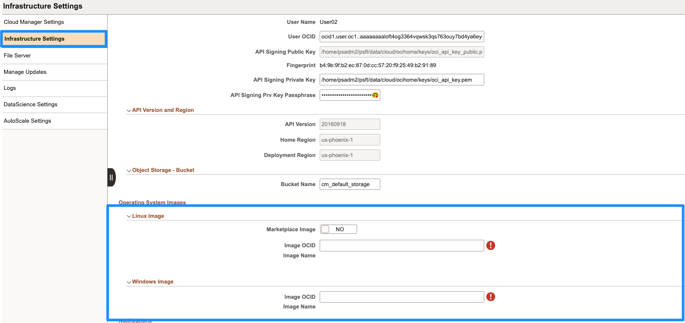
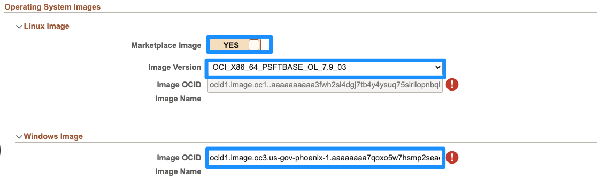
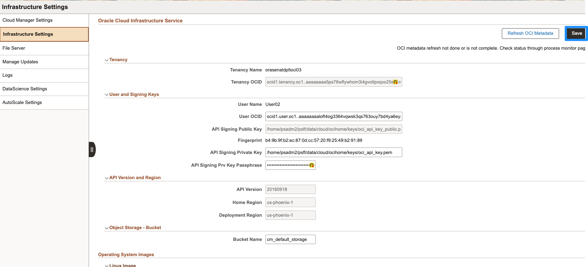
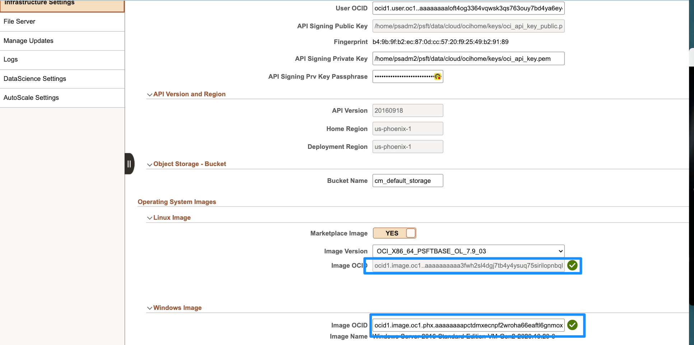

# Configuring Cloud Manager Settings

## Introduction
This lab will guide you on how to configure the system and infrastructure settings on Cloud Manager

Estimated Lab Time: 10 minutes

### Objectives
The purpose of this lab is to show you how to configure Cloud Manager settings.

In this lab, you will:
* Upload SSH public key
* Update My Oracle Support Credentials
* Input the image OCID for the Cloud Manager

### Prerequisites
* SSH keys generated in Lab 1

## Task 1: Uploading SSH public key

1. Navigate to **Cloud Manager Dashboard** > **My Settings**.

    

2. Navigate to the folder where you generated the keys (psftKeys) and open the file **id_rsa.pub**.

    

3. Copy the contents of the file in **My SSH Public Key** and click on **Save**

    

## Task 2: Updating Infrastructure Settings

Go back to the **Cloud Manager Dashboard** > **Cloud Manager Settings**. 
    
1.  Navigate to **Infrastructure Settings** on the left and scroll down to **Operating System Images**. We will specify these images now.
    

    * For Linux, enable **Marketplace Image** radio button to **YES** and choose the latest version from the displayed list. The OCID should populate automatically.

    * For Windows image, as per your home region, please select the OCID of the vanilla custom image from this [website](https://docs.oracle.com/en-us/iaas/images/image/943bdefa-8858-4b37-98e0-fd710c4aea1e/).

    For example, in this lab, we selected our Home Region to be us-phoenix-1 so our OCID is:    
    **ocid1.image.oc3.us-gov-phoenix-1.aaaaaaaa7qoxo5w7hsmp2seaquqf7nfloitaf3g7yasuul26yctxg3axu7ia**
 
    

2.	Scroll back to the top and click **Save** to save the configuration. 
    

3.	Now, click **Refresh OCI Metadata** button on top of the page and click **Okay** on the dialog box. Check that the images have these green check marks.
    
 

You may now **proceed to the next lab.**

## Acknowledgements
* **Authors** - Deepak Kumar M, Principal Cloud Architect; Sara Lipowsky, Cloud Engineer
* **Contributors** - Edward Lawson, Master Principal Cloud Architect
* **Last Updated By/Date** - Ziyad Choudhury, Principal Cloud Architect, August 2023

