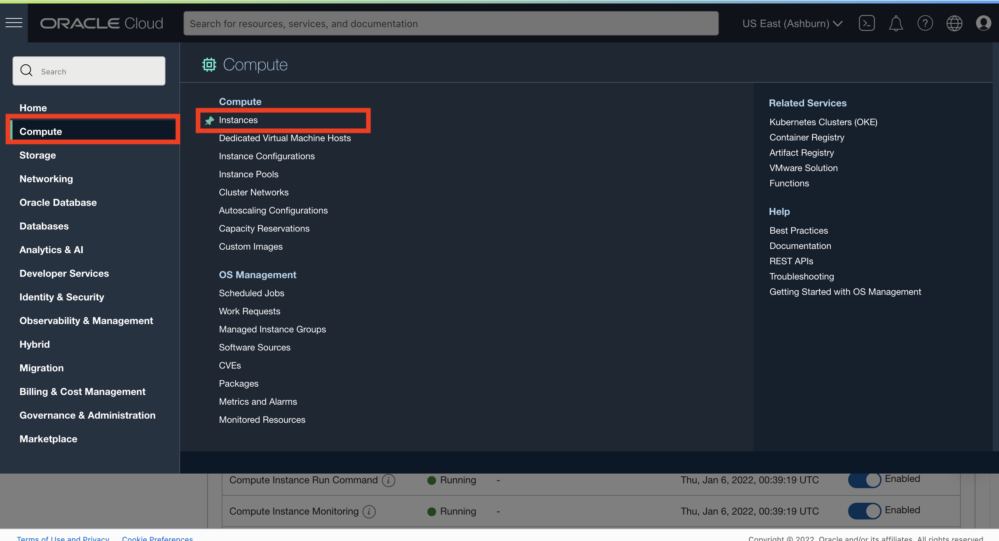
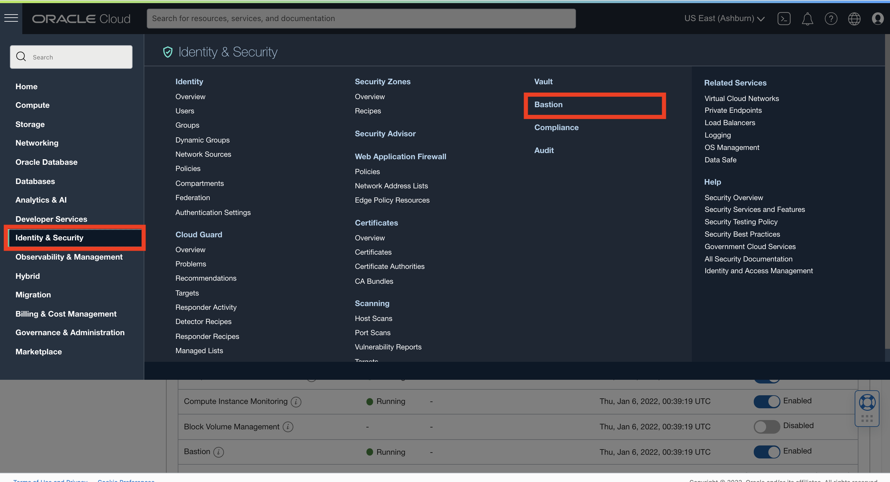
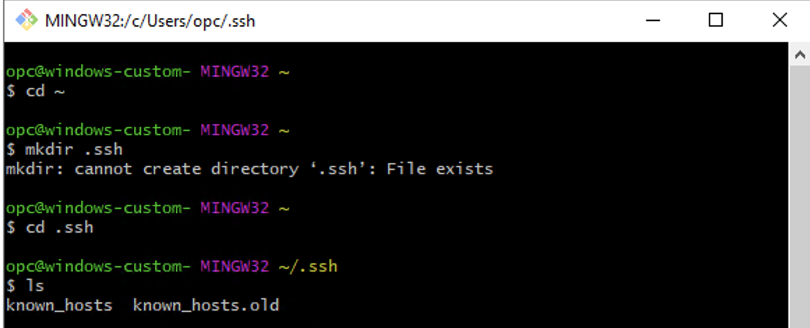
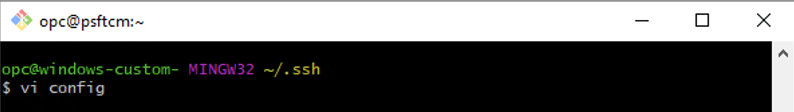
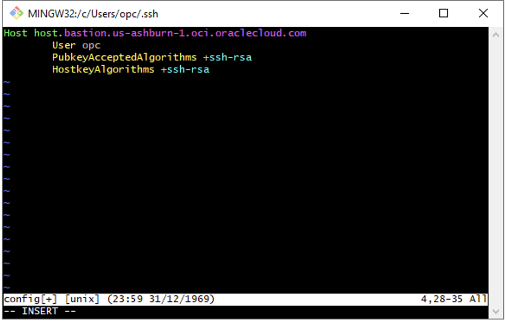
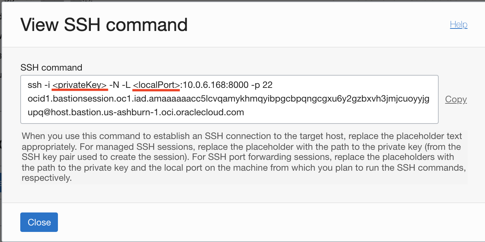
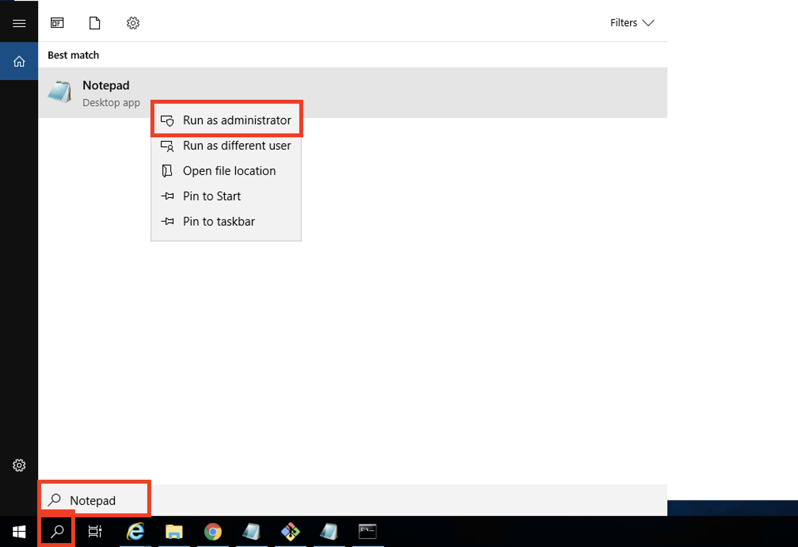
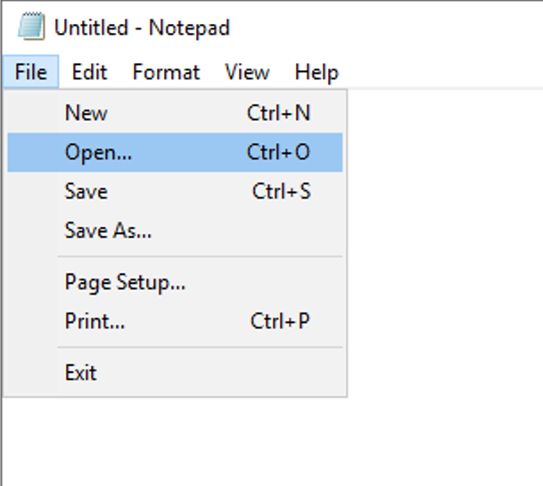
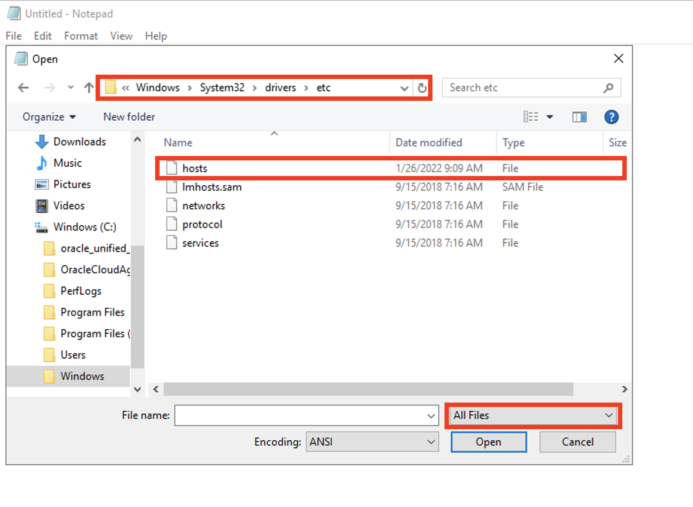
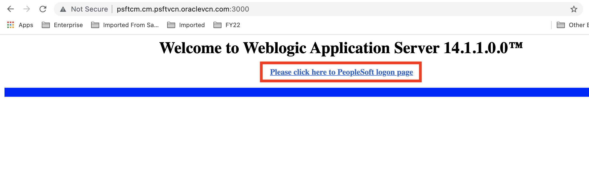

# FOR WINDOWS VM ONLY: Accessing Private Cloud Manager Instance via SSH and Logging in via Browser

## Introduction
This lab walks you through the steps to logging into your private Cloud Manager instance using the Bastion Service on OCI.

Estimated Lab Time: 45 minutes

### About Bastion
The Oracle Cloud Infrastructure (OCI) Identity Bastion Service allows you to gain SSH access through 

### Objectives

The purpose of this lab is to give you an overview of the IAM Service components and an example scenario to help you understand how they work together.

In this lab, you will:
* Create a Managed SSH Session using the Bastion Service on OCI
* Create a config file in .ssh
* Use Git Bash to connect to Cloud Manger Instance
* Monitor the creation of Cloud Manager
* Create an SSH Port Forwarding Session using the Bastion Service on OCI
* Update hosts file
* Access the PIA URL to log into Cloud Manager in the Browser


### Prerequisites

* Oracle Cloud Infrastructure account credentials 
* Windows Compute Instance
* Have the following downloaded on the Windows Compute Instance
    - Private SSH key (id_rsa)
    - Google Chrome
    - Git Bash
 
## Task 1: Enabling Bastion Plugin

We need to enable the Bastion plugin on our PSFT CM compute instance. 

1.	Log into the OCI console and navigate to the three-line menu on the top -> **Compute** -> **Instances**.
    

2.	On the left column, select **Demo** from the drop down. This should list the compute instances in our Demo Compartment. Then click **psftcm**

    

3.	This is the Cloud Manager instance we spun up. Click the **Oracle Cloud Agent** tab and ensure that the **Bastion plugin** is enabled.

    


## Task 2: Creating Managed SSH Session

*NOTE*: Ensure you are NOT on VPN
1.	Navigate to the three-line menu on the top -> **Identity & Security** -> **Bastion**.

    

2. Again, using the dropdowns on the left, select the **Demo** compartment. Then click on **cmbastion**
    

3. This is Bastion Instance we created in the last lab. Click the blue button to **Create Session**.

    * Session Type: **Managed SSH session** 
    * Session name:  can leave as is
    * Username:  **opc** 
    * Compute Instance in Demo: **psftcm**
    * Add SSH key: select the **id_rsa.pub** file downloaded earlier.

    Click **Create session** here as well.
    


4. Verify that the session is in the **Active** state, and the row looks something like this: 
    

5. Click on the 3 dots on the right of the row, then **Copy SSH Command**

    

6. Paste your command in a text editor, and replace <**privateKey**> with the name of your private key file, id_rsa.
    

7. Make note of the Bastion Host in your text editor noted by the highlighted portion
    For example:
    


The session will remain active for 3 hours. After then, you will need to create a new one the same way and generate a new command.

## Task 3: Creating a config File

1. Open up Git Bash
    * Change to the home directory
    ```
    <copy>
    cd ~
    </copy>
    ```
    * Make a .ssh directory. In this case, it already exists, so we changed into the existing directory (cd .ssh)
    ```
    <copy>
    mkdir .ssh
    </copy>
    ```
    * Now let's check if config exists by listing out the contents in .ssh
    ```
    <copy>
    ls
    </copy>
    ```
    

2. Now we can create our config file and add our entry
    * create config file
    ```
    <copy>
    vi config
    </copy>
    ```
    

    * Press **i** to change to INSERT mode and add the following to your file making sure to use your specific Bastion Host we made note of in the Task 2, Step #7.
    ```
    <copy>
    Host <bastion_Host>
        User opc
        PubkeyAcceptedAlgorithms +ssh-rsa
        HostkeyAlgorithms +ssh-rsa
    </copy>
    ```
  
    
    * Once edited, to save and exit, press **esc**, type **:wq**, then return
    ```
    <copy>
    :wq
    </copy>
    ```

## Task 4: Access Managed SSH Session

1. Open up **Git Bash** and change directory to your id_rsa key. (For example: ```cd Downloads/psftKeys ```)
2. Paste in edited Managed SSH Session command from Task 2 and run it.
3. Type in **"yes"** to authenticate the host.

    All together, it should look like this:
    

4. Now that you've SSH'ed into your Cloud Manager instance, let's check the status of the deployment. Monitor Cloud Manager bootstrap installation using the below command.

    ```
    <copy>
    tail -f /home/opc/bootstrap/CloudManagerStatus.log
    </copy>
    ```
    
    Keep checking the status untill you see **CM installed successfully** with the PIA URLs. After Cloud Manager bootstrap is complete, the CloudManagerStatus.log will show the following messages. 

		The PeopleSoft Environment Setup Process Ended.
		CM installed successfully
		Cloud Manager PIA URL: http://psftcm.cm.psftvcn.oraclevcn.com:8000 
		Cloud Manager PIA SSL URL: https://psftcm.cm.psftvcn.oraclevcn.com:8443

    The screenshot above shows the command run once Cloud Manager had already finished provisioning, but your will show progress if run immediately after completing Lab 2.
    
    *NOTE*: Usually, it takes an hour for Cloud Manager to finish the bootstrap script. Until the script is successfully executed and you get the above message, you won't be able to access Cloud Manager URL. This is a long process. 

## Task 5: Creating Port Forwarding SSH Session

1.	Navigate to the three-line menu on the top -> **Identity & Security** -> **Bastion**.

    

2. Again, using the dropdowns on the left, select the **Demo** compartment. Then click on **cmbastion**
    

3. This is Bastion Instance we created in the last lab. Click the blue button to **Create Session**.

    * Session Type: **SSH port forwarding session** 
    * Session name:  can leave as is
    * Connect to the target host by using :  **instance name** 
    * Compute Instance in Demo: **psftcm**
    * Port: **8000**
    * Add SSH key: select the **id_rsa.pub** file downloaded earlier.

    Click **Create session** here as well.
    


4. When the session is in the **Active** state, and the row looks something like this, click on the 3 dots on the right of the row, then **Copy SSH Command**
    


5. Paste your command in a text editor, and replace the following variables:
    * <**privateKey**> : with the name of your private key file, id_rsa 
    * <**localPort**> : with a port to access CM PIA URL through the bastion, which should be a value greater than 1024. I'm choosing 3300.

    

The session will remain active for 3 hours. After then, you will need to create a new one the same way and generate a new command.

## Task 6: Adding Entry to Hosts File
You need **Administrator Access** to your machine for this. We have that since we are logged in as opc.

1. In the bottom left, click the Search bar and type in **Notepad**. Then, right-click and select **Run as administrator**

    
2. Now that we've launched Notepad as an Administrator, we need to **File** --> **Open**
    

3. Our hosts file is in the following directory: C:\Windows\System32\drivers\etc. Change the dropdown to **All Files**
    

4. Open the file and the entry which includes the localhost IP address, tab, and then the fully-qualified domain name (FQDN) for the Cloud Manager instance such as:
    ```
    <copy>
    127.0.0.1  psftcm.cm.psftvcn.oraclevcn.com
    </copy>
    ```
    

5. **File** --> **Save**

## Task 7: Setting up Session

1. Open up **Git Bash** and change directory to your psftKeys folder. 
2. Paste in edited SSH command from the Task #5 and run it.
    


## Task 8: Access Cloud Manager in Browser

1.	Open up your browser (Chrome or Firefox) and paste in the PIA URL with the specified port (3300) in your SSH command such as:
    ```
    <copy>
    http://psftcm.cm.psftvcn.oraclevcn.com:3300
    </copy>
    ```

2. Click on **Please click here to PeopleSoft logon page** to sign in to Cloud Manager.
    

3. To login, use the username **CLADM** and password as **Psft1234** if you didn't choose your own password
    ```
    <copy>CLADM</copy>
    ```
    ```
    <copy>Psft1234</copy>

    ```
     
    
You have now signed into Cloud Manager 13.

You may now **proceed to the next lab.**


## Acknowledgments
* **Authors** - Megha Gajbhiye, Cloud Solutions Engineer; Sara Lipowsky, Cloud Engineer
* **Last Updated By/Date** - Sara Lipowsky, Cloud Engineer, January 2022

