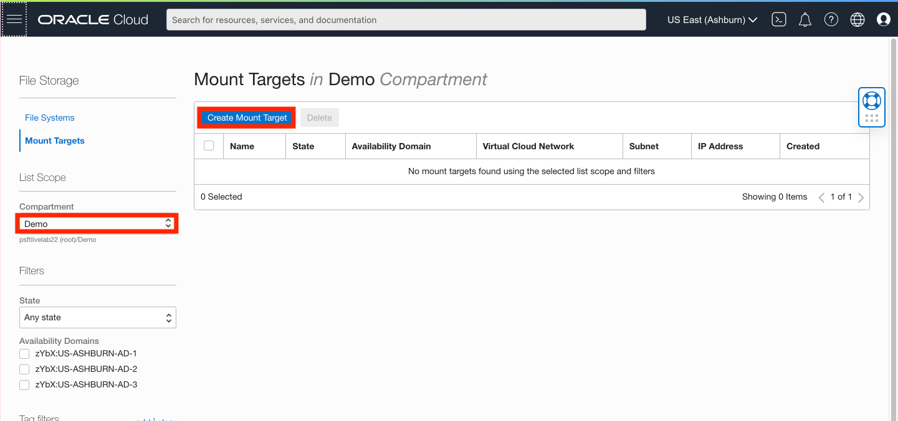
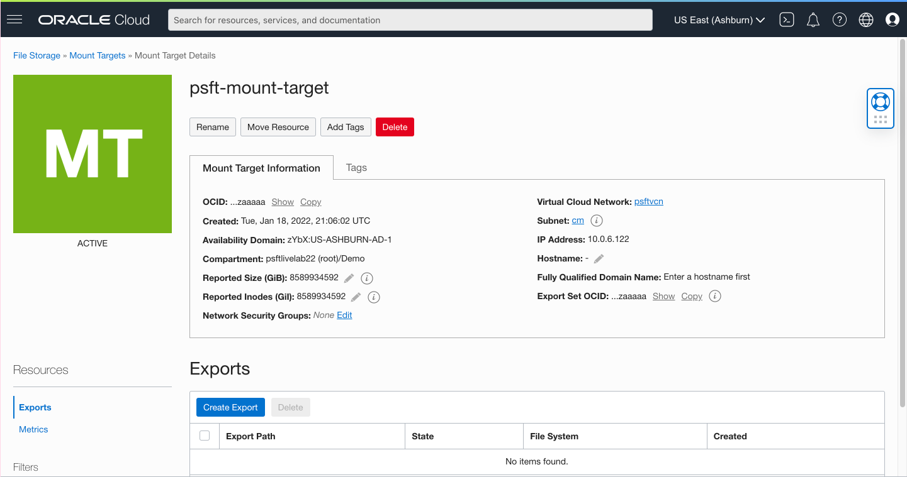
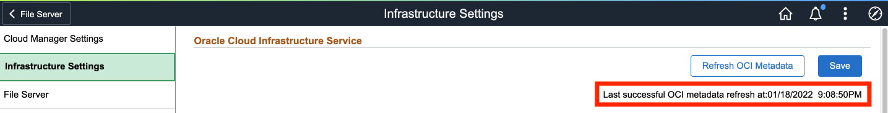
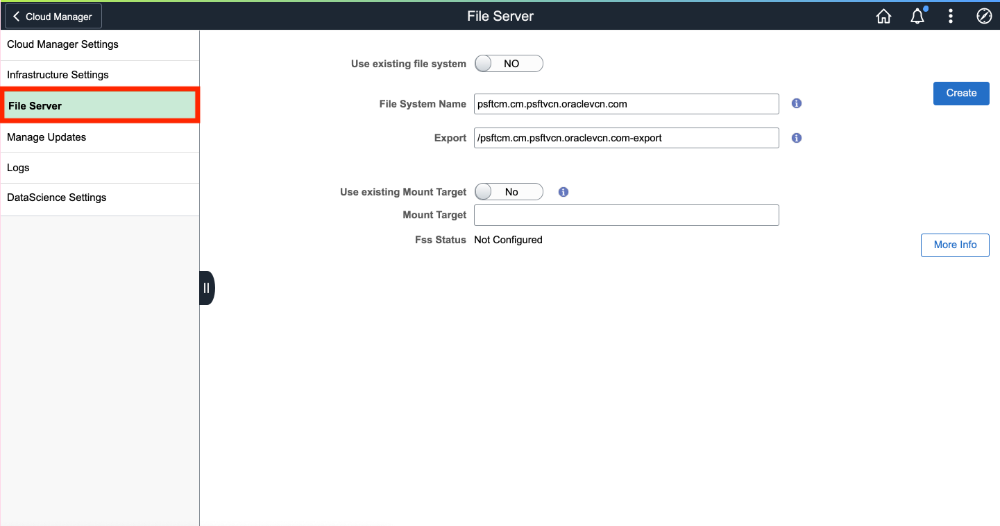
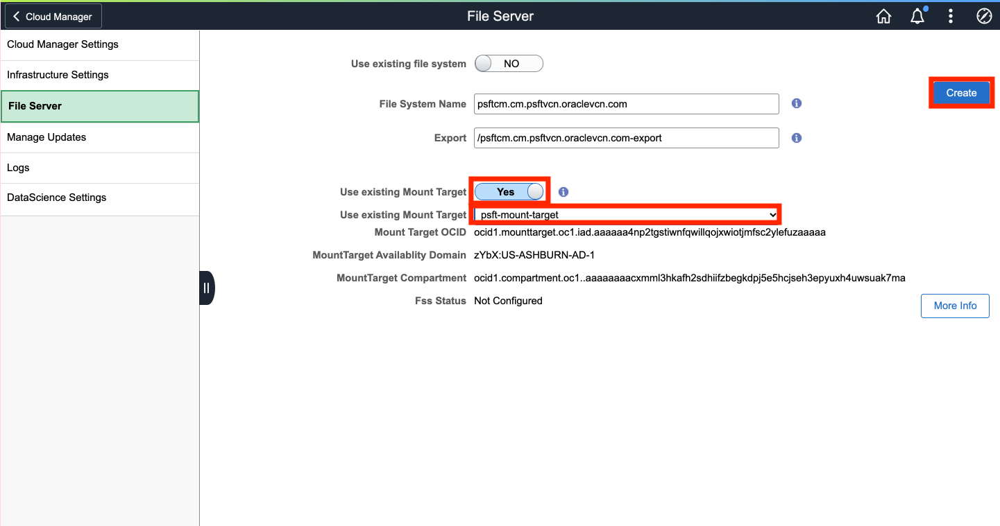
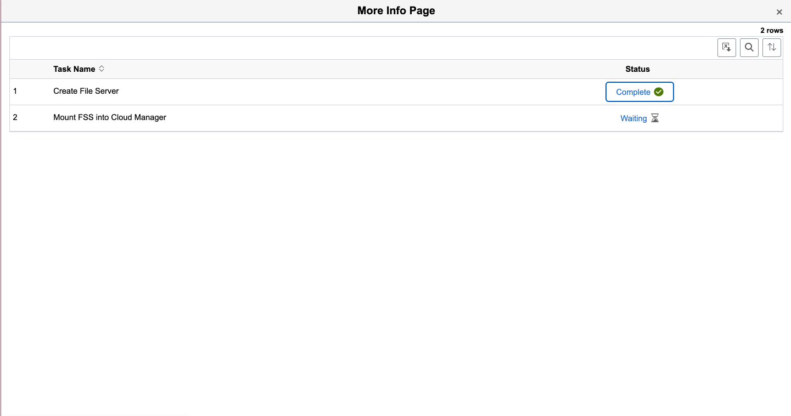
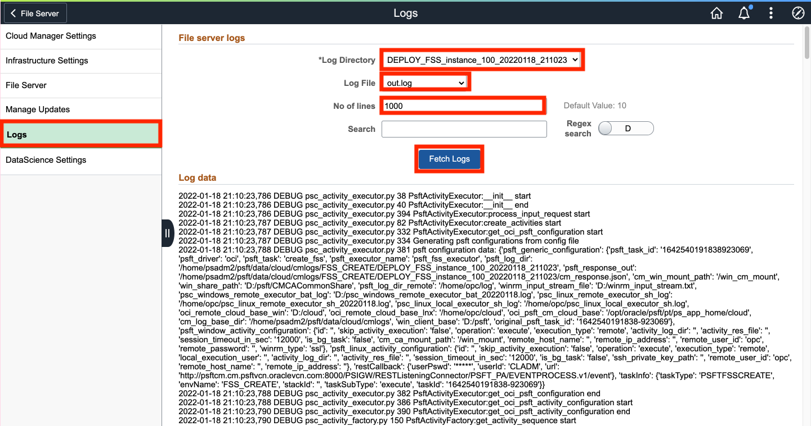
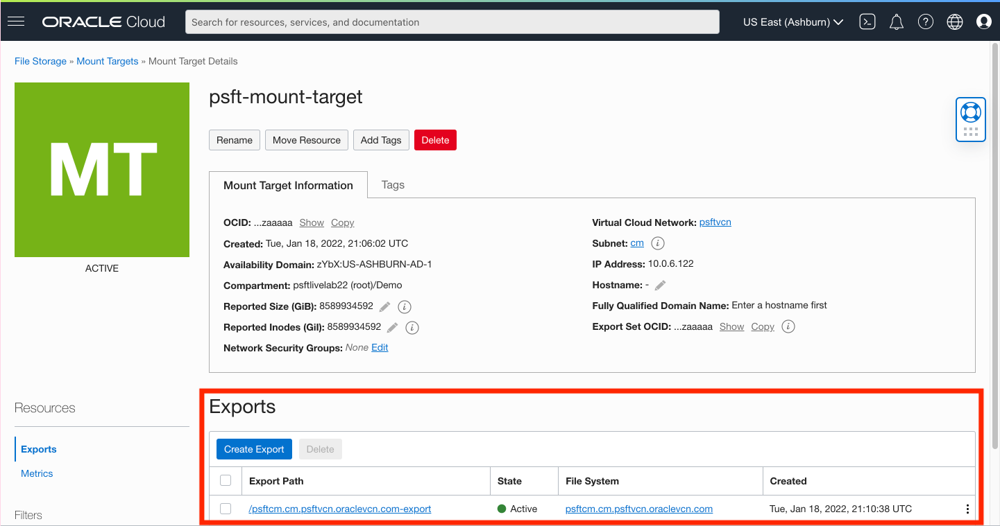

# Setting Up File Storage System

## Introduction
This lab walks you through the steps to setting up your file server for PeopleSoft Cloud Manager.

Estimated Lab Time: 45 minutes

### About File Storage Service (FSS)
The PeopleSoft Cloud Manager file server is used with the Cloud Manager Repository feature to automatically download updates. You use the Cloud Manager Infrastructure Settings page to create a File Storage service file system.

The file system created in File Storage service is a cluster file system for managing general purpose file data stored outside an Oracle Database. The file system is accessed through a mount target. The file system must have at least one export in one mount target in order for instances to mount the file system.
The mount target provides the IP address or DNS name that is used in the mount command when connecting NFS clients to a file system. A single mount target can export many file systems. The export path controls how NFS clients access file systems when they connect to a mount target.

For more detailed explanations of the File Storage service concepts, see [Overview of File Storage](https://docs.oracle.com/en-us/iaas/Content/File/Concepts/filestorageoverview.htm) in the Oracle Cloud Infrastructure documentation.

### Objectives

The purpose of this lab is to give you an overview of the IAM Service components and an example scenario to help you understand how they work together.

In this lab, you will:
* Create a Mount Target on OCI
* Use existing Mount Target to create a File System in Cloud Manager

### Prerequisites

* Oracle Cloud Infrastructure account credentials (User, Password, and Tenant)

## Task 1: Creating a Mount Target

Sign back into the OCI Console if not already logged in. 

1. Navigate to the three-line menu on the top -> **Storage** -> **Mount Targets**.

    

2. Ensure that you're in the **Demo** compartment by using the dropdown on the left. Then, click **Create Mount Target**
    
3. Now fill out the required **Mount Target Information**
    * New Mount Target Name: **psft-mount-target**
    * Availability Domain: **____AD-1**
    * Virtual Cloud Network: **psftvcn**
    * Subnet: **cm(Regional)**
    
    Click **Create**
4. You should see a dialog box pop up saying that it has successfully been created. Go ahead and click **View Details**
    
    

## Task 2: Refreshing OCI Metadata in Cloud Manager

1. In Cloud Manager, go to **Cloud Manger Settings**
    
2. On the left, click **Infrastructure Settings**
    
3. The messages should change to **OCI metadata refresh is in progress. Check status through process monitor page.**
    
4. You may need to refresh the page. You may move onto Task 3 once you see that the refresh has been successful with a recent timestamp.
    

## Task 3: Configuring File Server
1. On the left side, navigate down to File Server
    
2. Enter Mount Taget Information
    * Switch the radio button to **Yes** for **Use existing Mount Target**
    * Using the dropdown, select the Mount Taget we created: **psft-mount-target**
    
    Click **Create**.
    
3. Refresh the page and watch the Fss Status change to: **Initiating File Storage Service**
    

## Task 4: Monitoring File Server Configuration
The following are screenshots of monitoring the progress of the File Server creation.
1. Example of **More Info** in progress
    
2. Navigate to **Logs** on the left, then use the dropdown to change the **Log Directory**, choose the **Log File** you wish to see, and put a higher value in **No of lines** to view more and then click **Fetch Logs** like so:
    
3. On the Mount Target Details page on the OCI Console, you'll see the Export Path has been created. (Use the 3-line menu on the top, **Storage** --> **Mount Targets**. Select the mount target we created: **psft-mount-target** to view the details)
    
4. The file server should be created within 10 minutes. ‘**FSS Configured**' will appear when the File Server has completed configuring
    

 Please wait until the file server status shows ‘**FSS Configured**' to continue.

You may now **proceed to the next lab.**

## Acknowledgments
* **Authors** - Megha Gajbhiye, Cloud Solutions Engineer; Sara Lipowsky, Cloud Engineer
* **Last Updated By/Date** - Sara Lipowsky, Cloud Engineer, January 2022

## Need Help?
Please submit feedback or ask for help using our [LiveLabs Support Forum](https://community.oracle.com/tech/developers/categories/Migrate%20SaaS%20to%20OCI). Please click the **Log In** button and login using your Oracle Account. Click the **Ask A Question** button to the left to start a *New Discussion* or *Ask a Question*.  Please include your workshop name and lab name.  You can also include screenshots and attach files.  Engage directly with the author of the workshop.

If you do not have an Oracle Account, click [here](https://profile.oracle.com/myprofile/account/create-account.jspx) to create one.