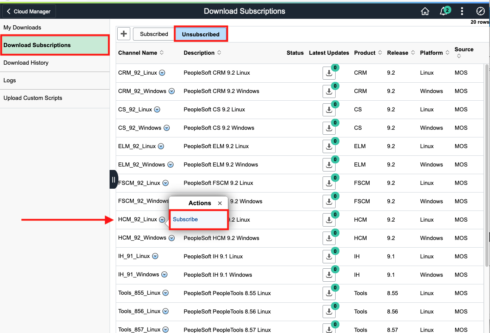
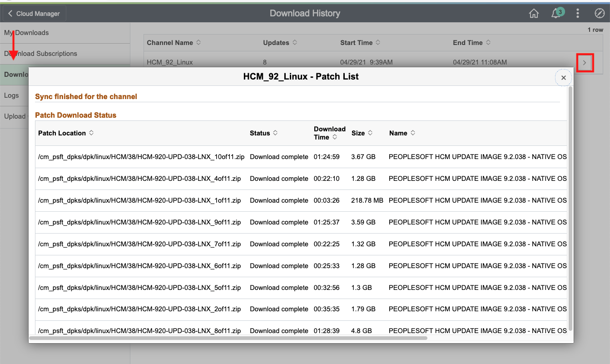

# Subscribing to PeopleSoft Download Channels

## Introduction
Cloud Manager is delivered with channels for PeopleSoft applications, which are available after you complete the installation and configuration. An administrator can subscribe to multiple channels and download all necessary PIs (PeopleSoft Update Images) and PRPs (PeopleSoft Release Patchset) that the organization needs.

Estimated Lab Time: 5 minutes + 2 hours waiting for downloads to complete

### Objectives
In this lab you will:
* subscribe to the download channels of your choosing for the latest PeopleSoft application updates

### Prerequisites
- Access to the Cloud Manager Dashboard

## Task 1: Subscribing to a Channel

1.	Navigate to **Cloud Manager Dashboard** > **Repository** 
    

2.	Click on **Download Subscriptions** on the left and switch over to the **Unsubscribed** tab.

3.	We will be creating an HCM environment, so scroll down **HCM\_92\_Linux**, click the arrow and then **Subscribe**

    
4. Repeat the same steps for **HCM\_92\_Windows** as our environment will have both a Linux node and a Windows node.
5. Go to the subscribed tab to view progress status for both channels.
    

    *This takes ~2 hours to complete.* 
    Make sure you refresh the page to check the current progress. Proceed to next lab only when you see green check marks as the status for both **HCM\_92\_Linux** and **HCM\_92\_Windows** as shown in the picture:

    

You may now **proceed to the next lab.**

## Acknowledgments
* **Authors** - Megha Gajbhiye, Cloud Solutions Engineer; Sara Lipowsky, Cloud Engineer
* **Last Updated By/Date** - Sara Lipowsky, Cloud Engineer, May 2021

