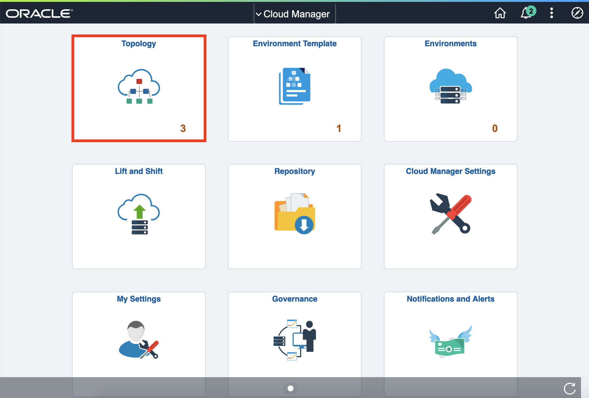
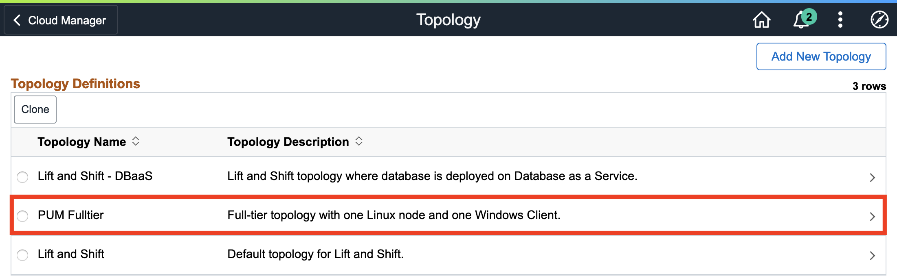
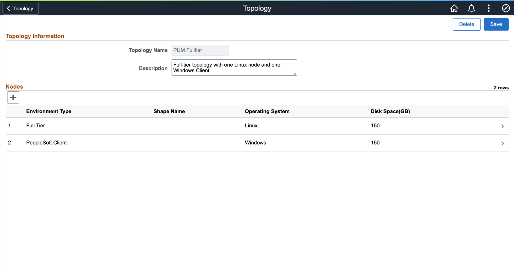
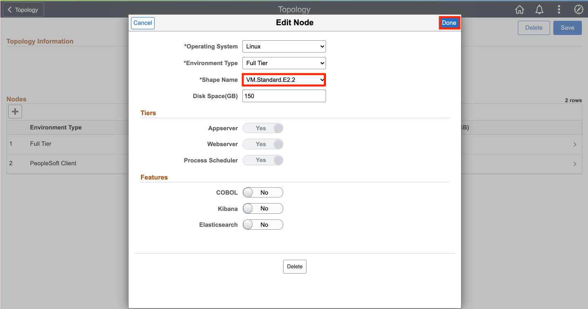
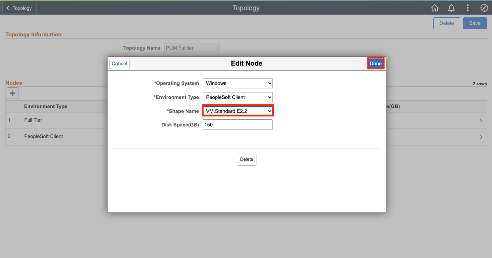
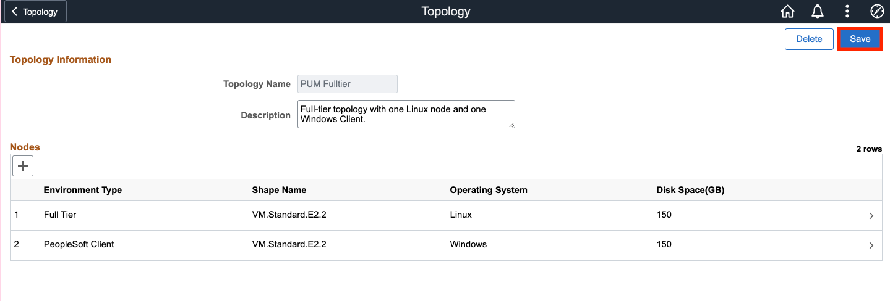

# Reviewing and Updating a Topology

## Introduction

Cloud Manager provisions PeopleSoft environments on-demand with just a few clicks. The entire provisioning process is automated. At the end of provisioning, a ready-to-use environment is available within a short time. The environments can be created by a three step process:
1. Create Topology
2. Create Template
3. Create Environment

Topology defines the infrastructure layout that will be created on Oracle Cloud by Cloud Manager. An administrator defines a template for creating an environment. The topology is encapsulated inside the template. 
Users can select a template, override topologies, change any attributes, if needed, and provision PeopleSoft environments on demand. Users are allowed to perform actions on a running environment, such as stop, view details, create new template from it, and so on.

We will be creating a PUM Full Tier Topology with 2 nodes:
* Linux Full Tier in private subnet (ft)
* PeopleSoft Client in private subnet (win)

Estimated Time: 5 minutes

### Objectives
In this lab you will:
* Create a topology for a template to automatically provision a PeopleSoft environment
* Give it required attributes including name, description, OS, shape type, and environment type

### Prerequisites
- Access to the Cloud Manager console.

## Task 1: Defining a Topology

1.	Navigate to **Cloud Manager Dashboard** > **Topology**
    
    

2. Click **PUM Fulltier**
    
    

    Here we have 2 nodes: Full Tier (Linux) and PeopleSoft Client (Windows), but they are missing shapes. 
    
    

3. Let's edit the **Full Tier** node first. Using the drop down, select **VM.StandardE2.2** 
    
    

    Click **Done**

4. Do the same for the **PeopleSoft Client** node. Using the dropdown, select **VM.StandardE2.2** 
    
    
    Click **Done**.

5. When you have this, click **Save**
    

You may now **proceed to the next lab.**

## Acknowledgements
* **Authors** - Deepak Kumar M, Principal Cloud Architect; Sara Lipowsky, Cloud Engineer
* **Contributors** - Edward Lawson, Master Principal Cloud Architect
* **Last Updated By/Date** - Ziyad Choudhury, Principal Cloud Architect, August 2023
