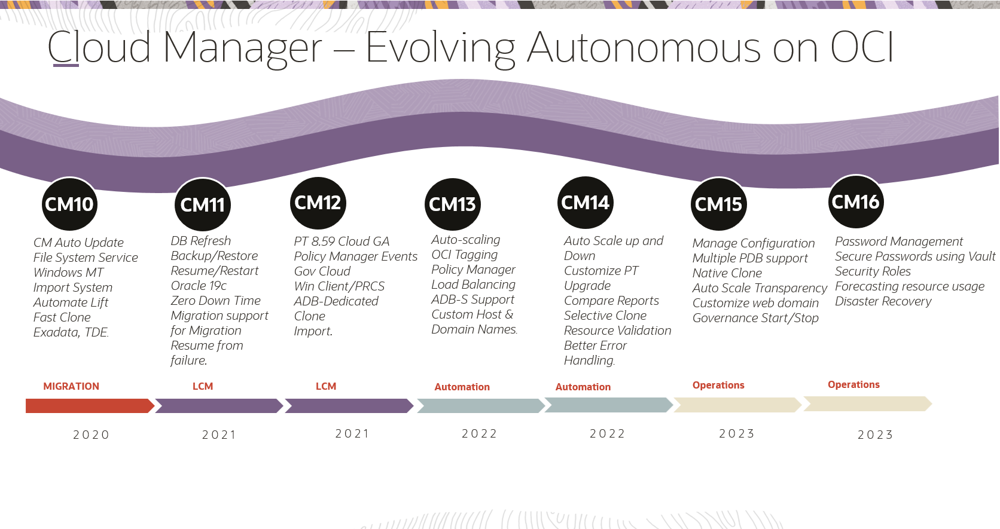

# Introduction

## About this Workshop

This hands-on lab provides users with step-by-step instructions for preparing their **Oracle Cloud Infrastructure (OCI) Tenancy**, including setting up a user group, adding a user and policies, as well as a compartment to house **Cloud Manager 16 using Marketplace** and associated resources. After provisioning and configuring Cloud Manager 16, users will **subscribe to the HCM deployment kit** to then create a **topology**, **environment template**, and **provision a PeopleSoft Environment**. 

In addition to getting a PeopleSoft Environment up and running on Cloud Manager, users can then move on to the simple and interactive Labs (12-16). 
These optional labs help familiarize users with the features of Cloud Manager and can be completed in any order.

Estimated Lab Time: 7.5 hours, including provisioning time (Labs 1-11) 

To ensure success:
- The workshop is quite detailed and technical. PLEASE take your time and DO NOT skip any steps.
- Follow all naming conventions (compartment, group, etc..) and passwords as directed.   
- IP addresses and URLs in the screenshots in this workshop may differ from what you use in the labs as these are dynamically generated.
- The user interface for the Oracle Cloud Infrastructure is constantly evolving. As a result the screens depicted in this tutorial may not exactly coincide with the current release. This tutorial is routinely updated for functional changes of PeopleSoft Cloud Manager and Oracle Cloud Infrastructure, at which time any differences in the user interface will be reconciled.

### Architecture Diagram
Oracle recommends deploying all instances in private subnets for production environments where there are no internet-facing endpoints. This type of deployment is useful when you want to have a hybrid deployment with the cloud as an extension to your existing data centers.

In this deployment, all the instances including application and database servers are deployed in a private subnet. A public IP address can’t be assigned to instances created in a private subnet, so you can’t access these instances over the internet. 

Create a bastion host in this configuration, and then access all the servers in private subnet from the bastion host.

  

**Cloud Manager Evolution**

  

### Objectives

In Labs 1-11, you will:
* Set up an Oracle Cloud Infrastructure Account (Prerequisites) 
* Create Identity and Access Management (IAM) Resources (Lab 1) 
* Provision the PeopleSoft Cloud Manager using Marketplace (Lab 2)
* FOR MAC USERS ONLY: Access Private Cloud Manager Instance via SSH and Log in via Browser (Lab 3)
* FOR WINDOWS VM ONLY: Access Private Cloud Manager Instance via SSH and Log in via Browser (Lab 4)
* Configure Cloud Manager Settings (Lab 5)
* Set up the File System (Lab 6)
* Subscribe to PeopleSoft Channels (Lab 7)
* Review and Update a Topology (Lab 8)
* Create a New Environment Template (Lab 9)
* Deploy a PeopleSoft Environment (Lab 10)

As aforementioned, Labs 1-10 cover the core purpose. 
Labs 11-16 guide users through executing additional Cloud Manager features:
Once users have spun up a PeopleSoft environment, they can:
* Clone an Existing PeopleSoft Environment (Lab 11) 
* Backup an Existing PeopleSoft Environment (Lab 12) 
* Patch an Existing PeopleSoft Environment (Lab 13)
* Upgrade an Existing PeopleSoft Environment (Lab 14)
* Create Governance Policies to Schedule Starting and Stopping a PeopleSoft Environment (Lab 15)
* Create a PUM Connection from a Source PeopleSoft Environment to a Target Environment (Lab 16)

### Prerequisites
* An OCI tenancy with administrator user access. 
* My Oracle Support (MOS) credentials. Please make sure that you can successfully login to [Oracle Support](https://support.oracle.com). Note down this login credential in a notepad. You will use it later to provision Cloud Manager.
* Workstation/laptop to access the OCI console, PSFT Cloud Manager, and provisioned instances
    - If you are using a Mac AND have administrator access to your machine, please skip Lab 4
    - If you are using a Windows OR do not have administrator access, please complete the Windows VM Lab and skip Lab 3
* The following should be installed:
    * A web browser (i.e. Chrome or Firefox) to connect to OCI web console and Cloud Manager. 
* Useful Download Links:
    * Git Bash [https://git-scm.com/download/win](https://git-scm.com/download/win)
    * Putty [https://www.chiark.greenend.org.uk/~sgtatham/putty/latest.html](https://www.chiark.greenend.org.uk/~sgtatham/putty/latest.html). In the Package Files section, click on an installer depending on 32/64 bits.
    * Remote Desktop for Mac [https://apps.apple.com/us/app/microsoft-remote-desktop/id1295203466?mt=12](https://apps.apple.com/us/app/microsoft-remote-desktop/id1295203466?mt=12)
    * PeopleSoft Cloud Manager Get Started: [https://docs.oracle.com/en/applications/peoplesoft/cloud-manager/index.html](https://docs.oracle.com/en/applications/peoplesoft/cloud-manager/index.html)

## Appendix

*Terminology*

The following terms are commonly employed in PeopleSoft cloud operations and used throughout our documentation:

**Availability Domain** – One or more data centers located within a region.

**Bastion Service** – A fully managed serverless offering on Oracle Cloud Infrastructure (OCI) to connect to your resources in a private subnet of your Oracle Virtual Cloud Network (VCN)

**Bucket** – A logical container used by Object Storage for storing your data and files. A bucket can contain an unlimited number of objects.

**Compartments** – Allows you to organize and control access to your cloud resources. A compartment is a collection of related resources (such as instances, virtual cloud networks, block volumes) that can be accessed only by certain groups.

**PeopleSoft Cloud Manager (PSFT)** - Oracle PeopleSoft Cloud Manager is a PeopleSoft lifecycle management application used for creating, managing, and configuring PeopleSoft environments on Oracle Cloud Infrastructure.

**PSFT Cloud Manager infrastructure** – Virtual network resources, compute resources, and policies required to run PSFT Cloud Manager on Oracle Cloud Infrastructure.

**Virtual Cloud Network (VCN)** – Networking and compute resources required to run PSFT on Oracle Cloud Infrastructure. The PSFT VCN includes the recommended networking resources (VCN, subnets routing tables, internet gateway, security lists, and security rules) to run Oracle PeopleSoft on OCI.

**Oracle Cloud Infrastructure (OCI)** – Combines the elasticity and utility of public cloud with the granular control, security, and predictability of on-premises infrastructure to deliver high-performance, high availability, and cost-effective infrastructure services.

**Region** – Oracle Cloud Infrastructure are hosted in regions, which are located in different metropolitan areas. Regions are completely independent of other regions and can be separated by vast distances – across countries or even continents. Generally, you would deploy an application in the region where it is most heavily used, since using nearby resources is faster than using distant resources.

**Subnet, Private** - Instances created in private subnets do not have direct access to the Internet. In this lab, we will be provisioning the Cloud Manager stack in Resource Manager, and creating private subnets. We will then choose to create a "jump host", or bastion host, as part of the installation. The IP for a private subnet cannot be accessed directly from the Internet. To access our CM instance in a private subnet, we will set up a jump host to enable SSH tunneling and Socket Secure (SOCKS) proxy connection to the Cloud Manager web server (PIA). The jump host is created using an Oracle Linux platform image, and will be created inside the VCN.

**Subnet, Public** - Instances that you create in a public subnet have public IP addresses, and can be accessed from the Internet.

**Tenancy** – When you sign up for Oracle Cloud Infrastructure, Oracle creates a tenancy for your company, which is a secure and isolated partition within Oracle Cloud Infrastructure where you can create, organize, and administer your cloud resources.

## Acknowledgements
* **Authors** - Deepak Kumar M, Principal Cloud Architect; Sara Lipowsky, Cloud Engineer
* **Contributors** - Edward Lawson, Master Principal Cloud Architect; Megha Gajbhiye, Principal Cloud Architect
* **Last Updated By/Date** - Ziyad Choudhury, Principal Cloud Architect, August 2023

