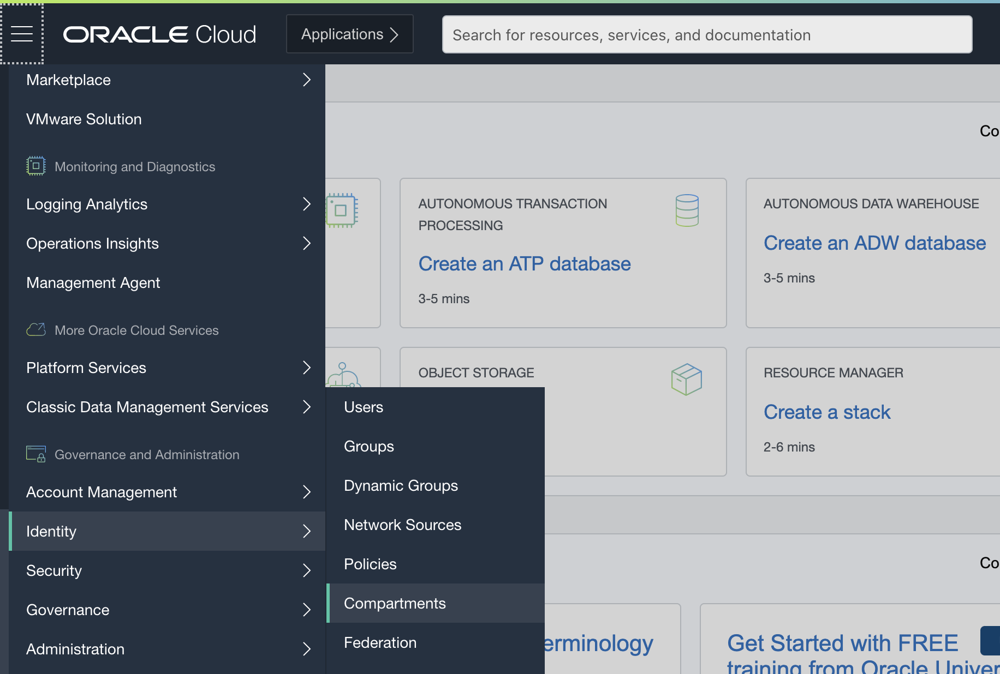
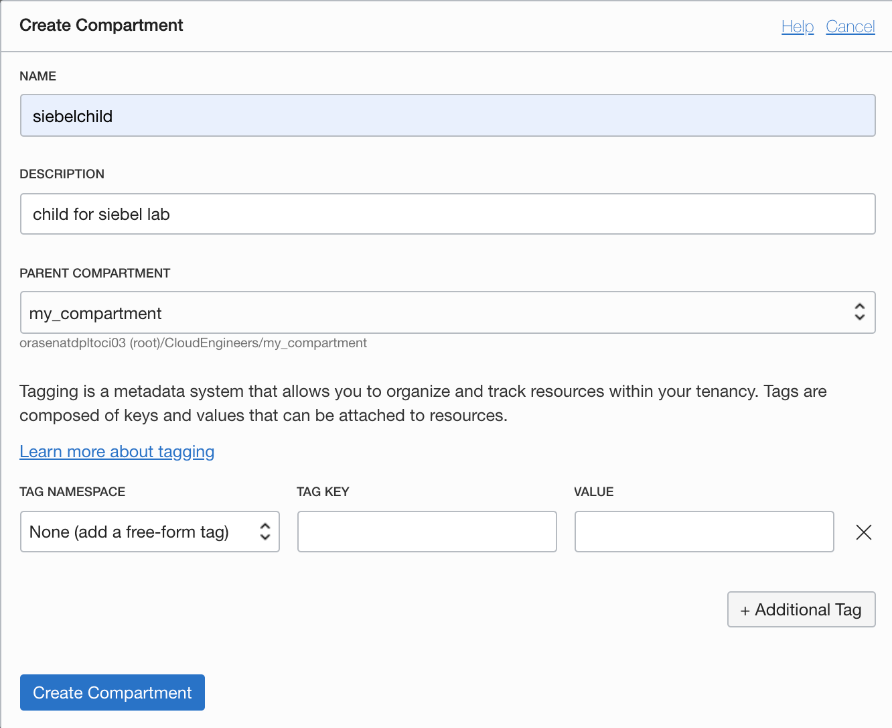
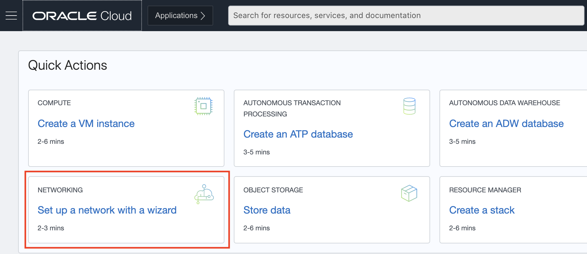
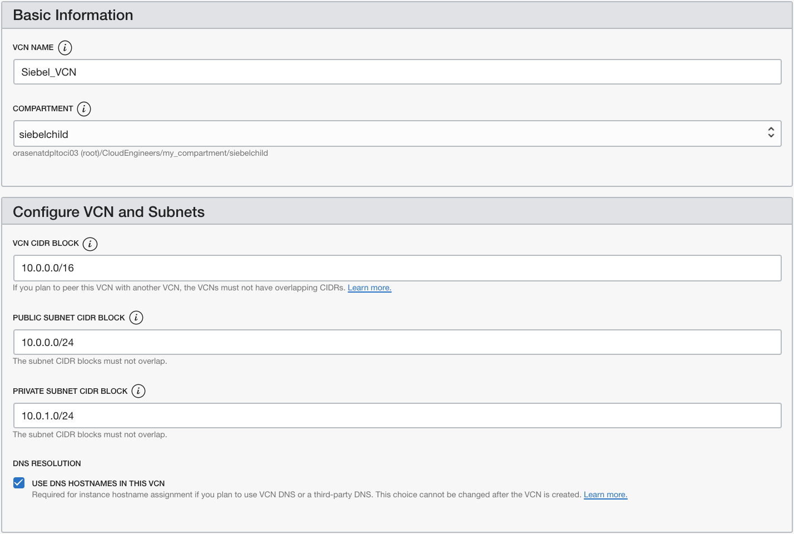
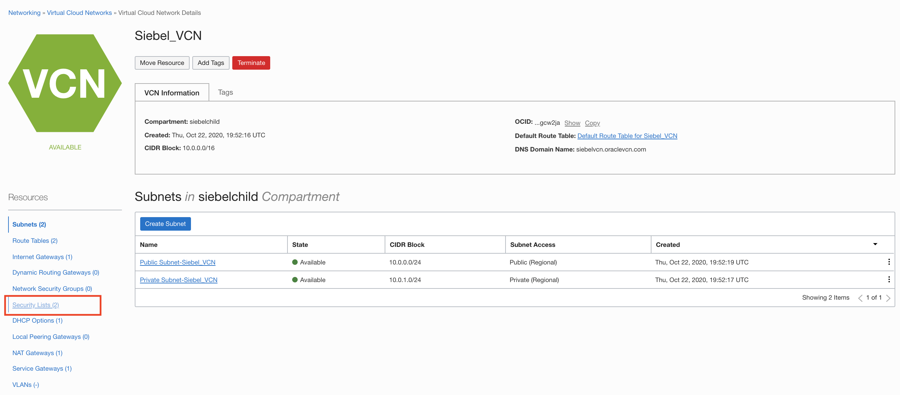
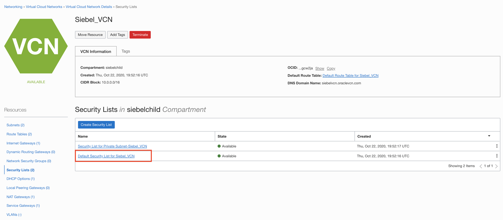
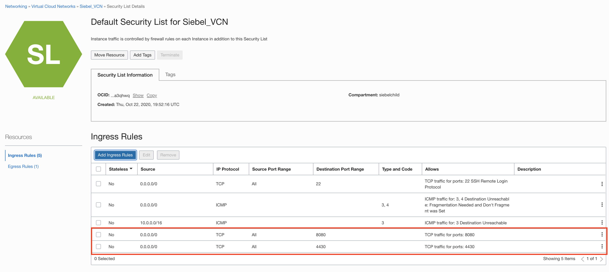

# Set Up OCI for Siebel Deployment

## Introduction

In this lab, the recently provisioned OCI Trial tenancy will be set up for the Siebel Application.

Estimated Lab Time: 20 minutes

### Objectives

To set up the OCI tenancy, in this lab, you will:
*   Create a Sub-Compartment
*   Create a Virtual Cloud Network (VCN)
*   Establish Security List Rules to allow access to our Siebel Instance

### Prerequisites
* A user with 'manage' access to Networking and Compute, compartment, and marketplace access
* SSH key

## Task 1: Create a Sub-Compartment

In this part of the lab, we create a sub-compartment to organize the resources we will create

Compartments are the primary building blocks you use to organize your cloud resources. You use compartments to organize and isolate your resources to make it easier to manage and secure access to them

When your tenancy is provisioned, a root compartment is created for you. Your root compartment holds ***all*** your cloud resources

1.  Please log into to your OCI tenancy, if you are not already signed in. Example for Ashburn location - https://console.us-ashburn-1.oraclecloud.com/

2.  On the Oracle Cloud Infrastructure Console Home page, click the Navigation Menu   in the upper-left corner, select Identity, and then select the Compartments option.

  

3.	If you only have a root compartment you can click the Create Compartment button

    If have a development compartment click on its name to open it. Inside of there we will click on the create compartment button and create a child as shown

    

4.	Choose a Name (e.g. “**siebelchild**”), fill out the form and click the ***Create Compartment*** button

  **Note:** that the parent compartment should be either in your the root compartment or your root compartment itself

  

  Now you can click the Oracle icon at the top of your screen to go to the home page and move onto the next step

  

##  **STEP 2:**  Create a Virtual Cloud Network (VCN)

To create a VCN on Oracle Cloud Infrastructure:

1. On the Oracle Cloud Infrastructure Console Home page, under the Quick Actions header, click on Set up a network with a wizard

  

2.	Select VCN with Internet Connectivity, and then click Start VCN Wizard

  

3. In this window, fill in the following fields with the information shown below:

    **VCN NAME:**

        Siebel_VCN     (or any other unique name for the VCN)

    **COMPARTMENT:**

        siebelchild        (or any other compartment previously created)

    **VCN CIDR BLOCK:**

        10.0.0.0/16

    **PUBLIC SUBNET CIDR BLOCK:**

        10.0.2.0/24

    **PRIVATE SUBNET CIDR BLOCK:**

       10.0.1.0/24

    **USE DNS HOSTNAMES IN THIS VCN:**

        Make sure this is checked

    

    Then, scroll down to the bottom and click the ***Next*** button.

4.	On the “Review and Create” page, click on the create button.

5. On the “Created Virtual Cloud Network” page wait until you see ***Virtual Cloud Network creation complete*** at the top of the list

    **NOTE:** If any of the necessary resources fail to be created simply click the retry button and it should correct the issue immediately

    

    Then click on the View Virtual CLoud Network Button shown

    

## Task 3:  Establish Security List Rules for Siebel

With the VCN in place, define the open inbound and outbound ports that will be available to instances created within the VCN

1.	From the details page of the Siebel_VCN, under the ***Resources*** section in the left pane, select ***Security Lists***
  

2.	In the Security Lists section, click the Default ***Security List*** for ***Siebel_VCN*** link  
  

3.	On Default Security List, under Resources, click the Add Ingress Rules button.
  

4.   Within the interface, click the + ***Additional Ingress Rules*** button and add 2 new rows with the following criteria

        | Stateless | Source Type |	Source CIDR | IP Protocol | Source Port Range |	Destination Port |
        | --- | --- | --- | --- | --- | --- |
        | Unchecked | CIDR|	0.0.0.0/0 |	TCP | All |	4430 |
        | Unchecked | CIDR|	0.0.0.0/0 |	TCP | All |	8080 |

        Click the ***Add Ingress Rules***  button when complete

        After you have created the two new rules your Security List should look like this

        

These Ingress Rules will be sufficient to allow the network traffic required for the Siebel environment

## **Summary**

In this lab, OCI has been set up for the networking required to be able to access the Siebel environment that will be created in the next lab

## Acknowledgements
* **Authors**
  - JB Anderson, Cloud Engineering
  - Chris Wegenek, Cloud Engineering
  - Naresh Sanodariya, Cloud Engineering
* **Contributors** -  Arunkumar Ravichandran, Cloud Engineering
* **Last Updated By/Date** - Chris Wegenek, Cloud Engineering, Jan 2021

