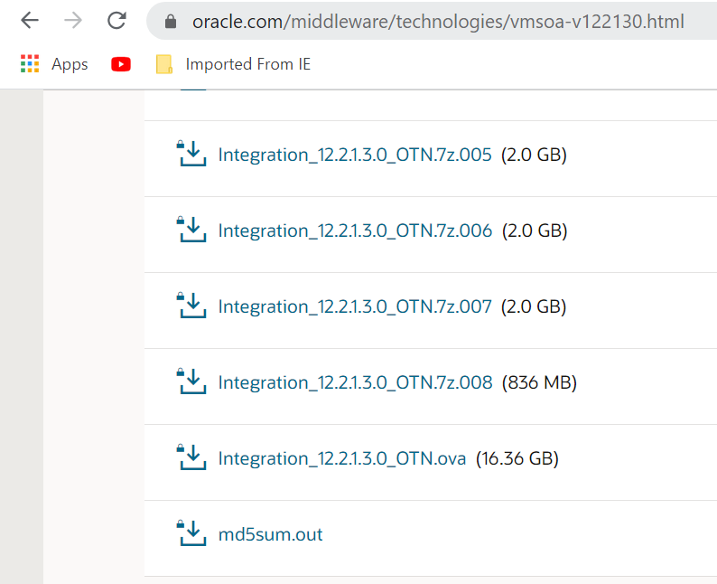
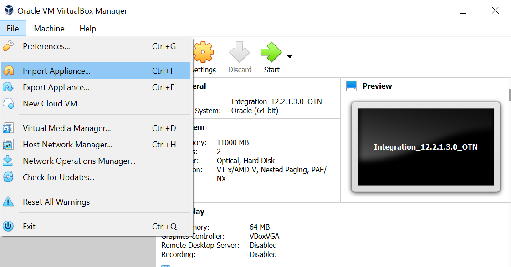
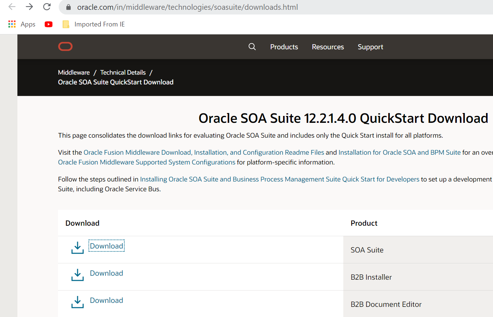
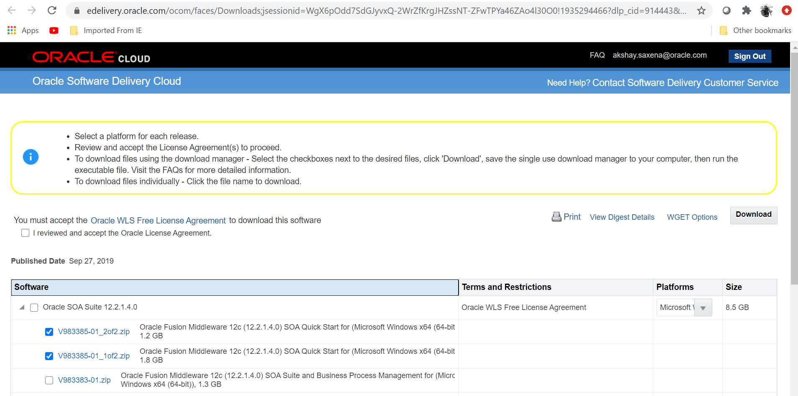

# Set up a Local (on-premises) Environment using VirtualBox

## Introduction

This lab will walk you through setting up a local SOA Suite environment to simulate an established on-premises environment, using **Oracle VM VirtualBox** on your local machine. 

At the end of this lab, you will have a local environment running with an Oracle SOA Suite 12.2.1.3 VM and a SOA Suite 12.2.1.4 quick start with JDeveloper 12.2.1.4.

Estimated Lab Time: 30 minutes to over 1 hour depending on your internet speed for download.

### Objectives

In this lab you will:

- Install Oracle VM VirtualBox.
- Download the SOA Suite 12.2.1.3 .ova VM image file.
- Startup Oracle VM VirtualBox demo environment.
- Prepare your VM box with downloaded SOA Suite 12.2.1.3 .ova file.
- Install the SOA Suite 12.2.1.4 quick start on your local machine.

### Prerequisites

To run this lab, you will need:
- An Oracle account to download the files from Oracle Technical Network (OTN).
- 25 GB of local storage available.
- A minimum of 16 GB of RAM.
- A minimum of 4 CPUs.

## Task 1: Download the SOA Suite 12.2.1.3 VM image

1. Download the SOA Suite 12.2.1.3 .ova image file from 

    [https://www.oracle.com/middleware/technologies/vmsoa-v122130.html](https://www.oracle.com/middleware/technologies/vmsoa-v122130.html)

    Download the `Integration_12.2.1.3.0_OTN.ova (16.36 GB)` file.

    

## Task 2: Import the OVA image into VirtualBox

1. Start Oracle VM VirtualBox .

2. Go to **File** and Select **Import Appliance**.

    

3. Select the `Integration_12.2.1.3.0_OTN.ova` file.

4. Click **Next**.

    This may take several minutes.

## Task 3: Start the SOA 12.2.1.3 VM.

Once the import is successfull;

1. Click **Start** to start your SOA 12.2.1.3 environment. 

2. Log in to the VM with:

    - username: `oracle`
    - password: `oracle`

## Task 4: Install SOA Suite 12.2.1.4 Quick Start

1. Go to [https://www.oracle.com/in/middleware/technologies/soasuite/downloads.html](https://www.oracle.com/in/middleware/technologies/soasuite/downloads.html).

2. Click **Download** in front of **SOA Suite** product.

    >*note: You need an Oracle OTN account and be logged in, in order to reach the site*.

    

3. Select the following items from the list:

    - `V983385-01_1of2.zip`
    - `V983385-01_2of2.zip`
    
    

4. Select your platform.

5. Click on **Download**.

6. Verify the SOA Suite versions SOA Suite 12.2.1.3 VM is working properly

7. Verify the SOA Suite 12.2.1.4 local installation is working properly

8. Verify that both JDeveloper versions are running properly.

You may proceed to the next lab.

## Acknowledgements

 - **Author** - Akshay Saxena, September 2020
 - **Last Updated By/Date** - Akshay Saxena, September 2020
