# Set up an 'on-premises' environment using the workshop image

## Introduction

This lab walks you through setting up an environment to simulate an established SOA 12.2.1.3 on-premises environment, using a Compute instance on Oracle Cloud Infrastructure OCI deployed through the marketplace.

At the end of this lab, you will have a simulated 'on-premises' environment running with an Oracle SOA Suite 12.2.1.3 VM containing an Oracle Database 12c, WebLogic Server 12c, and Jdeveloper 12.2.1.4, along with a demo application to be migrated.

>Note: Jdeveloper 12.2.1.4 is required to upgrade the application code from 12.2.1.3 to 12.2.1.4 to migrate to the SOAMP 12.2.1.4 on OCI.

Estimated Lab Time: 15 minutes.

### Objectives

In this lab you will:

- Launch the demo environment image from Marketplace.
- Check that the services are up and running.

### Prerequisites

For this lab you need:

- A bare metal compute instance with at least 4 OCPUs (8 preferred) available to run the image.
- Microsoft Remote Desktop Client (or similar RDP client) installed to connect to the demo environment.

## Task 1: Launch the Workshop Marketplace Stack

1. Navigate to [Workshop Environment Marketplace Stack](https://cloudmarketplace.oracle.com/marketplace/listing/84694612)

2. Click **Get App**.

    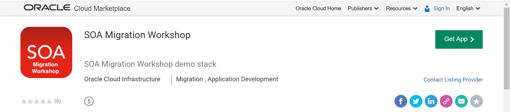

3. Select OCI Region and sign in to your Oracle Cloud Infrastructure (OCI) account.

    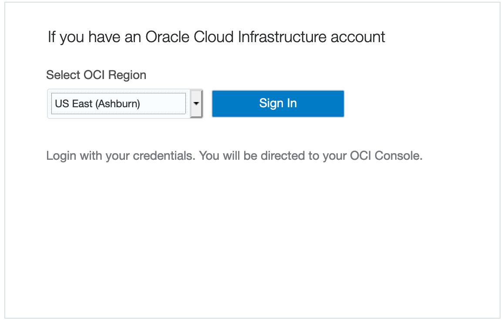

4. Select the compartment you prepared to run this workshop.

    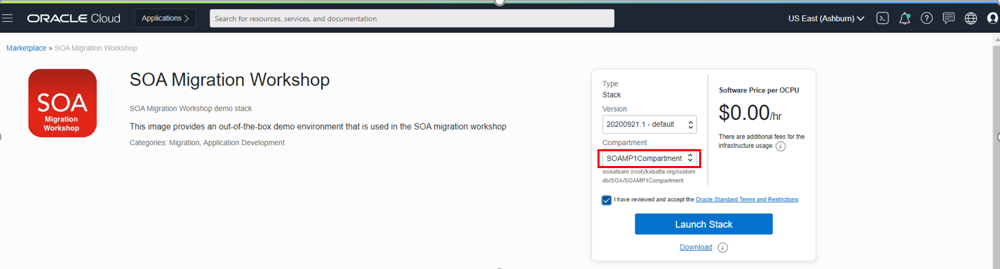

5. Accept the Terms and Conditions and click **Launch**.

    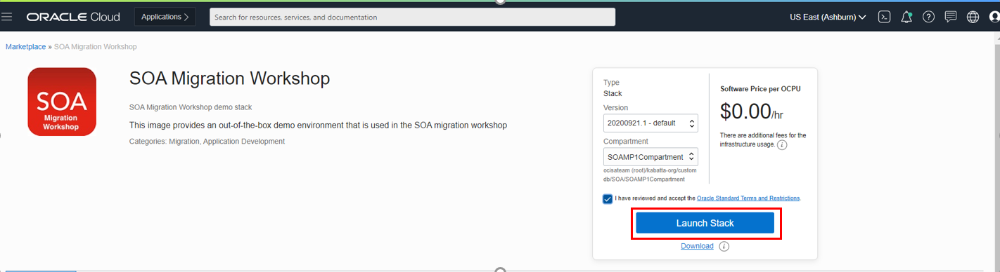

6. Provide an optional name and description, and click **Next**.

    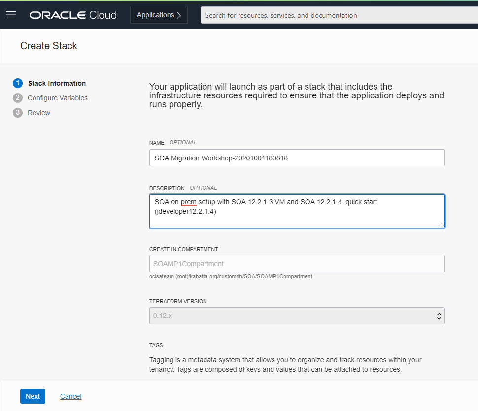

7. Choose a shape.

  The image will work on a VM shape but will be very slow. It is highly recommended to use a Bare Metal shape such as BM.Standard.E3.128 or BM.Standard.E2.x.

  Make sure the shape you chose is available in your tenancy.

    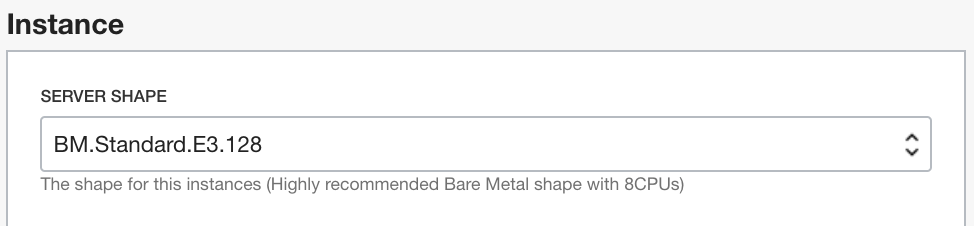

7. Browse to your **SSH Public Key**.

   To connect to the SOA servers via SSH, you need to provide a public key the server will use to identify your computer.

    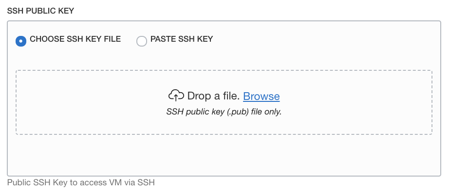

8. Click **Next** and then **Create**.

    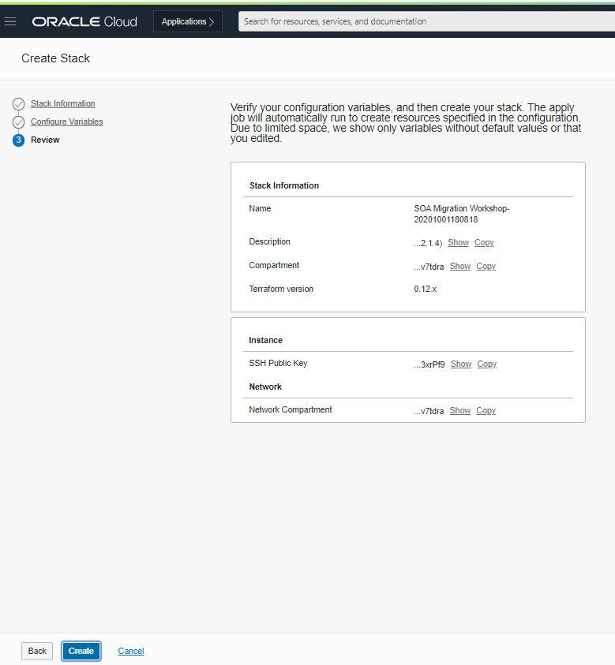

    

  It will take about 1 to 2 minutes to create the stack. 

8. When the job finishes, you can find the public IP address of the instance at the bottom of the logs, or in the **Output** area. Make a note of this information.

  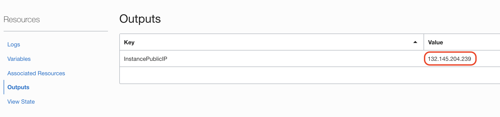

## Task 2: Connect to the Demo Environment

*It will take another 4 to 5 minutes for all the services to come online.*.

Connect to the instance using your RDP Client (the follwoing steps show the process using Microsoft Remote Desktop Client).

1. Add a new host, providing the public IP gathered from the stack output.

    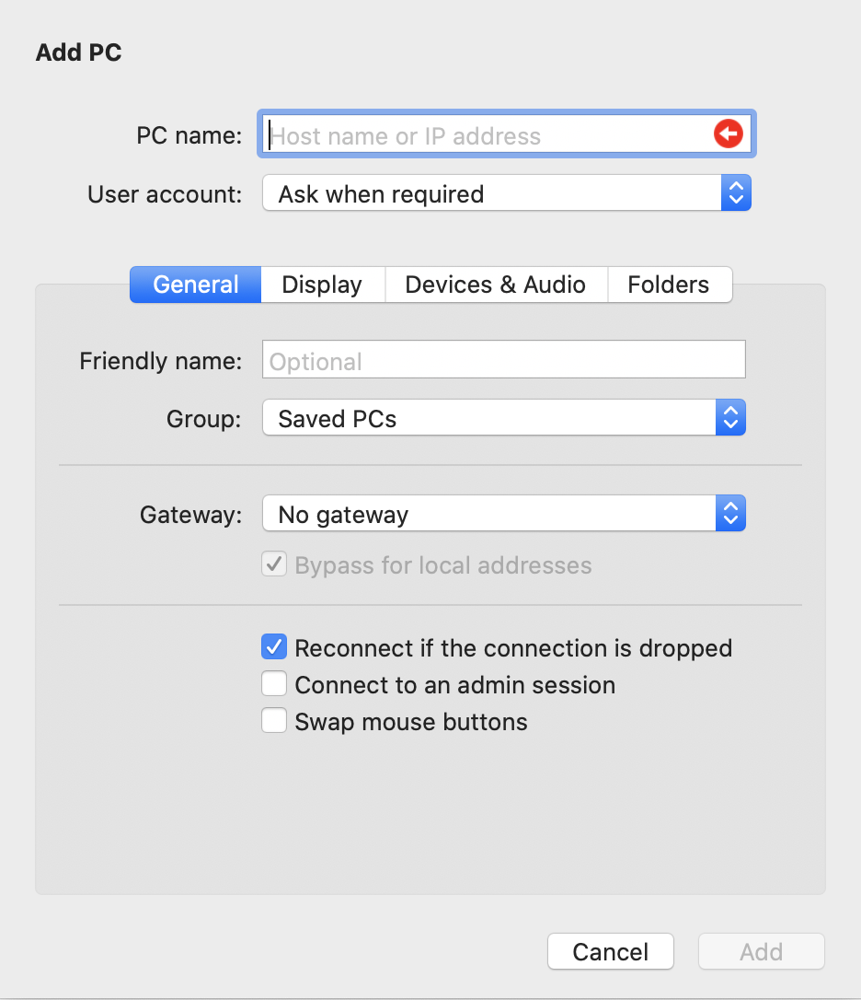

2. Connect using username `oracle` and password `oracle`.

3. If you have issues with display sizing, edit the connection and go to `Display` settings to adjust screen size.

## Task 3: Launch the SOA Domain

1. Click `SOA and Compact Domain` on the VM desktop.

    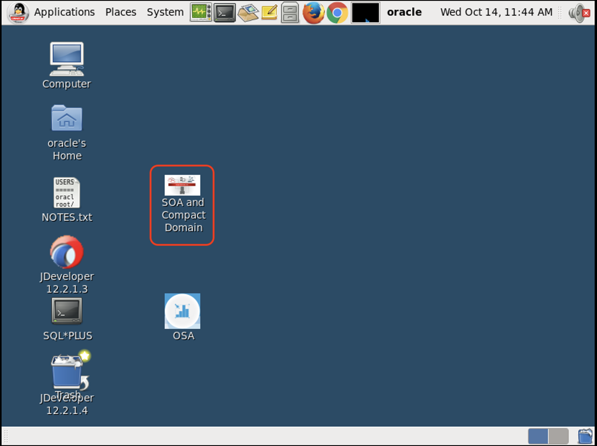

2. Double-click on the `Start soa_domain Admin Server` script to start the domain Admin Server.

    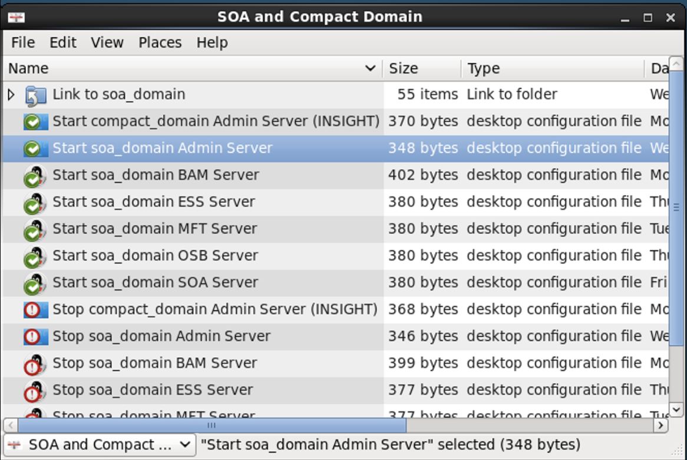

3. Wait for the admin server to be running. This will take 2 to 3 minutes.

    You will see state changed to `RUNNING` in the logs.

    

4. Double click on the `Start soa_domain SOA Server` script to start the SOA server.

    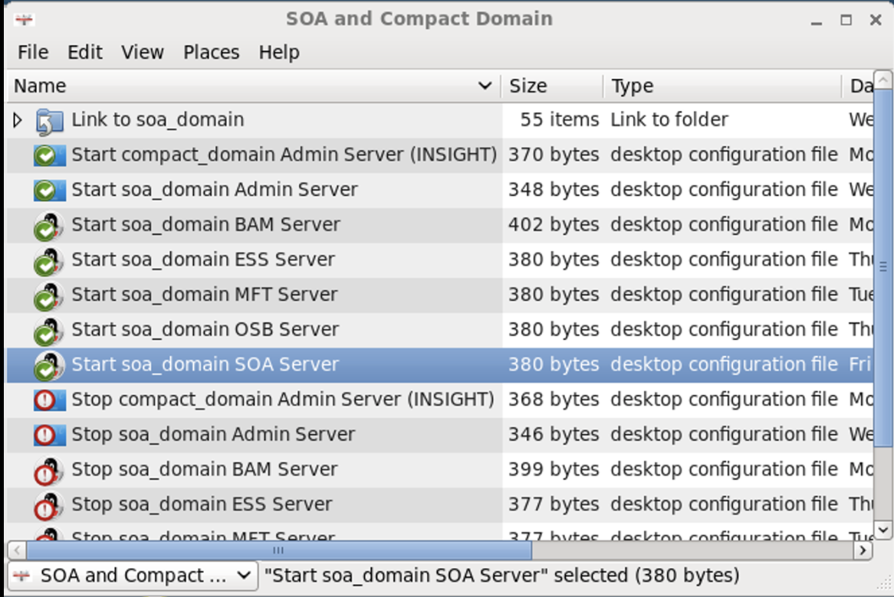

    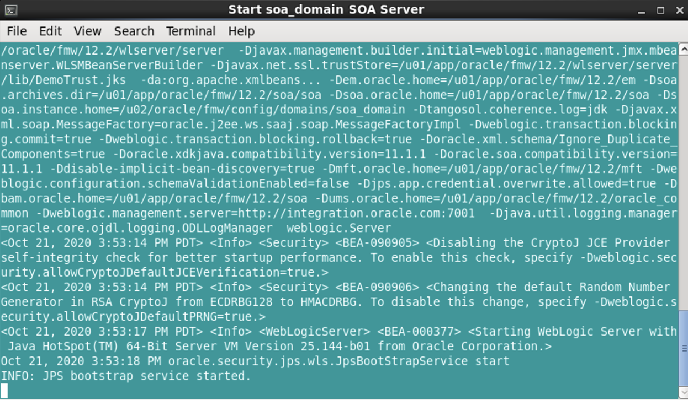

## Task 4: Check the Local Environment

1. Once the domains are started, open the Firefox web browser and select the bookmark for EM (Enterprise Manager), which points to `http://localhost:7001/em` to open the EM console.

2. Log in using usename `weblogic`, and password `welcome1`.

    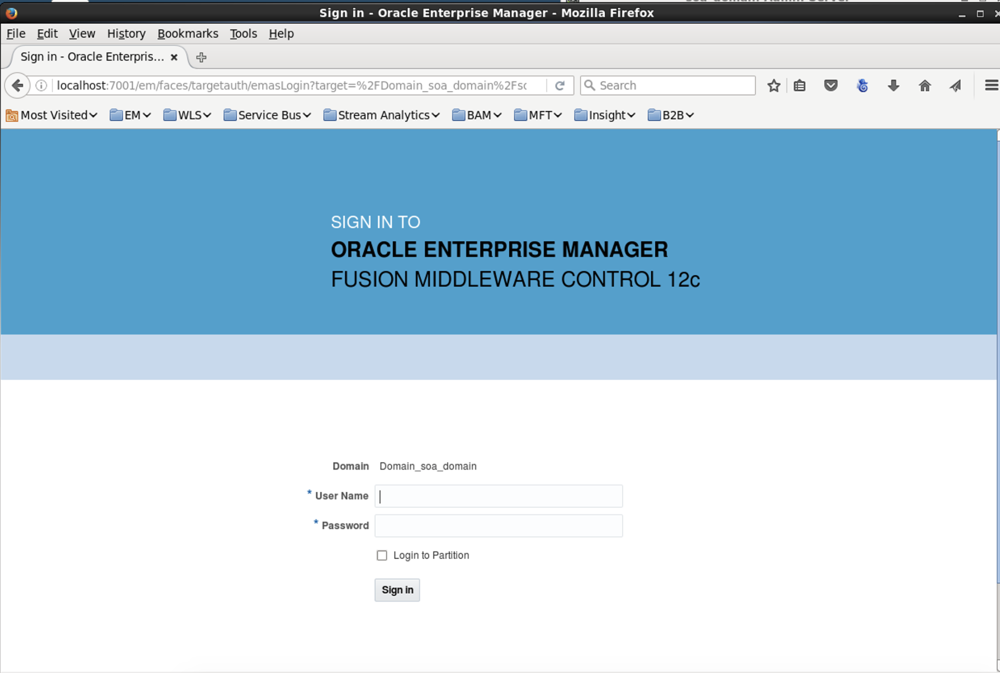

3. Check that the admin server and SOA domain are running (other domains will not be running and that is normal).

    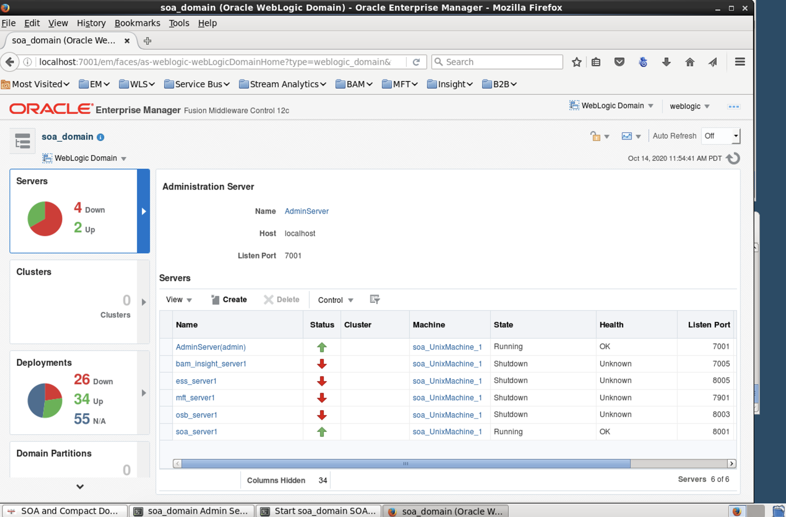

You may proceed to the next lab.

## Acknowledgements

 - **Author** - Akshay Saxena, September 2020
 - **Last Updated By/Date** - Akshay Saxena, September 2020
