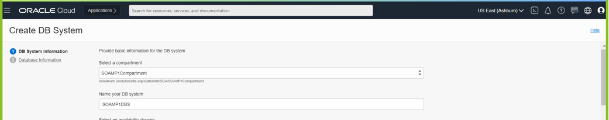
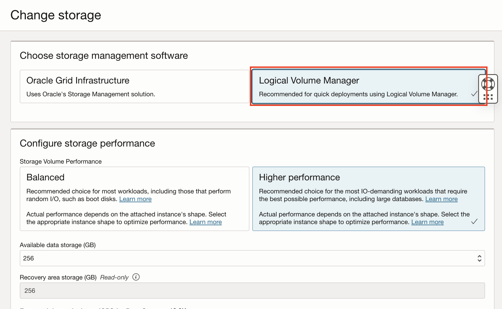

# Provision the Application Database on OCI with DBaaS

## Introduction

This lab with guide you through provisioning a Application Database

Estimated Lab Time: 30 to 35 minutes including 25 to 30 minutes provisioning time.

### Objectives

In this lab you will:

- Provision the application database as a Database Virtual Machine.
- Create a security list with proper ports open.


## Task 1: Provision the Database System

1. Go to **Database -> Base Database (VM, BM)**.

  

2. Click **Create DB System**.

  

3. Make sure you are in the **SOAMPCompartment** and select a name for your database system.

  

4. Select an availability domain or keep the default. Use **Virtual Machine** and select a **Shape** that is available.

  

5. Keep the defaults for **Total node count** and **Database Edition**.

  

6. Under **Configure Storage**, select **Change Storage**.

  

7. Then select **Logical Volume Manager**

  

7. Keep the default for **Storage**.

  

8. Add your **SSH public key**.

  

9. Keep the default of **License Included**.

  

10. Select the `SOAMP1VCN` **Virtual cloud network**, the `Private Subnet-SOAMP1VCN(regional)` **Client subnet** and set `soamp2db` as the **Hostname prefix**.

  

11. Click **Next**.

12. Use `SOAMP2DB` for the database name.

  

13. Select `19c` as the **Database version**.

  

14. Use `PDB1` as the **PDB** name.

  


15. Enter and confirm the **SYS Database password**.

    You can create your own password or use the following (used in further steps):

    ```
    <copy>
    WELcome##123
    </copy>
    ```

  


18. Click **Create DB System**.

  This will usually take up to 40 minutes to provision.

  

## Task 2: Check the Status of the Database Provisioning

Before you can proceed to the next lab, you need to check that the database has been fully provisioned.

1. Go to **Oracle Databases -> Base Database (VM, BM)**.

2. Make sure you are in the correct Compartment.

3. Check the status of the database is `Available` or wait until it is before proceeding.

  

You may proceed to the next lab.

## Acknowledgements

 - **Author** - Akshay Saxena, September 2020
 - **Last Updated By/Date** - Emmanuel Leroy, March 2023
