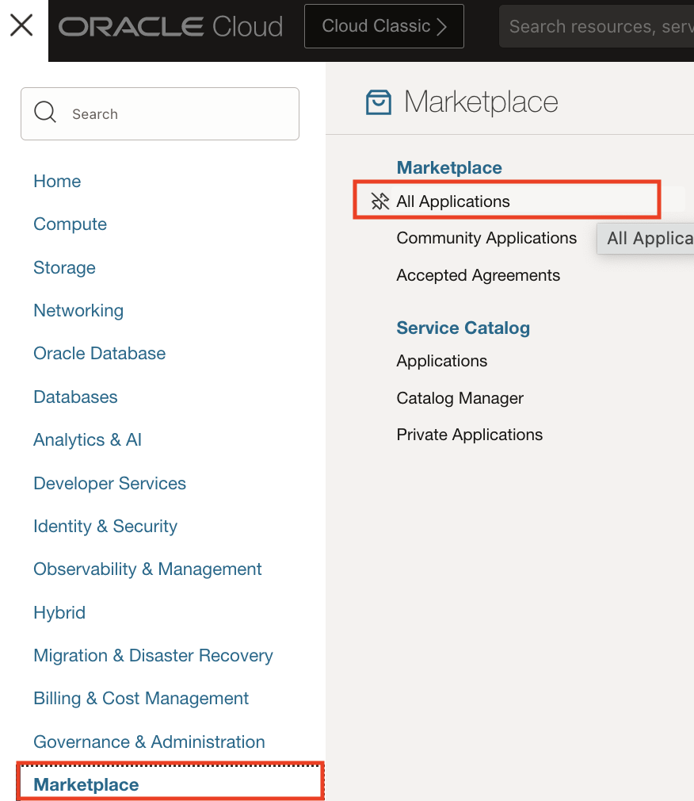

# Provision SOA Suite Marketplace on Oracle Cloud Infrastructure

## Introduction

This lab walks you through provisioning the SOA Suite Infrastructure by leveraging the OCI Marketplace image. 

Estimated Lab Time: 40 minutes.

### Objectives

In this lab you will:

- Provision SOA Server on Oracle Cloud Infrastructure via the Marketplace offering
- Gather information for further steps
- Connect to the Oracle Fusion Middleware console of the SOA Suite installation through the bastion host.

### Prerequisites

- We'll use the 'on-premises' environment as our working environment from which we'll connect to the newly deployed environment, so we'll need to create an SSH key pair there.

## Task 1: Create an SSH Key Pair 

Create a SSH key in the on-premises environment (whether you chose to provision via the demo marketplace or with a local VirtualBox VM)

1. Open a terminal in the 'on-premises' environment.

  

2. In the terminal, create an SSH key

    ```
    <copy>
    ssh-keygen
    </copy>
    ```

    - Press **Enter** to use all defaults to all questions

3. Get the content of the public key

    - SSH from your local machine to the VM with 

    ```
    <copy>
    ssh -p 7022 oracle@<PUBLIC_IP>
    </copy>
    ```

   Where the `PUBLIC_IP` is the public IP of the on-premises environment you gathered when provisioning the VM in Lab 1 Option A Set up an 'on-premises' environment using the workshop image.

   The password you will be prompted for is `oracle`.

   Then use:

    ```
    <copy>
    cat ~/.ssh/id_rsa.pub
    </copy>
    ```

4. Copy the content to clipboard, it will be used during the SOA stack provisioning.


## Task 2: Provision the Stack Through the Marketplace

1. Go to **Solutions and Platforms -> Marketplace -> Applications**.

   

2. In the search input, type `soa`. For this lab, we'll use **Oracle SOA Suite (BYOL)**.

   

3. Make sure you are in the **Compartment** you want to use, use the **default WebLogic version** available, accept the License agreement and click **Launch the Stack**.

   

4. **Name** the stack and click **Next**.

   

5. **Enter** a **Resource Name Prefix**, we'll use `SOAMP2`.

  It will be used to prefix the name of all the resources (domain, managed servers, admin server, cluster, machines, and so on...)

  The next steps in this workshop assumes the resource name prefix is `SOAMP2`, so it is highly recommended to use this name.

   

6. **Select** a **Service Type**.

   In a real world situation, choose a service type according to your requirements. For this workshop we are using **SOA with SB & B2B Cluster**.

   


7. Keep the **Enable SOA Schema partitioning** unchecked.

   

8. **Select** a **Shape**.

   In a real world situation, choose a shape appropriate to handle the load of a single managed server. Since we're using a trial account, choose the **VM.Standard.E2.1** shape, the **VM.Standard.2.1** shape or a suitable shape available in your tenancy.

   

   To check shape availability, go to **Governance -> Limits and Quotas** in another tab, and verify you have the specific shape available

9. In the **SSH Key** section, paste the SSH public key created earlier.

   *Important:* This is the SSH public key you created inside the on-premises environment, not your local public key.

     

11. **Select** a **Cluster Node Count**. In this lab, we'll provision `1` node.

   

12. We'll keep the **WebLogic Server Admin User Name** as the default of `weblogic`.

   

13. Provide a password of your choice. `welcome1` is assumed as the password in this lab.

   

14. In the **WebLogic Network** section, make sure you are in the right compartment. For this lab we have used `SOAMP1Compartment`.
 
15. For **VIRTUAL CLOUD NETWORK STRATERGY**, select `Use Existing VCN`.

16. Select the `SOAMP1VCN` for **EXISTING NETWORK**.

  

17. Select `Use Existing Subnet` for **SUBNET STRATEGY**. 
   
18. Select `SOAMP1Compartment` for **SUBNET COMPARTMENT**. 

19. Select `Use Private Subnet` for **SUBNET TYPE**.

20. Select `Regional Subnet` for **SUBNET SPAN**.

21. Select `Private Subnet-SOAMP1VCN(Regional)` for **EXISTING SUBNET**.

  

22. Select `Create new Bastion Instance` for **Bastion Instance Strategy**.

  

23. Select `Public Subnet-SOAMP1VCN(Regional)` for **EXISTING SUBNET FOR BASTION HOST**.

   **Note:** Since we are choosing a private subnet for the SOA instance, we need a bastion host in a public subnet. The bastion host would not be required if we used a public subnet for the SOA instance.

      

24. Select `VM Standard2.1` for **BASTION HOST SHAPE** (or a shape you have available).

      

25. Check the box for **Provision Load Balancer**.

      - Select `Public Subnet-SOAMP1VCN(Regional)` for **EXISTING SUBNET FOR LOAD BALANCER**.
      - Select `400Mbps` for **LOAD BALANCER SHAPE**.

  

26. Select `Database System` for **DATABASE STRATEGY**.

  

27. Select `SOAMP1VCNCompartment` for the **DB SYSTEM COMPARTMENT**.

   >**Note:** Since we already created the database for SOA, choose the compartment where the database was provisioned and check that is it visible.  

28. Input the following details as defined during database provisioning:

      - **DB SYSTEM**: the name of your database system created earlier.
      - **DB HOME IN THE DB SYSTEM**: select from drop down.
      - **DB IN THE DB SYSTEM**: `SOAMP2DB`.
      - **PDB**: `PDB1`.

  

29. Select `SYS` as the **DATABASE ADMINISTRATOR**.

30. Select `WELcome##123` as the **DATABASE ADMINISTRATOR PASSWORD** (or the password you selected before).

   

31. Check the box for **SERVICE INSTANCE ADVANCED CONFIGURATION** to see default ports assigned. We will keep them as-is.

   

32. In the same **Advanced** section, check the box **DEPLOY SAMPLE APPLICATION**.

   

33. Click **Next**, then click **Create**.

    

34. The stack will get provisioned using the **Resource Manager**. This may take 7 to 15 minutes.

    

Once the stack is provisioned, you can find the information regarding the URL and IP of the WebLogic Admin server in the logs, or in the **Outputs** left-side menu. 

To save some time you may proceed to the next lab and move to first steps of migrating the demo application, however you will need to come back and gather the info and create the tunnel connection to proceed further.


## Task 3: Gather the Necessary SOA Stack Information


1. In the job **Outputs** (left menu).

   

      Make a note of the values for:

      - **FMW Console**.
      - **Load Balancer IP**.
      
2. Go to **Core Infrastructure -> Compute -> Instances**.

3. Make sure you are in the right compartment and look for the **SOAMP2-bastion-instance** .

      Note the Public IP address of the bastion:

      


## Task 4: Connect to the SOA Console Through the Bastion Host.

Since the stack is deployed in a **private subnet**, accessing the console is achieve by tunneling through the bastion host. This way, we will be able to access the new environment from the source environment.

1. In the VNC window, in the terminal where you created the SSH key, create a tunnel to the SOA host via the bastion host.

      You find the Public IP of the bastion and the private IP of the SOA host under the **Compute -> Instances** in the compartment where you deployed the stack, in the OCI console.

      Note: do not confuse the Bastion Host public IP with the load balancer IP.

      ```
      <copy>
      export BASTION_IP=<PUBLIC IP of BASTION HOST>
      export REMOTEHOST=<PRIVATE IP OF SOA HOST>
      export PORT=7002
      # tunnel
      ssh -M -S socket -fnNT -L ${PORT}:${REMOTEHOST}:${PORT} opc@${BASTION_IP} cat -
      </copy>
      ```

      **Through RDP you might have to type the command**.


      Note: You might see a security exception. Click **Advanced**, and then Create Exception to proceed to the site.

2. Once your SOA private instance is tunneled, open the web browser to `https://localhost:7002/em`.

   This opens the EM console on the new environment.

   Provide your WebLogic username/password provided during SOAMP provisioning.

   Note: the connection uses SSL, so make sure to use the `https://` scheme.

     

11. go to **SOA -> soa-infra** you can see some pre deployed example applications, and check the server health.

     


You may proceed to the next lab.

## Acknowledgements

 - **Author** - Akshay Saxena, September 2020
 - **Last Updated By/Date** - Emmanuel Leroy March 2023
