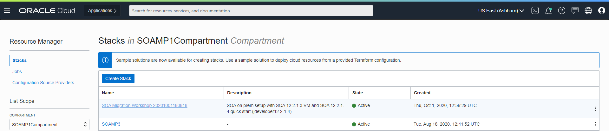
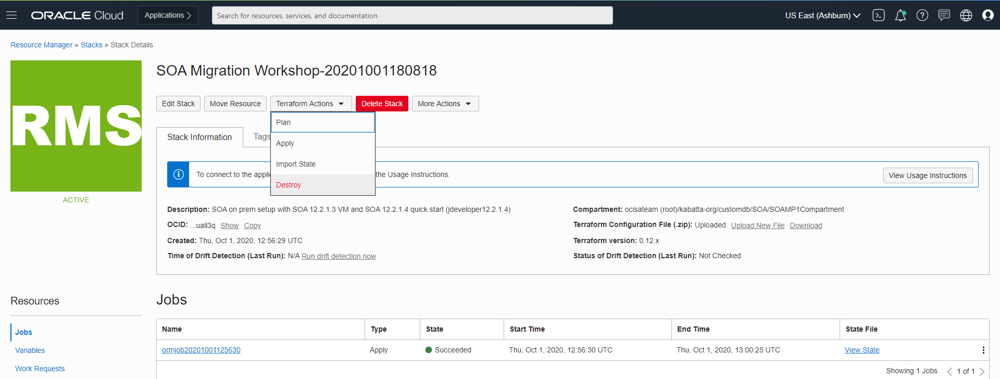
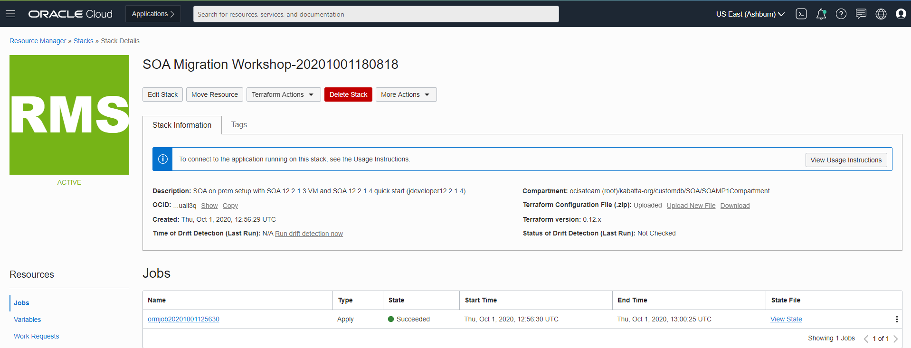
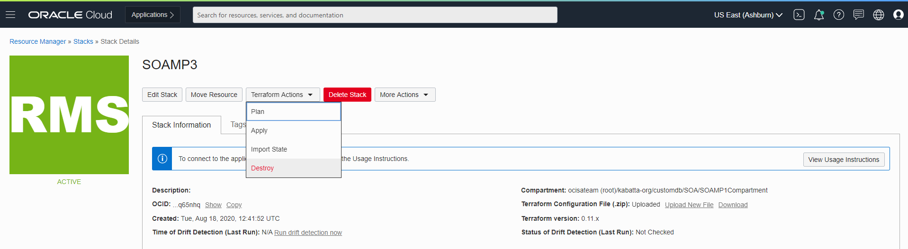
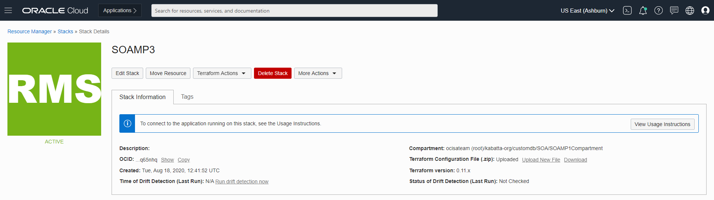

# Tear Down the Workshop Environment

## Introduction

Congratulations! You've come so far and completed the workshop, and you might wonder how to clean up resources.

Estimated Lab Time: 15 minutes.

*You should not keep the instances deployed on OCI as part of this workshop running once your are done, or use in any way for actual workloads: the database and WebLogic credentials are publically available and would be a security risk.*

## Task 1: Cleaning up the 'on-premises' environment

### If you used your local machine:

1. Uninstall the Oracle SOA Suite 12.2.1.3 VirtualBox VM.

2. Uninstall the Oracle SOA Suite Quick Start 12.2.1.4.

### If you used the workshop image from the marketplace:

1. Go to **Resources Manager**.

2. Select the **compartment** where you deployed the stack originally.

3. Click the stack name for the **Workshop on-premises environment**.

  

4. Click **Terraform Actions** then click **Destroy**.

  

5. Once the job completed, click **Stack Details** in the bread-crumbs menu to get back to the stack details.

6. Click **Delete Stack**.

  

## Task 2: Tear Down the Application Database

1. Go to the **Databases -> Bare Metal, VM and Exadata**.

2. Click the **Database System** `SOAMP2DB`.

3. Click **More Actions** and select **Terminate**.

    You'll be prompted for the name of the DB system to terminate.

    This will take several minutes.

## Task 3: Tear Down the SOA Environment

*You need to terminate the database subnet before you can tear down the SOA deployment. The Resource Manager will not be able to clean up the VCN until the database subnet is removed.*

1. Go to the **Resources Manager**.

2. Click the stack name for the **SOA Server deployment** `SOAMP3`.

3. Click **Terraform Actions** and select **Destroy**.

  

4. Once the job completed, click **stack details** in the bread-crumbs menu to get back to the stack details.

5. Click **Delete Stack**.

  

## Task 4: Tear Down the VCN

1. Go to **Networking -> Virtual Cloud Networks**.

2. Select the `SOAMP1VCN` VCN  (or whatever VCN name you have provided).

3. Click **Terminate**.

  >Note you won't be able to proceed until the Database System and the SOA stack have been terminated.

You're done.

## Acknowledgements

 - **Author** - Akshay Saxena, September 2020
 - **Last Updated By/Date** - Emmanuel Leroy March 2023
