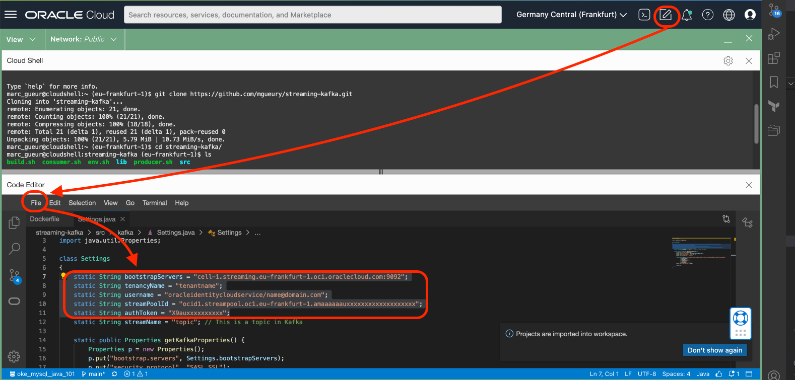

# Kafka Client

## Introduction

Estimated time: 10 min

We will use a small Java program to produce and consume messages with Kafka APIs.

### Objectives

- Clone the git repository
- Check the code
- Run the Producer and Consumer using the Kafka API in Java

### Prerequisites

- Previous labs completed

## Task 1: Clone the git repository

1. Start the Cloud Shell
    
2. Clone the git repository
     ```
     <copy>git clone https://github.com/mgueury/streaming-kafka.git
     </copy>
     ```

   The repository contains the Kafka library. If you want to download the latest one, see here: [https://kafka.apache.org/downloads](https://kafka.apache.org/downloads).


## Task 2: Check the code

The code contains the following 3 files:

- Settings.java: common file
   ```
<copy>
package kafka;

import java.util.Properties;

class Settings 
{
    // To configure
    static String bootstrapServers = "cell-1.streaming.eu-frankfurt-1.oci.oraclecloud.com:9092";
    static String authToken = "X9auxxxxxxxxxx";
    static String tenancyName = "tenantname";
    static String username = "oracleidentitycloudservice/name@domain.com";
    static String streamPoolId = "ocid1.streampool.oc1.eu-frankfurt-1.amaaaaaauxxxxxxxxxxxxxxxxxxx";
    static String authToken = "X9auxxxxxxxxxx";

    static String streamName = "topic"; // This is a topic in Kafka 

    static public Properties getKafkaProperties() {
        Properties p = new Properties();
        p.put("bootstrap.servers", Settings.bootstrapServers);
        p.put("security.protocol", "SASL_SSL");
        p.put("sasl.mechanism", "PLAIN");

        final String value = "org.apache.kafka.common.security.plain.PlainLoginModule required username=\""
                + tenancyName + "/"
                + username + "/"
                + streamPoolId + "\" "
                + "password=\""
                + authToken + "\";";
        p.put("sasl.jaas.config", value);

        return p;
    }
}
</copy>
````

- Producer.java: produce messages with the Kafka API 

````
<copy>
package kafka;

import org.apache.kafka.clients.producer.KafkaProducer;
import org.apache.kafka.clients.producer.ProducerConfig;
import org.apache.kafka.clients.producer.ProducerRecord;
import org.apache.kafka.common.serialization.StringSerializer;

import java.util.Properties;

public class Producer {

    private static Properties getKafkaProperties() {
        Properties p = Settings.getKafkaProperties();
        p.put("enable.idempotence", false);
        p.put(ProducerConfig.KEY_SERIALIZER_CLASS_CONFIG, 
              StringSerializer.class.getName());
        p.put(ProducerConfig.VALUE_SERIALIZER_CLASS_CONFIG, 
              StringSerializer.class.getName());
        p.put("retries", 3); // retries on transient errors and load balancing disconnection
        p.put("max.request.size", 1024 * 1024); // limit request size to 1MB
        return p;
    }

    public static void main(String args[]) {
            Properties properties = getKafkaProperties();
            KafkaProducer producer = new KafkaProducer<>(properties);

            for(int i=0;i<10;i++) {
                ProducerRecord<String, String> record = new ProducerRecord<>(Settings.streamName, "message" + i, "{ i=" +i +" }" );
                producer.send(record, (md, ex) -> {
                    if (ex != null) {
                        System.err.println("exception occurred in producer for review :" + record.value()
                                + ", exception is " + ex);
                        ex.printStackTrace();
                    } else {
                        System.err.println("Sent msg to " + md.partition() + " with offset " + md.offset() + " at " + md.timestamp());
                    }
                });
            }
            // producer.send() is async, to make sure all messages are sent we use producer.flush()
            producer.flush();
            producer.close();
        
    }
}
</copy>
````

- Consumer.java: consume messages

````
<copy>
package kafka;

import org.apache.kafka.clients.consumer.ConsumerConfig;
import org.apache.kafka.clients.consumer.ConsumerRecord;
import org.apache.kafka.clients.consumer.ConsumerRecords;
import org.apache.kafka.clients.consumer.KafkaConsumer;

import java.util.Collections;
import java.util.Properties;

public class Consumer {
    
    private static Properties getKafkaProperties(){
        Properties p = Settings.getKafkaProperties();
        p.put("group.id", "GROUP1");
        p.put("enable.auto.commit", "false");
        p.put("session.timeout.ms", "30000");
        p.put(ConsumerConfig.KEY_DESERIALIZER_CLASS_CONFIG, 
              "org.apache.kafka.common.serialization.StringDeserializer");
        p.put(ConsumerConfig.VALUE_DESERIALIZER_CLASS_CONFIG, 
              "org.apache.kafka.common.serialization.StringDeserializer");
        p.put("auto.offset.reset", "earliest");
        return p;
    }

    public static void main(String[] args) {
        final KafkaConsumer<Integer, String> consumer = new KafkaConsumer<>(getKafkaProperties());;
        consumer.subscribe(Collections.singletonList(Settings.streamName));
        ConsumerRecords<Integer, String> records = consumer.poll(10000);

        System.out.println("size of records polled is "+ records.count());
        for (ConsumerRecord<Integer, String> record : records) {
            System.out.println("Received message: (" + record.key() + ", " + record.value() + ") at offset " + record.offset());
        }

        consumer.commitSync();
        consumer.close();
    }
}
</copy>
````

## Task 3: Run the Producer and Consumer

1. Start the code editor and  with your settings.
     - Menu File / Open 
     - File streaming-kafka/src/kafka/Settings.java
    

2. Replace with the values found above and save the file.

```
    ...
    static String bootstrapServers = "cell-1.streaming.eu-frankfurt-1.oci.oraclecloud.com:9092";
    static String streamPoolId = "ocid1.streampool.oc1.eu-frankfurt-1.amaaaaaauxxxxxxxxxxxxxxxxxxx";
    static String tenancyName = "tenantname";
    static String username = "oracleidentitycloudservice/name@domain.com";
    static String authToken = "X9auxxxxxxxxxx";
    ...
```
3. Back in the console. 
   - Compile the code
     ```
     <copy>
     cd streaming-kafka
     ./build.sh
     ./producer.sh
     ./consumer.sh
     </copy>
     ```
  - During the first run, the topic (stream) will be created.   
  - You will see that some messages are produced and consumed by the Kafka client.
     ```
$ ./build.sh 
$ ./producer.sh 
log4j:WARN No appenders could be found for logger (org.apache.kafka.clients.producer.ProducerConfig).
log4j:WARN Please initialize the log4j system properly.
log4j:WARN See http://logging.apache.org/log4j/1.2/faq.html#noconfig for more info.
Sent msg to 0 with offset 20 at 1661454346261
Sent msg to 0 with offset 21 at 1661454346261
Sent msg to 0 with offset 22 at 1661454346261
...
)$ ./consumer.sh 
log4j:WARN No appenders could be found for logger (org.apache.kafka.clients.consumer.ConsumerConfig).
log4j:WARN Please initialize the log4j system properly.
log4j:WARN See http://logging.apache.org/log4j/1.2/faq.html#noconfig for more info.
size of records polled is 10
Received message: (message0, { i=0 }) at offset 20
Received message: (message1, { i=1 }) at offset 21
Received message: (message2, { i=2 }) at offset 22
Received message: (message3, { i=3 }) at offset 23
...
```

## Acknowledgements

- **Author** - Marc Gueury
- **History** - Creation - 25 Aug 2022