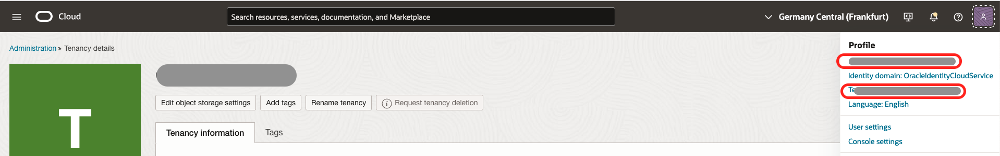
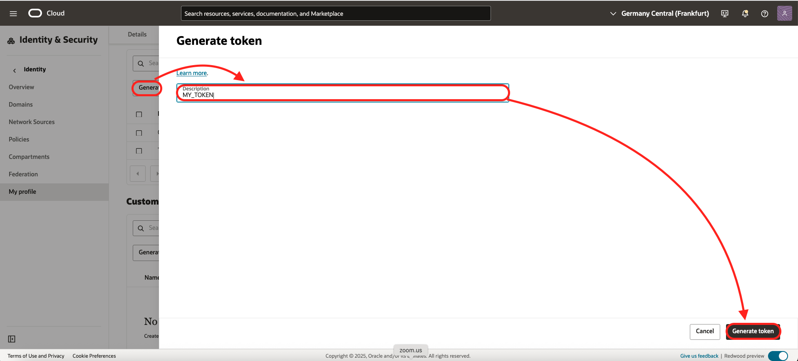

# Create a Stream Pool

## Introduction

Estimated time: 10 min

### Objectives

- Provision of stream

### Prerequisites

## Task 1: Create a Stream Pool

1. Log to your cloud account
2. Click the menu icon on the top
     - Choose the **Analytics & AI** menu
     - Choose **Streaming**
     
3. On the left, choose **Streams Pool**
     - Then click **Create Stream Pool**
4. Let fill the wizard:
     - Type a name for the stream pool: **pool**
     - Clik **Show Advanced Options**
     - Enable **Auto create topics**
     - Click **Create**

     We could create the topics manually. But this makes this tutorial shorter.
      
     

## Task 2: Note the details of the Stream Pool

When the pool is created. Take note of 
- the OCID (click Copy) (**1**)
- the FQDN (this is the hostname of the service) (**2**)
  

## Task 3: Get security details to call the API

- Click on the top right person icon 
   
- Take note the **tenancy name** (**3**)
- Click on your **username** 
- Take note of your **username** (**4**). If you use IDCS, it will be in the form of **oracleidentitycloudservice/xxxxxxx**
- Scroll down
- Click **Auth Tokens**
- Then **Generate Token**
- Give a **name**
- Click **Generate Token**
- Take note of the token generated. It will appear only once (**5**)
    

You have now the 5 settings needed in the next lab.

## Remark: Policies

Depending of the type of user that you are using, you will maybe need to add policies to acccess the Stream.
If you need policies, they look like this:

```
allow any-user to use stream-family in compartment marc.gueury	
allow any-user to {STREAM_READ, STREAM_CONSUME} in compartment marc.gueury
```

More info here: [OCI Common Policies](https://docs.oracle.com/en-us/iaas/Content/Identity/Concepts/commonpolicies.htm#)

## Acknowledgments

- **Author** - Marc Gueury
- **History** - Creation - 25 Aug 2022

