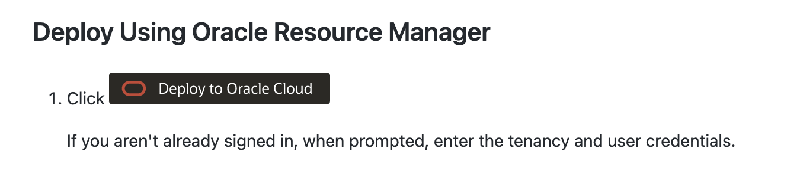
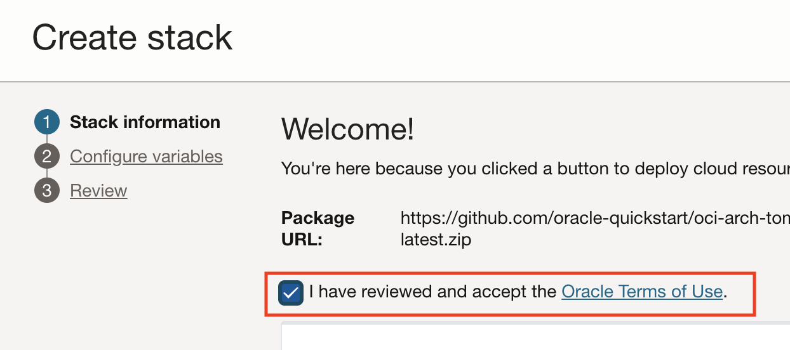
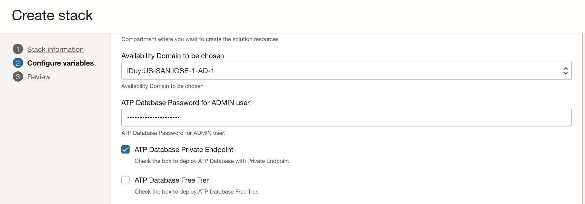
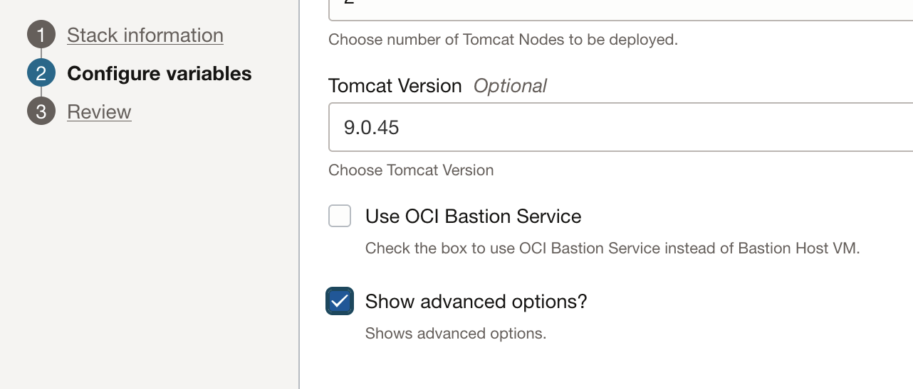
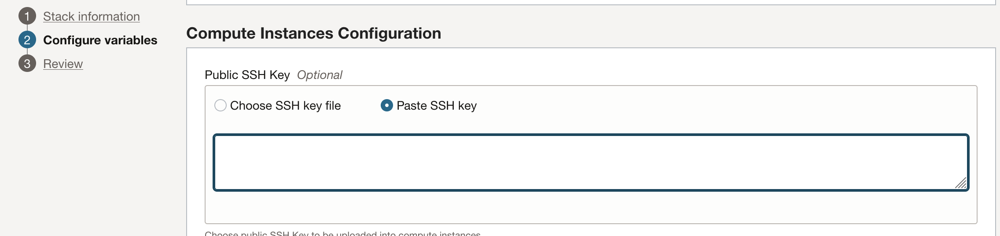
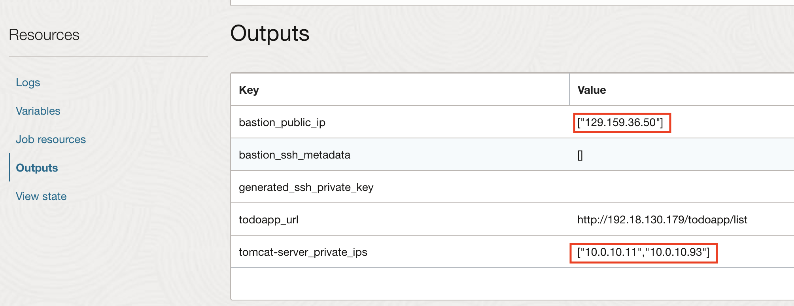

# Deploy Tomcat on Oracle Cloud Infrastructure with the Oracle Autonomous Transaction Processing database

## Introduction

In this tutorial, we will deploy a Tomcat Cluster on Oracle Cloud Infrastructure (OCI) with Terraform, along with an Oracle Autonomous Transaction Processing database.

Estimated Completion Time: 25 minutes.

### Objectives

In this tutorial, you will provision:
* An Apache Tomcat cluster based on Compute VM
* A public load balancer targeting the Tomcat instances
* An Oracle Autonomous Database

### Prerequisites

For this tutorial, you need:

* An Oracle Free Tier, Always Free, Paid or LiveLabs Cloud Account

## Task 1: Deploy Tomcat with 1-click

1. Go to [https://github.com/oracle-quickstart/oci-arch-tomcat-autonomous](https://github.com/oracle-quickstart/oci-arch-tomcat-autonomous)

2. Scroll down to find the **Deploy To Oracle Cloud** button, and click the button.

    

3. Agree to the terms of use.

    

4. Clear the tag if it auto-completed with your email.

5. Click the **Next** button.

6. Enter a password for the Autonomous Database ADMIN user (must start with a letter, contain 12-30 characters, at least 1 uppercase, 1 lowercase, 1 number, and special character _ or #)

7. Click **ATP Database Private Endpoint** to provision the Autonomous Database with a private endpoint.

    

8. If you already used the Free Tier Autonomous DB in your tenancy, uncheck the **ATP Database Free Tier** checkbox or the stack will failed on quota exceeded.

9. Select Tomcat v9.x for this lab.

10. Click **View Advanced Options** and scroll to the **SSH Key** section.

    

11. Click **Paste SSH Key** and paste the SSH key created earlier in the Tomcat docker environment. 

    *NOTE*: The SSH key created in the docker environment is available to the local machine, in the `ssh` folder.

    

12. Keep the rest as defaults and click **Next**

13. Click **Create**.

## Task 2: Take note of the Outputs

1. Wait for the stack creation to complete, and take note of the **Output** values.

    

## Acknowledgements
 - **Author** - Subash Singh, Emmanuel Leroy, October 2020
 - **Last Updated By/Date** - Emmanuel Leroy, February 2023
