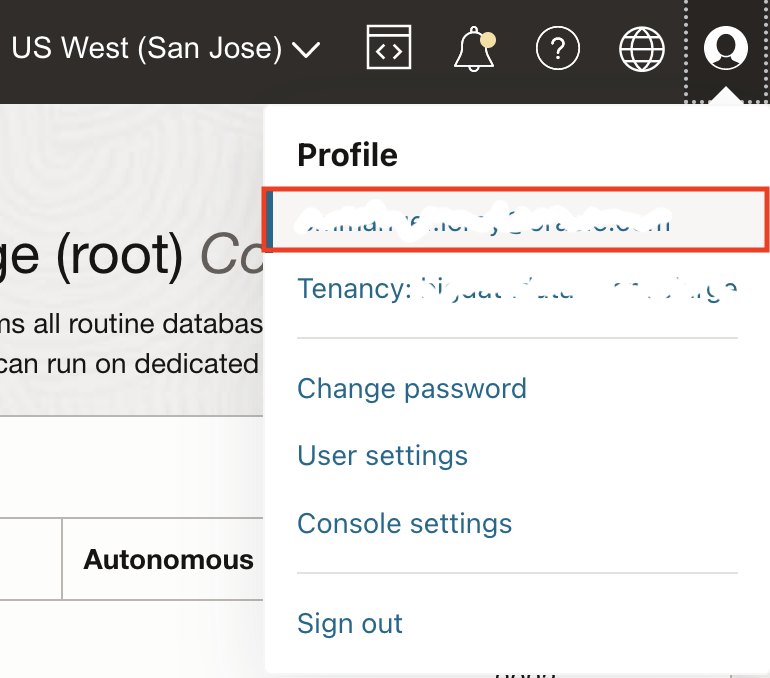
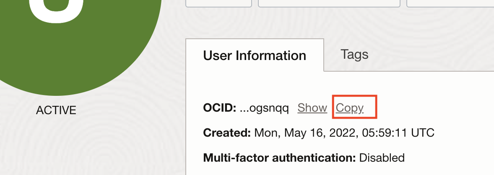
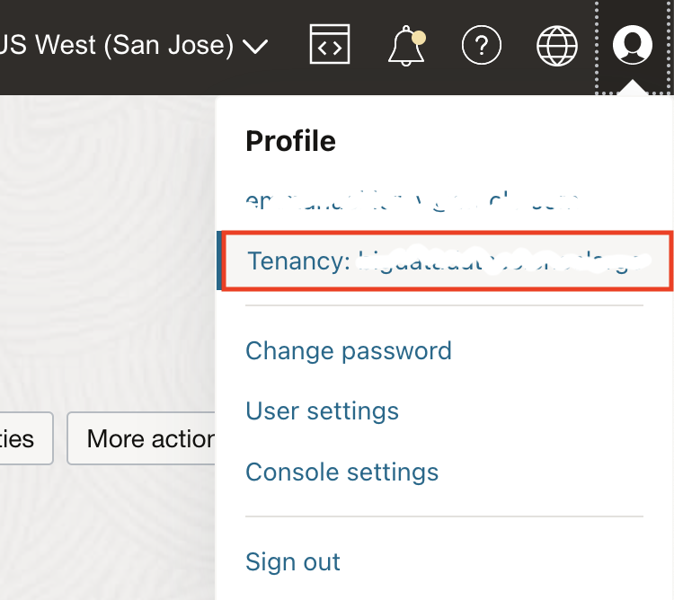
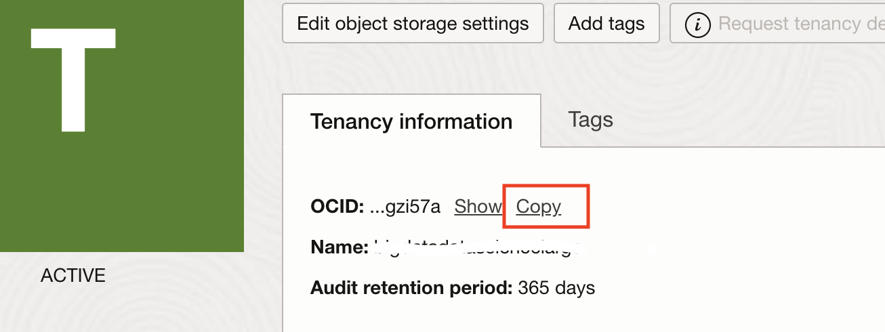
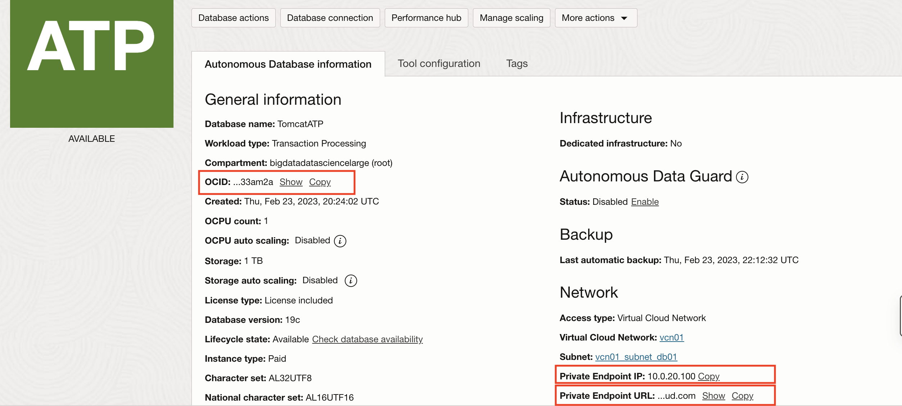

# Migrate the On-Premises Database to Oracle Autonomous Database

## Introduction

In this lab, we will migrate the on-premises database to the Oracle Autonomous Database on Oracle Cloud Infrastructure (OCI).

Estimated Completion Time: 10 minutes.

### Objectives

In this tutorial, you will move the application database schema over to the Oracle Autonomous Database on OCI using datapump and the OCI Object Storage service as intermediate storage location.

## Task 1: Install the Oracle Cloud Infrastructure CLI on the Source Database

This task is required to get the wallet from the database and put the dump file into object storage.

> **Note:** You could also do without the Oracle Cloud Infrastructure (OCI) command line interface (CLI) by getting the wallet through the console and uploading the dump file through the console. This requires more manual steps.

1. You should still be inside the Oracle Database container, otherwise get inside with:

    ```
    <copy>
    docker exec -it tomcat-to-oci-oracledb-1 /bin/bash
    </copy>
    ```

1. Install the OCI CLI on the source database:

    ```bash
    <copy>
    bash -c "$(curl -L https://raw.githubusercontent.com/oracle/oci-cli/master/scripts/install/install.sh)"
    </copy>
    ```

    Press **Enter** to use the defaults for all options.

2. Restart your shell:
    ```
    <copy>
    exec -l $SHELL
    </copy>
    ```

3. Configure the OCI CLI:

    ```
    <copy>
    oci setup config
    </copy>
    ```

    Enter the following information:
    
    1. Location of the configuration: press **Enter**.
    2. `user_ocid`: enter your user OCID.
        1. In the Oracle Cloud Console, click your **User** icon (top right corner), then click your user name.
            

       2. Copy the OCID of your user.
            

    3. `tenancy_ocid`: enter your tenancy OCID.
        1. In the Oracle Cloud Console, **click** your **User** icon (top right corner), then **Tenancy**.
            

        2. **Copy** the OCID of the tenancy.
            

    4. `region`: enter your region from the list provided.
    5. Generate a RSA key pair: press **Enter** for Yes (default).
    6. Directory for keys: press **Enter** for the default.
    7. Name for the key: press **Enter** for the default.
    8. Passphrase: press **Enter** for no passphrase.
    

    You should see an output like:

    ```bash
    Private key written to: /home/oracle/.oci/oci_api_key.pem
    Fingerprint: 21:d4:f1:a0:55:a5:c2:ce:...
    Config written to /home/oracle/.oci/config
    ```

4. Upload the public key to your OCI account.

    To use the CLI, you need to upload the public key generated to your user account.

    Get the key content with:

    ```
    <copy>
    cat /home/oracle/.oci/oci_api_key_public.pem
    </copy>
    ```

    Copy the full printed output to clipboard.

    In the Oracle Cloud Console:

    1. Under your **User** (top right icon), select **User Settings**.
    2. Click **API Keys**.
    3. Click **Add Public Key**.
    4. Click **Paste Public Key**.
    5. Paste the key copied above.
    6. Click **Add**.
    
    You can verify that the fingerprint generated matches the fingerprint output of the configuration.

5. Test your OCI CLI:

    ```
    <copy>
    oci os ns get
    </copy>
    ```

    This command should output the namespace of your tenancy (usually the name of the tenancy):

    ```
    {
        "data": "your-tenancy-namespace"
    }
    ```

    *Note*: It sometimes takes a minute or so for the key to be validated. If you get a 401 error at first, retry after a minute.

## Task 2: Create an Oracle Cloud Infrastructure Object Storage Bucket

1. Go to **Core Infrastructure** and select **Object Storage**.

    

2. Make sure you are in the compartment where you deployed the resources.

3. Click **Create Bucket**.

4. Give the bucket the name **atp-upload**.

5. Click **Create Bucket**.

## Task 3: Export the Database Schema and Data

1. Run the datapump export script `datapump_export.sh`:

    ```bash
    <copy>
    cd ~/datapump
    ./datapump_export.sh
    </copy>
    ```

    This will take a minute or so.

    The log should look like:

    ```
    SQL*Plus: Release 12.2.0.1.0 Production on Fri Oct 9 22:33:38 2020

    Copyright (c) 1982, 2016, Oracle.  All rights reserved.

    Last Successful login time: Fri Oct 09 2020 21:35:52 +00:00

    Connected to:
    Oracle Database 12c Enterprise Edition Release 12.2.0.1.0 - 64bit Production

    SQL> DROP DIRECTORY export
    *
    ERROR at line 1:
    ORA-04043: object EXPORT does not exist


    SQL> Disconnected from Oracle Database 12c Enterprise Edition Release 12.2.0.1.0 - 64bit Production

    SQL*Plus: Release 12.2.0.1.0 Production on Fri Oct 9 22:33:38 2020

    Copyright (c) 1982, 2016, Oracle.  All rights reserved.

    Last Successful login time: Fri Oct 09 2020 22:33:38 +00:00

    Connected to:
    Oracle Database 12c Enterprise Edition Release 12.2.0.1.0 - 64bit Production

    SQL>
    Directory created.

    SQL> Disconnected from Oracle Database 12c Enterprise Edition Release 12.2.0.1.0 - 64bit Production

    Export: Release 12.2.0.1.0 - Production on Fri Oct 9 22:33:39 2020

    Copyright (c) 1982, 2017, Oracle and/or its affiliates.  All rights reserved.

    Connected to: Oracle Database 12c Enterprise Edition Release 12.2.0.1.0 - 64bit Production
    Starting "SYSTEM"."SYS_EXPORT_SCHEMA_01":  system/********@oracledb:/PDB.us.oracle.com schemas=RIDERS DIRECTORY=export
    Processing object type SCHEMA_EXPORT/TABLE/TABLE_DATA
    Processing object type SCHEMA_EXPORT/TABLE/STATISTICS/TABLE_STATISTICS
    Processing object type SCHEMA_EXPORT/STATISTICS/MARKER
    Processing object type SCHEMA_EXPORT/USER
    Processing object type SCHEMA_EXPORT/SYSTEM_GRANT
    Processing object type SCHEMA_EXPORT/DEFAULT_ROLE
    Processing object type SCHEMA_EXPORT/PRE_SCHEMA/PROCACT_SCHEMA
    >>> DBMS_AW_EXP: SYS.AW$EXPRESS: OLAP not enabled
    >>> DBMS_AW_EXP: SYS.AW$AWMD: OLAP not enabled
    >>> DBMS_AW_EXP: SYS.AW$AWCREATE: OLAP not enabled
    >>> DBMS_AW_EXP: SYS.AW$AWCREATE10G: OLAP not enabled
    >>> DBMS_AW_EXP: SYS.AW$AWXML: OLAP not enabled
    >>> DBMS_AW_EXP: SYS.AW$AWREPORT: OLAP not enabled
    Processing object type SCHEMA_EXPORT/TABLE/TABLE
    >>> DBMS_AW_EXP: SYS.AW$EXPRESS: OLAP not enabled
    >>> DBMS_AW_EXP: SYS.AW$AWMD: OLAP not enabled
    >>> DBMS_AW_EXP: SYS.AW$AWCREATE: OLAP not enabled
    >>> DBMS_AW_EXP: SYS.AW$AWCREATE10G: OLAP not enabled
    >>> DBMS_AW_EXP: SYS.AW$AWXML: OLAP not enabled
    >>> DBMS_AW_EXP: SYS.AW$AWREPORT: OLAP not enabled
    . . exported "RIDERS"."RIDERS"                           863.7 KB    9040 rows
    Master table "SYSTEM"."SYS_EXPORT_SCHEMA_01" successfully loaded/unloaded
    ******************************************************************************
    Dump file set for SYSTEM.SYS_EXPORT_SCHEMA_01 is:
    /home/oracle/datapump/export/expdat.dmp
    Job "SYSTEM"."SYS_EXPORT_SCHEMA_01" successfully completed at Fri Oct 9 22:34:04 2020 elapsed 0 00:00:24

    ```

## Task 4: Move the Dump File to the Oracle Cloud Infrastructure Object Storage Bucket

1. Put the dump file in the `atp-upload` bucket:

    ```
    <copy>
    oci os object put \
    -bn atp-upload \
    --file /home/oracle/datapump/export/expdat.dmp \
    --name expdat.dmp
    </copy>
    ```

    The log should look like:

    ```
    Uploading object  [####################################]  100%
    {
    "etag": "4170701c-22e9-42b1-9bea-44423eede8b7",
    "last-modified": "Fri, 09 Oct 2020 22:36:05 GMT",
    "opc-content-md5": "9YvlOURl0QgQBvxFvxKMnQ=="
    }
    ```

## Task 5: Get the OCID of the Database

1. Go to **Oracle Database** and select **Autonomous Database**.

2. Make sure you are in the right compartment and select the database you provisioned earlier to get to the details.

3. **Copy** the **OCID**, and save in a notepad for later use.

4. Gather the **Private Endpoint IP** and the **Private Endpoint URL** (for example, hostname).

    

## Task 6: Get the Database Wallet

1. Using the OCI CLI, download the database wallet on the source database, replacing the OCID:

    ```bash
    <copy>
    oci db autonomous-database generate-wallet --autonomous-database-id <your ATP OCID> --file wallet.zip --password atpPasSword1
    </copy>
    ```

    Replace the OCID of the autonomous database in the command.

2. Unzip the wallet:

    ```bash
    <copy>
    unzip wallet.zip
    </copy>
    ```

3. Set the `DIRECTORY` to point to the wallet location in the `sqlnet.ora` file.

    1. Edit the sqlnet.ora file:

    ```
    <copy>
    nano sqlnet.ora
    </copy>
    ```

    2. Replace the directory value as below:

    ```
    <copy>
    WALLET_LOCATION = (SOURCE = (METHOD = file) (METHOD_DATA = (DIRECTORY="/home/oracle/datapump")))
    SSL_SERVER_DN_MATCH=no
    </copy>
    ```

    Enter CTRL+X to exit, type Y to save the changes.

4. Set the `TNS_ADMIN` environment variable:

    ```
    <copy>
    export TNS_ADMIN=$(pwd)
    </copy>
    ```

## Task 7: Create a Local SSH Tunnel to the Database

1. Get the public IP of the bastion host from the stack deployment output:

    If the Tomcat server was deployed in a public subnet, you can use the public IP of the Tomcat server.

2. Create a tunnel with:

    ```bash
    <copy>
    # Configure the bastion public IP to go through
    export BASTION_IP=<Public IP of the bastion>
    </copy>
    ```

    ```bash
    <copy>
    # This DB_HOST is the Private Endpoint IP gathered earlier
    export DB_HOST=<Private Endpoint IP>
    </copy>
    ```

    Then run:
    ```
    <copy>
    ssh -4 -M -S socket -fnNT -L 1522:${DB_HOST}:1522 opc@${BASTION_IP} cat -
    </copy>
    ```

    You will be prompted to type `yes` to acknowledge the new host.

3. Edit the `/etc/hosts` to point the Private Endpoint Host of the database to 127.0.0.1 (localhost).

    ```
    <copy>
    # This looks up the Private Endpoint Host in the tnsnames.ora file
    ATP_HOSTNAME=$(sed 's|.*(host=\([A-Za-z0-9.-]*\)).*|\1|;' tnsnames.ora | head -n1)
    sudo su -c "printf \"127.0.0.1  ${ATP_HOSTNAME}\n\"  >> /etc/hosts"
    </copy>
    ```

    You can verify it was inserted properly with:

    ```
    <copy>
    cat /etc/hosts
    </copy>
    ```

    Which should output something like:

    ```
    127.0.0.1	localhost
    ::1	localhost ip6-localhost ip6-loopback
    fe00::0	ip6-localnet
    ff00::0	ip6-mcastprefix
    ff02::1	ip6-allnodes
    ff02::2	ip6-allrouters
    172.19.0.3	58aa534ef636
    127.0.0.1  ATPPrivateEndpoint.adb.us-sanjose-1.oraclecloud.com
    ```

## Task 8: Get an Oracle Cloud Infrastructure Auth Token

1. Go to **User** and select **User Settings**.

2. Take note of your full user name.

3. Go to **Auth Tokens**.

    

4. Click **Generate Token**.

5. Give it a name.

6. Click **Generate Token**.

7. Copy the output of the token to notepad.

## Task 9: Configure the Database Cloud Credentials

1. Using SQL*Plus Instant Client, connect to the remote database through the tunnel created earlier:

    ```
    <copy>
    sqlplus admin@<you_atp_db_name>_high
    </copy>
    ```

    If you followed the naming conventions used in this workshop, this should be:

    ```
    <copy>
    sqlplus admin@tomcatatp_high
    </copy>
    ```

    You'll be prompted for the admin password for the database `atp_admin_password`, which was configured when deploying the stack.

    Confirm that you are logged into a SQL prompt like:

    ```
    SQL*Plus: Release 12.2.0.1.0 Production on Fri Oct 9 22:52:05 2020

    Copyright (c) 1982, 2016, Oracle.  All rights reserved.

    Enter password:

    Connected to:
    Oracle Database 19c Enterprise Edition Release 19.0.0.0.0 - Production

    SQL>
    ```

2. Create the OCI cloud credential:

    At the SQL prompt, paste the following command (replacing the `username` and `password` values):

    ```
    <copy>
    SET DEFINE OFF
    BEGIN
    DBMS_CLOUD.CREATE_CREDENTIAL(
        credential_name => 'DEF_CRED_NAME',
        username => '<oci username>',
        password => '<oci auth token>'
    );
    END;
    /
    </copy>
    ```

3. Set as the default credential:

    ```
    <copy>
    ALTER DATABASE PROPERTY SET DEFAULT_CREDENTIAL = 'ADMIN.DEF_CRED_NAME';
    </copy>
    ```

4. Type `exit` to exit SQL*Plus.


## Task 10: Import the Dump File into the Database

Use datapump to import the data dump.

1. Define the environment variables below:
    ```
    <copy>
    export REGION=<your-region ex: us-ashburn-1>
    export NAMESPACE=<your namespace>
    export BUCKET=atp-upload
    export FILENAME=expdat.dmp
    export ATP_DB_NAME=tomcatatp <or your ATP DB name>
    export ATP_PASSWORD=<atp_admin_password>
    </copy>
    ```

2. Then run:

    ```bash
    <copy>
    impdp admin/${ATP_PASSWORD}@${ATP_DB_NAME}_low directory=data_pump_dir dumpfile=default_credential:https://objectstorage.${REGION}.oraclecloud.com/n/${NAMESPACE}/b/${BUCKET}/o/${FILENAME} parallel=16 exclude=cluster,db_link
    </copy>
    ```

2. First attempt will fail with an error: `ORA-01950: no privileges on tablespace 'DATA'` and we need to give quota to the created user RIDERS:

    ```
    <copy>
    echo "GRANT UNLIMITED TABLESPACE TO RIDERS;" | sqlplus admin/${ATP_PASSWORD}@${ATP_DB_NAME}_low
    </copy>
    ```

    You should see:

    ```
    Grant Succeeded
    ```

3. We also need to drop the table `RIDERS.RIDERS` that was created or its data won't be created on the next run:

    ```bash
    <copy>
    echo "DROP TABLE RIDERS.RIDERS;" | sqlplus admin/${ATP_PASSWORD}@${ATP_DB_NAME}_low
    </copy>
    ```

3. Re-run the import now that the user `RIDERS` has valid quota:

    ```
    <copy>
    impdp admin/${ATP_PASSWORD}@${ATP_DB_NAME}_low directory=data_pump_dir dumpfile=default_credential:https://objectstorage.${REGION}.oraclecloud.com/n/${NAMESPACE}/b/${BUCKET}/o/${FILENAME} parallel=16 exclude=cluster,db_link
    </copy>
    ```

    You will see errors about the user `RIDERS` and the associated table `RIDERS.RIDERS`: the objects already exist as they were created during the first run of the command.

The database has been migrated.


## Acknowledgements
 - **Author** - Subash Singh, Emmanuel Leroy, October 2020
 - **Last Updated By/Date** - Emmanuel Leroy, February 2023
